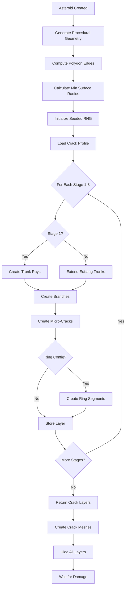
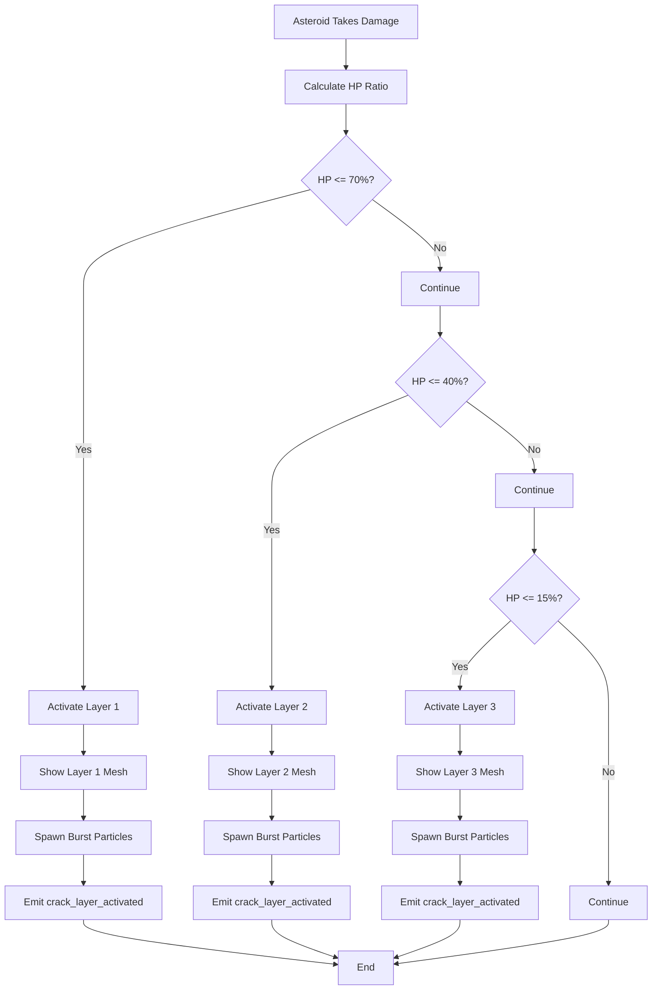
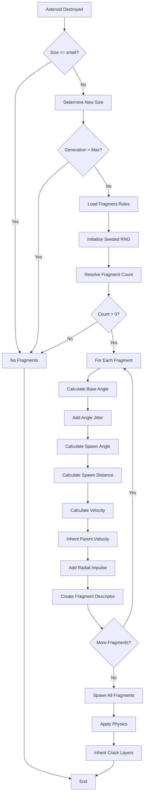
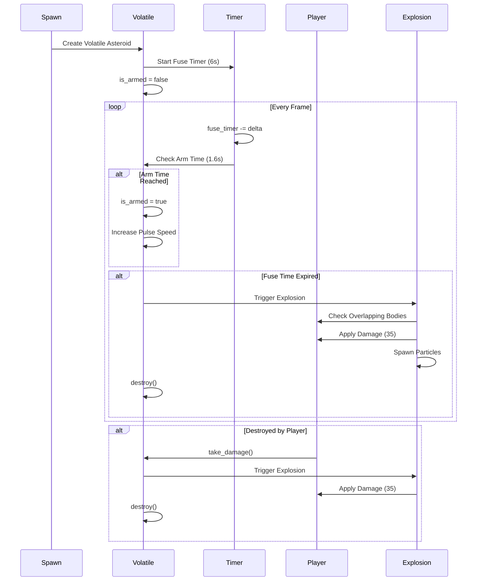
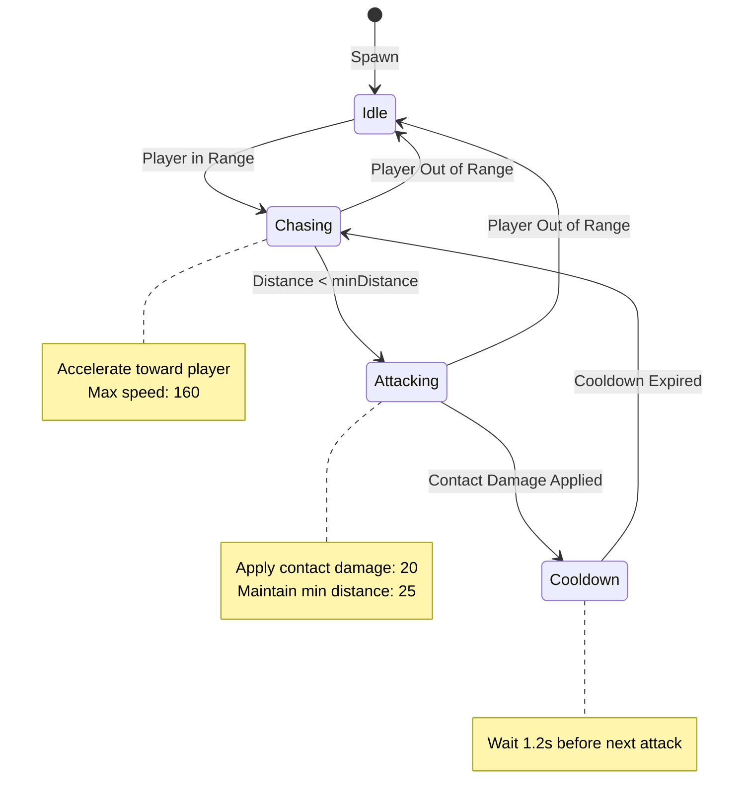

## 1. Visão Geral do Sistema
- Conceito: Asteroides se fragmentam em pedaços menores quando destruídos, com padrões de rachadura procedurais determinísticos
- 3 camadas de crack ativadas por HP thresholds: Layer 1 (70% HP), Layer 2 (40% HP), Layer 3 (15% HP)
- 4 tipos de crack segments: trunk (raiz), extension (continuação), branch (ramificação), micro (detalhes finos)
- Fragmentação: large→medium (3-4 fragments), medium→small (2-3 fragments), small→none
- 7 variantes de asteroides: common (70%), iron (8%), denseCore (7%), gold (0.4%), volatile (6.5%), parasite (4.5%), crystal (1.5%)
- Propósito: Visual feedback progressivo de dano + fragmentação realista com física

## 2. Estrutura de Dados do Sistema
Descrever estrutura completa baseada em `CrackGenerationService.js` e `FragmentationSystem.js`.

**Crack Context (Input para geração):**
- `vertices` (Array): Vértices do polígono relativo ao centro
- `polygonEdges` (Array): Edges pré-computados com deltas (ax, ay, bx, by)
- `radius` (float): Raio base do asteroide
- `minSurfaceRadius` (float): Raio mínimo até superfície
- `crackSeed` (number): Seed para RNG determinístico
- `crackProfileKey` (String): Identificador do perfil ("default", "denseCore", "volatile", "parasite", "crystal")
- `id` (String): ID da entidade para debugging
- `generation` (int): Profundidade de fragmentação (0 = original, 1 = primeiro fragmento, etc.)

**Crack Segment (Output da geração):**
- `id` (String): UUID único do segmento
- `stage` (int): Camada de crack (1, 2 ou 3)
- `type` (String): Tipo ("trunk", "extension", "branch", "micro", "ring")
- `parentId` (String): ID do segmento pai (null se root)
- `rootId` (String): ID do trunk raiz
- `x1, y1, x2, y2` (float): Coordenadas de início e fim
- `start, end` (Object): Pontos {x, y}
- `width` (float): Largura da linha de crack
- `length` (float): Comprimento do segmento
- `angle` (float): Ângulo em radianos
- `children` (int): Número de segmentos filhos
- `continuation` (int): Contador de continuações (para extensions)

**Fragment Descriptor (Output da fragmentação):**
- `x, y` (float): Posição de spawn
- `vx, vy` (float): Velocidade (herdada + impulso radial)
- `size` (String): Tamanho ("large", "medium", "small")
- `wave` (int): Wave atual
- `spawnedBy` (String): ID do asteroide pai
- `generation` (int): Profundidade de fragmentação

**Mapeamento GDScript:**
```gdscript
class_name AsteroidCrackSystem
extends Node3D

# Crack context
var vertices: PackedVector2Array
var polygon_edges: Array[Dictionary]  # [{ax, ay, bx, by}]
var radius: float
var min_surface_radius: float
var crack_seed: int
var crack_profile_key: String
var entity_id: String
var generation: int

# Crack segment
class CrackSegment:
    var id: String
    var stage: int
    var type: String  # "trunk", "extension", "branch", "micro", "ring"
    var parent_id: String
    var root_id: String
    var start: Vector2
    var end: Vector2
    var width: float
    var length: float
    var angle: float
    var children: int
    var continuation: int

# Fragment descriptor
class FragmentDescriptor:
    var position: Vector3
    var velocity: Vector3
    var size: String
    var wave: int
    var spawned_by: String
    var generation: int
```

## 3. Ray-Casting (Intersecção Ray-Polygon)
Descrever algoritmo baseado em `CrackGenerationService.js` linhas 45-92.

**Conceito:**
- Calcula intersecção entre ray (origem + direção) e edges do polígono
- Usa cross product para determinar se ray cruza cada edge
- Retorna distância até intersecção mais próxima (ou 0 se nenhuma)
- Usado para medir distância segura até borda do asteroide

**Algoritmo:**
1. Para cada edge do polígono:
   - Calcula vetores relativos à origem do ray
   - Calcula cross product para determinar intersecção
   - Verifica se `t >= 0` (ray vai para frente) e `0 <= u <= 1` (dentro do edge)
   - Armazena menor `t` encontrado
2. Retorna `t` (distância) ou 0 se nenhuma intersecção

**Pseudocódigo GDScript:**
```gdscript
func intersect_ray_with_edges(
    polygon_edges: Array[Dictionary],
    start_x: float,
    start_y: float,
    dir_x: float,
    dir_y: float
) -> float:
    if polygon_edges.is_empty():
        return 0.0
    
    const EPSILON = 1e-6
    var closest = INF
    
    for edge in polygon_edges:
        # Vetores relativos à origem do ray
        var ax = edge.ax - start_x
        var ay = edge.ay - start_y
        var bx = edge.bx - start_x
        var by = edge.by - start_y
        var seg_dir_x = bx - ax
        var seg_dir_y = by - ay
        
        # Cross product para determinar intersecção
        var denom = calculate_cross(dir_x, dir_y, seg_dir_x, seg_dir_y)
        if abs(denom) < EPSILON:
            continue  # Ray paralelo ao edge
        
        var t = calculate_cross(ax, ay, seg_dir_x, seg_dir_y) / denom
        var u = calculate_cross(ax, ay, dir_x, dir_y) / denom
        
        # Verifica se intersecção é válida
        if t >= 0 and u >= 0 and u <= 1:
            if t < closest:
                closest = t
    
    return closest if is_finite(closest) and closest != INF else 0.0

func calculate_cross(ax: float, ay: float, bx: float, by: float) -> float:
    return ax * by - ay * bx

func measure_ray_distance(
    polygon_edges: Array[Dictionary],
    start_x: float,
    start_y: float,
    angle: float,
    margin: float = 0.0
) -> float:
    var dir_x = cos(angle)
    var dir_y = sin(angle)
    var distance = intersect_ray_with_edges(polygon_edges, start_x, start_y, dir_x, dir_y)
    
    if not is_finite(distance) or distance <= 0:
        return 0.0
    
    return max(0.0, distance - margin)
```

**Implementação Godot:**
- Usar `Vector2` para coordenadas 2D (crack generation acontece em plano 2D, depois projeta para 3D)
- Cachear polygon edges ao criar asteroide (evita recalcular a cada crack layer)
- Usar `PackedVector2Array` para vertices (mais eficiente que Array)

## 4. Crack Generation (Geração de Rachaduras em Camadas)
Descrever algoritmo baseado em `CrackGenerationService.js` linhas 175-820.

**Conceito:**
- Gera 3 camadas de cracks progressivamente mais complexas
- Cada camada tem: trunk rays (raízes), extensions (continuações), branches (ramificações), micro-cracks (detalhes), rings (anéis opcionais)
- Usa graph rules para controlar crescimento: continuation bias (preferência por estender vs criar novo), child penalty (penalidade por ter filhos), jitter (variação angular)
- Seeded RNG garante patterns determinísticos

**Fluxo de Geração (por camada):**
1. **Trunk Creation**: Cria N trunk rays (raízes) partindo do centro
   - Calcula ângulo base + jitter angular
   - Mede distância segura até borda (ray-casting)
   - Define start radius (0.18-0.4 × radius) e length (0.5-0.9 × max reach)
   - Spawna segment tipo "trunk"
2. **Extension**: Estende trunks existentes
   - Para cada trunk não-exausto:
     - Calcula ângulo com continuation jitter
     - Mede distância segura do endpoint atual
     - Spawna segment tipo "extension" conectado ao último
     - Incrementa continuation counter
   - Continua até atingir target count ou trunks exaustos
3. **Branch Creation**: Cria ramificações laterais
   - Seleciona parent segment (weighted by length, penalized by children)
   - Calcula anchor point (0.3-0.6 ao longo do parent)
   - Calcula ângulo perpendicular + spread
   - Spawna segment tipo "branch"
4. **Micro Creation**: Cria detalhes finos
   - Similar a branches, mas menor (length × 0.28, width × 0.6)
   - Pode ramificar de qualquer segment (exceto outros micros)
   - Spawna segment tipo "micro"
5. **Ring Creation**: Cria anéis concêntricos (opcional)
   - Calcula ring radius (0.45-0.72 × min surface radius)
   - Divide em N segments (5-10)
   - Spawna segments tipo "ring" formando círculo

**Pseudocódigo GDScript (simplificado):**
```gdscript
func generate_crack_layers(
    context: Dictionary,
    crack_profile: Dictionary
) -> Dictionary:
    var thresholds = ASTEROID_CRACK_THRESHOLDS  # [0.7, 0.4, 0.15]
    if thresholds.is_empty():
        return {"layers": [], "segments": [], "segment_lookup": {}}
    
    # Extrai dados do context
    var vertices = context.get("vertices", [])
    var polygon_edges = context.get("polygon_edges", [])
    var radius = context.get("radius", 0.0)
    var min_surface_radius = context.get("min_surface_radius", radius)
    var crack_seed = context.get("crack_seed", 0)
    var crack_profile_key = context.get("crack_profile_key", "default")
    
    # Inicializa RNG seedado
    var seeded_random = create_seeded_random(crack_seed ^ 0x9e3779)
    var base_rotation = seeded_random() * TAU
    
    # Carrega profile
    var profile = crack_profile if crack_profile else ASTEROID_CRACK_PROFILES.get(crack_profile_key, ASTEROID_CRACK_PROFILES.default)
    var graph_rules = merge_graph_rules(profile.get("graph_rules", {}), ASTEROID_CRACK_GRAPH_RULES)
    
    var layers = []
    var segments = []
    var segment_lookup = {}
    var trunk_records = []
    var next_segment_index = 0
    
    var min_segment_length = max(1.2, radius * graph_rules.min_segment_length_ratio)
    
    # Gera cada camada
    for stage_index in range(thresholds.size()):
        var stage_number = stage_index + 1
        var template = profile.layers[stage_index] if stage_index < profile.layers.size() else {}
        var stage_segments = []
        
        var main_count_target = max(1, int(template.get("main_rays", 3)))
        var stage_rotation = base_rotation + (seeded_random() - 0.5) * 2 * profile.rotation_jitter
        
        # FASE 1: Cria trunk rays (apenas stage 1) ou estende existentes
        if stage_index == 0:
            # Cria trunks iniciais
            var attempts = 0
            while count_main_segments(stage_segments) < main_count_target and attempts < main_count_target * 4:
                attempts += 1
                create_root_segment(trunk_records, stage_segments, segments, segment_lookup, 
                                   polygon_edges, radius, min_segment_length, stage_rotation, 
                                   main_count_target, template, graph_rules, seeded_random)
        else:
            # Estende trunks existentes
            for trunk in trunk_records:
                extend_trunk(trunk, stage_segments, segments, segment_lookup, 
                            polygon_edges, min_segment_length, graph_rules, seeded_random)
            
            # Preenche até target count
            var produced_main = count_main_segments(stage_segments)
            var guard = 0
            while produced_main < main_count_target and guard < main_count_target * 4:
                guard += 1
                var viable_trunks = trunk_records.filter(func(t): return not t.exhausted)
                var prefer_continuation = not viable_trunks.is_empty() and seeded_random() < graph_rules.continuation_bias
                
                if prefer_continuation:
                    var trunk = viable_trunks[randi() % viable_trunks.size()]
                    extend_trunk(trunk, stage_segments, segments, segment_lookup, 
                                polygon_edges, min_segment_length, graph_rules, seeded_random)
                elif seeded_random() < graph_rules.new_root_chance:
                    create_root_segment(trunk_records, stage_segments, segments, segment_lookup, 
                                       polygon_edges, radius, min_segment_length, stage_rotation, 
                                       main_count_target, template, graph_rules, seeded_random)
                
                produced_main = count_main_segments(stage_segments)
        
        # FASE 2: Cria branches
        var branch_config = template.get("branch", {})
        var branch_count = max(0, int(branch_config.get("count", 0)))
        if branch_count > 0:
            var created = 0
            var attempts = 0
            while created < branch_count and attempts < branch_count * 5:
                attempts += 1
                if create_branch_segment(stage_segments, segments, segment_lookup, 
                                        polygon_edges, min_segment_length, branch_config, 
                                        graph_rules, seeded_random, false):
                    created += 1
        
        # FASE 3: Cria micro-cracks
        var micro_config = template.get("micro", {})
        var micro_count = max(0, int(micro_config.get("count", 0)))
        if micro_count > 0:
            var created = 0
            var attempts = 0
            while created < micro_count and attempts < micro_count * 5:
                attempts += 1
                if create_branch_segment(stage_segments, segments, segment_lookup, 
                                        polygon_edges, min_segment_length, micro_config, 
                                        graph_rules, seeded_random, true):
                    created += 1
        
        # FASE 4: Cria ring (opcional)
        var ring_config = template.get("ring")
        if ring_config and ring_config.get("segments", 0) > 0:
            create_ring_segments(stage_segments, segments, segment_lookup, 
                                min_surface_radius, min_segment_length, ring_config, 
                                stage_rotation, seeded_random)
        
        # Adiciona layer
        var layer_entry = {
            "id": template.get("id", "%s-stage-%d" % [profile.key, stage_number]),
            "intensity": template.get("intensity", stage_number),
            "segments": stage_segments,
            "lines": stage_segments,
            "segment_ids": stage_segments.map(func(s): return s.id),
            "burst": template.get("burst", {"cracks": 4, "sparks": 1, "shards": 0})
        }
        layers.append(layer_entry)
    
    return {"layers": layers, "segments": segments, "segment_lookup": segment_lookup}

func count_main_segments(segments: Array) -> int:
    return segments.filter(func(s): return s.type == "trunk" or s.type == "extension").size()
```

**Implementação Godot:**
- Executar crack generation em thread separado (pode ser pesado para asteroides grandes)
- Cachear crack layers ao criar asteroide (não regenerar a cada frame)
- Usar `Line2D` ou custom mesh para renderizar cracks em 3D
- Aplicar shader para efeito de glow/pulse nas cracks

## 5. Crack Profiles (Perfis de Rachadura)
Descrever 5 perfis baseados em `asteroid-configs.js` linhas 47-511.

### 5.1. Default Profile
**Características:**
- Balanced: 3-5 main rays, 1-3 branches, 0-4 micro-cracks
- Rotation jitter: 0.28 rad (moderado)
- Line width: 0.85-1.25 (médio)
- Ring: Stage 2-3 (5-7 segments)
- Uso: Common asteroids (70% spawn rate)

**Layers:**
- **Stage 1 (70% HP)**: 3 main rays, 1 branch, 0 micro, no ring
  - Main length: 0.48-0.62 × radius
  - Start radius: 0.24-0.36 × radius
  - Angular jitter: 0.2 rad
  - Burst: 4 cracks, 1 spark, 0 shards
- **Stage 2 (40% HP)**: 4 main rays, 2 branches, 2 micro, 5-segment ring
  - Main length: 0.6-0.8 × radius
  - Ring radius: 0.45-0.62 × min surface radius
  - Burst: 6 cracks, 2 sparks, 1 shard
- **Stage 3 (15% HP)**: 5 main rays, 3 branches, 4 micro, 7-segment ring
  - Main length: 0.72-0.92 × radius
  - Ring radius: 0.5-0.72 × min surface radius
  - Burst: 8 cracks, 3 sparks, 2 shards

### 5.2. DenseCore Profile
**Características:**
- Dense: 4-6 main rays, mais rings (4-8 segments)
- Rotation jitter: 0.2 rad (baixo - mais ordenado)
- Line width: 1.1-1.6 (grosso)
- Ring: Todas as stages (4-8 segments)
- Uso: DenseCore asteroids (7% spawn rate)

**Visual:** Cracks mais grossas e organizadas, rings proeminentes desde stage 1

### 5.3. Volatile Profile
**Características:**
- Chaotic: 3-5 main rays, mais micro-cracks (2-4)
- Rotation jitter: 0.42 rad (alto - caótico)
- Line width: 0.8-1.3 (variado)
- Angular jitter: 0.34-0.5 rad (muito alto)
- Uso: Volatile asteroids (6.5% spawn rate)

**Visual:** Cracks irregulares e caóticas, muitos detalhes finos

### 5.4. Parasite Profile
**Características:**
- Organic: 4-6 main rays, moderate branches (1-3)
- Rotation jitter: 0.34 rad (moderado-alto)
- Line width: 0.85-1.3 (médio)
- Ring: Stage 2-3 (5-7 segments)
- Uso: Parasite asteroids (4.5% spawn rate)

**Visual:** Cracks orgânicas, menos rings que default

### 5.5. Crystal Profile
**Características:**
- Geometric: 4-8 main rays (mais que outros), rings grandes (6-10 segments)
- Rotation jitter: 0.18 rad (muito baixo - geométrico)
- Line width: 0.9-1.35 (médio-grosso)
- Angular jitter: 0.14-0.2 rad (baixo)
- Uso: Crystal asteroids (1.5% spawn rate)

**Visual:** Cracks geométricas e simétricas, rings proeminentes, aparência cristalina

**Tabela Comparativa:**

| Profile | Main Rays | Branches | Micro | Rings | Rotation Jitter | Line Width | Visual Style |
|---------|-----------|----------|-------|-------|-----------------|------------|-------------|
| default | 3-5 | 1-3 | 0-4 | 5-7 (S2-3) | 0.28 | 0.85-1.25 | Balanced |
| denseCore | 4-6 | 1-3 | 1-3 | 4-8 (all) | 0.20 | 1.1-1.6 | Dense, thick |
| volatile | 3-5 | 1-3 | 2-4 | 6-7 (S2-3) | 0.42 | 0.8-1.3 | Chaotic |
| parasite | 4-6 | 1-3 | 1-3 | 5-7 (S2-3) | 0.34 | 0.85-1.3 | Organic |
| crystal | 4-8 | 1-3 | 2-4 | 6-10 (all) | 0.18 | 0.9-1.35 | Geometric |

**Implementação Godot:**
- Usar `Resource` files para crack profiles (`.tres` files)
- Carregar profile baseado em variant ao criar asteroide
- Aplicar shader diferente por profile (ex: crystal tem glow mais intenso)

## 6. Fragmentation System (Geração de Fragmentos)
Descrever algoritmo baseado em `FragmentationSystem.js` linhas 99-177.

**Conceito:**
- Ao destruir asteroide, spawna 2-4 fragmentos menores
- Fragmentos herdam velocidade do pai (0.34-0.55) + impulso radial
- Tamanho reduz: large→medium, medium→small, small→none
- Seeded RNG garante patterns determinísticos
- Configurable per variant (volatile spawna mais fragmentos, denseCore menos)

**Algoritmo:**
1. Verifica se pode fragmentar (small não fragmenta)
2. Determina novo tamanho (large→medium, medium→small)
3. Verifica max generation (padrão: 3)
4. Calcula fragment count baseado em countBySize (ex: large: [3,4], medium: [2,3])
5. Para cada fragmento:
   - Calcula ângulo base (distribuído uniformemente ao redor do círculo)
   - Adiciona angle jitter (0.28-0.6 rad)
   - Calcula spawn angle (travel angle + offset jitter)
   - Calcula spawn distance (0.42-1.05 × radius)
   - Calcula velocidade: base speed × multiplier + parent velocity × inherit factor
   - Cria fragment descriptor

**Pseudocódigo GDScript:**
```gdscript
func generate_fragments(
    entity: Dictionary,
    fragment_rules: Dictionary
) -> Array[Dictionary]:
    if entity.size == "small":
        return []
    
    var new_size = "medium" if entity.size == "large" else "small"
    var rules = fragment_rules if fragment_rules else entity.get("fragment_profile", {})
    
    # Verifica max generation
    var current_generation = entity.get("generation", 0)
    var max_generation = rules.get("max_generation")
    if is_finite(max_generation) and current_generation + 1 > max_generation:
        return []
    
    # Determina fragment count
    var count_range = rules.get("count_by_size", {}).get(entity.size, [2, 3])
    var seeded_random = create_seeded_random((entity.get("crack_seed", 0) ^ 0x5e17))
    var fragment_count = resolve_count(count_range, seeded_random)
    
    if fragment_count <= 0:
        return []
    
    var fragments = []
    var base_speed = ASTEROID_SPEEDS.get(new_size, 40.0)
    var speed_range = rules.get("speed_multiplier_by_size", {}).get(new_size, [0.85, 1.2])
    var inherit_velocity = rules.get("inherit_velocity", 0.4)
    var angle_jitter = rules.get("angle_jitter", PI / 6)
    var radial_range = rules.get("radial_distance_range", [0.45, 0.9])
    var offset_jitter = rules.get("radial_offset_jitter", 0.2)
    
    var parent_vx = entity.get("vx", 0.0)
    var parent_vy = entity.get("vy", 0.0)
    var angle_offset = seeded_random() * TAU
    
    for i in range(fragment_count):
        # Ângulo base (distribuído uniformemente)
        var base_angle = angle_offset + (float(i) / max(1, fragment_count)) * TAU
        
        # Ângulo de viagem (com jitter)
        var travel_angle = base_angle + (seeded_random() - 0.5) * 2 * angle_jitter
        
        # Ângulo de spawn (com offset jitter)
        var spawn_angle = travel_angle + (seeded_random() - 0.5) * 2 * offset_jitter
        
        # Distância de spawn
        var distance = entity.radius * sample_range(radial_range, 0.6, seeded_random)
        
        # Velocidade
        var speed_multiplier = sample_range(speed_range, 1.0, seeded_random)
        var vx = cos(travel_angle) * base_speed * speed_multiplier + parent_vx * inherit_velocity
        var vy = sin(travel_angle) * base_speed * speed_multiplier + parent_vy * inherit_velocity
        
        fragments.append({
            "x": entity.x + cos(spawn_angle) * distance,
            "y": entity.y + sin(spawn_angle) * distance,
            "vx": vx,
            "vy": vy,
            "size": new_size,
            "wave": entity.wave,
            "spawned_by": entity.id,
            "generation": current_generation + 1
        })
    
    return fragments

func sample_range(range: Variant, fallback: float, random: Callable) -> float:
    if range is Array and range.size() == 2:
        var low = range[0] if is_finite(range[0]) else fallback
        var high = range[1] if is_finite(range[1]) else low
        if high <= low:
            return low
        return low + (high - low) * random.call()
    
    if is_finite(range):
        return range
    
    return fallback

func resolve_count(range: Variant, random: Callable) -> int:
    if range is Array and range.size() == 2:
        var min_val = int(range[0]) if is_finite(range[0]) else 0
        var max_val = int(range[1]) if is_finite(range[1]) else min_val
        if max_val <= min_val:
            return max(0, min_val)
        return min_val + int(random.call() * (max_val - min_val + 1))
    
    if is_finite(range):
        return max(0, int(range))
    
    return 0
```

**Implementação Godot:**
- Usar `RigidBody3D` para fragmentos (física realista)
- Aplicar impulso radial via `apply_central_impulse()`
- Herdar crack layers do pai (fragmentos já começam com cracks)
- Usar object pooling para fragmentos (evita criar/destruir em runtime)

## 7. Fragment Rules (Regras de Fragmentação)
Descrever regras baseadas em `asteroid-configs.js` linhas 552-643.

### 7.1. Default Rules
```gdscript
const FRAGMENT_RULES_DEFAULT = {
    "key": "default",
    "inherit_velocity": 0.42,
    "angle_jitter": 0.45,  # ~25 degrees
    "radial_distance_range": [0.48, 0.92],
    "radial_offset_jitter": 0.18,
    "speed_multiplier_by_size": {
        "large": [0.82, 1.12],
        "medium": [0.92, 1.22],
        "small": [1.0, 1.0]
    },
    "count_by_size": {
        "large": [3, 4],
        "medium": [2, 3],
        "small": [0, 0]
    },
    "max_generation": 3
}
```

### 7.2. DenseCore Rules
**Diferenças:**
- `inherit_velocity: 0.34` (menos herança - fragmentos mais lentos)
- `angle_jitter: 0.32` (menos spread)
- `radial_distance_range: [0.42, 0.78]` (spawn mais próximo)
- `speed_multiplier: large [0.7, 0.95], medium [0.82, 1.08]` (mais lento)
- `count_by_size: large [2, 3], medium [2, 2]` (menos fragmentos)

**Visual:** Fragmentos mais pesados e lentos, menos caóticos

### 7.3. Volatile Rules
**Diferenças:**
- `inherit_velocity: 0.55` (mais herança)
- `angle_jitter: 0.6` (muito spread - caótico)
- `radial_distance_range: [0.55, 1.05]` (spawn mais longe)
- `speed_multiplier: large [0.95, 1.35], medium [1.0, 1.35]` (mais rápido)
- `count_by_size: large [3, 4], medium [3, 4]` (mais fragmentos)

**Visual:** Fragmentos rápidos e caóticos, explosão violenta

### 7.4. Parasite Rules
**Diferenças:**
- `inherit_velocity: 0.5` (balanceado)
- `angle_jitter: 0.5` (moderado-alto)
- `count_by_size: large [3, 4], medium [3, 3]` (mais fragmentos que default)

### 7.5. Crystal Rules
**Diferenças:**
- `inherit_velocity: 0.4` (baixo)
- `angle_jitter: 0.28` (baixo - mais ordenado)
- `radial_distance_range: [0.48, 0.86]` (moderado)
- `speed_multiplier: large [0.82, 1.08], medium [0.88, 1.12]` (moderado)
- `count_by_size: large [4, 4], medium [3, 4]` (sempre 4 fragmentos em large)

**Visual:** Fragmentos ordenados e simétricos, aparência cristalina

**Tabela Comparativa:**

| Rules | Inherit Velocity | Angle Jitter | Radial Range | Speed Mult (large) | Count (large) | Visual Style |
|-------|------------------|--------------|--------------|-------------------|---------------|-------------|
| default | 0.42 | 0.45 | [0.48, 0.92] | [0.82, 1.12] | [3, 4] | Balanced |
| denseCore | 0.34 | 0.32 | [0.42, 0.78] | [0.7, 0.95] | [2, 3] | Heavy, slow |
| volatile | 0.55 | 0.6 | [0.55, 1.05] | [0.95, 1.35] | [3, 4] | Fast, chaotic |
| parasite | 0.5 | 0.5 | [0.5, 0.9] | [0.9, 1.25] | [3, 4] | Organic |
| crystal | 0.4 | 0.28 | [0.48, 0.86] | [0.82, 1.08] | [4, 4] | Geometric |

## 8. Asteroid Variants (Variantes de Asteroides)
Descrever 7 variantes baseadas em `asteroid-configs.js` linhas 673-960.

### 8.1. Common (Padrão)
**Stats:**
- HP multiplier: 1.0
- Speed multiplier: 1.0
- Mass multiplier: 1.0
- Orb multiplier: 1.0 (baseline)
- Spawn rate: 70% (maioria)

**Visual:**
- Fill: #8B4513 (brown)
- Stroke: #654321 (dark brown)
- Cracks: rgba(255, 255, 255, 0.45) (white semi-transparent)

**Profiles:**
- Crack: default
- Fragment: default

**Behavior:** Movimento linear simples, sem comportamentos especiais

### 8.2. Iron (Blindado)
**Stats:**
- HP multiplier: 1.3 (mais resistente)
- Speed multiplier: 0.85 (mais lento)
- Mass multiplier: 1.2 (mais pesado)
- Orb multiplier: 2.53
- Spawn rate: 8%

**Visual:**
- Fill: #5A6F7F (steel blue)
- Stroke: #3A4A57 (dark steel)
- Cracks: rgba(180, 200, 220, 0.5) (light blue)
- Inner glow: rgba(120, 140, 160, 0.25) (subtle blue glow)

**Profiles:**
- Crack: default
- Fragment: default

**Behavior:** Tanque - absorve mais dano, move-se lentamente

### 8.3. DenseCore (Núcleo Denso)
**Stats:**
- HP multiplier: 1.8 (muito resistente)
- Speed multiplier: 0.65 (muito lento)
- Mass multiplier: 1.4 (muito pesado)
- Orb multiplier: 2.93
- Spawn rate: 7%
- Allowed sizes: large, medium (não spawna small)

**Visual:**
- Fill: #2F8CA3 (teal)
- Stroke: #1F5E6F (dark teal)
- Cracks: rgba(163, 227, 255, 0.6) (bright cyan)
- Inner glow: rgba(90, 220, 255, 0.35) (cyan glow)

**Profiles:**
- Crack: denseCore (cracks grossas, rings proeminentes)
- Fragment: denseCore (fragmentos pesados e lentos)

**Behavior:** Super-tanque - muito HP, muito lento, fragmenta em menos pedaços

### 8.4. Gold (Tesouro Dourado 💰)
**Stats:**
- HP multiplier: 0.4 (ULTRA FRÁGIL - vidro!)
- Speed multiplier: 1.8 (ULTRA RÁPIDO - foge!)
- Mass multiplier: 0.6 (leve)
- Orb multiplier: 4.90 (muito XP)
- Spawn rate: 0.4% (ULTRA RARO!)
- Allowed sizes: medium, small (não spawna large)

**Visual:**
- Fill: #FFD700 (gold)
- Stroke: #DAA520 (dark gold)
- Cracks: rgba(255, 250, 205, 0.95) (bright yellow)
- Glow: rgba(255, 223, 0, 0.8) (intense gold glow)
- Pulse: speed 3.0, amount 0.6 (RÁPIDO e FORTE)
- Glow: baseBlur 20, baseAlpha 0.6 (MUITO visível)

**Profiles:**
- Crack: crystal (geométrico)
- Fragment: crystal (fragmentos ordenados)

**Behavior:** High-risk high-reward - muito frágil, muito rápido, muito XP
- Drop pattern: "explosion" (orbs explodem radialmente)

### 8.5. Volatile (Fragmento Volátil)
**Stats:**
- HP multiplier: 0.6 (frágil)
- Speed multiplier: 1.4 (rápido)
- Mass multiplier: 0.7 (leve)
- Orb multiplier: 5.46 (muito XP - danger = reward)
- Spawn rate: 6.5%

**Visual:**
- Fill: #B64220 (orange-red)
- Stroke: #5E1A0D (dark red)
- Cracks: rgba(255, 200, 120, 0.7) (orange)
- Pulse: rgba(255, 120, 30, 0.45) (orange pulse)
- Glow: rgba(255, 180, 90, 0.6) (orange glow)
- Trail: ember particles (fire trail)

**Profiles:**
- Crack: volatile (caótico)
- Fragment: volatile (fragmentos rápidos e caóticos)

**Behavior:**
- Type: "volatile"
- Fuse time: 6s (countdown até explosão)
- Arm time: 1.6s (tempo para armar após spawn)
- Explosion: radius 85, damage 35 (área de dano)
- Visual: pulse speed aumenta conforme fuse time diminui
- Trail: ember particles atrás do asteroide

**Mecânica:** Explode ao morrer ou após 6s, causando dano em área (85px radius, 35 damage)

### 8.6. Parasite (Parásita)
**Stats:**
- HP multiplier: 0.8 (frágil)
- Speed multiplier: 1.2 (rápido)
- Mass multiplier: 0.9 (leve)
- Orb multiplier: 8.10 (MUITO XP - hardest enemy)
- Spawn rate: 4.5%
- Min wave: 4 (não spawna antes da wave 4)

**Visual:**
- Fill: #612E83 (purple)
- Stroke: #37154D (dark purple)
- Cracks: rgba(190, 120, 255, 0.65) (bright purple)
- Glow: rgba(90, 255, 180, 0.35) (cyan-green glow)
- Pulse: speed 1.7, amount 0.38 (moderado)

**Profiles:**
- Crack: parasite (orgânico)
- Fragment: parasite (fragmentos orgânicos)

**Behavior:**
- Type: "parasite"
- Acceleration: 180 (persegue player)
- Max speed: 160
- Min distance: 25 (mantém distância mínima)
- Contact damage: 20 (dano ao tocar player)
- Cooldown: 1.2s (entre ataques)

**Mecânica:** Persegue o player ativamente, causa dano ao tocar, hardest enemy = biggest reward

### 8.7. Crystal (Cristal Energético)
**Stats:**
- HP multiplier: 0.7 (frágil)
- Speed multiplier: 1.3 (ágil)
- Mass multiplier: 0.95 (moderado)
- Orb multiplier: 4.73 (muito XP)
- Spawn rate: 1.5% (raro)

**Visual:**
- Fill: #4FD0FF (cyan)
- Stroke: #2A8FB4 (dark cyan)
- Cracks: rgba(240, 255, 255, 0.85) (bright white-cyan)
- Glow: rgba(120, 240, 255, 0.55) (cyan glow)
- Pulse: speed 1.9, amount 0.35 (moderado)

**Profiles:**
- Crack: crystal (geométrico, 8 main rays, 10-segment rings)
- Fragment: crystal (sempre 4 fragmentos em large)

**Behavior:** Movimento linear, sem comportamentos especiais
- Drop: 3 blue orbs base + 1 extra orb per 3 waves (wave scaling)

**Tabela Comparativa:**

| Variant | HP Mult | Speed Mult | Orb Mult | Spawn Rate | Special Behavior | Risk/Reward |
|---------|---------|------------|----------|------------|------------------|-------------|
| common | 1.0 | 1.0 | 1.0 | 70% | None | Baseline |
| iron | 1.3 | 0.85 | 2.53 | 8% | Tank | Medium |
| denseCore | 1.8 | 0.65 | 2.93 | 7% | Super-tank | Medium |
| gold | 0.4 | 1.8 | 4.90 | 0.4% | Fragile + fast | Very High |
| volatile | 0.6 | 1.4 | 5.46 | 6.5% | Explodes (85 radius, 35 dmg) | High |
| parasite | 0.8 | 1.2 | 8.10 | 4.5% | Chases player (20 contact dmg) | Very High |
| crystal | 0.7 | 1.3 | 4.73 | 1.5% | Wave scaling drops | High |

## 9. Deterministic RNG (Seeded Random)
Descrever sistema baseado em `CrackGenerationService.js` linhas 26-34 e `FragmentationSystem.js` linhas 18-26.

**Conceito:**
- Usa xorshift32 algorithm para RNG determinístico
- Mesma seed = mesma sequência de números
- Garante reprodutibilidade total (crack patterns, fragment velocities)
- Cada asteroide tem seu próprio crack seed (derivado de ID + wave + generation)

**Algoritmo xorshift32:**
```gdscript
func create_seeded_random(seed: int) -> Callable:
    var state = seed & 0xFFFFFFFF  # Garante 32-bit unsigned
    
    return func() -> float:
        state = (state + 0x6d2b79f5) & 0xFFFFFFFF
        var t = ((state ^ (state >> 15)) * (1 | state)) & 0xFFFFFFFF
        t = (t ^ (t + ((t ^ (t >> 7)) * (61 | t)) & 0xFFFFFFFF)) & 0xFFFFFFFF
        return float((t ^ (t >> 14)) & 0xFFFFFFFF) / 4294967296.0
```

**Uso:**
```gdscript
# Crack generation
var crack_seed = asteroid.id.hash() ^ (wave << 16) ^ (generation << 8)
var seeded_random = create_seeded_random(crack_seed ^ 0x9e3779)
var base_rotation = seeded_random() * TAU

# Fragmentation
var fragment_seed = crack_seed ^ 0x5e17
var seeded_random = create_seeded_random(fragment_seed)
var fragment_count = resolve_count(count_range, seeded_random)
```

**Implementação Godot:**
- Usar `RandomNumberGenerator` com seed para RNG nativo
- Ou implementar xorshift32 customizado (mais controle)
- Armazenar seed em cada asteroide para replay/debugging
- Usar seeds diferentes para crack generation vs fragmentation (evita coupling)

## 10. Implementação Godot: Estrutura de Cena

**Scene: Asteroid.tscn**
```
Asteroid (RigidBody3D)
├─ CollisionShape3D (ConvexPolygonShape3D)
├─ MeshInstance3D (procedural mesh)
│  └─ material: ShaderMaterial (asteroid_shader.gdshader)
├─ CrackRenderer (Node3D)
│  ├─ CrackLayer1 (MeshInstance3D)
│  ├─ CrackLayer2 (MeshInstance3D)
│  └─ CrackLayer3 (MeshInstance3D)
├─ VariantEffects (Node3D)
│  ├─ GlowParticles (GPUParticles3D) - para gold/crystal
│  ├─ TrailParticles (GPUParticles3D) - para volatile
│  └─ PulseAnimation (AnimationPlayer)
└─ ExplosionArea (Area3D) - para volatile
   └─ CollisionShape3D (SphereShape3D, radius: 85)
```

**Script: Asteroid.gd**
```gdscript
class_name Asteroid
extends RigidBody3D

signal destroyed(asteroid: Asteroid)
signal damaged(asteroid: Asteroid, damage: float, hp_ratio: float)
signal crack_layer_activated(asteroid: Asteroid, layer: int)

# Stats
var asteroid_id: String
var size: String  # "large", "medium", "small"
var variant: String  # "common", "iron", "denseCore", etc.
var max_health: float
var current_health: float
var generation: int = 0
var wave: int

# Crack system
var crack_seed: int
var crack_profile_key: String
var crack_layers: Array[Dictionary] = []
var active_crack_layer: int = 0
var crack_thresholds: Array[float] = [0.7, 0.4, 0.15]

# Fragment system
var fragment_profile_key: String

# Geometry
var vertices: PackedVector2Array
var polygon_edges: Array[Dictionary]
var radius: float
var min_surface_radius: float

# Variant-specific
var behavior_type: String = "default"
var fuse_timer: float = 0.0
var is_armed: bool = false

@onready var mesh_instance: MeshInstance3D = $MeshInstance3D
@onready var crack_renderer: Node3D = $CrackRenderer
@onready var variant_effects: Node3D = $VariantEffects
@onready var explosion_area: Area3D = $ExplosionArea

func _ready() -> void:
    # Gera geometria procedural
    generate_procedural_geometry()
    
    # Gera crack layers
    generate_crack_layers()
    
    # Configura variant-specific behavior
    setup_variant_behavior()

func generate_procedural_geometry() -> void:
    # Gera polígono irregular usando simplex noise
    var vertex_count = 8 + randi() % 5  # 8-12 vertices
    vertices = PackedVector2Array()
    
    for i in range(vertex_count):
        var angle = (float(i) / vertex_count) * TAU
        var noise_offset = randf_range(0.8, 1.2)
        var vertex = Vector2(
            cos(angle) * radius * noise_offset,
            sin(angle) * radius * noise_offset
        )
        vertices.append(vertex)
    
    # Pre-computa polygon edges
    polygon_edges = []
    for i in range(vertices.size()):
        var next_i = (i + 1) % vertices.size()
        polygon_edges.append({
            "ax": vertices[i].x,
            "ay": vertices[i].y,
            "bx": vertices[next_i].x,
            "by": vertices[next_i].y
        })
    
    # Cria mesh 3D a partir do polígono 2D
    var mesh = create_3d_mesh_from_polygon(vertices)
    mesh_instance.mesh = mesh
    
    # Cria collision shape
    var collision_shape = $CollisionShape3D
    collision_shape.shape = create_convex_shape_from_polygon(vertices)

func generate_crack_layers() -> void:
    var context = {
        "vertices": vertices,
        "polygon_edges": polygon_edges,
        "radius": radius,
        "min_surface_radius": min_surface_radius,
        "crack_seed": crack_seed,
        "crack_profile_key": crack_profile_key,
        "id": asteroid_id,
        "generation": generation
    }
    
    var crack_profile = ASTEROID_CRACK_PROFILES.get(crack_profile_key)
    var result = CrackGenerationService.generate_crack_layers(context, crack_profile)
    crack_layers = result.layers
    
    # Cria meshes para cada layer (inicialmente invisíveis)
    for i in range(crack_layers.size()):
        var layer_mesh = create_crack_layer_mesh(crack_layers[i])
        var layer_node = crack_renderer.get_child(i)
        layer_node.mesh = layer_mesh
        layer_node.visible = false

func take_damage(damage: float) -> void:
    current_health -= damage
    var hp_ratio = current_health / max_health
    
    damaged.emit(self, damage, hp_ratio)
    
    # Ativa crack layers baseado em HP ratio
    check_crack_layer_activation(hp_ratio)
    
    if current_health <= 0:
        destroy()

func check_crack_layer_activation(hp_ratio: float) -> void:
    for i in range(crack_thresholds.size()):
        if hp_ratio <= crack_thresholds[i] and active_crack_layer <= i:
            activate_crack_layer(i)
            active_crack_layer = i + 1

func activate_crack_layer(layer_index: int) -> void:
    if layer_index >= crack_renderer.get_child_count():
        return
    
    var layer_node = crack_renderer.get_child(layer_index)
    layer_node.visible = true
    
    # Spawn burst particles
    var layer_data = crack_layers[layer_index]
    spawn_crack_burst_particles(layer_data.burst)
    
    crack_layer_activated.emit(self, layer_index + 1)

func destroy() -> void:
    # Gera fragmentos
    var fragment_rules = ASTEROID_FRAGMENT_RULES.get(fragment_profile_key)
    var fragments = FragmentationSystem.generate_fragments({
        "size": size,
        "x": global_position.x,
        "y": global_position.z,  # 2D→3D: y→z
        "vx": linear_velocity.x,
        "vy": linear_velocity.z,
        "radius": radius,
        "wave": wave,
        "id": asteroid_id,
        "generation": generation,
        "crack_seed": crack_seed
    }, fragment_rules)
    
    # Spawna fragmentos
    for fragment_desc in fragments:
        spawn_fragment(fragment_desc)
    
    # Variant-specific destruction
    if behavior_type == "volatile":
        trigger_volatile_explosion()
    
    destroyed.emit(self)
    queue_free()

func setup_variant_behavior() -> void:
    match variant:
        "volatile":
            behavior_type = "volatile"
            fuse_timer = 6.0
            is_armed = false
            variant_effects.get_node("TrailParticles").emitting = true
        "parasite":
            behavior_type = "parasite"
            # Setup chase behavior
        "gold":
            variant_effects.get_node("GlowParticles").emitting = true
            variant_effects.get_node("PulseAnimation").play("gold_pulse")
        "crystal":
            variant_effects.get_node("GlowParticles").emitting = true
            variant_effects.get_node("PulseAnimation").play("crystal_pulse")

func _process(delta: float) -> void:
    if behavior_type == "volatile":
        update_volatile_behavior(delta)
    elif behavior_type == "parasite":
        update_parasite_behavior(delta)

func update_volatile_behavior(delta: float) -> void:
    if not is_armed:
        fuse_timer -= delta
        if fuse_timer <= 0:
            is_armed = true
    else:
        # Increase pulse speed as fuse time decreases
        var pulse_speed = 2.4 + (1.0 - fuse_timer / 6.0) * 2.0
        variant_effects.get_node("PulseAnimation").speed_scale = pulse_speed
        
        fuse_timer -= delta
        if fuse_timer <= 0:
            trigger_volatile_explosion()
            destroy()

func trigger_volatile_explosion() -> void:
    explosion_area.monitoring = true
    var bodies = explosion_area.get_overlapping_bodies()
    for body in bodies:
        if body.has_method("take_damage"):
            body.take_damage(35)  # Explosion damage
    
    # Spawn explosion particles
    spawn_explosion_particles(global_position, 85)
```

**Shader: asteroid_shader.gdshader**
```glsl
shader_type spatial;

uniform vec4 fill_color : source_color = vec4(0.545, 0.271, 0.075, 1.0);
uniform vec4 stroke_color : source_color = vec4(0.396, 0.263, 0.129, 1.0);
uniform vec4 glow_color : source_color = vec4(0.0, 0.0, 0.0, 0.0);
uniform float glow_intensity : hint_range(0.0, 2.0) = 0.0;
uniform float pulse_phase : hint_range(0.0, 6.28) = 0.0;
uniform float pulse_amount : hint_range(0.0, 1.0) = 0.0;

void fragment() {
    // Base color
    ALBEDO = fill_color.rgb;
    
    // Edge darkening (stroke)
    float edge_factor = smoothstep(0.9, 1.0, UV.x) + smoothstep(0.9, 1.0, UV.y);
    ALBEDO = mix(ALBEDO, stroke_color.rgb, edge_factor * 0.5);
    
    // Glow (para gold/crystal)
    if (glow_intensity > 0.0) {
        float pulse = 0.5 + 0.5 * sin(pulse_phase);
        float glow = glow_intensity * (0.8 + 0.2 * pulse * pulse_amount);
        EMISSION = glow_color.rgb * glow;
    }
}
```

**Crack Rendering:**
```gdscript
func create_crack_layer_mesh(layer: Dictionary) -> ArrayMesh:
    var segments = layer.segments
    var mesh = ArrayMesh.new()
    var arrays = []
    arrays.resize(Mesh.ARRAY_MAX)
    
    var vertices = PackedVector3Array()
    var colors = PackedColorArray()
    
    for segment in segments:
        # Cria linha 3D a partir do segment 2D
        var start = Vector3(segment.start.x, 0, segment.start.y)
        var end = Vector3(segment.end.x, 0, segment.end.y)
        var width = segment.width
        
        # Cria quad para a linha (2 triângulos)
        var perpendicular = (end - start).cross(Vector3.UP).normalized() * width * 0.5
        
        vertices.append(start + perpendicular)
        vertices.append(start - perpendicular)
        vertices.append(end + perpendicular)
        vertices.append(end - perpendicular)
        
        # Cor branca semi-transparente
        var crack_color = Color(1, 1, 1, 0.45)
        for i in range(4):
            colors.append(crack_color)
    
    arrays[Mesh.ARRAY_VERTEX] = vertices
    arrays[Mesh.ARRAY_COLOR] = colors
    
    mesh.add_surface_from_arrays(Mesh.PRIMITIVE_TRIANGLE_STRIP, arrays)
    return mesh
```

## 11. Tabela de Parâmetros Configuráveis

| Parâmetro | Valor Padrão | Descrição | Arquivo Origem |
|-----------|--------------|-----------|----------------|
| **Crack Thresholds** |
| `ASTEROID_CRACK_THRESHOLDS[0]` | 0.7 | HP ratio para Layer 1 (70%) | `physics.js:19` |
| `ASTEROID_CRACK_THRESHOLDS[1]` | 0.4 | HP ratio para Layer 2 (40%) | `physics.js:19` |
| `ASTEROID_CRACK_THRESHOLDS[2]` | 0.15 | HP ratio para Layer 3 (15%) | `physics.js:19` |
| **Graph Rules** |
| `continuationBias` | 0.82 | Preferência por estender vs criar novo | `physics.js:22` |
| `newRootChance` | 0.22 | Chance de criar novo trunk | `physics.js:23` |
| `childPenalty` | 0.45 | Penalidade por ter filhos | `physics.js:24` |
| `branchParentPenalty` | 0.5 | Penalidade para branch parents | `physics.js:25` |
| `microParentPenalty` | 0.35 | Penalidade para micro parents | `physics.js:26` |
| `minSegmentLengthRatio` | 0.12 | Comprimento mínimo (× radius) | `physics.js:27` |
| `surfaceMargin` | 0.65 | Margem de segurança da borda | `physics.js:28` |
| `branchAnchorJitter` | 0.15 | Jitter de anchor point (branch) | `physics.js:29` |
| `microAnchorJitter` | 0.22 | Jitter de anchor point (micro) | `physics.js:30` |
| `continuationJitter` | 0.5 | Jitter angular de continuação | `physics.js:31` |
| **Asteroid Speeds** |
| `ASTEROID_SPEEDS.large` | 25 | Velocidade base (large) | `physics.js:13` |
| `ASTEROID_SPEEDS.medium` | 45 | Velocidade base (medium) | `physics.js:14` |
| `ASTEROID_SPEEDS.small` | 70 | Velocidade base (small) | `physics.js:15` |
| **Crack Profiles (Default)** |
| `rotationJitter` | 0.28 | Variação angular base | `asteroid-configs.js:50` |
| `startRadiusRange` | [0.18, 0.32] | Range de start radius | `asteroid-configs.js:51` |
| `lineWidthRange` | [0.85, 1.25] | Range de largura de linha | `asteroid-configs.js:52` |
| `stage1.mainRays` | 3 | Main rays (stage 1) | `asteroid-configs.js:56` |
| `stage2.mainRays` | 4 | Main rays (stage 2) | `asteroid-configs.js:81` |
| `stage3.mainRays` | 5 | Main rays (stage 3) | `asteroid-configs.js:110` |
| **Fragment Rules (Default)** |
| `inheritVelocity` | 0.42 | Fração de velocidade herdada | `asteroid-configs.js:555` |
| `angleJitter` | 0.45 | Spread angular (rad) | `asteroid-configs.js:556` |
| `radialDistanceRange` | [0.48, 0.92] | Range de spawn distance | `asteroid-configs.js:557` |
| `radialOffsetJitter` | 0.18 | Jitter de spawn angle | `asteroid-configs.js:558` |
| `countBySize.large` | [3, 4] | Fragment count (large) | `asteroid-configs.js:565` |
| `countBySize.medium` | [2, 3] | Fragment count (medium) | `asteroid-configs.js:566` |
| `maxGeneration` | 3 | Profundidade máxima | `asteroid-configs.js:569` |
| **Variant Stats (Common)** |
| `hpMultiplier` | 1.0 | Multiplicador de HP | `asteroid-configs.js:679` |
| `speedMultiplier` | 1.0 | Multiplicador de velocidade | `asteroid-configs.js:680` |
| `massMultiplier` | 1.0 | Multiplicador de massa | `asteroid-configs.js:681` |
| `orbMultiplier` | 1.0 | Multiplicador de XP | `asteroid-configs.js:684` |
| **Variant Stats (Volatile)** |
| `behavior.fuseTime` | 6.0 | Tempo até explosão (s) | `asteroid-configs.js:817` |
| `behavior.armTime` | 1.6 | Tempo para armar (s) | `asteroid-configs.js:818` |
| `behavior.explosion.radius` | 85 | Raio de explosão (px) | `asteroid-configs.js:820` |
| `behavior.explosion.damage` | 35 | Dano de explosão | `asteroid-configs.js:821` |
| **Variant Stats (Parasite)** |
| `behavior.acceleration` | 180 | Aceleração de perseguição | `asteroid-configs.js:887` |
| `behavior.maxSpeed` | 160 | Velocidade máxima | `asteroid-configs.js:888` |
| `behavior.minDistance` | 25 | Distância mínima do player | `asteroid-configs.js:889` |
| `behavior.contactDamage` | 20 | Dano de contato | `asteroid-configs.js:890` |
| `behavior.cooldown` | 1.2 | Cooldown entre ataques (s) | `asteroid-configs.js:891` |
| **Spawn Chances** |
| `large.baseChance` | 0.35 | Chance base de variant (large) | `asteroid-configs.js:966` |
| `medium.baseChance` | 0.25 | Chance base de variant (medium) | `asteroid-configs.js:977` |
| `small.baseChance` | 0.15 | Chance base de variant (small) | `asteroid-configs.js:988` |
| `waveBonus.startWave` | 4 | Wave inicial para bonus | `asteroid-configs.js:998` |
| `waveBonus.increment` | 0.025 | Incremento por wave | `asteroid-configs.js:999` |
| `waveBonus.maxBonus` | 0.15 | Bonus máximo | `asteroid-configs.js:1000` |

## 12. Diagramas de Fluxo

**Diagrama 1: Crack Generation Pipeline**


**Diagrama 2: Crack Layer Activation**


**Diagrama 3: Fragmentation Flow**


**Diagrama 4: Ray-Casting Algorithm**
```mermaid
flowchart TD
    A[Start Ray-Cast] --> B[Initialize closest = INF]
    B --> C{For Each Polygon Edge}
    
    C --> D[Calculate Relative Vectors]
    D --> E[Calculate Cross Products]
    E --> F{|denom| < epsilon?}
    F -->|Yes| G[Skip Edge - Parallel]
    F -->|No| H[Calculate t and u]
    
    H --> I{t >= 0 AND 0 <= u <= 1?}
    I -->|No| G
    I -->|Yes| J{t < closest?}
    J -->|Yes| K[Update closest = t]
    J -->|No| G
    
    K --> L{More Edges?}
    G --> L
    L -->|Yes| C
    L -->|No| M{closest == INF?}
    
    M -->|Yes| N[Return 0]
    M -->|No| O[Return closest]
```

**Diagrama 5: Variant Behavior (Volatile)**


**Diagrama 6: Variant Behavior (Parasite)**


## 13. Visual Examples (Crack Profiles)

### 13.1. Default Profile Visual
```
Stage 1 (70% HP):          Stage 2 (40% HP):          Stage 3 (15% HP):
       *                          *                          *
      /|\                        /|\                        /|\
     / | \                      / | \                      / | \
    *  |  *                    *  |  *                    *  |  *
   /   |   \                  /|  |  |\                  /|  |  |\
  /    |    \                / |  |  | \                / |  |  | \
 *     |     *              *  | ( ) |  *              *  | ( ) |  *
       |                      |  \_/  |                  |  \_/  |
       |                      |       |                  |       |
       *                      *       *                  *       *

3 main rays              4 main rays + ring         5 main rays + ring
1 branch                 2 branches, 2 micro        3 branches, 4 micro
No ring                  5-segment ring             7-segment ring
```

### 13.2. Crystal Profile Visual
```
Stage 1 (70% HP):          Stage 2 (40% HP):          Stage 3 (15% HP):
     *   *
      \ /
   *---O---*
      / \
     *   *

4 main rays              6 main rays + ring         8 main rays + ring
Geometric                8-segment ring             10-segment ring
Low jitter               Symmetric                  Very symmetric
```

### 13.3. Volatile Profile Visual
```
Stage 1 (70% HP):          Stage 2 (40% HP):          Stage 3 (15% HP):
      *
     /|
    / | \
   *  |  *
  /   |   \
 /    |    \
*     |     *
      |
      *

3 main rays              4 main rays + ring         5 main rays + ring
Chaotic                  High jitter                Very chaotic
Many micro               Many micro                 Many micro
```

## 14. Performance e Otimizações

**Otimizações Implementadas:**
1. **Polygon Edge Caching**: Pre-computa edges ao criar asteroide (evita recalcular a cada ray-cast)
2. **Crack Layer Caching**: Gera crack layers uma vez, armazena meshes (não regenera a cada frame)
3. **Seeded RNG**: Determinístico e rápido (xorshift32 é ~2x mais rápido que Math.random())
4. **Object Pooling**: Reutiliza fragmentos ao invés de criar/destruir (reduz GC spikes)
5. **Lazy Crack Activation**: Cracks só são renderizadas quando ativadas (economiza draw calls)
6. **Batch Rendering**: Agrupa crack segments em single mesh per layer (reduz draw calls)

**Godot-Specific:**
- Usar `MultiMesh` para renderizar múltiplos asteroides com mesma geometria (instancing)
- Usar `GPUParticles3D` ao invés de `CPUParticles3D` (offload para GPU)
- Usar `RigidBody3D` com `continuous_cd = false` para asteroides (discrete collision é mais rápido)
- Cachear crack meshes em `Resource` files (carregar ao invés de gerar)
- Usar `VisibleOnScreenNotifier3D` para desabilitar processing de asteroides off-screen

**Profiling:**
- Crack generation: ~2-5ms por asteroide (large com crystal profile)
- Fragmentation: ~0.5-1ms por asteroide
- Ray-casting: ~0.1-0.3ms por ray (depende de vertex count)
- Total overhead: ~3-6ms por asteroide destroyed

**Limites Recomendados:**
- Max asteroides simultâneos: 100-150 (com crack layers)
- Max crack segments por layer: 20-30 (para manter 60 FPS)
- Max fragment depth: 3 generations (evita explosão exponencial)

## 15. Referências de Código

**Arquivos JavaScript Analisados:**
- `src/services/CrackGenerationService.js` (linhas 1-824): Sistema completo de geração de cracks
  - Linhas 26-34: Seeded RNG (xorshift32)
  - Linhas 45-92: Ray-polygon intersection
  - Linhas 104-118: Measure ray distance
  - Linhas 128-156: Compute min surface radius
  - Linhas 175-820: Generate crack layers (main algorithm)
- `src/modules/enemies/systems/FragmentationSystem.js` (linhas 1-181): Sistema de fragmentação
  - Linhas 18-26: Seeded RNG
  - Linhas 37-53: Sample range
  - Linhas 62-78: Resolve count
  - Linhas 99-177: Generate fragments (main algorithm)
- `src/data/enemies/asteroid-configs.js` (linhas 1-1002): Configurações completas
  - Linhas 47-511: ASTEROID_CRACK_PROFILES (5 perfis)
  - Linhas 552-643: ASTEROID_FRAGMENT_RULES (5 regras)
  - Linhas 673-960: ASTEROID_VARIANTS (7 variantes)
  - Linhas 964-1002: ASTEROID_VARIANT_CHANCES (spawn rates)
- `src/data/constants/physics.js` (linhas 1-32): Constantes de física
  - Linha 19: ASTEROID_CRACK_THRESHOLDS [0.7, 0.4, 0.15]
  - Linhas 21-32: ASTEROID_CRACK_GRAPH_RULES
  - Linhas 12-16: ASTEROID_SPEEDS

**Funções-Chave:**
- `CrackGenerationService.createSeededRandom(seed)`: Cria RNG determinístico
- `CrackGenerationService.calculateCross(ax, ay, bx, by)`: Cross product 2D
- `CrackGenerationService.intersectRayWithEdges(polygonEdges, startX, startY, dirX, dirY)`: Ray-polygon intersection
- `CrackGenerationService.measureRayDistance(polygonEdges, startX, startY, angle, margin)`: Mede distância segura
- `CrackGenerationService.computeMinSurfaceRadius(polygonEdges, radius, vertices)`: Calcula raio mínimo
- `CrackGenerationService.generateCrackLayers(context, crackProfile)`: Gera crack layers completas
- `FragmentationSystem.createSeededRandom(seed)`: Cria RNG determinístico
- `FragmentationSystem.sampleRange(range, fallback, random)`: Amostra valor de range
- `FragmentationSystem.resolveCount(range, random)`: Resolve contagem inteira
- `FragmentationSystem.generateFragments(entity, fragmentRules)`: Gera fragmentos

**Eventos Emitidos:**
- `asteroid-destroyed`: Quando asteroide é destruído `{asteroidId, size, variant, position, fragments}`
- `asteroid-damaged`: Quando asteroide toma dano `{asteroidId, damage, hpRatio}`
- `crack-layer-activated`: Quando crack layer é ativada `{asteroidId, layer, intensity}`
- `volatile-explosion`: Quando volatile explode `{position, radius, damage}`
- `parasite-attack`: Quando parasite ataca player `{asteroidId, damage}`

**Constantes Importantes:**
- `ASTEROID_CRACK_THRESHOLDS = [0.7, 0.4, 0.15]`: HP ratios para ativar layers
- `ASTEROID_SPEEDS = {large: 25, medium: 45, small: 70}`: Velocidades base
- `ASTEROID_CRACK_GRAPH_RULES`: Regras de crescimento de cracks
- `ASTEROID_CRACK_PROFILES`: 5 perfis (default, denseCore, volatile, parasite, crystal)
- `ASTEROID_FRAGMENT_RULES`: 5 regras (default, denseCore, volatile, parasite, crystal)
- `ASTEROID_VARIANTS`: 7 variantes (common, iron, denseCore, gold, volatile, parasite, crystal)

**Mapeamento 2D → 3D (Godot):**
- JavaScript usa plano XY (x horizontal, y vertical)
- Godot 3D top-down usa plano XZ (x horizontal, z profundidade, y altura)
- Conversão: `{x: js.x, y: 0, z: js.y}`
- Velocidades: `{vx: js.vx, vy: 0, vz: js.vy}`
- Ângulos: `atan2(dz, dx)` ao invés de `atan2(dy, dx)`
- Crack rendering: Gera mesh 3D a partir de segments 2D (extrude no plano XZ)

Este documento serve como **referência completa** para implementar o sistema de fragmentação de asteroides em Godot 3D, preservando todas as mecânicas do projeto JavaScript original.
