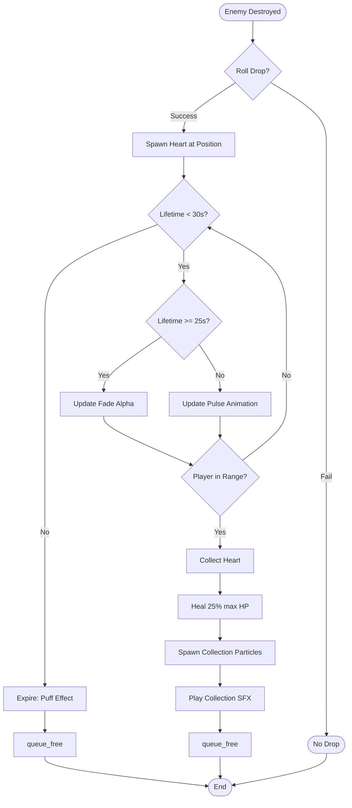
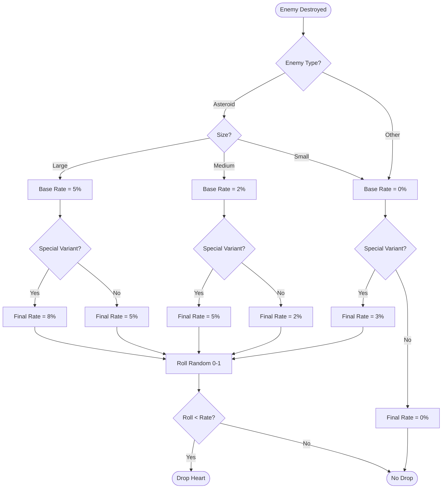
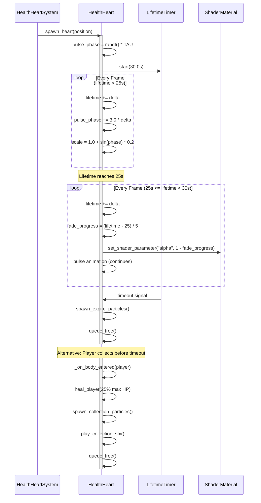
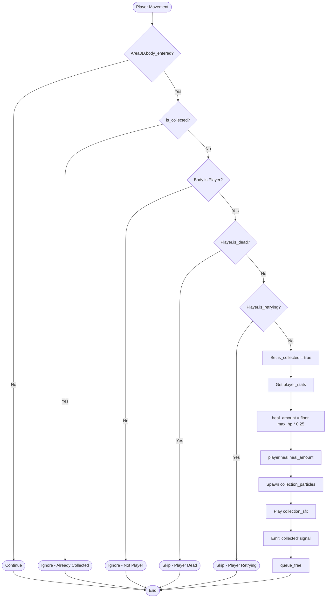

# Collectibles System - Godot Migration Guide

## 1. Visão Geral do Sistema

### Conceito
O sistema de collectibles gerencia itens que aparecem no espaço quando inimigos são destruídos. O jogador pode coletar esses itens ao passar próximo deles, recebendo benefícios imediatos (healing, power-ups temporários).

### Estado Atual (JavaScript)
- **1 tipo implementado**: Health Hearts (healing)
- **Drop condicional**: Baseado em enemy type/size/variant
- **Collection automática**: Radius-based (25px)
- **Visual feedback**: Pulse animation, gradient rendering
- **Persistence**: NÃO persiste entre death/retry

### Features Novas para Godot
- **Lifetime system**: Hearts desaparecem após 30s
- **Fade animation**: Últimos 5s (25s → 30s)
- **Drop position offset**: Offset radial da posição do enemy
- **Power-ups temporários**: Speed boost, damage boost, invincibility (slots para implementação futura)

### Propósito no Gameplay
- **Risk/reward**: Jogador deve se posicionar estrategicamente para coletar hearts antes que desapareçam
- **Health management**: Alternativa ao regeneration natural (se houver)
- **Visual feedback**: Indicação clara de progresso/recompensa

---

## 2. Estrutura de Dados

### HealthHeartSystem (Manager)

**JavaScript (src/modules/collectibles/HealthHeartSystem.js):**
```javascript
{
  hearts: [],              // Array de HealthHeart instances
  player: Object,          // Referência ao player
  camera: Object,          // Referência à câmera
  audioSystem: Object      // Referência ao audio system
}
```

**Godot (GDScript):**
```gdscript
extends Node3D
class_name HealthHeartSystem

var hearts: Array[HealthHeart] = []
var player: Player = null
var audio_system: AudioSystem = null

const COLLECTION_RADIUS: float = 25.0  # px convertido para units
```

### HealthHeart (Individual Item)

**JavaScript (src/modules/collectibles/HealthHeart.js):**
```javascript
{
  x: Number,              // Position X
  y: Number,              // Position Y
  radius: 14,             // Visual radius (px)
  pulsePhase: Number,     // Animation phase (radians)
  collected: Boolean,     // Collection flag
  lifetime: Number        // Time alive (seconds)
}
```

**Godot (GDScript):**
```gdscript
extends Area3D
class_name HealthHeart

var pulse_phase: float = 0.0
var lifetime: float = 0.0
var is_collected: bool = false

const RADIUS: float = 14.0
const PULSE_SPEED: float = 3.0  # rad/s
const PULSE_AMPLITUDE: float = 0.2  # ±20% scale
const MAX_LIFETIME: float = 30.0  # seconds
const FADE_START_TIME: float = 25.0  # start fade at 25s
const FADE_DURATION: float = 5.0  # fade over 5s
```

---

## 3. Health Hearts Mechanics

### Healing Calculation

**⚠️ IMPORTANTE**: Healing é **25% do max HP**, não valor fixo de 25 HP.

**JavaScript (HealthHeartSystem.js:57-78):**
```javascript
const healAmount = Math.floor(playerStats.maxHP * 0.25);
playerStats.HP = Math.min(playerStats.HP + healAmount, playerStats.maxHP);
```

**Godot (GDScript):**
```gdscript
func heal_player(heart: HealthHeart) -> void:
    var player_stats = player.get_stats()
    var heal_amount = floori(player_stats.max_hp * 0.25)
    player_stats.hp = mini(player_stats.hp + heal_amount, player_stats.max_hp)

    # Visual feedback
    emit_signal("heart_collected", heart.global_position, heal_amount)
```

### Drop Rates

**JavaScript (src/data/constants/visual.js:193):**

| Enemy Type | Size | Base Rate | Special Variant Bonus | Total Rate |
|------------|------|-----------|----------------------|------------|
| Asteroid   | Large | 5% (0.05) | +3% (0.03) | 8% special |
| Asteroid   | Medium | 2% (0.02) | +3% (0.03) | 5% special |
| Asteroid   | Small | 0% (0.00) | +3% (0.03) | 3% special |

**Special Variants**: gold, crystal, volatile, parasite

### Visual Design

**Rendering (JavaScript - HealthHeart.js:80-120):**
1. **Outer glow**: Red gradient (radius × 2.5)
2. **Body gradient**: Red fill (radius × 1.0)
3. **Inner highlight**: Lighter red (radius × 0.6)
4. **Cross symbol**: White, width 2px, extends ±60% of radius

**Godot Implementation**: Ver seção 9 (Sprite3D + shader)

---

## 4. Drop System Algorithm

### Drop Decision Logic

**Pseudocódigo GDScript:**
```gdscript
func should_drop_heart(enemy: Enemy) -> bool:
    var base_rate: float = 0.0

    # Determine base rate by enemy type and size
    match enemy.type:
        Enemy.Type.ASTEROID:
            match enemy.size:
                Enemy.Size.LARGE:
                    base_rate = 0.05  # 5%
                Enemy.Size.MEDIUM:
                    base_rate = 0.02  # 2%
                Enemy.Size.SMALL:
                    base_rate = 0.0   # 0%

    # Add variant bonus
    if enemy.is_special_variant():  # gold, crystal, volatile, parasite
        base_rate += 0.03  # +3%

    # Roll
    var roll = randf()  # 0.0 to 1.0
    return roll < base_rate

func calculate_drop_position(enemy_position: Vector3, enemy_radius: float) -> Vector3:
    # NOVO: Offset radial (não implementado no JS atual)
    var angle = randf() * TAU
    var distance = randf_range(enemy_radius * 0.5, enemy_radius * 1.5)
    var offset = Vector3(cos(angle), 0, sin(angle)) * distance
    return enemy_position + offset
```

### Drop Trigger Integration

**Enemy System Integration:**
```gdscript
# Em Enemy.gd, quando destruído:
signal destroyed(position: Vector3, type: Type, size: Size, is_special: bool)

# Em HealthHeartSystem.gd:
func _ready() -> void:
    # Connect to all enemy destruction events
    get_tree().get_nodes_in_group("enemies").connect("destroyed", _on_enemy_destroyed)

func _on_enemy_destroyed(position: Vector3, type: int, size: int, is_special: bool) -> void:
    var enemy_data = {
        "type": type,
        "size": size,
        "is_special": is_special,
        "position": position,
        "radius": 30.0  # Exemplo, usar valor real do enemy
    }

    if should_drop_heart(enemy_data):
        spawn_heart(calculate_drop_position(position, enemy_data.radius))
```

---

## 5. Lifetime System (NOVO)

**⚠️ Feature nova**: Não implementado no JavaScript atual.

### Conceito
- Hearts vivem **30 segundos** após spawn
- **Fade animation** nos últimos 5 segundos (25s → 30s)
- **Auto-expire** ao atingir max lifetime

### Pseudocódigo GDScript

```gdscript
func _process(delta: float) -> void:
    if is_collected:
        return

    lifetime += delta

    # Check expiration
    if lifetime >= MAX_LIFETIME:
        _expire()
        return

    # Update fade
    if lifetime >= FADE_START_TIME:
        var fade_progress = (lifetime - FADE_START_TIME) / FADE_DURATION
        _update_fade(fade_progress)

    # Update pulse animation
    pulse_phase += PULSE_SPEED * delta
    _update_pulse()

func _update_fade(progress: float) -> void:
    # progress: 0.0 (opaque) to 1.0 (transparent)
    var alpha = 1.0 - progress

    # Apply to sprite material
    if sprite_3d:
        var material = sprite_3d.material_override as ShaderMaterial
        if material:
            material.set_shader_parameter("alpha", alpha)

func _expire() -> void:
    # Play disappear effect
    spawn_expire_particles()

    # Remove from scene
    queue_free()

func spawn_expire_particles() -> void:
    # Small puff effect (menos dramático que collection)
    var particles = EXPIRE_PARTICLES_SCENE.instantiate()
    get_parent().add_child(particles)
    particles.global_position = global_position
    particles.emitting = true
```

---

## 6. Collection System Algorithm

### Collision Detection

**⚠️ IMPORTANTE**: Collection radius é **25px** (constante fixa), não "collision radius + padding".

**JavaScript (HealthHeartSystem.js:44-55):**
```javascript
const collectionRadiusSq = 25 * 25;  // 625
const distSq = (heart.x - player.x) ** 2 + (heart.y - player.y) ** 2;
if (distSq < collectionRadiusSq) {
    collectHeart(heart);
}
```

**Godot (GDScript):**
```gdscript
# HealthHeart.gd - Area3D signals
func _ready() -> void:
    body_entered.connect(_on_body_entered)

func _on_body_entered(body: Node3D) -> void:
    if is_collected:
        return

    if body is Player:
        _collect(body)

func _collect(player: Player) -> void:
    is_collected = true

    # Skip if player is dead/retrying
    if player.is_dead or player.is_retrying:
        return

    # Healing
    var player_stats = player.get_stats()
    var heal_amount = floori(player_stats.max_hp * 0.25)
    player.heal(heal_amount)

    # Visual feedback
    spawn_collection_particles()

    # Audio feedback
    play_collection_sfx()

    # UI feedback (heal popup)
    emit_signal("collected", global_position, heal_amount)

    # Remove
    queue_free()

func spawn_collection_particles() -> void:
    var particles = COLLECTION_PARTICLES_SCENE.instantiate()
    get_parent().add_child(particles)
    particles.global_position = global_position
    particles.emitting = true

    # Burst effect: red sparkles expanding outward
    particles.process_material.set_param(GPUParticles3D.PARAM_INITIAL_LINEAR_VELOCITY, 50.0)
    particles.process_material.set_param(GPUParticles3D.PARAM_RADIAL_ACCEL, 100.0)

func play_collection_sfx() -> void:
    AudioSystem.play_sfx("heart_collect", {
        "position": global_position,
        "pitch": randf_range(0.9, 1.1),
        "volume_db": -5.0
    })
```

### Collection Radius Setup (Area3D)

```gdscript
# HealthHeart.tscn - CollisionShape3D
# Sphere shape com radius = 25.0 (convertido de px para units)
var collision_shape = CollisionShape3D.new()
collision_shape.shape = SphereShape3D.new()
collision_shape.shape.radius = 25.0
add_child(collision_shape)
```

---

## 7. Pulse Animation

### Algorithm

**JavaScript (HealthHeart.js:26-45):**
```javascript
// Seeded RNG para phase inicial
this.pulsePhase = seedRandom() * Math.PI * 2;

// Update loop
this.pulsePhase += 3.0 * deltaTime;  // 3 rad/s

// Scale calculation
const pulseScale = 1.0 + Math.sin(this.pulsePhase) * 0.2;  // 1.0 ± 0.2
```

**Godot (GDScript):**
```gdscript
func _ready() -> void:
    # Seeded RNG para evitar todos os hearts pulsando em sincronia
    pulse_phase = randf() * TAU

func _process(delta: float) -> void:
    if is_collected:
        return

    # Increment phase
    pulse_phase += PULSE_SPEED * delta

    # Wrap phase (prevent overflow)
    if pulse_phase > TAU:
        pulse_phase -= TAU

    # Update scale
    _update_pulse()

func _update_pulse() -> void:
    var pulse_scale = 1.0 + sin(pulse_phase) * PULSE_AMPLITUDE
    sprite_3d.scale = Vector3.ONE * pulse_scale
```

### Shader Implementation (Alternativa)

```gdshader
shader_type spatial;

uniform float pulse_speed = 3.0;
uniform float pulse_amplitude = 0.2;
uniform float alpha = 1.0;

void vertex() {
    float pulse_scale = 1.0 + sin(TIME * pulse_speed) * pulse_amplitude;
    VERTEX *= pulse_scale;
}

void fragment() {
    ALBEDO = vec3(1.0, 0.0, 0.0);  // Red
    ALPHA = alpha;
}
```

---

## 8. Future Power-ups (NOVO)

**⚠️ Não implementado**: Slots para implementação futura.

### Power-up Types

| Type | Duration | Effect | Visual | Drop Rate |
|------|----------|--------|--------|-----------|
| **Speed Boost** | 10s | +50% move speed | Blue glow | 1% boss, 0.5% special |
| **Damage Boost** | 8s | +100% damage | Red glow | 1% boss, 0.5% special |
| **Invincibility** | 5s | Immune to damage | Golden glow | 0.5% boss only |

### Pseudocódigo GDScript

```gdscript
extends Area3D
class_name PowerUp

enum Type {
    SPEED_BOOST,
    DAMAGE_BOOST,
    INVINCIBILITY
}

var type: Type
var duration: float
var lifetime: float = 0.0

const MAX_LIFETIME: float = 20.0  # Power-ups desaparecem mais rápido
const FADE_START_TIME: float = 15.0

func _ready() -> void:
    match type:
        Type.SPEED_BOOST:
            duration = 10.0
            _setup_visual(Color.BLUE)
        Type.DAMAGE_BOOST:
            duration = 8.0
            _setup_visual(Color.RED)
        Type.INVINCIBILITY:
            duration = 5.0
            _setup_visual(Color.GOLD)

    body_entered.connect(_on_body_entered)

func _on_body_entered(body: Node3D) -> void:
    if body is Player:
        _apply_buff(body)

func _apply_buff(player: Player) -> void:
    match type:
        Type.SPEED_BOOST:
            player.add_buff("speed", 1.5, duration)  # +50% speed
        Type.DAMAGE_BOOST:
            player.add_buff("damage", 2.0, duration)  # +100% damage
        Type.INVINCIBILITY:
            player.add_buff("invincibility", 1.0, duration)

    # Visual/audio feedback
    spawn_collection_particles()
    play_collection_sfx()

    # UI notification
    emit_signal("powerup_collected", type, duration)

    queue_free()

# Player.gd - Buff system
var active_buffs: Dictionary = {}  # buff_name -> {multiplier, time_left}

func add_buff(buff_name: String, multiplier: float, duration: float) -> void:
    active_buffs[buff_name] = {
        "multiplier": multiplier,
        "time_left": duration
    }

    # UI update
    emit_signal("buff_added", buff_name, duration)

func _process(delta: float) -> void:
    # Update buffs
    for buff_name in active_buffs.keys():
        active_buffs[buff_name].time_left -= delta

        if active_buffs[buff_name].time_left <= 0:
            active_buffs.erase(buff_name)
            emit_signal("buff_expired", buff_name)

func get_move_speed_multiplier() -> float:
    return active_buffs.get("speed", {}).get("multiplier", 1.0)

func get_damage_multiplier() -> float:
    return active_buffs.get("damage", {}).get("multiplier", 1.0)

func is_invincible() -> bool:
    return active_buffs.has("invincibility")
```

---

## 9. Implementação Godot

### Scene Structure: HealthHeart.tscn

```
HealthHeart (Area3D)
├── Sprite3D (billboard mode, texture: heart sprite)
│   └── Material: ShaderMaterial (heart_shader.gdshader)
├── CollisionShape3D (SphereShape3D, radius: 25.0)
├── LifetimeTimer (Timer, wait_time: 30.0, one_shot: true)
├── CollectionParticles (GPUParticles3D, one_shot: true)
└── ExpireParticles (GPUParticles3D, one_shot: true)
```

### Scene Structure: HealthHeartSystem.tscn

```
HealthHeartSystem (Node3D)
├── Script: HealthHeartSystem.gd
└── (hearts spawned as children)
```

### Script: HealthHeart.gd

```gdscript
extends Area3D
class_name HealthHeart

signal collected(position: Vector3, heal_amount: int)

@onready var sprite_3d: Sprite3D = $Sprite3D
@onready var lifetime_timer: Timer = $LifetimeTimer
@onready var collection_particles: GPUParticles3D = $CollectionParticles
@onready var expire_particles: GPUParticles3D = $ExpireParticles

var pulse_phase: float = 0.0
var lifetime: float = 0.0
var is_collected: bool = false

const RADIUS: float = 14.0
const PULSE_SPEED: float = 3.0
const PULSE_AMPLITUDE: float = 0.2
const MAX_LIFETIME: float = 30.0
const FADE_START_TIME: float = 25.0
const FADE_DURATION: float = 5.0

func _ready() -> void:
    # Seeded RNG para pulse phase
    pulse_phase = randf() * TAU

    # Setup collision
    collision_layer = 0  # Don't collide with anything
    collision_mask = 1   # Only detect player (layer 1)

    # Setup lifetime timer
    lifetime_timer.wait_time = MAX_LIFETIME
    lifetime_timer.timeout.connect(_on_lifetime_timeout)
    lifetime_timer.start()

    # Setup body detection
    body_entered.connect(_on_body_entered)

func _process(delta: float) -> void:
    if is_collected:
        return

    lifetime += delta

    # Update fade
    if lifetime >= FADE_START_TIME:
        var fade_progress = (lifetime - FADE_START_TIME) / FADE_DURATION
        _update_fade(fade_progress)

    # Update pulse
    pulse_phase += PULSE_SPEED * delta
    if pulse_phase > TAU:
        pulse_phase -= TAU
    _update_pulse()

func _update_pulse() -> void:
    var pulse_scale = 1.0 + sin(pulse_phase) * PULSE_AMPLITUDE
    sprite_3d.scale = Vector3.ONE * pulse_scale

func _update_fade(progress: float) -> void:
    var alpha = 1.0 - progress
    var material = sprite_3d.material_override as ShaderMaterial
    if material:
        material.set_shader_parameter("alpha", alpha)

func _on_body_entered(body: Node3D) -> void:
    if is_collected:
        return

    if body is Player:
        _collect(body)

func _collect(player: Player) -> void:
    is_collected = true

    # Skip if player dead/retrying
    if player.is_dead or player.is_retrying:
        return

    # Heal player
    var player_stats = player.get_stats()
    var heal_amount = floori(player_stats.max_hp * 0.25)
    player.heal(heal_amount)

    # Visual feedback
    collection_particles.restart()

    # Audio feedback
    AudioSystem.play_sfx("heart_collect", global_position)

    # Signal
    emit_signal("collected", global_position, heal_amount)

    # Remove
    queue_free()

func _on_lifetime_timeout() -> void:
    if is_collected:
        return

    # Expire effect
    expire_particles.restart()

    # Remove
    queue_free()
```

### Script: HealthHeartSystem.gd

```gdscript
extends Node3D
class_name HealthHeartSystem

const HEART_SCENE = preload("res://scenes/collectibles/HealthHeart.tscn")

@export var player: Player
@export var audio_system: AudioSystem

var hearts: Array[HealthHeart] = []

const COLLECTION_RADIUS: float = 25.0

func _ready() -> void:
    # Connect to enemy destruction events
    _connect_enemy_events()

func _connect_enemy_events() -> void:
    # Connect to all enemies in scene
    for enemy in get_tree().get_nodes_in_group("enemies"):
        if not enemy.is_connected("destroyed", _on_enemy_destroyed):
            enemy.destroyed.connect(_on_enemy_destroyed)

func _on_enemy_destroyed(data: Dictionary) -> void:
    # data = {position, type, size, is_special, radius}

    if should_drop_heart(data):
        var drop_position = calculate_drop_position(data.position, data.radius)
        spawn_heart(drop_position)

func should_drop_heart(enemy_data: Dictionary) -> bool:
    var base_rate: float = 0.0

    # Determine base rate
    match enemy_data.type:
        Enemy.Type.ASTEROID:
            match enemy_data.size:
                Enemy.Size.LARGE:
                    base_rate = 0.05  # 5%
                Enemy.Size.MEDIUM:
                    base_rate = 0.02  # 2%
                Enemy.Size.SMALL:
                    base_rate = 0.0   # 0%

    # Add variant bonus
    if enemy_data.is_special:
        base_rate += 0.03  # +3%

    # Roll
    return randf() < base_rate

func calculate_drop_position(position: Vector3, radius: float) -> Vector3:
    var angle = randf() * TAU
    var distance = randf_range(radius * 0.5, radius * 1.5)
    var offset = Vector3(cos(angle), 0, sin(angle)) * distance
    return position + offset

func spawn_heart(position: Vector3) -> void:
    var heart = HEART_SCENE.instantiate() as HealthHeart
    add_child(heart)
    heart.global_position = position
    heart.collected.connect(_on_heart_collected)
    hearts.append(heart)

func _on_heart_collected(position: Vector3, heal_amount: int) -> void:
    # UI feedback (heal popup)
    if player:
        player.show_heal_popup(heal_amount)

func reset() -> void:
    # Clear all hearts (new game or quit to menu)
    for heart in hearts:
        if is_instance_valid(heart):
            heart.queue_free()
    hearts.clear()
```

### Shader: heart_shader.gdshader

```gdshader
shader_type spatial;
render_mode blend_mix, depth_draw_opaque, cull_back, unshaded;

uniform sampler2D texture_albedo : source_color;
uniform float alpha : hint_range(0.0, 1.0) = 1.0;
uniform vec3 glow_color : source_color = vec3(1.0, 0.2, 0.2);
uniform float glow_strength : hint_range(0.0, 2.0) = 0.5;

void fragment() {
    vec4 albedo_tex = texture(texture_albedo, UV);

    // Base color (red)
    ALBEDO = albedo_tex.rgb;

    // Glow effect
    EMISSION = glow_color * glow_strength;

    // Alpha (for fade)
    ALPHA = albedo_tex.a * alpha;
}
```

---

## 10. Tabela de Parâmetros

| Parâmetro | Valor | Descrição | Origem |
|-----------|-------|-----------|--------|
| `COLLECTION_RADIUS` | 25.0 | Radius de collection (units) | HealthHeartSystem.js:16 |
| `HEART_RADIUS` | 14.0 | Radius visual do heart (units) | HealthHeart.js:12 |
| `HEAL_PERCENTAGE` | 0.25 | Healing como % do max HP | HealthHeartSystem.js:57 |
| `PULSE_SPEED` | 3.0 | Velocidade da pulse animation (rad/s) | HealthHeart.js:28 |
| `PULSE_AMPLITUDE` | 0.2 | Amplitude do pulse (±20% scale) | HealthHeart.js:30 |
| `MAX_LIFETIME` | 30.0 | Tempo de vida máximo (seconds) | **NOVO** |
| `FADE_START_TIME` | 25.0 | Início do fade (seconds) | **NOVO** |
| `FADE_DURATION` | 5.0 | Duração do fade (seconds) | **NOVO** |
| `DROP_RATE_LARGE` | 0.05 | Drop rate asteroid large (5%) | visual.js:193 |
| `DROP_RATE_MEDIUM` | 0.02 | Drop rate asteroid medium (2%) | visual.js:193 |
| `DROP_RATE_SMALL` | 0.0 | Drop rate asteroid small (0%) | visual.js:193 |
| `VARIANT_BONUS` | 0.03 | Bonus drop rate special variants (+3%) | visual.js:193 |

---

## 11. Drop Rates Table

### Base Rates

| Enemy Type | Size | Base Drop Rate | Special Variant? | Final Drop Rate |
|------------|------|----------------|------------------|-----------------|
| Asteroid   | Large | 5% (0.05) | No | 5% |
| Asteroid   | Large | 5% (0.05) | **Yes** (gold/crystal/volatile/parasite) | **8%** (0.05 + 0.03) |
| Asteroid   | Medium | 2% (0.02) | No | 2% |
| Asteroid   | Medium | 2% (0.02) | **Yes** | **5%** (0.02 + 0.03) |
| Asteroid   | Small | 0% (0.00) | No | 0% |
| Asteroid   | Small | 0% (0.00) | **Yes** | **3%** (0.00 + 0.03) |

### Special Variants
- **Gold**: +3% drop rate
- **Crystal**: +3% drop rate
- **Volatile**: +3% drop rate
- **Parasite**: +3% drop rate

### Future Power-ups (Sugestão)

| Enemy Type | Power-up Type | Drop Rate |
|------------|---------------|-----------|
| Boss | Speed Boost | 1% |
| Boss | Damage Boost | 1% |
| Boss | Invincibility | 0.5% |
| Special Enemy | Speed Boost | 0.5% |
| Special Enemy | Damage Boost | 0.5% |

---

## 12. Diagramas

### Collection Flow



### Drop Decision Tree



### Lifetime & Fade Sequence



### Collection Check Flowchart



---

## 13. Visual Specs

### Rendering Layers (JavaScript Canvas 2D)

**JavaScript (HealthHeart.js:80-120):**

| Layer | Radius | Color (RGB) | Color (HSL) | Specs |
|-------|--------|-------------|-------------|-------|
| **Outer Glow** | radius × 2.5 (35px) | `rgba(255, 0, 0, 0.3)` | `hsl(0, 100%, 50%)` + alpha 0.3 | Radial gradient: center (r=0, alpha=0.3) → edge (r=35, alpha=0) |
| **Body Gradient** | radius × 1.0 (14px) | Center: `rgb(255, 100, 100)` → Edge: `rgb(200, 0, 0)` | Center: `hsl(0, 100%, 70%)` → Edge: `hsl(0, 100%, 39%)` | Radial gradient fill |
| **Inner Highlight** | radius × 0.6 (8.4px) | `rgba(255, 150, 150, 0.6)` | `hsl(0, 100%, 79%)` + alpha 0.6 | Radial gradient: center (alpha=0.6) → edge (alpha=0) |
| **Cross Symbol** | Width: 2px, Length: radius × 1.2 (16.8px) | `rgb(255, 255, 255)` | `hsl(0, 0%, 100%)` | Two lines: horizontal + vertical, centered |

### Godot 3D Equivalent

**Approach 1: Sprite3D + Texture**
- Criar texture 64×64 PNG pré-renderizada com as 4 layers
- Aplicar a Sprite3D com billboard mode
- Shader para pulse/fade

**Approach 2: Sprite3D + Shader (Procedural)**
```gdshader
shader_type spatial;
render_mode blend_mix, unshaded;

uniform float alpha = 1.0;

void fragment() {
    vec2 center = vec2(0.5, 0.5);
    float dist = distance(UV, center);

    // Outer glow (radius 0.7-1.0)
    float glow = smoothstep(0.7, 1.0, dist) * 0.3;

    // Body gradient (radius 0.0-0.4)
    float body = 1.0 - smoothstep(0.0, 0.4, dist);
    vec3 body_color = mix(vec3(0.78, 0.0, 0.0), vec3(1.0, 0.39, 0.39), body);

    // Inner highlight (radius 0.0-0.24)
    float highlight = smoothstep(0.0, 0.24, dist) * 0.6;

    // Cross symbol
    float cross_h = step(abs(UV.y - 0.5), 0.02);  // Horizontal
    float cross_v = step(abs(UV.x - 0.5), 0.02);  // Vertical
    float cross_mask = max(cross_h, cross_v) * step(dist, 0.42);  // Limit to radius

    // Combine
    vec3 final_color = body_color + vec3(glow) + vec3(highlight);
    final_color = mix(final_color, vec3(1.0), cross_mask);

    ALBEDO = final_color;
    ALPHA = alpha * step(dist, 1.0);  // Circular cutoff
}
```

**Approach 3: MeshInstance3D + QuadMesh**
- Similar ao Sprite3D, mas com mais controle sobre geometry/UV

### Recomendação
- **Approach 1** (Sprite3D + Texture): Melhor performance, visual consistente
- **Approach 2** (Shader procedural): Mais flexível, permite variações dinâmicas

---

## 14. Audio Specs

### Collection SFX

**Características:**
- **Sound design**: Bright, short "bling" (100-150ms)
- **Pitch**: Base C6 (1046 Hz), variação ±10% (randf_range(0.9, 1.1))
- **Volume**: -5 dB (audível mas não intrusivo)
- **Spatial**: 3D audio com attenuation (max distance: 100 units)

**Godot Implementation:**
```gdscript
func play_collection_sfx() -> void:
    var audio_player = AudioStreamPlayer3D.new()
    get_parent().add_child(audio_player)
    audio_player.global_position = global_position

    audio_player.stream = preload("res://audio/sfx/heart_collect.wav")
    audio_player.pitch_scale = randf_range(0.9, 1.1)
    audio_player.volume_db = -5.0
    audio_player.max_distance = 100.0
    audio_player.attenuation_model = AudioStreamPlayer3D.ATTENUATION_INVERSE_DISTANCE

    audio_player.finished.connect(audio_player.queue_free)
    audio_player.play()
```

### Expire SFX (Opcional)

**Características:**
- **Sound design**: Soft "poof" (80ms)
- **Pitch**: Base A4 (440 Hz)
- **Volume**: -15 dB (muito sutil)
- **Spatial**: 3D audio com attenuation

---

## 15. Integration

### Interfaces Necessárias

#### Enemy System
**Signal emitido pelo Enemy:**
```gdscript
signal destroyed(data: Dictionary)
# data = {
#     position: Vector3,
#     type: Enemy.Type,
#     size: Enemy.Size,
#     is_special: bool,
#     radius: float
# }
```

**HealthHeartSystem conecta:**
```gdscript
func _ready() -> void:
    for enemy in get_tree().get_nodes_in_group("enemies"):
        enemy.destroyed.connect(_on_enemy_destroyed)
```

#### Player System
**Métodos necessários no Player:**
```gdscript
func get_stats() -> Dictionary:
    return {
        "hp": current_hp,
        "max_hp": max_hp
    }

func heal(amount: int) -> void:
    current_hp = mini(current_hp + amount, max_hp)
    emit_signal("healed", amount)

func show_heal_popup(amount: int) -> void:
    # UI popup: "+25 HP"
    pass
```

**Propriedades necessárias:**
```gdscript
var is_dead: bool = false
var is_retrying: bool = false
```

#### Effects System
**GPUParticles3D configuration:**
```gdscript
# Collection particles
var particles = GPUParticles3D.new()
particles.amount = 20
particles.lifetime = 0.5
particles.one_shot = true
particles.explosiveness = 1.0

var material = ParticleProcessMaterial.new()
material.emission_shape = ParticleProcessMaterial.EMISSION_SHAPE_SPHERE
material.emission_sphere_radius = 5.0
material.initial_velocity_min = 30.0
material.initial_velocity_max = 50.0
material.gravity = Vector3.ZERO
material.radial_accel_min = 50.0
material.radial_accel_max = 100.0
material.color = Color(1.0, 0.3, 0.3)  # Red sparkles
particles.process_material = material
```

#### Audio System
**Método necessário:**
```gdscript
# Global AudioSystem autoload
static func play_sfx(sfx_name: String, position: Vector3, pitch: float = 1.0, volume_db: float = 0.0) -> void:
    var player = AudioStreamPlayer3D.new()
    # ... (setup como acima)
```

#### UI System
**Signal emitido pelo HealthHeart:**
```gdscript
signal collected(position: Vector3, heal_amount: int)
```

**UI conecta para criar popup:**
```gdscript
func _on_heart_collected(position: Vector3, heal_amount: int) -> void:
    var popup = FloatingText.new()
    popup.text = "+%d HP" % heal_amount
    popup.color = Color.GREEN
    popup.world_position = position
    add_child(popup)
```

---

## 16. Referências

### Arquivos Analisados

| Arquivo | Linhas | Descrição |
|---------|--------|-----------|
| [src/modules/collectibles/HealthHeartSystem.js](../../../src/modules/collectibles/HealthHeartSystem.js) | 122 | Manager: spawn, update, collection check, healing |
| [src/modules/collectibles/HealthHeart.js](../../../src/modules/collectibles/HealthHeart.js) | 128 | Individual heart: pulse, render, collision |
| [src/data/constants/visual.js](../../../src/data/constants/visual.js) | 193 | Drop rates por enemy type/size/variant |

### Funções-Chave (JavaScript)

| Função | Arquivo | Linhas | Descrição |
|--------|---------|--------|-----------|
| `update(deltaTime)` | HealthHeartSystem.js | 26-42 | Update loop: hearts, collection, cleanup |
| `checkCollision(player)` | HealthHeartSystem.js | 44-55 | Circle-circle collision check (radius 25px) |
| `collectHeart(heart)` | HealthHeartSystem.js | 57-78 | Healing (25% max HP), feedback, remove |
| `spawn(x, y)` | HealthHeartSystem.js | 80-88 | Create HealthHeart instance, add to array |
| `render(ctx, camera)` | HealthHeart.js | 80-120 | Canvas 2D rendering (4 layers) |
| `update(deltaTime)` | HealthHeart.js | 26-45 | Pulse animation update |

### Eventos

| Evento | Emitido por | Consumido por | Dados |
|--------|-------------|---------------|-------|
| `destroyed` | Enemy | HealthHeartSystem | `{position, type, size, is_special, radius}` |
| `collected` | HealthHeart | UI System | `{position, heal_amount}` |
| `healed` | Player | UI System, Audio System | `{amount}` |

### Constantes Importantes

```javascript
// JavaScript (valores exatos)
COLLECTION_RADIUS = 25         // px
HEART_RADIUS = 14              // px
HEAL_PERCENTAGE = 0.25         // 25% max HP
PULSE_SPEED = 3.0              // rad/s
PULSE_AMPLITUDE = 0.2          // ±20% scale
DROP_RATE_LARGE = 0.05         // 5%
DROP_RATE_MEDIUM = 0.02        // 2%
VARIANT_BONUS = 0.03           // +3%
```

```gdscript
# Godot (conversão sugerida)
const COLLECTION_RADIUS: float = 25.0  # units (1px = 1 unit)
const HEART_RADIUS: float = 14.0
const HEAL_PERCENTAGE: float = 0.25
const PULSE_SPEED: float = 3.0
const PULSE_AMPLITUDE: float = 0.2
const MAX_LIFETIME: float = 30.0       # NOVO
const FADE_START_TIME: float = 25.0    # NOVO
const FADE_DURATION: float = 5.0       # NOVO
```

---

## Observações Finais

### Correções de Informações Iniciais

1. **Healing**: 25% do max HP (não valor fixo de 25 HP)
   - Fórmula: `floor(maxHP × 0.25)`
   - Exemplo: Player com 100 HP max → heal 25 HP
   - Exemplo: Player com 150 HP max → heal 37 HP

2. **Collection Radius**: 25px constante (não "collision radius + padding")
   - Definido em HealthHeartSystem.js:16
   - Circle-circle check: `distSq < collectionRadiusSq` (625)

3. **Drop Position**: Exata posição do enemy no código atual
   - Offset radial é feature nova sugerida para Godot
   - JavaScript: `new HealthHeart(enemy.x, enemy.y)`

4. **Magnetismo**: NÃO implementado no código atual
   - Comentário explícito em HealthHeart.js:9: "no magnetism needed"
   - Se desejar adicionar no Godot, implementar como feature nova

### Features Novas Implementadas no Godot

1. **Lifetime System**: 30s max, fade animation últimos 5s
2. **Drop Position Offset**: Offset radial da posição do enemy
3. **Power-ups Temporários**: Slots para speed boost, damage boost, invincibility (implementação futura)
4. **Shader-based Rendering**: Substitui Canvas 2D rendering (Sprite3D + shader)

### Próximos Passos

1. Implementar `HealthHeart.gd` e `HealthHeartSystem.gd`
2. Criar `heart_shader.gdshader` (ou texture 64×64 PNG)
3. Configurar `HealthHeart.tscn` (Area3D + Sprite3D + Timer + Particles)
4. Integrar com Enemy System (`destroyed` signal)
5. Integrar com Player System (`heal()`, `get_stats()`)
6. Criar collection SFX (`heart_collect.wav`)
7. Testar drop rates, lifetime, fade, collection
8. (Opcional) Implementar power-ups temporários

---

**Documento criado em**: 2025-10-30
**Versão**: 1.0
**Status**: Completo - Pronto para implementação
