# Migração Godot 3D: Sistema de Input

**Status**: 📋 Planejamento
**Prioridade**: Alta
**Complexidade**: Alta
**Documento**: 11/N da série de migração

---

## 1. Visão Geral do Sistema

### Conceito
Sistema de input flexível que suporta keyboard, gamepad e rebinding dinâmico de controles, permitindo aos jogadores customizar completamente suas preferências de input.

### Características Principais
- **8 Input Actions**: moveUp/Down/Left/Right, firePrimary, activateShield, pause, openSettings, confirm
- **Keyboard Support**: WASD/Arrow keys, Space, E, Escape, F10, Enter com rebinding completo
- **Gamepad Support**: Analog sticks (threshold: 0.45), buttons, detecção automática de connect/disconnect
- **Rebinding System**: UI para capturar novos inputs, validação de conflitos, persistência em localStorage
- **Input Normalization**: Diagonal movement normalizado (magnitude 1.0), dead zones para analog sticks
- **Multiple Bindings**: Até 2 bindings por action (ex: W + Arrow Up para moveUp)

### Propósito
Fornecer controles responsivos e customizáveis que funcionam perfeitamente tanto com keyboard quanto com gamepad, garantindo acessibilidade e conforto para todos os jogadores.

---

## 2. Estrutura de Dados do Sistema

### Mapeamento JavaScript → GDScript

```gdscript
class_name InputSystem
extends Node

# Dependencies
var command_queue: CommandQueueService
var settings: SettingsSystem
var event_bus: EventBusService

# Keyboard state
var keys: Dictionary = {}  # key (String) -> bool
var codes: Dictionary = {}  # code (String) -> bool
var key_aliases: Dictionary = {
    "w": "keyw",
    "a": "keya",
    "s": "keys",
    "d": "keyd"
}

# Mouse state
var mouse_pos: Vector2 = Vector2.ZERO
var mouse_buttons: Dictionary = {}  # button (int) -> bool

# Gamepad state
var gamepad_connected: bool = false
var gamepad_index: int = 0
var previous_gamepad_buttons: Array = []  # Array[bool]
var previous_gamepad_axes: Array = []  # Array[Dictionary] {positive: bool, negative: bool}
var gamepad_axis_threshold: float = 0.45

# Action bindings (loaded from settings)
var action_bindings: Dictionary = {}  # action (String) -> {keyboard: Array[String], gamepad: Array[String]}
var keyboard_binding_map: Dictionary = {}  # normalized_key (String) -> Array[String] (actions)
var gamepad_button_map: Dictionary = {}  # "button:N" -> Array[String] (actions)
var gamepad_axis_map: Dictionary = {}  # "axis:N:direction" -> Array[String] (actions)
var movement_bindings: Array = []  # Array[String] - Actions que são movement

# Active actions (pressed state)
var active_keyboard_actions: Array = []  # Array[String] - Godot não tem Set
var active_gamepad_actions: Array = []  # Array[String]
var keyboard_action_inputs: Dictionary = {}  # action (String) -> Array[String] (inputIds)

# Rebinding system
var is_capturing_binding: bool = false

# Last movement (cached para evitar enqueue duplicado)
var last_movement_command: Dictionary = {}
```

### Campos Principais

| Campo JavaScript | Tipo GDScript | Descrição |
|-----------------|---------------|-----------|
| `keys` | `Dictionary` | Mapa de teclas pressionadas (key → bool) |
| `codes` | `Dictionary` | Mapa de key codes pressionados (code → bool) |
| `keyboardBindingMap` | `Dictionary` | Mapa de tecla normalizada → actions |
| `gamepadButtonMap` | `Dictionary` | Mapa de "button:N" → actions |
| `gamepadAxisMap` | `Dictionary` | Mapa de "axis:N:direction" → actions |
| `actionBindings` | `Dictionary` | Mapa de action → {keyboard, gamepad} bindings |
| `activeKeyboardActions` | `Array` | Lista de actions ativas via keyboard |
| `activeGamepadActions` | `Array` | Lista de actions ativas via gamepad |
| `isCapturingBinding` | `bool` | Flag de rebinding em progresso |
| `gamepadAxisThreshold` | `float` | Threshold para analog sticks (0.45) |

---

## 3. Input Actions (8 Ações)

### Tabela Completa de Actions

Baseado em `settingsSchema.js` linhas 76-188:

| Action | Label | Keyboard Default | Gamepad Default | Categoria | Description |
|--------|-------|------------------|-----------------|-----------|-------------|
| **moveUp** | Mover-se para cima | KeyW, ArrowUp | axis:1:-, button:12 | Movement | Acelerar a nave adiante |
| **moveDown** | Mover-se para baixo | KeyS, ArrowDown | axis:1:+, button:13 | Movement | Acionar propulsores traseiros |
| **moveLeft** | Derivar para esquerda | KeyA, ArrowLeft | axis:0:-, button:14 | Movement | Controle lateral (esquerda) |
| **moveRight** | Derivar para direita | KeyD, ArrowRight | axis:0:+, button:15 | Movement | Controle lateral (direita) |
| **activateShield** | Ativar escudo | KeyE, ShiftLeft | button:2, button:4 | Ability | Dispara proteção energética |
| **pause** | Pausar / Retomar | Escape, KeyP | button:9 | System | Congela o jogo |
| **openSettings** | Abrir configurações | F10 | button:8 | System | Atalho para settings |
| **confirm** | Confirmar / Interagir | Enter, Space | button:0 | UI | Confirma seleções |

### Notas Importantes

⚠️ **`firePrimary` (Space) NÃO está em settingsSchema** mas é usado no código (legacy ou hardcoded).

**Movement Actions**: moveUp, moveDown, moveLeft, moveRight são tratados especialmente:
- Combinados para gerar movimento direcional
- Enviados como comandos `{type: 'move'}` para CommandQueue
- Normalizados para magnitude 1.0 em diagonais

**Ability Actions**: activateShield
- Enviado como comando `{type: 'ability'}`
- Evento direto para PlayerSystem

**System Actions**: pause, openSettings
- Emitem eventos no EventBus
- Não passam por CommandQueue

**UI Actions**: confirm
- Emite evento `input-confirmed`
- Usado em menus e diálogos

---

## 4. Keyboard Support

### Event Listeners

Baseado em `InputSystem.js` linhas 175-323:

**KeyDown (Capture Phase)**:
- Bloqueia password manager se necessário (web-specific)
- Previne auto-fill em campos não-input

**KeyDown (Bubble Phase)**:
- Processa input normal
- Normaliza key/code
- Atualiza `keys` e `codes` dictionaries
- Coleta keyboard actions
- Handle action press

**KeyUp**:
- Libera keys/codes
- Handle action release

### Key Normalization

```gdscript
func normalize_keyboard_binding(value: String) -> String:
    """
    Normaliza binding de keyboard para lowercase e remove espaços.

    Exemplo:
        "KeyW" -> "keyw"
        "  Space  " -> "space"
        "ArrowUp" -> "arrowup"
    """
    return value.strip_edges().to_lower()
```

### Key Synonyms

Baseado em `InputSystem.js` linhas 664-697:

```gdscript
func get_keyboard_synonyms(binding: String) -> Array:
    """
    Retorna lista de synonyms para um binding.
    Permite que "KeyW" aceite tanto "keyw" quanto "w".

    Exemplo:
        get_keyboard_synonyms("keyw") -> ["w"]
        get_keyboard_synonyms("space") -> [" ", "spacebar"]
        get_keyboard_synonyms("shiftleft") -> ["shift"]
    """
    var synonyms = []

    # KeyW -> "w" (extrai última letra)
    if binding.begins_with("key") and binding.length() == 4:
        synonyms.append(binding.substr(3, 1))

    # Space -> [" ", "spacebar"]
    if binding == "space":
        synonyms.append(" ")
        synonyms.append("spacebar")

    # Shift/Control/Alt/Meta
    if binding.begins_with("shift"):
        synonyms.append("shift")
    if binding.begins_with("control"):
        synonyms.append("control")
        synonyms.append("ctrl")
    if binding.begins_with("alt"):
        synonyms.append("alt")
    if binding.begins_with("meta"):
        synonyms.append("meta")

    return synonyms
```

### Keyboard Binding Registration

Baseado em `InputSystem.js` linhas 715-727:

```gdscript
func register_keyboard_bindings(action: String, bindings: Array) -> void:
    """
    Registra bindings de keyboard em keyboardBindingMap.
    Suporta múltiplos bindings por action e synonyms.

    Exemplo:
        register_keyboard_bindings("moveUp", ["KeyW", "ArrowUp"])
        -> keyboardBindingMap["keyw"] = ["moveUp"]
        -> keyboardBindingMap["w"] = ["moveUp"]
        -> keyboardBindingMap["arrowup"] = ["moveUp"]
    """
    for binding in bindings:
        var normalized = normalize_keyboard_binding(binding)

        # Add binding principal
        add_keyboard_binding(normalized, action)

        # Add synonyms
        var synonyms = get_keyboard_synonyms(normalized)
        for syn in synonyms:
            add_keyboard_binding(syn, action)

func add_keyboard_binding(normalized_key: String, action: String) -> void:
    """
    Adiciona binding ao mapa, criando array se necessário.
    """
    if not keyboard_binding_map.has(normalized_key):
        keyboard_binding_map[normalized_key] = []

    var actions = keyboard_binding_map[normalized_key]
    if action not in actions:
        actions.append(action)
```

### Password Manager Guard (Web-Specific)

⚠️ **Não aplicável a Godot (desktop app)**

No JavaScript original (linhas 11-13):
```javascript
const PASSWORD_MANAGER_GUARD_CODES = ['KeyS', 'ArrowDown'];
```

**Propósito**: Bloquear KeyS/ArrowDown quando não está em input field para evitar que password managers capturem teclas de movimento.

**Godot**: Não necessário, pois é uma aplicação desktop sem password managers.

---

## 5. Gamepad Support

### Polling System

Baseado em `InputSystem.js` linhas 497-620:

```gdscript
func poll_gamepad() -> void:
    """
    Poll gamepad state a cada frame.
    Detecta buttons e axes, mapeia para actions.
    Emite eventos de detecção para rebinding UI.
    """
    var gamepads = Input.get_connected_joypads()

    # Gamepad disconnect
    if gamepads.is_empty():
        if gamepad_connected:
            clear_gamepad_actions()
        gamepad_connected = false
        return

    # Gamepad connected
    gamepad_connected = true
    var gamepad_id = gamepads[0]  # Primeiro gamepad

    var active_actions = []

    # ===== BUTTONS =====
    for button_index in range(16):  # Standard gamepad: 16 buttons
        var pressed = Input.is_joy_button_pressed(gamepad_id, button_index)

        if pressed:
            var key = "button:%d" % button_index
            var mapped = gamepad_button_map.get(key, [])
            active_actions.append_array(mapped)

        # Emit detection event (first press)
        var was_pressed = previous_gamepad_buttons[button_index] if button_index < previous_gamepad_buttons.size() else false
        if pressed and not was_pressed:
            event_bus.emit_signal("gamepad_input_detected", {
                "type": "button",
                "index": button_index
            })

        previous_gamepad_buttons[button_index] = pressed

    # ===== AXES =====
    for axis_index in range(4):  # Standard gamepad: 4 axes (2 sticks)
        var value = Input.get_joy_axis(gamepad_id, axis_index)
        var positive = value >= gamepad_axis_threshold
        var negative = value <= -gamepad_axis_threshold

        var previous = previous_gamepad_axes[axis_index] if axis_index < previous_gamepad_axes.size() else {"positive": false, "negative": false}

        # Positive direction
        if positive:
            var key = "axis:%d:+" % axis_index
            var mapped = gamepad_axis_map.get(key, [])
            active_actions.append_array(mapped)

            if not previous.positive:
                event_bus.emit_signal("gamepad_input_detected", {
                    "type": "axis",
                    "index": axis_index,
                    "direction": "positive",
                    "value": value
                })

        # Negative direction
        if negative:
            var key = "axis:%d:-" % axis_index
            var mapped = gamepad_axis_map.get(key, [])
            active_actions.append_array(mapped)

            if not previous.negative:
                event_bus.emit_signal("gamepad_input_detected", {
                    "type": "axis",
                    "index": axis_index,
                    "direction": "negative",
                    "value": value
                })

        previous_gamepad_axes[axis_index] = {"positive": positive, "negative": negative}

    sync_gamepad_actions(active_actions)

func sync_gamepad_actions(new_active: Array) -> void:
    """
    Sincroniza active_gamepad_actions com novo estado.
    Emite press/release events para actions que mudaram.
    """
    # Detect presses (new - old)
    for action in new_active:
        if action not in active_gamepad_actions:
            handle_action_press(action, "gamepad")

    # Detect releases (old - new)
    for action in active_gamepad_actions:
        if action not in new_active:
            handle_action_release(action, "gamepad")

    active_gamepad_actions = new_active

func clear_gamepad_actions() -> void:
    """
    Limpa todas as actions ativas do gamepad.
    Emite release events para todas.
    """
    for action in active_gamepad_actions:
        handle_action_release(action, "gamepad")
    active_gamepad_actions.clear()
```

### Gamepad Binding Format

**Button Binding**:
- Format: `"button:N"` onde N = 0-15
- Exemplo: `"button:0"` (A/Cross), `"button:1"` (B/Circle)

**Axis Binding**:
- Format: `"axis:N:direction"` onde N = 0-3, direction = "+" ou "-"
- Exemplo: `"axis:0:+"` (left stick right), `"axis:1:-"` (left stick up)

### Gamepad Binding Registration

Baseado em `InputSystem.js` linhas 729-751:

```gdscript
func register_gamepad_bindings(action: String, bindings: Array) -> void:
    """
    Registra bindings de gamepad em gamepadButtonMap e gamepadAxisMap.
    Parse "button:N" e "axis:N:direction" formats.

    Exemplo:
        register_gamepad_bindings("moveUp", ["axis:1:-", "button:12"])
        -> gamepad_axis_map["axis:1:-"] = ["moveUp"]
        -> gamepad_button_map["button:12"] = ["moveUp"]
    """
    for binding in bindings:
        var parsed = parse_gamepad_binding(binding)

        if parsed.type == "button":
            var key = "button:%d" % parsed.index
            if not gamepad_button_map.has(key):
                gamepad_button_map[key] = []
            if action not in gamepad_button_map[key]:
                gamepad_button_map[key].append(action)

        elif parsed.type == "axis":
            var direction_char = "+" if parsed.direction == "positive" else "-"
            var key = "axis:%d:%s" % [parsed.index, direction_char]
            if not gamepad_axis_map.has(key):
                gamepad_axis_map[key] = []
            if action not in gamepad_axis_map[key]:
                gamepad_axis_map[key].append(action)

func parse_gamepad_binding(binding: String) -> Dictionary:
    """
    Parse gamepad binding string para estrutura.

    Exemplo:
        "button:0" -> {type: "button", index: 0}
        "axis:1:-" -> {type: "axis", index: 1, direction: "negative"}
        "axis:0:+" -> {type: "axis", index: 0, direction: "positive"}
    """
    var parts = binding.split(":")

    if parts[0] == "button":
        return {
            "type": "button",
            "index": int(parts[1])
        }

    elif parts[0] == "axis":
        var direction = "positive" if parts[2] == "+" else "negative"
        return {
            "type": "axis",
            "index": int(parts[1]),
            "direction": direction
        }

    return {}
```

### Gamepad Events

**Connect/Disconnect**:
```gdscript
func on_gamepad_connected(device_id: int, connected: bool) -> void:
    if connected:
        gamepad_connected = true
        gamepad_index = device_id
        event_bus.emit_signal("gamepad_connected", {"deviceId": device_id})
    else:
        gamepad_connected = false
        clear_gamepad_actions()
        event_bus.emit_signal("gamepad_disconnected", {"deviceId": device_id})
```

---

## 6. Action Binding System

### Binding Maps

**3 Maps Principais**:

1. **keyboardBindingMap**: `normalized_key → Array[action]`
   - Exemplo: `"w" → ["moveUp"]`, `"keyw" → ["moveUp"]`
   - Suporta synonyms (múltiplas keys para mesma action)

2. **gamepadButtonMap**: `"button:N" → Array[action]`
   - Exemplo: `"button:0" → ["confirm"]`, `"button:9" → ["pause"]`

3. **gamepadAxisMap**: `"axis:N:direction" → Array[action]`
   - Exemplo: `"axis:1:-" → ["moveUp"]`, `"axis:0:+" → ["moveRight"]`

### Apply Control Settings

Baseado em `InputSystem.js` linhas 144-162:

```gdscript
func apply_control_settings(values: Dictionary) -> void:
    """
    Rebuild binding maps de settings.
    Chamado quando settings mudam ou no init.

    Exemplo values:
    {
        "moveUp": {
            "keyboard": ["KeyW", "ArrowUp"],
            "gamepad": ["axis:1:-", "button:12"]
        },
        ...
    }
    """
    # Clear maps
    keyboard_binding_map.clear()
    gamepad_button_map.clear()
    gamepad_axis_map.clear()
    movement_bindings.clear()

    # Rebuild from settings
    for action in values.keys():
        var binding = values[action]

        # Store binding
        action_bindings[action] = binding

        # Register keyboard
        if binding.has("keyboard"):
            register_keyboard_bindings(action, binding.keyboard)

        # Register gamepad
        if binding.has("gamepad"):
            register_gamepad_bindings(action, binding.gamepad)

        # Track movement actions
        if action in MOVEMENT_ACTIONS:
            movement_bindings.append(action)
```

---

## 7. Input Normalization

### Diagonal Movement Normalization

Baseado em `InputSystem.js` linhas 867-895:

```gdscript
func compute_movement_vector(binary: Dictionary) -> Dictionary:
    """
    Converte binary state (up/down/left/right) para vetor normalizado.
    Garante que movimento diagonal tem magnitude 1.0 (não 1.414).

    Exemplo:
        Input: W + D (diagonal)
        Binary: {up: true, right: true, down: false, left: false}
        Raw vector: {x: 1, y: -1}
        Raw magnitude: sqrt(2) ≈ 1.414
        Normalized: {x: 0.707, y: -0.707}
        Magnitude: 1.0 ✅

    Args:
        binary: Dictionary com keys {up, down, left, right} (bool)

    Returns:
        Dictionary {
            axes: Vector2 (normalizado),
            raw_magnitude: float,
            normalized_magnitude: float
        }
    """
    var x = 0.0
    var y = 0.0

    # Build raw vector (Godot: +X = right, +Y = down)
    if binary.get("left", false):
        x -= 1.0
    if binary.get("right", false):
        x += 1.0
    if binary.get("up", false):
        y -= 1.0
    if binary.get("down", false):
        y += 1.0

    # Calculate magnitude
    var raw_magnitude = sqrt(x * x + y * y)

    # Normalize se magnitude > 1.0
    var divisor = raw_magnitude if raw_magnitude > 1.0 else 1.0
    var normalized_x = x / divisor if raw_magnitude > 0 else 0.0
    var normalized_y = y / divisor if raw_magnitude > 0 else 0.0

    return {
        "axes": Vector2(normalized_x, normalized_y),
        "raw_magnitude": raw_magnitude,
        "normalized_magnitude": min(raw_magnitude, 1.0)
    }
```

### Dead Zones (Gamepad)

Dead zones são aplicados no polling do gamepad:

```gdscript
# Axis threshold (default: 0.45)
var positive = value >= gamepad_axis_threshold  # 0.45
var negative = value <= -gamepad_axis_threshold  # -0.45
```

**Propósito**: Evitar drift do analog stick (pequenas variações indesejadas).

---

## 8. Rebinding System

### Capture Mode

Baseado em `InputSystem.js` linhas 240-248:

```gdscript
func on_input_binding_capture(data: Dictionary) -> void:
    """
    Inicia/para captura de binding para rebinding UI.

    Exemplo:
        event_bus.emit("input-binding-capture", {state: "start"})
        -> is_capturing_binding = true
        -> Próximo input será emitido mas não processado
    """
    var state = data.get("state", "")

    if state == "start":
        is_capturing_binding = true
    elif state == "stop":
        is_capturing_binding = false
```

### Capture Flow

**Durante captura** (`is_capturing_binding = true`):
1. Input normal é **bloqueado** (não processa actions)
2. Inputs são **detectados e emitidos** via eventos:
   - Keyboard: `key-pressed` com `{key, code, type: "down"}`
   - Gamepad: `gamepad-input-detected` com `{type, index, direction?}`
3. UI captura evento e valida binding
4. UI atualiza settings via SettingsSystem
5. SettingsSystem emite `settings-controls-changed`
6. InputSystem reconstrói binding maps

### Conflict Validation

```gdscript
func validate_binding_conflict(action: String, binding: String, device: String) -> Dictionary:
    """
    Valida se binding já está em uso por outra action.

    Returns:
        {
            has_conflict: bool,
            conflicting_action: String (se has_conflict)
        }
    """
    if device == "keyboard":
        var normalized = normalize_keyboard_binding(binding)
        var mapped_actions = keyboard_binding_map.get(normalized, [])

        for mapped_action in mapped_actions:
            if mapped_action != action:
                return {
                    "has_conflict": true,
                    "conflicting_action": mapped_action
                }

    elif device == "gamepad":
        var parsed = parse_gamepad_binding(binding)
        var mapped_actions = []

        if parsed.type == "button":
            var key = "button:%d" % parsed.index
            mapped_actions = gamepad_button_map.get(key, [])
        elif parsed.type == "axis":
            var direction_char = "+" if parsed.direction == "positive" else "-"
            var key = "axis:%d:%s" % [parsed.index, direction_char]
            mapped_actions = gamepad_axis_map.get(key, [])

        for mapped_action in mapped_actions:
            if mapped_action != action:
                return {
                    "has_conflict": true,
                    "conflicting_action": mapped_action
                }

    return {"has_conflict": false}
```

### Persistence

Bindings são persistidos no SettingsSystem (localStorage no JS, ConfigFile no Godot):

```gdscript
# SettingsSystem.gd
func save_control_binding(action: String, device: String, bindings: Array) -> void:
    settings.controls[action][device] = bindings
    save_to_file()
    event_bus.emit_signal("settings_controls_changed", {"values": settings.controls})
```

### Reset to Defaults

```gdscript
func reset_bindings_to_defaults() -> void:
    """
    Restaura bindings para defaults do settingsSchema.
    """
    var defaults = get_default_bindings()  # From settingsSchema
    settings.apply_defaults("controls")
    event_bus.emit_signal("settings_controls_changed", {"values": defaults})
```

---

## 9. Movement Vector Calculation

### Binary State Collection

Baseado em `InputSystem.js` linhas 897-924:

```gdscript
func collect_binary_movement_state() -> Dictionary:
    """
    Coleta estado binário de movement actions.

    Returns:
        {
            up: bool,
            down: bool,
            left: bool,
            right: bool
        }
    """
    return {
        "up": is_action_active("moveUp"),
        "down": is_action_active("moveDown"),
        "left": is_action_active("moveLeft"),
        "right": is_action_active("moveRight")
    }

func is_action_active(action: String) -> bool:
    """
    Verifica se action está ativa (keyboard OR gamepad).
    """
    return action in active_keyboard_actions or action in active_gamepad_actions
```

### Build Movement Command Payload

```gdscript
func build_movement_command_payload() -> Dictionary:
    """
    Constrói comando de movimento para CommandQueue.
    Combina binary state + normalized vector.

    Returns:
        {
            type: "move",
            axes: Vector2,
            binary: Dictionary,
            magnitude: float,
            timestamp: int
        }
    """
    var binary = collect_binary_movement_state()
    var vector = compute_movement_vector(binary)

    return {
        "type": "move",
        "axes": vector.axes,
        "binary": binary,
        "magnitude": vector.normalized_magnitude,
        "timestamp": Time.get_ticks_msec()
    }
```

### Enqueue to CommandQueue

```gdscript
func enqueue_movement_command() -> void:
    """
    Enqueue movement command se mudou desde último frame.
    Evita duplicatas.
    """
    var command = build_movement_command_payload()

    # Check se mudou
    if command_changed(command, last_movement_command):
        command_queue.enqueue(command)
        last_movement_command = command

func command_changed(a: Dictionary, b: Dictionary) -> bool:
    """
    Compara comandos para detectar mudanças.
    """
    if a.is_empty() or b.is_empty():
        return true

    return (
        a.axes != b.axes or
        a.binary != b.binary or
        a.magnitude != b.magnitude
    )
```

---

## 10. Command Queue Integration

### Command Types

**Movement Command**:
```gdscript
{
    "type": "move",
    "axes": Vector2(0.707, -0.707),  # Normalized
    "binary": {"up": true, "right": true, "down": false, "left": false},
    "magnitude": 1.0,
    "timestamp": 123456789
}
```

**Ability Command**:
```gdscript
{
    "type": "ability",
    "ability": "activateShield",
    "phase": "pressed",  # or "released"
    "timestamp": 123456789
}
```

**Action Command** (generic):
```gdscript
{
    "type": "action",
    "action": "confirm",
    "phase": "pressed",
    "source": "keyboard",  # or "gamepad"
    "timestamp": 123456789
}
```

### Handle Action Press/Release

Baseado em `InputSystem.js` linhas 799-865:

```gdscript
func handle_action_press(action: String, source: String) -> void:
    """
    Processa action press e enqueue comando apropriado.
    """
    # Movement actions -> enqueue movement command
    if action in MOVEMENT_ACTIONS:
        enqueue_movement_command()
        return

    # Special actions -> emit events
    if action == "pause":
        event_bus.emit_signal("toggle_pause")
        return

    if action == "activateShield":
        event_bus.emit_signal("activate_shield_pressed")
        command_queue.enqueue({
            "type": "ability",
            "ability": "activateShield",
            "phase": "pressed",
            "timestamp": Time.get_ticks_msec()
        })
        return

    if action == "openSettings":
        event_bus.emit_signal("settings_menu_requested")
        return

    if action == "confirm":
        event_bus.emit_signal("input_confirmed")
        return

    # Generic action
    event_bus.emit_signal("input_action", {
        "action": action,
        "phase": "pressed",
        "source": source
    })

func handle_action_release(action: String, source: String) -> void:
    """
    Processa action release.
    """
    # Movement actions -> enqueue movement command (update state)
    if action in MOVEMENT_ACTIONS:
        enqueue_movement_command()
        return

    # Special actions
    if action == "activateShield":
        event_bus.emit_signal("activate_shield_released")
        command_queue.enqueue({
            "type": "ability",
            "ability": "activateShield",
            "phase": "released",
            "timestamp": Time.get_ticks_msec()
        })
        return

    # Generic action
    event_bus.emit_signal("input_action", {
        "action": action,
        "phase": "released",
        "source": source
    })
```

### Command Queue Consumption

PlayerSystem consome comandos:

```gdscript
# PlayerSystem.gd
func _process(delta: float) -> void:
    while command_queue.has_commands():
        var command = command_queue.dequeue()

        match command.type:
            "move":
                apply_movement_input(command.axes, command.magnitude)
            "ability":
                activate_ability(command.ability, command.phase)
            "action":
                handle_generic_action(command.action, command.phase)
```

---

## 11. Implementação Godot: InputMap vs Custom System

### Opção A: Godot InputMap (Recomendado ✅)

**Características**:
- Built-in no engine (zero código de input handling)
- Rebinding via `ProjectSettings.set_setting()`
- `Input.get_vector()` automático e normalizado
- Gamepad support automático (sem polling)
- Persistência via `ConfigFile`

**Exemplo de Uso**:

```gdscript
# project.godot (InputMap configuration)
[input]

move_up={
    "deadzone": 0.45,
    "events": [
        {"type": "InputEventKey", "keycode": KEY_W},
        {"type": "InputEventKey", "keycode": KEY_UP},
        {"type": "InputEventJoypadButton", "button_index": JOY_BUTTON_DPAD_UP},
        {"type": "InputEventJoypadMotion", "axis": JOY_AXIS_LEFT_Y, "axis_value": -1.0}
    ]
}

move_down={
    "deadzone": 0.45,
    "events": [
        {"type": "InputEventKey", "keycode": KEY_S},
        {"type": "InputEventKey", "keycode": KEY_DOWN},
        {"type": "InputEventJoypadButton", "button_index": JOY_BUTTON_DPAD_DOWN},
        {"type": "InputEventJoypadMotion", "axis": JOY_AXIS_LEFT_Y, "axis_value": 1.0}
    ]
}

# ... (outros 6 actions)
```

```gdscript
# Player.gd
extends CharacterBody3D

func _physics_process(delta: float) -> void:
    # Input já normalizado!
    var input = Input.get_vector("move_left", "move_right", "move_up", "move_down")

    # Apply movement
    velocity.x = input.x * SPEED
    velocity.z = input.y * SPEED

    move_and_slide()
```

**Rebinding UI**:

```gdscript
# RebindingUI.gd
func capture_input_for_action(action: String) -> void:
    is_capturing = true
    capturing_action = action

    # Wait for input
    await get_tree().create_timer(0.1).timeout

    # Next _input() call will capture

func _input(event: InputEvent) -> void:
    if not is_capturing:
        return

    if event is InputEventKey and event.pressed:
        # Add key to action
        InputMap.action_erase_events(capturing_action)
        InputMap.action_add_event(capturing_action, event)

        # Save to ConfigFile
        save_input_mapping()

        is_capturing = false

    elif event is InputEventJoypadButton and event.pressed:
        # Add gamepad button
        InputMap.action_erase_events(capturing_action)
        InputMap.action_add_event(capturing_action, event)
        save_input_mapping()
        is_capturing = false

func save_input_mapping() -> void:
    var config = ConfigFile.new()

    for action in InputMap.get_actions():
        var events = InputMap.action_get_events(action)
        config.set_value("input", action, events)

    config.save("user://input_map.cfg")

func load_input_mapping() -> void:
    var config = ConfigFile.new()
    var err = config.load("user://input_map.cfg")

    if err == OK:
        for action in config.get_section_keys("input"):
            var events = config.get_value("input", action)
            InputMap.action_erase_events(action)
            for event in events:
                InputMap.action_add_event(action, event)
```

**Prós**:
- ✅ Reduz código de ~1100 linhas para ~100 linhas
- ✅ Usa otimizações do Godot engine
- ✅ Gamepad support automático (sem polling)
- ✅ `Input.get_vector()` já normalizado
- ✅ Menos bugs (engine-tested)
- ✅ Dead zones built-in

**Contras**:
- ❌ Menos controle sobre normalization (mas Godot é suficiente)
- ❌ Rebinding UI precisa ser customizado
- ❌ Não tem command queue integration (mas pode não ser necessário)

---

### Opção B: Custom Input System (JavaScript Approach)

**Características**:
- 100% compatível com JS (mesma lógica)
- Controle total sobre normalization
- Command queue integration preservado
- Password manager guard (se necessário)

**Prós**:
- ✅ 100% compatível com sistema atual
- ✅ Controle total sobre normalization
- ✅ Command queue integration preservado
- ✅ Mesma lógica de rebinding

**Contras**:
- ❌ Mais código para manter (~1100 linhas)
- ❌ Precisa implementar gamepad polling
- ❌ Precisa implementar rebinding UI
- ❌ Duplica funcionalidade do Godot

---

### Recomendação Final: Opção A (Godot InputMap) ✅

**Justificativa**:
1. **Simplicidade**: Reduz 90% do código (1100 → 100 linhas)
2. **Performance**: Engine-optimized, sem polling overhead
3. **Manutenção**: Menos bugs, menos código para debugar
4. **Features**: Dead zones, normalization, gamepad support built-in
5. **Command Queue é Legacy**: PlayerSystem pode ler Input diretamente

**O que remover**:
- ❌ Command queue integration (desnecessário)
- ❌ Password manager guard (web-specific)
- ❌ Manual gamepad polling (engine faz automático)
- ❌ Custom normalization (engine faz melhor)

**O que implementar**:
- ✅ Rebinding UI customizado (única parte necessária)
- ✅ ConfigFile persistence (simples)
- ✅ Conflict validation (opcional, mas útil)

---

## 12. Parâmetros de Configuração

### Tabela de Constantes

| Constante | Valor Default | Tipo | Descrição |
|-----------|--------------|------|-----------|
| `MOVEMENT_ACTIONS` | `["moveUp", "moveDown", "moveLeft", "moveRight"]` | `Array[String]` | Lista de actions de movimento |
| `DEFAULT_GAMEPAD_AXIS_THRESHOLD` | `0.45` | `float` | Threshold para analog sticks |
| `PASSWORD_MANAGER_GUARD_CODES` | `["KeyS", "ArrowDown"]` | `Array[String]` | Keys bloqueadas para password manager (web) |
| `DEFAULT_BINDING_MAX_KEYBOARD` | `2` | `int` | Máximo de keyboard bindings por action |
| `DEFAULT_BINDING_MAX_GAMEPAD` | `2` | `int` | Máximo de gamepad bindings por action |
| `GAMEPAD_BUTTON_COUNT` | `16` | `int` | Número de buttons em gamepad padrão |
| `GAMEPAD_AXIS_COUNT` | `4` | `int` | Número de axes em gamepad padrão (2 sticks) |

### Binding Metadata

Baseado em `settingsSchema.js` linhas 9-20:

```gdscript
const DEFAULT_BINDING_METADATA = {
    "keyboard": {
        "max": 2  # Máximo de bindings por action
    },
    "gamepad": {
        "max": 2,
        "threshold": 0.45,  # Dead zone para analog sticks
        "allowAxis": true  # Permitir axis bindings
    }
}
```

---

## 13. Default Bindings Table (8 Actions Completos)

### Tabela Completa

| Action | Keyboard Primary | Keyboard Secondary | Gamepad Primary | Gamepad Secondary | Category | Notes |
|--------|------------------|-------------------|-----------------|-------------------|----------|-------|
| **moveUp** | W | Arrow Up | Axis 1 Negative | Button 12 (D-pad Up) | Movement | Left Stick Up |
| **moveDown** | S | Arrow Down | Axis 1 Positive | Button 13 (D-pad Down) | Movement | Left Stick Down |
| **moveLeft** | A | Arrow Left | Axis 0 Negative | Button 14 (D-pad Left) | Movement | Left Stick Left |
| **moveRight** | D | Arrow Right | Axis 0 Positive | Button 15 (D-pad Right) | Movement | Left Stick Right |
| **activateShield** | E | Shift Left | Button 2 (X/Square) | Button 4 (LB) | Ability | Shield toggle |
| **pause** | Escape | P | Button 9 (Start) | - | System | Pause menu |
| **openSettings** | F10 | - | Button 8 (Select) | - | System | Settings UI |
| **confirm** | Enter | Space | Button 0 (A/Cross) | - | UI | Confirm/Interact |

### Gamepad Button Reference (Standard Layout)

| Button Index | Xbox | PlayStation | Usage |
|--------------|------|-------------|-------|
| 0 | A | Cross | Confirm |
| 1 | B | Circle | Back/Cancel |
| 2 | X | Square | Shield |
| 3 | Y | Triangle | Special |
| 4 | LB | L1 | Shield (alt) |
| 5 | RB | R1 | Fire (primary) |
| 6 | LT | L2 | Analog trigger |
| 7 | RT | R2 | Analog trigger |
| 8 | Select | Share | Settings |
| 9 | Start | Options | Pause |
| 10 | L3 | L3 | Left stick press |
| 11 | R3 | R3 | Right stick press |
| 12 | D-pad Up | D-pad Up | Move up |
| 13 | D-pad Down | D-pad Down | Move down |
| 14 | D-pad Left | D-pad Left | Move left |
| 15 | D-pad Right | D-pad Right | Move right |

### Gamepad Axis Reference

| Axis Index | Control | Negative (-1.0) | Positive (+1.0) | Usage |
|------------|---------|----------------|-----------------|-------|
| 0 | Left Stick Horizontal | Left | Right | moveLeft / moveRight |
| 1 | Left Stick Vertical | Up | Down | moveUp / moveDown |
| 2 | Right Stick Horizontal | Left | Right | Camera/Aim (unused) |
| 3 | Right Stick Vertical | Up | Down | Camera/Aim (unused) |

---

## 14. Diagramas de Fluxo

### Diagrama 1: Input Flow (Hardware → Action → Command)


### Diagrama 2: Rebinding Flow


### Diagrama 3: Gamepad Polling (Every Frame)


### Diagrama 4: Movement Vector Normalization

```mermaid
flowchart TD
    A[Active Actions] --> B[Collect Binary State]
    B --> C{moveUp Active?}
    C -->|Yes| D["y = -1"]
    C -->|No| E["y = 0"]
    D --> F{moveDown Active?}
    E --> F
    F -->|Yes| G["y += 1"]
    F -->|No| H{moveLeft Active?}
    G --> H

    H -->|Yes| I["x = -1"]
    H -->|No| J["x = 0"]
    I --> K{moveRight Active?}
    J --> K
    K -->|Yes| L["x += 1"]
    K -->|No| M["Calculate Raw Magnitude"]
    L --> M

    M --> N["raw_mag = sqrt(x² + y²)"]
    N --> O{raw_mag > 1.0?}
    O -->|Yes| P["Normalize: x/raw_mag, y/raw_mag"]
    O -->|No| Q["Keep: x, y"]
    P --> R["Return {axes: Vector2, magnitude: 1.0}"]
    Q --> S["Return {axes: Vector2, magnitude: raw_mag}"]

    R --> T[Movement Command]
    S --> T
    T --> U[Enqueue to CommandQueue]
```



---

## 15. Password Manager Guard (Web-Specific)

### Conceito

⚠️ **Não aplicável a Godot (desktop app)**

No JavaScript original, o sistema bloqueia teclas específicas (KeyS, ArrowDown) quando o jogador não está em um input field, para evitar que password managers capturem teclas de movimento e tentem fazer auto-fill.

### Implementação JavaScript

Baseado em `InputSystem.js` linhas 219-239:

```javascript
onKeyDownCapture(event) {
    const tagName = event.target.tagName.toLowerCase();
    const isTypingInField = (tagName === 'input' || tagName === 'textarea');
    const needsGuarding = PASSWORD_MANAGER_GUARD_CODES.includes(event.code);

    if (!isTypingInField && needsGuarding) {
        if (this.shouldBlockPasswordManager(event)) {
            event.preventDefault();
            return;
        }
    }
}

shouldBlockPasswordManager(event) {
    // Bloqueia se não está em input field e é KeyS ou ArrowDown
    const tagName = event.target.tagName.toLowerCase();
    return tagName !== 'input' && tagName !== 'textarea';
}
```

### Godot Considerations

**Por que não é necessário**:
1. Godot é desktop app (não tem password managers do browser)
2. Não há DOM/HTML input fields (apenas Godot UI nodes)
3. Input events não são capturados por software externo

**Conclusão**: **Remover completamente** esta feature na migração.

---

## 16. Integration com Outros Sistemas

### EventBus

**Eventos Emitidos pelo InputSystem**:

| Evento | Payload | Descrição |
|--------|---------|-----------|
| `key-pressed` | `{key, code, type, event, actions}` | Tecla pressionada/liberada |
| `mouse-pressed` | `{button, type, pos}` | Mouse clicado |
| `gamepad-input-detected` | `{type, index, direction?, value?}` | Gamepad input detectado (rebinding) |
| `input-action` | `{action, phase, source, context}` | Action ativada (generic) |
| `toggle-pause` | `{}` | Pause pressionado |
| `activate-shield-pressed` | `{}` | Shield pressionado |
| `activate-shield-released` | `{}` | Shield liberado |
| `settings-menu-requested` | `{}` | Settings pressionado |
| `input-confirmed` | `{}` | Confirm pressionado |
| `gamepad-connected` | `{deviceId}` | Gamepad conectado |
| `gamepad-disconnected` | `{deviceId}` | Gamepad desconectado |

**Eventos Consumidos pelo InputSystem**:

| Evento | Payload | Descrição |
|--------|---------|-----------|
| `settings-controls-changed` | `{values}` | Settings de controle mudaram (rebuild maps) |
| `input-binding-capture` | `{state}` | Inicia/para captura de rebinding |

### SettingsSystem

**Interface**:

```gdscript
# InputSystem -> SettingsSystem
func get_control_bindings() -> Dictionary:
    """
    Retorna bindings atuais de todos os actions.
    """
    return settings.controls

func save_control_binding(action: String, device: String, bindings: Array) -> void:
    """
    Salva binding para action específica.
    Emite settings-controls-changed.
    """
    pass

func reset_controls_to_defaults() -> void:
    """
    Restaura controles para defaults.
    Emite settings-controls-changed.
    """
    pass
```

### CommandQueue

**Interface**:

```gdscript
# InputSystem -> CommandQueue
func enqueue(command: Dictionary) -> void:
    """
    Adiciona comando à fila.
    """
    commands.append(command)

func has_commands() -> bool:
    """
    Verifica se há comandos pendentes.
    """
    return not commands.is_empty()

func dequeue() -> Dictionary:
    """
    Remove e retorna primeiro comando.
    """
    return commands.pop_front()
```

**Nota**: Command queue pode ser **removido** na migração Godot (PlayerSystem pode ler Input diretamente).

### PlayerSystem

**Interface**:

```gdscript
# PlayerSystem consome inputs

# Opção A: Via CommandQueue (legacy)
func _process(delta: float) -> void:
    while command_queue.has_commands():
        var command = command_queue.dequeue()
        process_command(command)

# Opção B: Input direto (Godot InputMap - recomendado)
func _physics_process(delta: float) -> void:
    var input = Input.get_vector("move_left", "move_right", "move_up", "move_down")
    velocity.x = input.x * SPEED
    velocity.z = input.y * SPEED

    if Input.is_action_just_pressed("activate_shield"):
        activate_shield()
```

### UI Systems

**RebindingUI** consome eventos:
- `gamepad-input-detected`: Captura gamepad input para rebinding
- `key-pressed`: Captura keyboard input para rebinding

**PauseMenu** consome eventos:
- `toggle-pause`: Abre/fecha pause menu

**SettingsMenu** consome eventos:
- `settings-menu-requested`: Abre settings menu

---

## 17. Godot InputMap Comparison

### Tabela Comparativa

| Feature | Custom System (JS) | Godot InputMap | Winner |
|---------|-------------------|----------------|---------|
| **Setup** | Manual event listeners, polling | Automático (ProjectSettings) | ✅ Godot |
| **Normalization** | Manual (computeMovementVector) | Automático (Input.get_vector) | ✅ Godot |
| **Rebinding** | Custom UI + localStorage | Custom UI + ProjectSettings | 🟰 Empate |
| **Gamepad** | Manual polling (navigator.getGamepads) | Automático (Input.is_joy_*) | ✅ Godot |
| **Dead Zones** | Manual threshold check (0.45) | Built-in (deadzone property) | ✅ Godot |
| **Persistence** | localStorage (JSON) | ConfigFile (INI) | ✅ Godot |
| **Code Complexity** | ~1100 linhas | ~100 linhas | ✅ Godot |
| **Flexibility** | Total controle sobre tudo | Limitado a InputMap API | ⚠️ JS |
| **Performance** | Polling overhead a cada frame | Otimizado pelo engine | ✅ Godot |
| **Maintenance** | Alto (bugs, edge cases) | Baixo (engine-tested) | ✅ Godot |
| **Command Queue** | Integrado | Não existe (mas pode não ser necessário) | ⚠️ JS |
| **Synonyms** | Suportado (Space = " ") | Não suportado (mas pode não ser necessário) | ⚠️ JS |

### Feature-by-Feature Analysis

#### 1. Input Detection

**Custom System**:
```gdscript
func _input(event: InputEvent) -> void:
    if event is InputEventKey:
        var normalized = normalize_keyboard_binding(event.keycode)
        var actions = keyboard_binding_map.get(normalized, [])
        for action in actions:
            handle_action_press(action, "keyboard")
```

**Godot InputMap**:
```gdscript
func _input(event: InputEvent) -> void:
    if event.is_action_pressed("move_up"):
        # Action já mapeado pelo engine
        pass
```

**Vencedor**: ✅ Godot (menos código, mais eficiente)

---

#### 2. Movement Input

**Custom System**:
```gdscript
func _process(delta: float) -> void:
    poll_gamepad()
    var binary = collect_binary_movement_state()
    var vector = compute_movement_vector(binary)
    apply_movement(vector.axes, vector.normalized_magnitude)
```

**Godot InputMap**:
```gdscript
func _physics_process(delta: float) -> void:
    var input = Input.get_vector("move_left", "move_right", "move_up", "move_down")
    # input já normalizado, ready to use
    apply_movement(input)
```

**Vencedor**: ✅ Godot (1 linha vs ~50 linhas)

---

#### 3. Rebinding

**Custom System**:
```gdscript
# Captura input manualmente
func capture_binding() -> void:
    is_capturing_binding = true
    await get_tree().create_timer(0.1).timeout
    # Próximo input será capturado

# Rebuild maps manualmente
func apply_control_settings(values: Dictionary) -> void:
    keyboard_binding_map.clear()
    gamepad_button_map.clear()
    # ... 50+ linhas de rebuild logic
```

**Godot InputMap**:
```gdscript
# Captura input
func capture_binding() -> void:
    # Próximo InputEvent será capturado

func _input(event: InputEvent) -> void:
    if is_capturing and event.pressed:
        InputMap.action_erase_events(action)
        InputMap.action_add_event(action, event)
        save_input_mapping()
```

**Vencedor**: ✅ Godot (mais simples, menos código)

---

#### 4. Gamepad Support

**Custom System**:
```gdscript
func poll_gamepad() -> void:
    var gamepads = Input.get_connected_joypads()
    if gamepads.is_empty():
        return

    var gamepad_id = gamepads[0]

    # Poll buttons (16x)
    for button_index in range(16):
        var pressed = Input.is_joy_button_pressed(gamepad_id, button_index)
        # ... mapping logic

    # Poll axes (4x)
    for axis_index in range(4):
        var value = Input.get_joy_axis(gamepad_id, axis_index)
        # ... threshold check + mapping logic

    sync_gamepad_actions(active_actions)
```

**Godot InputMap**:
```gdscript
# Nada! Engine faz tudo automaticamente.
# Apenas usa Input.is_action_pressed() ou Input.get_vector()
```

**Vencedor**: ✅ Godot (zero código de polling)

---

### Conclusão: Godot InputMap Vence 🏆

**Pontuação**:
- ✅ Godot: 9 features
- ⚠️ Custom: 2 features (flexibility, command queue)
- 🟰 Empate: 1 feature (rebinding UI)

**Recomendação Final**: **Usar Godot InputMap** (Opção A)

**Benefícios**:
- ✅ Reduz código de ~1100 linhas para ~100 linhas
- ✅ Usa otimizações do Godot engine
- ✅ Gamepad support automático (sem polling)
- ✅ Input.get_vector() já normalizado
- ✅ Menos bugs (engine-tested)
- ✅ Dead zones built-in
- ✅ Mais fácil de manter

**Trade-offs Aceitáveis**:
- ❌ Perde 100% compatibilidade com JS (mas não é necessário)
- ❌ Menos controle sobre normalization (mas Godot é suficiente)
- ❌ Command queue precisa ser removido (mas é legacy)
- ❌ Key synonyms não suportados (mas não são essenciais)

---

## 18. Referências de Código

### Arquivos JavaScript Analisados

#### src/modules/InputSystem.js (1098 linhas)

**Estrutura Principal**:
- **Linhas 1-5**: Imports
- **Linhas 6-15**: Constantes (MOVEMENT_ACTIONS, DEFAULT_GAMEPAD_AXIS_THRESHOLD, PASSWORD_MANAGER_GUARD_CODES)
- **Linhas 17-31**: Class declaration
- **Linhas 33-74**: Constructor (state initialization)
- **Linhas 76-82**: destroy()
- **Linhas 84-100**: resolveControlFieldMap (extrai schema)
- **Linhas 102-109**: resolveSettingsWithDefaults
- **Linhas 111-126**: initializeBindings (load de settings)
- **Linhas 128-142**: resetBindings (clear state)
- **Linhas 144-162**: applyControlSettings (rebuild binding maps)
- **Linhas 164-173**: setupEventListenersForBindingCapture
- **Linhas 175-219**: setupEventListeners (keyboard, mouse, gamepad)
- **Linhas 221-255**: onKeyDownCapture (password manager guard)
- **Linhas 257-293**: onKeyDown (keyboard handling)
- **Linhas 295-323**: onKeyUp
- **Linhas 325-350**: onMouseDown/onMouseUp
- **Linhas 352-363**: onGamepadConnected/Disconnected
- **Linhas 365-385**: pollInputFrameTick
- **Linhas 387-405**: collectKeyboardActions
- **Linhas 407-443**: syncKeyboardActions
- **Linhas 445-495**: trackKeyboardInputForAction
- **Linhas 497-591**: pollGamepad (gamepad polling)
- **Linhas 593-607**: syncGamepadActions (press/release detection)
- **Linhas 609-655**: handleActionPress/handleActionRelease
- **Linhas 657-662**: normalizeKeyboardBinding
- **Linhas 664-697**: getKeyboardSynonyms
- **Linhas 699-713**: addKeyboardBinding
- **Linhas 715-727**: registerKeyboardBindings
- **Linhas 729-751**: registerGamepadBindings
- **Linhas 753-797**: getActionSources
- **Linhas 799-865**: handleActionPress (action-specific logic)
- **Linhas 867-895**: computeMovementVector (normalization)
- **Linhas 897-924**: buildMovementCommandPayload
- **Linhas 926-971**: getKeyState/getButtonState/getMousePos
- **Linhas 973-1010**: isMoveActionActive/getPrimaryMoveAction
- **Linhas 1012-1098**: Utility methods (getActionSources, etc.)

#### src/data/settingsSchema.js (292 linhas)

**Estrutura Principal**:
- **Linhas 1-7**: Imports
- **Linhas 9-20**: DEFAULT_BINDING_METADATA
- **Linhas 22-285**: SETTINGS_SCHEMA (4 categorias)
  - **Linhas 23-72**: Audio category (masterVolume, musicVolume, sfxVolume)
  - **Linhas 76-188**: Controls category (8 actions) ⭐
    - **Linhas 77-89**: moveUp
    - **Linhas 90-102**: moveDown
    - **Linhas 103-115**: moveLeft
    - **Linhas 116-128**: moveRight
    - **Linhas 129-141**: activateShield
    - **Linhas 142-154**: pause
    - **Linhas 155-167**: openSettings
    - **Linhas 168-188**: confirm
  - **Linhas 189-231**: Accessibility category
  - **Linhas 232-285**: Video category

### Funções-Chave

| Função | Arquivo | Linhas | Descrição |
|--------|---------|--------|-----------|
| `normalizeKeyboardBinding(value)` | InputSystem.js | 657-662 | toLowerCase + trim |
| `getKeyboardSynonyms(binding)` | InputSystem.js | 664-697 | Gera synonyms (Space → [" ", "spacebar"]) |
| `parseGamepadBinding(binding)` | InputSystem.js | N/A | Parse "button:0" ou "axis:1:-" (inline) |
| `registerKeyboardBindings(action, bindings)` | InputSystem.js | 715-727 | Popula keyboardBindingMap |
| `registerGamepadBindings(action, bindings)` | InputSystem.js | 729-751 | Popula gamepadButtonMap/gamepadAxisMap |
| `computeMovementVector(binary)` | InputSystem.js | 867-895 | Normaliza diagonal movement |
| `pollGamepad()` | InputSystem.js | 497-591 | Poll gamepad state, sync actions |
| `buildMovementCommandPayload()` | InputSystem.js | 897-924 | Constrói command para queue |
| `applyControlSettings(values)` | InputSystem.js | 144-162 | Rebuild binding maps de settings |
| `handleActionPress(action, source)` | InputSystem.js | 799-865 | Processa action press (emit events, enqueue commands) |
| `syncKeyboardActions(newActive)` | InputSystem.js | 407-443 | Detecta press/release de keyboard actions |
| `syncGamepadActions(newActive)` | InputSystem.js | 593-607 | Detecta press/release de gamepad actions |

### Eventos

**Emitidos pelo InputSystem**:

| Evento | Linhas | Payload | Quando |
|--------|--------|---------|--------|
| `key-pressed` | 279, 315 | `{key, code, type, event, actions}` | Tecla pressionada/liberada |
| `mouse-pressed` | 332, 345 | `{button, type, pos}` | Mouse clicado |
| `gamepad-input-detected` | 531, 569 | `{type, index, direction?, value?}` | Gamepad input detectado |
| `input-action` | 814, 859 | `{action, phase, source, context}` | Action ativada |
| `toggle-pause` | 822 | `{}` | Pause pressionado |
| `activate-shield-pressed` | 827 | `{}` | Shield pressionado |
| `activate-shield-released` | 851 | `{}` | Shield liberado |
| `settings-menu-requested` | 835 | `{}` | Settings pressionado |
| `input-confirmed` | 839 | `{}` | Confirm pressionado |
| `gamepad-connected` | 358 | `{deviceId}` | Gamepad conectado |
| `gamepad-disconnected` | 362 | `{deviceId}` | Gamepad desconectado |

**Consumidos pelo InputSystem**:

| Evento | Linhas | Payload | Ação |
|--------|--------|---------|------|
| `settings-controls-changed` | 158 | `{values}` | Rebuild binding maps |
| `input-binding-capture` | 240-248 | `{state}` | Inicia/para captura de rebinding |

### Constantes Importantes

```javascript
// InputSystem.js linhas 6-15
const MOVEMENT_ACTIONS = ['moveUp', 'moveDown', 'moveLeft', 'moveRight'];
const DEFAULT_GAMEPAD_AXIS_THRESHOLD = 0.45;
const PASSWORD_MANAGER_GUARD_CODES = ['KeyS', 'ArrowDown'];

// settingsSchema.js linhas 9-20
const DEFAULT_BINDING_METADATA = {
    keyboard: { max: 2 },
    gamepad: { max: 2, threshold: 0.45, allowAxis: true }
};
```

### Default Bindings (settingsSchema.js)

```javascript
// moveUp (linhas 77-89)
keyboard: ['KeyW', 'ArrowUp']
gamepad: ['axis:1:-', 'button:12']

// moveDown (linhas 90-102)
keyboard: ['KeyS', 'ArrowDown']
gamepad: ['axis:1:+', 'button:13']

// moveLeft (linhas 103-115)
keyboard: ['KeyA', 'ArrowLeft']
gamepad: ['axis:0:-', 'button:14']

// moveRight (linhas 116-128)
keyboard: ['KeyD', 'ArrowRight']
gamepad: ['axis:0:+', 'button:15']

// activateShield (linhas 129-141)
keyboard: ['KeyE', 'ShiftLeft']
gamepad: ['button:2', 'button:4']

// pause (linhas 142-154)
keyboard: ['Escape', 'KeyP']
gamepad: ['button:9']

// openSettings (linhas 155-167)
keyboard: ['F10']
gamepad: ['button:8']

// confirm (linhas 168-188)
keyboard: ['Enter', 'Space']
gamepad: ['button:0']
```

---

## Sumário e Recomendações

### O Que Documentamos

✅ **Sistema de Input Completo**:
- 8 input actions (moveUp/Down/Left/Right, activateShield, pause, openSettings, confirm)
- Keyboard support (WASD/Arrows, rebinding, synonyms)
- Gamepad support (analog sticks, buttons, threshold 0.45)
- Action binding system (3 maps: keyboard, gamepad button, gamepad axis)
- Input normalization (diagonal movement, dead zones)
- Rebinding system (capture mode, conflict validation, persistence)
- Command queue integration (movement commands, ability commands)
- Password manager guard (web-specific, não aplicável a Godot)

### Decisões de Migração

**Recomendação Principal: Usar Godot InputMap** ✅

**Justificativa**:
1. **Reduz complexidade**: 1100 linhas → 100 linhas (~91% redução)
2. **Usa engine features**: Gamepad polling, normalization, dead zones automáticos
3. **Menos bugs**: Engine-tested, otimizado
4. **Mais fácil de manter**: Menos código custom

**O que implementar**:
- ✅ Godot InputMap configuration (project.godot)
- ✅ Rebinding UI customizado (única parte necessária)
- ✅ ConfigFile persistence (simples)
- ✅ Conflict validation (opcional, mas útil)

**O que remover**:
- ❌ Command queue integration (PlayerSystem lê Input diretamente)
- ❌ Password manager guard (web-specific)
- ❌ Manual gamepad polling (engine faz automático)
- ❌ Custom normalization (engine faz melhor)
- ❌ Key synonyms (não essenciais)

### Próximos Passos

1. **Configurar InputMap** no project.godot com 8 actions
2. **Implementar rebinding UI** usando InputMap API
3. **Criar ConfigFile persistence** para salvar bindings customizados
4. **Testar keyboard + gamepad** em diferentes cenários
5. **Validar normalization** (especialmente movimento diagonal)
6. **Remover CommandQueue** e fazer PlayerSystem ler Input diretamente

### Referências

- [Documentação oficial: InputMap](src/modules/InputSystem.js:1-1098)
- [Documentação oficial: settingsSchema](src/data/settingsSchema.js:1-292)
- Diagramas: Ver seção 14 (Input Flow, Rebinding Flow, Gamepad Polling)

---

**Fim do Documento** 🎮
