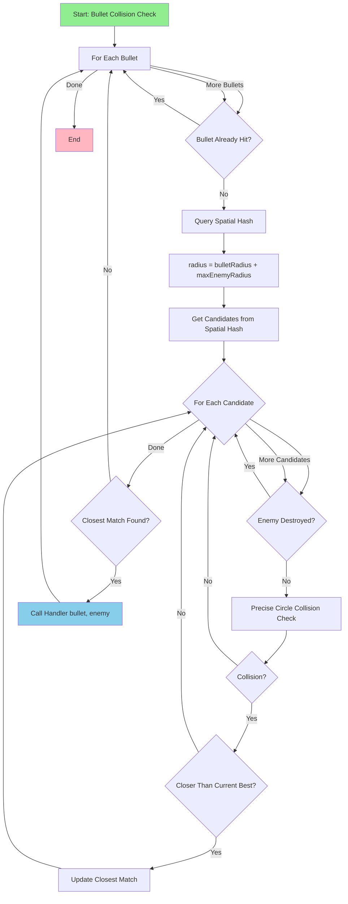
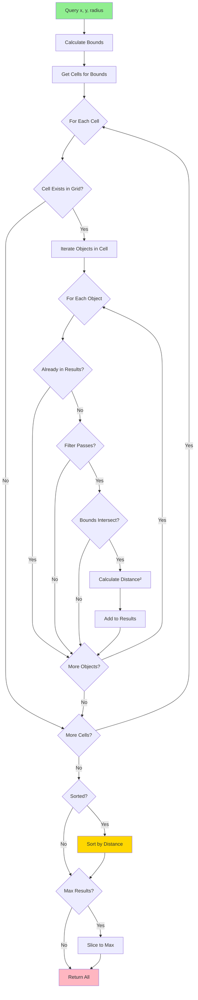
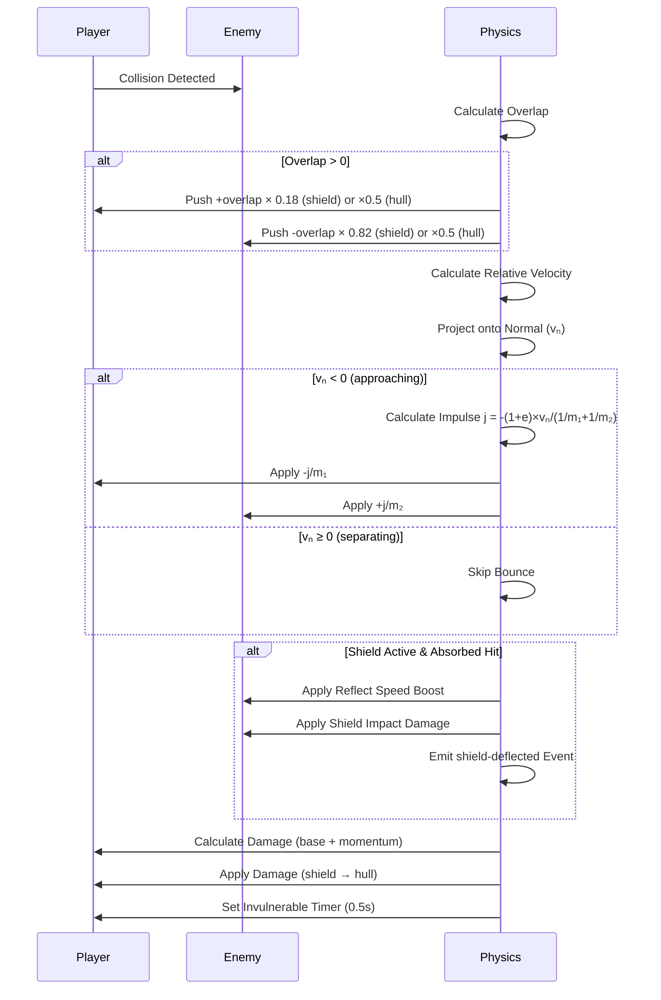

# Physics System Migration Guide

## Document Overview

This document provides a complete technical reference for migrating the JavaScript physics system to Godot 3D. It covers spatial hash implementation, collision detection, bounce physics, screen wrapping, boss-specific mechanics, and damage calculation with practical GDScript pseudocode.

**Important Corrections:**
- Cell size: **96px** (PHYSICS_CELL_SIZE), not 100px
- Bounce coefficient: **0.85** (shield), **0.2** (hull), not 0.6
- Screen wrapping: Implemented in **PlayerSystem**, not PhysicsSystem

---

## 1. System Overview

### Concept
The physics system implements **top-down 2D physics projected into 3D space** (XZ plane) with spatial hashing for efficient collision detection. The system reduces collision detection complexity from O(n²) to O(n) through grid-based partitioning.

### Five Integrated Subsystems

1. **Spatial Hash System**
   - Grid-based partitioning with 96px cell size
   - Dynamic resize based on object density
   - Efficient O(n) spatial queries
   - Supports objects spanning multiple cells

2. **Collision Detection**
   - Optimized circle-circle collision (squared distance)
   - Bullet vs enemies collision
   - Player vs enemies collision
   - Boss-specific collision handling

3. **Bounce Physics**
   - Momentum conservation via impulse
   - Coefficient of restitution: 0.85 (shield), 0.2 (hull)
   - Mass-proportional impulse distribution
   - Shield force multiplier support

4. **Screen Wrapping**
   - Seamless teleport at screen boundaries
   - Preserves velocity and rotation
   - Implemented in PlayerSystem (not PhysicsSystem)

5. **Boss Physics**
   - Collision cooldowns (contact: 120ms, charge: 240ms, area: 300ms)
   - Spatial and collision padding (both 0 by default)
   - Screen shake integration
   - Knockback and damage modifiers

### Purpose
- Reduce collision detection from O(n²) to O(n)
- Provide responsive and deterministic physics
- Support complex mechanics (shields, boss attacks, mine explosions)
- Maintain performance with hundreds of entities

---

## 2. Data Structure

### PhysicsSystem State

Based on `PhysicsSystem.js` lines 31-84:

```javascript
// JavaScript Structure
{
  enemySystem: EnemySystem,
  cellSize: 96,
  maxEnemyRadius: 0,
  activeEnemies: Set<Enemy>,
  activeBosses: Set<Enemy>,
  bossCollisionState: Map<Enemy, {contact, charge, area}>,
  spatialHash: SpatialHash,
  enemyIndex: Map<id, Enemy>,  // Legacy
  indexDirty: boolean,
  performanceMetrics: {
    lastUpdateTime: 0,
    collisionChecks: 0,
    spatialQueries: 0,
    frameTime: 0
  },
  _handledMineExplosions: WeakSet,
  _handledMineExplosionIds: Set<string>
}
```

**GDScript Mapping:**

```gdscript
class_name PhysicsSystem
extends Node3D

# Enemy management
var enemy_system: EnemySystem
var active_enemies: Array[Enemy] = []  # Godot doesn't have Set
var active_bosses: Array[Enemy] = []
var boss_collision_state: Dictionary = {}  # boss -> {contact, charge, area}

# Spatial hash
var spatial_hash: SpatialHash
var cell_size: int = 96
var max_enemy_radius: float = 0.0

# Legacy index (backward compatibility)
var enemy_index: Dictionary = {}  # id -> Enemy
var index_dirty: bool = false

# Performance tracking
var performance_metrics: Dictionary = {
	"last_update_time": 0.0,
	"collision_checks": 0,
	"spatial_queries": 0,
	"frame_time": 0.0
}

# Mine explosion tracking
var handled_mine_explosions: Dictionary = {}  # Godot doesn't have WeakSet
var handled_mine_explosion_ids: Array = []
```

### SpatialHash State

Based on `SpatialHash.js` lines 35-78:

```javascript
// JavaScript Structure
{
  baseCellSize: 64,      // PhysicsSystem uses 96
  cellSize: 96,
  maxObjects: 8,
  maxDepth: 4,
  dynamicResize: true,
  grid: Map<string, Set<Object>>,
  objects: Map<Object, {x, y, radius, bounds, cells}>,
  dirtyCells: Set<string>,
  objectCount: 0,
  stats: {
    insertions: 0,
    removals: 0,
    queries: 0,
    cellHits: 0,
    objectChecks: 0,
    dynamicResizes: 0
  }
}
```

**GDScript Mapping:**

```gdscript
class_name SpatialHash
extends RefCounted

# Configuration
var base_cell_size: int = 96
var cell_size: int = 96
var max_objects: int = 8
var max_depth: int = 4
var dynamic_resize: bool = true

# Data structures
var grid: Dictionary = {}  # cell_key (String) -> Array[Object]
var objects: Dictionary = {}  # object -> {x, y, radius, bounds, cells}
var dirty_cells: Array = []
var object_count: int = 0

# Stats tracking
var stats: Dictionary = {
	"insertions": 0,
	"removals": 0,
	"queries": 0,
	"cell_hits": 0,
	"object_checks": 0,
	"dynamic_resizes": 0
}

# Dynamic resize timing
var last_resize_check: int = 0
var resize_check_interval: int = 2000  # ms
```

---

## 3. Spatial Hash System

### 3.1. Concept

The spatial hash divides the game world into a grid of cells (96px × 96px). Each cell contains an array of objects within that region. Objects with radius larger than cell size can occupy multiple cells.

**Benefits:**
- Query only checks adjacent cells (9 cells for typical radius)
- Reduces collision checks from O(n²) to O(n)
- Dynamic resize adapts to object density

### 3.2. Insert Algorithm

Based on `SpatialHash.js` lines 89-155:

**Steps:**
1. Check if object already exists (if so, call update)
2. Calculate bounds: `{minX: x-radius, minY: y-radius, maxX: x+radius, maxY: y+radius}`
3. Determine cells that intersect bounds
4. Store metadata: `{x, y, radius, bounds, cells}`
5. Add object to each cell in grid
6. Increment object count
7. Periodically check for dynamic resize

**GDScript Implementation:**

```gdscript
func insert(object: Variant, x: float, y: float, radius: float) -> bool:
	# Update if already exists
	if objects.has(object):
		return update(object, x, y, radius)

	# Calculate bounds
	var bounds = calculate_bounds(x, y, radius)
	var cells = get_cells_for_bounds(bounds)

	# Store metadata
	objects[object] = {
		"x": x,
		"y": y,
		"radius": radius,
		"bounds": bounds,
		"cells": cells.duplicate()
	}

	# Add to grid cells
	for cell_key in cells:
		if not grid.has(cell_key):
			grid[cell_key] = []
		grid[cell_key].append(object)

	object_count += 1
	stats.insertions += 1

	# Periodic dynamic resize check
	if dynamic_resize and Time.get_ticks_msec() - last_resize_check > resize_check_interval:
		check_dynamic_resize()

	return true

func calculate_bounds(x: float, y: float, radius: float) -> Dictionary:
	return {
		"minX": x - radius,
		"minY": y - radius,
		"maxX": x + radius,
		"maxY": y + radius
	}

func get_cells_for_bounds(bounds: Dictionary) -> Array:
	var cells = []
	var start_x = int(floor(bounds.minX / cell_size))
	var end_x = int(floor(bounds.maxX / cell_size))
	var start_y = int(floor(bounds.minY / cell_size))
	var end_y = int(floor(bounds.maxY / cell_size))

	for x in range(start_x, end_x + 1):
		for y in range(start_y, end_y + 1):
			cells.append("%d,%d" % [x, y])

	return cells
```

### 3.3. Remove Algorithm

Based on `SpatialHash.js` lines 157-192:

**Steps:**
1. Retrieve object metadata
2. Remove from all cells
3. Mark cells as dirty
4. Delete metadata
5. Decrement object count

**GDScript Implementation:**

```gdscript
func remove(object: Variant) -> bool:
	if not objects.has(object):
		return false

	var data = objects[object]
	var cells = data.cells

	# Remove from all cells
	for cell_key in cells:
		if grid.has(cell_key):
			var cell = grid[cell_key]
			var index = cell.find(object)
			if index >= 0:
				cell.remove_at(index)

			# Mark as dirty if empty
			if cell.is_empty():
				dirty_cells.append(cell_key)

	# Delete metadata
	objects.erase(object)
	object_count -= 1
	stats.removals += 1

	return true
```

### 3.4. Update Algorithm

Based on `SpatialHash.js` lines 194-270:

**Steps:**
1. Retrieve current metadata
2. Calculate new bounds and cells
3. Determine cells to remove from and add to
4. Update grid
5. Update metadata

**GDScript Implementation:**

```gdscript
func update(object: Variant, x: float, y: float, radius: float) -> bool:
	if not objects.has(object):
		return insert(object, x, y, radius)

	var data = objects[object]
	var old_cells = data.cells
	var new_bounds = calculate_bounds(x, y, radius)
	var new_cells = get_cells_for_bounds(new_bounds)

	# Determine cell changes
	var cells_to_remove = []
	var cells_to_add = []

	for cell in old_cells:
		if not cell in new_cells:
			cells_to_remove.append(cell)

	for cell in new_cells:
		if not cell in old_cells:
			cells_to_add.append(cell)

	# Update grid
	for cell_key in cells_to_remove:
		if grid.has(cell_key):
			var cell = grid[cell_key]
			var index = cell.find(object)
			if index >= 0:
				cell.remove_at(index)
			if cell.is_empty():
				dirty_cells.append(cell_key)

	for cell_key in cells_to_add:
		if not grid.has(cell_key):
			grid[cell_key] = []
		grid[cell_key].append(object)

	# Update metadata
	data.x = x
	data.y = y
	data.radius = radius
	data.bounds = new_bounds
	data.cells = new_cells

	return true
```

### 3.5. Query Algorithm

Based on `SpatialHash.js` lines 272-389:

**Steps:**
1. Calculate bounds for query radius
2. Determine cells that intersect bounds
3. For each cell:
   - Iterate objects
   - Apply filter (if provided)
   - Verify bounds intersection
   - Calculate distance² for sorting
4. Sort by distance (if requested)
5. Limit to maxResults (if specified)

**GDScript Implementation:**

```gdscript
func query(x: float, y: float, radius: float, options: Dictionary = {}) -> Array:
	var filter_fn = options.get("filter", null)
	var max_results = options.get("maxResults", -1)
	var sorted = options.get("sorted", true)

	var bounds = calculate_bounds(x, y, radius)
	var cells = get_cells_for_bounds(bounds)
	var results = {}  # object -> distance_sq

	stats.queries += 1

	# Check each cell
	for cell_key in cells:
		if not grid.has(cell_key):
			continue

		var cell = grid[cell_key]
		stats.cell_hits += 1

		for object in cell:
			# Skip duplicates
			if results.has(object):
				continue

			stats.object_checks += 1

			# Apply filter
			if filter_fn and not filter_fn.call(object):
				continue

			# Verify bounds intersection (precise check)
			var object_data = objects.get(object)
			if object_data and bounds_intersect(bounds, object_data.bounds):
				var dx = object_data.x - x
				var dy = object_data.y - y
				var distance_sq = dx * dx + dy * dy
				results[object] = distance_sq

	# Return early if no sorting/limiting needed
	if not sorted and max_results < 0:
		return results.keys()

	# Sort by distance
	var sorted_entries = []
	for object in results.keys():
		sorted_entries.append({"object": object, "distance_sq": results[object]})
	sorted_entries.sort_custom(func(a, b): return a.distance_sq < b.distance_sq)

	var objects_array = sorted_entries.map(func(entry): return entry.object)

	# Apply max results limit
	if max_results > 0:
		return objects_array.slice(0, max_results)

	return objects_array

func bounds_intersect(bounds_a: Dictionary, bounds_b: Dictionary) -> bool:
	return not (
		bounds_a.maxX < bounds_b.minX or
		bounds_b.maxX < bounds_a.minX or
		bounds_a.maxY < bounds_b.minY or
		bounds_b.maxY < bounds_a.minY
	)
```

### 3.6. Dynamic Resize Algorithm

Based on `SpatialHash.js` lines 445-500:

**Steps:**
1. Calculate average objects per cell
2. If avg > maxObjects × 1.5: reduce cell size (× 0.8, min: baseCellSize × 0.5)
3. If avg < maxObjects × 0.3 and activeCells > 20: increase cell size (× 1.25, max: baseCellSize × 2)
4. If change > 1px: rebuild grid with new cell size

**GDScript Implementation:**

```gdscript
func check_dynamic_resize() -> void:
	last_resize_check = Time.get_ticks_msec()

	if object_count == 0:
		return

	var active_cells = grid.size()
	if active_cells == 0:
		return

	var avg_objects_per_cell = object_count / float(active_cells)
	var new_cell_size = cell_size

	# Too crowded - reduce cell size
	if avg_objects_per_cell > max_objects * 1.5:
		new_cell_size = max(base_cell_size * 0.5, cell_size * 0.8)
	# Too sparse - increase cell size
	elif avg_objects_per_cell < max_objects * 0.3 and active_cells > 20:
		new_cell_size = min(base_cell_size * 2.0, cell_size * 1.25)

	# Execute resize if significant change
	if abs(new_cell_size - cell_size) > 1:
		resize(new_cell_size)

func resize(new_cell_size: int) -> void:
	if new_cell_size == cell_size:
		return

	# Store all objects temporarily
	var temp_objects = []
	for object in objects.keys():
		var data = objects[object]
		temp_objects.append({
			"object": object,
			"x": data.x,
			"y": data.y,
			"radius": data.radius
		})

	# Clear and resize
	clear()
	cell_size = new_cell_size

	# Re-insert all objects
	for entry in temp_objects:
		insert(entry.object, entry.x, entry.y, entry.radius)

	stats.dynamic_resizes += 1
	print("[SpatialHash] Resized to cell size %d (objects: %d, avg/cell: %.2f)" %
		[new_cell_size, object_count, object_count / float(grid.size())])

func clear() -> void:
	grid.clear()
	objects.clear()
	dirty_cells.clear()
	object_count = 0
```

### 3.7. Cleanup Algorithm

**GDScript Implementation:**

```gdscript
func cleanup() -> void:
	# Remove empty cells
	for cell_key in dirty_cells:
		if grid.has(cell_key) and grid[cell_key].is_empty():
			grid.erase(cell_key)

	dirty_cells.clear()
```

---

## 4. Collision Detection

### 4.1. Circle-Circle Collision (Optimized)

Based on `PhysicsSystem.js` lines 1409-1416:

**Algorithm:**
- Avoids expensive `sqrt()` by comparing squared distances
- Early exit if no collision

**GDScript Implementation:**

```gdscript
func check_circle_collision(
	x1: float, y1: float, r1: float,
	x2: float, y2: float, r2: float
) -> bool:
	var dx = x1 - x2
	var dy = y1 - y2
	var total_radius = r1 + r2
	return (dx * dx + dy * dy) <= (total_radius * total_radius)
```

**Performance:** O(1) per check, ~3x faster than using `sqrt()`

### 4.2. Bullet vs Enemies Collision

Based on `PhysicsSystem.js` lines 1323-1403:

**Algorithm:**
1. For each bullet (if not already hit):
   - Query spatial hash with radius = bulletRadius + maxEnemyRadius
   - Filter: only active, non-destroyed enemies
   - Find closest collision (if multiple hits)
   - Call handler with bullet and closest enemy

**GDScript Implementation:**

```gdscript
func for_each_bullet_collision(bullets: Array, handler: Callable) -> void:
	if bullets.is_empty() or not handler:
		return

	if active_enemies.is_empty():
		return

	var bullet_radius = GameConstants.BULLET_SIZE  # 4
	var max_check_radius = bullet_radius + max_enemy_radius

	for bullet in bullets:
		if not bullet or bullet.hit:
			continue

		# Query spatial hash
		var candidates = spatial_hash.query(bullet.x, bullet.y, max_check_radius, {
			"filter": func(obj): return obj in active_enemies and not obj.destroyed,
			"sorted": false
		})

		performance_metrics.collision_checks += candidates.size()
		performance_metrics.spatial_queries += 1

		var closest_match = null
		var closest_distance_sq = INF

		# Find closest collision
		for enemy in candidates:
			if not enemy or enemy.destroyed:
				continue

			# Precise collision check
			if check_circle_collision(
				bullet.x, bullet.y, bullet_radius,
				enemy.x, enemy.y, enemy.radius
			):
				var dx = bullet.x - enemy.x
				var dy = bullet.y - enemy.y
				var distance_sq = dx * dx + dy * dy

				if distance_sq < closest_distance_sq:
					closest_distance_sq = distance_sq
					closest_match = enemy

		# Call handler with closest hit
		if closest_match:
			handler.call(bullet, closest_match)
```

### 4.3. Player vs Enemies Collision

Based on `PhysicsSystem.js` lines 1453-1699:

**Algorithm:**
1. Validate player position (finite check)
2. Build collision context (shield state, radii, impact profile)
3. Calculate collision distance
4. If colliding:
   - **Separation:** Push player and enemy apart
   - **Bounce:** Apply momentum-conserving impulse
   - **Damage:** Apply damage (shield absorbs first)
   - **Shield reflection:** Boost enemy velocity if shield absorbed
   - **Invulnerability:** Set 0.5s timer

**GDScript Implementation:**

```gdscript
func handle_player_enemy_collision(
	player: Player,
	enemy: Enemy,
	enemy_system: EnemySystem,
	options: Dictionary = {}
) -> Dictionary:
	var result = {"collided": false, "player_died": false}

	if not enemy or enemy.destroyed or not player:
		return result

	# Extract options
	var damage_override = options.get("damageOverride", null)
	var extra_knockback = options.get("extraKnockback", 0.0)
	var boss_velocity_damp = options.get("bossVelocityDamp", 0.0)
	var damage_bonus = options.get("damageBonus", 0.0)

	var is_boss = is_boss_enemy(enemy)
	var collision_type = options.get("collisionType", "boss-contact" if is_boss else "enemy-contact")

	# Validate player position
	var pos = player.global_position
	if not is_finite(pos.x) or not is_finite(pos.z):
		return result

	# Build collision context
	var context = build_player_collision_context(player)
	var collision_radius = context.collision_radius
	var enemy_radius = resolve_enemy_collision_radius(enemy)

	if collision_radius <= 0:
		return result

	# Calculate distance (2D in XZ plane)
	var dx = pos.x - enemy.position.x
	var dz = pos.z - enemy.position.z
	var max_distance = collision_radius + enemy_radius
	var distance_sq = dx * dx + dz * dz

	if distance_sq >= max_distance * max_distance:
		return result

	result.collided = true

	var distance = sqrt(distance_sq)
	var nx = dx / distance if distance > 0 else 0
	var nz = dz / distance if distance > 0 else 0
	var overlap = max_distance - distance

	# ========== SEPARATION ==========
	if overlap > 0:
		var player_push_ratio = 0.18 if context.shield_active else 0.5
		var enemy_push_ratio = 1.0 - player_push_ratio
		var player_shift = overlap * player_push_ratio
		var enemy_shift = overlap * enemy_push_ratio

		player.global_position.x += nx * player_shift
		player.global_position.z += nz * player_shift
		enemy.position.x -= nx * enemy_shift
		enemy.position.z -= nz * enemy_shift

	# ========== BOUNCE (Momentum Conservation) ==========
	var player_mass = PhysicsConstants.SHIP_MASS  # 60
	if context.shield_active:
		player_mass *= max(context.impact_profile.force_multiplier, 1.0)

	var rvx = enemy.velocity.x - player.velocity.x
	var rvz = enemy.velocity.z - player.velocity.z
	var vel_along_normal = rvx * nx + rvz * nz

	if vel_along_normal < 0:  # Objects approaching
		var bounce = GameConstants.SHIELD_COLLISION_BOUNCE if context.shield_active else 0.2
		var inv_mass1 = 1.0 / max(player_mass, 1.0)
		var inv_mass2 = 1.0 / max(enemy.mass, 1.0)
		var j = (-(1.0 + bounce) * vel_along_normal) / (inv_mass1 + inv_mass2)

		if context.shield_active:
			j *= max(context.impact_profile.force_multiplier, 1.0)

		var jx = j * nx
		var jz = j * nz

		player.velocity.x -= jx * inv_mass1
		player.velocity.z -= jz * inv_mass1
		enemy.velocity.x += jx * inv_mass2
		enemy.velocity.z += jz * inv_mass2

	# ========== DAMAGE ==========
	if player.invulnerable_timer > 0:
		return result

	var base_damage = 12.0
	var rel_speed = sqrt(rvx * rvx + rvz * rvz)
	var momentum_factor = (enemy.mass * rel_speed) / 120.0
	var raw_damage = base_damage + momentum_factor + damage_bonus
	var damage = max(3, int(floor(raw_damage)))

	if is_finite(damage_override):
		damage = max(0, int(floor(damage_override)))

	result.damage = damage
	var remaining = player.take_damage(damage)
	result.remaining_health = remaining

	# ========== SHIELD REFLECTION ==========
	var new_shield_state = player.get_shield_state()
	var shield_absorbed_hit = (
		context.shield_active and
		(not new_shield_state.is_active or new_shield_state.current_hp < context.shield_state.current_hp)
	)

	if shield_absorbed_hit:
		var boost = GameConstants.SHIELD_REFLECT_SPEED * max(context.impact_profile.force_multiplier, 1.0)
		enemy.velocity.x -= nx * boost
		enemy.velocity.z -= nz * boost

		# Apply shield impact damage to enemy
		if enemy.shield_hit_cooldown <= 0:
			enemy_system.apply_damage(enemy, context.impact_profile.damage)
			enemy.shield_hit_cooldown = GameConstants.SHIELD_HIT_GRACE_TIME

		EventBus.shield_deflected.emit({
			"position": player.global_position,
			"normal": Vector3(nx, 0, nz),
			"level": context.impact_profile.level,
			"intensity": max(context.impact_profile.force_multiplier, 1.0)
		})

	# ========== INVULNERABILITY ==========
	player.invulnerable_timer = 0.5

	return result

func build_player_collision_context(player: Player) -> Dictionary:
	var shield_state = player.get_shield_state()
	var impact_profile = player.get_shield_impact_profile()

	var hull_radius = GameConstants.SHIP_SIZE  # 24
	var shield_padding = 8 if shield_state.is_active else 0

	return {
		"shield_active": shield_state.is_active,
		"shield_state": shield_state,
		"collision_radius": hull_radius + shield_padding,
		"impact_profile": impact_profile
	}

func resolve_enemy_collision_radius(enemy: Enemy) -> float:
	if is_boss_enemy(enemy):
		return enemy.radius + GameConstants.BOSS_COLLISION_PADDING  # 0
	return enemy.radius

func is_boss_enemy(enemy: Enemy) -> bool:
	return enemy in active_bosses
```

**Helper Functions:**

```gdscript
func get_nearby_enemies(x: float, y: float, radius: float) -> Array:
	performance_metrics.spatial_queries += 1

	return spatial_hash.query(x, y, radius, {
		"filter": func(obj): return obj in active_enemies and not obj.destroyed,
		"sorted": true
	})

func for_each_nearby_enemy(
	x: float, y: float, radius: float,
	handler: Callable,
	options: Dictionary = {}
) -> void:
	if not handler:
		return

	var candidates = get_nearby_enemies(x, y, radius)

	for enemy in candidates:
		if enemy and not enemy.destroyed:
			handler.call(enemy)
```

---

## 5. Collision Layers (Godot-Specific)

**Important:** JavaScript version has no explicit collision layers. Godot requires proper layer configuration.

### 5.1. Layer Definitions

| Layer | Name | Objects | Collision Mask |
|-------|------|---------|----------------|
| 1 | Player | Player ship | Layers 2, 4, 5, 7 |
| 2 | Enemies | Asteroids, Drones, Mines, Hunters, Boss | Layers 1, 2, 3, 6, 7 |
| 3 | Bullets | Player bullets | Layer 2 |
| 4 | Collectibles | XP orbs, Health hearts | Layer 1 |
| 5 | EnemyBullets | Enemy projectiles | Layer 1 |
| 6 | Shields | Player shield area | Layer 2 |
| 7 | Explosions | Mine explosions, Volatile explosions | Layers 1, 2 |

### 5.2. Collision Matrix

|   | Player (1) | Enemies (2) | Bullets (3) | Collectibles (4) | EnemyBullets (5) | Shields (6) | Explosions (7) |
|---|------------|-------------|-------------|------------------|------------------|-------------|----------------|
| **Player (1)** | ❌ | ✅ | ❌ | ✅ | ✅ | ❌ | ✅ |
| **Enemies (2)** | ✅ | ✅ | ✅ | ❌ | ❌ | ✅ | ✅ |
| **Bullets (3)** | ❌ | ✅ | ❌ | ❌ | ❌ | ❌ | ❌ |
| **Collectibles (4)** | ✅ | ❌ | ❌ | ❌ | ❌ | ❌ | ❌ |
| **EnemyBullets (5)** | ✅ | ❌ | ❌ | ❌ | ❌ | ❌ | ❌ |
| **Shields (6)** | ❌ | ✅ | ❌ | ❌ | ❌ | ❌ | ❌ |
| **Explosions (7)** | ✅ | ✅ | ❌ | ❌ | ❌ | ❌ | ❌ |

### 5.3. GDScript Configuration

```gdscript
# Player.gd
func _ready() -> void:
	collision_layer = 1  # Layer 1: Player
	collision_mask = (1 << 1) | (1 << 3) | (1 << 4) | (1 << 6)  # Enemies, Collectibles, EnemyBullets, Explosions

# Asteroid.gd
func _ready() -> void:
	collision_layer = 1 << 1  # Layer 2: Enemies
	collision_mask = (1 << 0) | (1 << 1) | (1 << 2) | (1 << 5) | (1 << 6)  # Player, Enemies, Bullets, Shields, Explosions

# Bullet.gd
func _ready() -> void:
	collision_layer = 1 << 2  # Layer 3: Bullets
	collision_mask = 1 << 1  # Enemies only

# XPOrb.gd
func _ready() -> void:
	collision_layer = 1 << 3  # Layer 4: Collectibles
	collision_mask = 1  # Player only

# EnemyBullet.gd
func _ready() -> void:
	collision_layer = 1 << 4  # Layer 5: EnemyBullets
	collision_mask = 1  # Player only

# Shield.gd (Area3D around player)
func _ready() -> void:
	collision_layer = 1 << 5  # Layer 6: Shields
	collision_mask = 1 << 1  # Enemies only

# MineExplosion.gd
func _ready() -> void:
	collision_layer = 1 << 6  # Layer 7: Explosions
	collision_mask = (1 << 0) | (1 << 1)  # Player and Enemies
```

---

## 6. Bounce Physics

### 6.1. Concept

Based on `PhysicsSystem.js` lines 1562-1587:

Bounce uses **impulse-based momentum conservation** with coefficient of restitution:
- **Shield active:** e = 0.85 (elastic bounce)
- **Hull collision:** e = 0.2 (inelastic bounce)

### 6.2. Formula

```
j = -(1 + e) × vₙ / (1/m₁ + 1/m₂)

where:
  e = coefficient of restitution (0.85 shield, 0.2 hull)
  vₙ = relative velocity along normal = (v₂ - v₁) · n̂
  m₁ = player mass (60 × forceMultiplier if shield active)
  m₂ = enemy mass
  n̂ = unit normal vector

Impulse applied:
  Δv₁ = -(j × n̂) / m₁  (player velocity change)
  Δv₂ = +(j × n̂) / m₂  (enemy velocity change)
```

### 6.3. Example Calculation

**Scenario:** Player (60kg, vx=100) collides head-on with Large Asteroid (100kg, vx=-50)

```
Normal: n̂ = (1, 0)
Relative velocity: vₙ = (-50 - 100) × 1 = -150

With shield (e = 0.85):
  j = -(1 + 0.85) × (-150) / (1/60 + 1/100)
  j = 1.85 × 150 / 0.0267
  j = 10393

  Δv_player = -10393 / 60 = -173 px/s (bounced back)
  Δv_asteroid = +10393 / 100 = +104 px/s (pushed forward)

Without shield (e = 0.2):
  j = -(1 + 0.2) × (-150) / (1/60 + 1/100)
  j = 1.2 × 150 / 0.0267
  j = 6742

  Δv_player = -6742 / 60 = -112 px/s (less bounce)
  Δv_asteroid = +6742 / 100 = +67 px/s (less push)
```

### 6.4. GDScript Implementation

```gdscript
const SHIELD_COLLISION_BOUNCE = 0.85
const HULL_COLLISION_BOUNCE = 0.2

func apply_bounce_impulse(
	player: Player,
	enemy: Enemy,
	normal: Vector3,
	context: Dictionary
) -> void:
	# Calculate effective mass
	var player_mass = PhysicsConstants.SHIP_MASS  # 60
	if context.shield_active:
		player_mass *= max(context.impact_profile.force_multiplier, 1.0)

	# Relative velocity along normal
	var rvx = enemy.velocity.x - player.velocity.x
	var rvz = enemy.velocity.z - player.velocity.z
	var vel_along_normal = rvx * normal.x + rvz * normal.z

	# Skip if objects are separating
	if vel_along_normal >= 0:
		return

	# Calculate impulse
	var bounce = SHIELD_COLLISION_BOUNCE if context.shield_active else HULL_COLLISION_BOUNCE
	var inv_mass1 = 1.0 / max(player_mass, 1.0)
	var inv_mass2 = 1.0 / max(enemy.mass, 1.0)
	var j = (-(1.0 + bounce) * vel_along_normal) / (inv_mass1 + inv_mass2)

	# Apply shield force multiplier
	if context.shield_active:
		j *= max(context.impact_profile.force_multiplier, 1.0)

	# Apply impulse to velocities
	var jx = j * normal.x
	var jz = j * normal.z

	player.velocity.x -= jx * inv_mass1
	player.velocity.z -= jz * inv_mass1
	enemy.velocity.x += jx * inv_mass2
	enemy.velocity.z += jz * inv_mass2
```

### 6.5. Godot Built-in Alternative

Godot has built-in bounce physics via `PhysicsMaterial`:

```gdscript
# PhysicsMaterial setup (alternative approach)
var material = PhysicsMaterial.new()
material.bounce = 0.85  # Coefficient of restitution
material.friction = 0.0  # Space has no friction

# Apply to RigidBody3D
rigid_body.physics_material_override = material
```

**Note:** Custom implementation provides more control over shield multipliers and damage integration.

---

## 7. Screen Wrapping

### 7.1. Important Note

**Screen wrapping is implemented in `PlayerSystem.js` lines 797-807, NOT in PhysicsSystem.**

### 7.2. Algorithm

When an entity exits one side of the screen, it seamlessly teleports to the opposite side while preserving velocity and rotation.

**Steps:**
1. If `position.x < 0`: teleport to `x = GAME_WIDTH`
2. If `position.x > GAME_WIDTH`: teleport to `x = 0`
3. If `position.y < 0`: teleport to `y = GAME_HEIGHT` (in 3D: position.z)
4. If `position.y > GAME_HEIGHT`: teleport to `y = 0` (in 3D: position.z)

### 7.3. GDScript Implementation

```gdscript
const GAME_WIDTH = 800.0
const GAME_HEIGHT = 600.0

func update_screen_wrapping() -> void:
	var pos = global_position
	var wrapped = false

	# Horizontal wrapping
	if pos.x < 0:
		pos.x = GAME_WIDTH
		wrapped = true
	elif pos.x > GAME_WIDTH:
		pos.x = 0
		wrapped = true

	# Vertical wrapping (2D y → 3D z)
	if pos.z < 0:
		pos.z = GAME_HEIGHT
		wrapped = true
	elif pos.z > GAME_HEIGHT:
		pos.z = 0
		wrapped = true

	if wrapped:
		global_position = pos
		# Velocity and rotation are automatically preserved
```

### 7.4. Integration

Apply in `_physics_process()` after movement:

```gdscript
# Player.gd
func _physics_process(delta: float) -> void:
	# Movement
	velocity = move_and_slide(velocity)

	# Screen wrapping (AFTER movement)
	update_screen_wrapping()
```

Apply to all entities that should wrap:
- Player ship
- Enemies (asteroids, drones, mines)
- Bullets (optional, usually destroyed at edge)
- Collectibles (XP orbs, health hearts)

### 7.5. Visual Polish (Optional)

Add fade effect when wrapping:

```gdscript
func update_screen_wrapping() -> void:
	var pos = global_position
	var wrapped_x = false
	var wrapped_z = false

	if pos.x < 0:
		pos.x = GAME_WIDTH
		wrapped_x = true
	elif pos.x > GAME_WIDTH:
		pos.x = 0
		wrapped_x = true

	if pos.z < 0:
		pos.z = GAME_HEIGHT
		wrapped_z = true
	elif pos.z > GAME_HEIGHT:
		pos.z = 0
		wrapped_z = true

	if wrapped_x or wrapped_z:
		global_position = pos
		play_wrap_effect()  # Visual feedback

func play_wrap_effect() -> void:
	var tween = create_tween()
	tween.tween_property(mesh_instance, "modulate:a", 0.3, 0.1)
	tween.tween_property(mesh_instance, "modulate:a", 1.0, 0.1)
```

---

## 8. Boss Physics

### 8.1. Concept

Based on `PhysicsSystem.js` lines 430-782:

Boss enemies have special physics handling:
- **Collision cooldowns** prevent event spam
- **Spatial padding** (0) and **collision padding** (0) are configurable
- **Screen shake** triggered on collision with intensity/duration based on attack type
- **Three collision types:** contact (touch), charge (dash attack), area (shockwave)

### 8.2. Collision Cooldowns

| Type | Cooldown | Trigger | Screen Shake |
|------|----------|---------|-------------|
| `boss-contact` | 120ms | Player touches boss | Light (intensity: 0.15, duration: 0.1s) |
| `boss-charge` | 240ms | Boss dash attack | Medium (intensity: 0.25, duration: 0.15s) |
| `boss-area` | 300ms | Boss shockwave | Heavy (intensity: 0.35, duration: 0.2s) |

### 8.3. Algorithm: shouldEmitBossCollision

Based on `PhysicsSystem.js` lines 576-605:

**Steps:**
1. Get current timestamp
2. Get cooldown for collision type
3. Check if enough time has passed since last collision of this type
4. If still in cooldown: return false
5. Update timestamp and return true

**GDScript Implementation:**

```gdscript
const BOSS_COLLISION_COOLDOWNS = {
	"boss-contact": 120,  # ms
	"boss-charge": 240,
	"boss-area": 300
}

func should_emit_boss_collision(boss: Enemy, type: String) -> bool:
	if not boss:
		return false

	var now = Time.get_ticks_msec()
	var cooldown = BOSS_COLLISION_COOLDOWNS.get(type, 120)

	# Get or create collision state for this boss
	if not boss_collision_state.has(boss):
		boss_collision_state[boss] = {}

	var state = boss_collision_state[boss]
	var last_time = state.get(type, 0)

	# Check cooldown
	if now - last_time < cooldown:
		return false

	# Update timestamp
	state[type] = now
	return true

func cleanup_boss_collision_state(boss: Enemy) -> void:
	boss_collision_state.erase(boss)
```

### 8.4. Screen Shake Integration

**GDScript Implementation:**

```gdscript
const BOSS_SHAKE_CONFIGS = {
	"boss-contact": {"intensity": 0.15, "duration": 0.1},
	"boss-charge": {"intensity": 0.25, "duration": 0.15},
	"boss-area": {"intensity": 0.35, "duration": 0.2}
}

func handle_boss_collision_feedback(type: String, context: Dictionary) -> void:
	var boss = context.get("boss")
	if not should_emit_boss_collision(boss, type):
		return  # Still in cooldown

	var shake_config = BOSS_SHAKE_CONFIGS.get(type)
	if not shake_config:
		return

	trigger_screen_shake(
		shake_config.intensity,
		shake_config.duration,
		type,
		context
	)

func trigger_screen_shake(
	intensity: float,
	duration: float,
	type: String,
	context: Dictionary
) -> void:
	EventBus.screen_shake.emit({
		"intensity": intensity,
		"duration": duration,
		"type": type,
		"position": context.get("position", Vector3.ZERO)
	})
```

### 8.5. Boss-Specific Collision Handling

**Charge Attack:**

```gdscript
func handle_boss_charge_collision(
	player: Player,
	boss: Enemy,
	enemy_system: EnemySystem
) -> Dictionary:
	var options = {
		"collisionType": "boss-charge",
		"damageBonus": GameConstants.BOSS_CHARGE_DAMAGE_BONUS,  # From visual.js
		"extraKnockback": GameConstants.BOSS_CHARGE_KNOCKBACK,
		"bossVelocityDamp": GameConstants.BOSS_CHARGE_BOSS_SLOW
	}

	var result = handle_player_enemy_collision(player, boss, enemy_system, options)

	if result.collided:
		handle_boss_collision_feedback("boss-charge", {
			"boss": boss,
			"position": player.global_position
		})

	return result
```

**Area Attack (Shockwave):**

```gdscript
func handle_boss_area_attack(
	boss: Enemy,
	enemy_system: EnemySystem
) -> void:
	var area_radius = boss.radius * GameConstants.BOSS_AREA_RADIUS_MULTIPLIER  # 2.2
	var area_damage = GameConstants.BOSS_AREA_DAMAGE
	var area_force = GameConstants.BOSS_AREA_FORCE

	# Find all entities in radius
	var targets = get_nearby_enemies(boss.position.x, boss.position.z, area_radius)

	for target in targets:
		if target == boss:
			continue

		# Calculate direction and distance
		var dx = target.position.x - boss.position.x
		var dz = target.position.z - boss.position.z
		var distance = sqrt(dx * dx + dz * dz)

		if distance < 0.1:
			continue

		var nx = dx / distance
		var nz = dz / distance

		# Apply force (inverse square falloff)
		var falloff = 1.0 - (distance / area_radius)
		var force = area_force * falloff

		target.velocity.x += nx * force
		target.velocity.z += nz * force

		# Apply damage to player if in range
		if target == player and should_emit_boss_collision(boss, "boss-area"):
			player.take_damage(area_damage * falloff)

			handle_boss_collision_feedback("boss-area", {
				"boss": boss,
				"position": boss.position
			})
```

### 8.6. Boss Configuration

From `visual.js` BOSS_PHYSICS_CONFIG:

```gdscript
const BOSS_PHYSICS_CONFIG = {
	"spatial_padding": 0,
	"collision_padding": 0,
	"contact_cooldown_ms": 120,
	"charge_cooldown_ms": 240,
	"area_cooldown_ms": 300,
	"charge_knockback": 150.0,
	"charge_boss_slow": 0.6,  # Boss slows to 60% after charge
	"charge_damage_bonus": 10.0,
	"area_damage": 20.0,
	"area_force": 200.0,
	"area_radius_multiplier": 2.2,
	"charge_shake": {"intensity": 0.25, "duration": 0.15},
	"area_shake": {"intensity": 0.35, "duration": 0.2},
	"contact_shake": {"intensity": 0.15, "duration": 0.1}
}
```

---

## 9. Mine Explosion Tracking

### 9.1. Concept

Based on `PhysicsSystem.js` lines 81-83, 1701-1752:

Mine explosions can damage multiple entities but should only damage each entity **once per explosion**. JavaScript uses `WeakSet` + `Set` to track processed explosions.

### 9.2. JavaScript Implementation

```javascript
// PhysicsSystem.js
this._handledMineExplosions = new WeakSet();  // explosion objects
this._handledMineExplosionIds = new Set();    // explosion IDs

// Check if already processed
if (this._handledMineExplosions.has(explosion) ||
    this._handledMineExplosionIds.has(explosion.id)) {
  return;  // Skip duplicate
}

// Mark as processed
this._handledMineExplosions.add(explosion);
this._handledMineExplosionIds.add(explosion.id);
```

### 9.3. Godot Alternative (No WeakSet)

Godot doesn't have `WeakSet`, so use `Dictionary` with cleanup:

```gdscript
# PhysicsSystem.gd
var handled_mine_explosions: Dictionary = {}  # explosion -> timestamp
var handled_mine_explosion_ids: Array = []
var explosion_cleanup_interval: int = 5000  # Clean up every 5s
var last_explosion_cleanup: int = 0

func has_handled_mine_explosion(explosion: Variant) -> bool:
	# Check by object reference
	if handled_mine_explosions.has(explosion):
		return true

	# Check by ID
	if explosion.has("id") and explosion.id in handled_mine_explosion_ids:
		return true

	return false

func mark_mine_explosion_handled(explosion: Variant) -> void:
	handled_mine_explosions[explosion] = Time.get_ticks_msec()

	if explosion.has("id"):
		handled_mine_explosion_ids.append(explosion.id)

	# Periodic cleanup
	var now = Time.get_ticks_msec()
	if now - last_explosion_cleanup > explosion_cleanup_interval:
		cleanup_old_mine_explosions()
		last_explosion_cleanup = now

func cleanup_old_mine_explosions() -> void:
	var now = Time.get_ticks_msec()
	var timeout = 10000  # 10 seconds

	# Remove old entries
	var to_remove = []
	for explosion in handled_mine_explosions.keys():
		if now - handled_mine_explosions[explosion] > timeout:
			to_remove.append(explosion)

	for explosion in to_remove:
		handled_mine_explosions.erase(explosion)

	# IDs can't be cleaned up easily without explosion objects
	# Keep array size reasonable by clearing periodically
	if handled_mine_explosion_ids.size() > 1000:
		handled_mine_explosion_ids.clear()
```

### 9.4. Usage Example

```gdscript
func handle_mine_explosion(explosion: Dictionary, player: Player, enemies: Array) -> void:
	# Check if already processed
	if has_handled_mine_explosion(explosion):
		return

	# Mark as handled
	mark_mine_explosion_handled(explosion)

	var radius = explosion.get("radius", 50.0)
	var damage = explosion.get("damage", 30.0)
	var pos = explosion.get("position", Vector3.ZERO)

	# Damage player if in range
	var player_dist_sq = (player.global_position - pos).length_squared()
	if player_dist_sq <= radius * radius:
		player.take_damage(damage)

	# Damage enemies in range
	for enemy in enemies:
		var enemy_dist_sq = (enemy.position - pos).length_squared()
		if enemy_dist_sq <= radius * radius:
			enemy_system.apply_damage(enemy, damage)
```

---

## 10. Damage Calculation

### 10.1. Formula

Based on `PhysicsSystem.js` lines 1635-1638:

```
damage = max(3, floor(baseDamage + momentumFactor + damageBonus))

where:
  baseDamage = 12
  momentumFactor = (enemyMass × relativeSpeed) / 120
  relativeSpeed = sqrt((enemy.vx - player.vx)² + (enemy.vy - player.vy)²)
  damageBonus = 0 (default, configurable for boss attacks)

  Minimum damage: 3
```

### 10.2. Example Calculations

**Scenario 1: Large Asteroid (mass=100, speed=50) hits stationary player**

```
relativeSpeed = sqrt((50-0)² + (0-0)²) = 50
momentumFactor = (100 × 50) / 120 = 41.67
damage = max(3, floor(12 + 41.67 + 0)) = 53
```

**Scenario 2: Small Asteroid (mass=30, speed=70) hits moving player (speed=100)**

```
relativeSpeed = sqrt((70-100)² + (0-0)²) = 30
momentumFactor = (30 × 30) / 120 = 7.5
damage = max(3, floor(12 + 7.5 + 0)) = 19
```

**Scenario 3: Boss charge attack (mass=200, speed=150, damageBonus=10)**

```
relativeSpeed = 150 (assume head-on)
momentumFactor = (200 × 150) / 120 = 250
damage = max(3, floor(12 + 250 + 10)) = 272
```

### 10.3. GDScript Implementation

```gdscript
const BASE_COLLISION_DAMAGE = 12.0
const MOMENTUM_DIVISOR = 120.0
const MIN_COLLISION_DAMAGE = 3

func calculate_collision_damage(
	enemy: Enemy,
	player: Player,
	damage_bonus: float = 0.0,
	damage_override: Variant = null
) -> int:
	# Override takes precedence
	if damage_override != null and is_finite(damage_override):
		return max(0, int(floor(damage_override)))

	# Calculate relative velocity
	var rvx = enemy.velocity.x - player.velocity.x
	var rvz = enemy.velocity.z - player.velocity.z
	var relative_speed = sqrt(rvx * rvx + rvz * rvz)

	# Calculate momentum factor
	var momentum_factor = (enemy.mass * relative_speed) / MOMENTUM_DIVISOR

	# Total damage
	var raw_damage = BASE_COLLISION_DAMAGE + momentum_factor + damage_bonus
	var damage = max(MIN_COLLISION_DAMAGE, int(floor(raw_damage)))

	return damage
```

### 10.4. Shield Absorption

Shields absorb damage before hull:

```gdscript
# Player.gd
func take_damage(amount: int) -> int:
	var shield_state = get_shield_state()

	if shield_state.is_active:
		# Shield absorbs first
		var absorbed = min(amount, shield_state.current_hp)
		shield_state.current_hp -= absorbed
		var remaining = amount - absorbed

		if shield_state.current_hp <= 0:
			shield_state.is_active = false
			EventBus.shield_depleted.emit()

		# Apply remaining to hull
		if remaining > 0:
			current_hp -= remaining

		return current_hp
	else:
		# Direct hull damage
		current_hp -= amount
		return current_hp
```

### 10.5. Invulnerability Timer

After taking damage, player is invulnerable for 0.5 seconds:

```gdscript
# Player.gd
var invulnerable_timer: float = 0.0

func _physics_process(delta: float) -> void:
	# Update invulnerability
	if invulnerable_timer > 0:
		invulnerable_timer -= delta

func take_damage(amount: int) -> int:
	# Skip if invulnerable
	if invulnerable_timer > 0:
		return current_hp

	# Apply damage (shield + hull logic here)
	# ...

	# Set invulnerability
	invulnerable_timer = 0.5

	return current_hp
```

---

## 11. Godot Implementation Structure

### 11.1. Scene Hierarchy

**PhysicsSystem.tscn:**
```
PhysicsSystem (Node3D)
└─ (script: PhysicsSystem.gd)
```

### 11.2. Script Structure

**PhysicsSystem.gd:**

```gdscript
class_name PhysicsSystem
extends Node3D

# ========== DEPENDENCIES ==========
var enemy_system: EnemySystem
var player: Player
var effects_system: EffectsSystem

# ========== SPATIAL HASH ==========
var spatial_hash: SpatialHash
var cell_size: int = 96
var max_enemy_radius: float = 0.0

# ========== ACTIVE ENTITIES ==========
var active_enemies: Array[Enemy] = []
var active_bosses: Array[Enemy] = []
var boss_collision_state: Dictionary = {}

# ========== PERFORMANCE ==========
var performance_metrics: Dictionary = {
	"last_update_time": 0.0,
	"collision_checks": 0,
	"spatial_queries": 0,
	"frame_time": 0.0
}

# ========== MINE EXPLOSIONS ==========
var handled_mine_explosions: Dictionary = {}
var handled_mine_explosion_ids: Array = []

# ========== INITIALIZATION ==========
func _ready() -> void:
	spatial_hash = SpatialHash.new(cell_size, {
		"max_objects": 8,
		"max_depth": 4,
		"dynamic_resize": true
	})

	setup_event_listeners()

func setup_event_listeners() -> void:
	EventBus.enemy_spawned.connect(_on_enemy_spawned)
	EventBus.enemy_destroyed.connect(_on_enemy_destroyed)
	EventBus.boss_defeated.connect(_on_boss_defeated)
	EventBus.mine_exploded.connect(_on_mine_exploded)

# ========== UPDATE LOOP ==========
func _physics_process(delta: float) -> void:
	var start_time = Time.get_ticks_usec()

	cleanup_destroyed_enemies()
	update_spatial_hash()

	performance_metrics.frame_time = (Time.get_ticks_usec() - start_time) / 1000.0  # ms

# ========== ENEMY MANAGEMENT ==========
func register_enemy(enemy: Enemy) -> void:
	if enemy in active_enemies:
		return

	active_enemies.append(enemy)

	if is_boss_enemy(enemy):
		active_bosses.append(enemy)
		boss_collision_state[enemy] = {}

	# Update max radius
	if enemy.radius > max_enemy_radius:
		max_enemy_radius = enemy.radius

	# Add to spatial hash
	spatial_hash.insert(enemy, enemy.position.x, enemy.position.z, enemy.radius)

func unregister_enemy(enemy: Enemy) -> void:
	var index = active_enemies.find(enemy)
	if index >= 0:
		active_enemies.remove_at(index)

	var boss_index = active_bosses.find(enemy)
	if boss_index >= 0:
		active_bosses.remove_at(boss_index)
		boss_collision_state.erase(enemy)

	spatial_hash.remove(enemy)

func cleanup_destroyed_enemies() -> void:
	var to_remove = []

	for enemy in active_enemies:
		if enemy.destroyed:
			to_remove.append(enemy)

	for enemy in to_remove:
		unregister_enemy(enemy)

# ========== SPATIAL HASH UPDATE ==========
func update_spatial_hash() -> void:
	for enemy in active_enemies:
		if enemy.destroyed:
			continue

		var radius = resolve_enemy_spatial_radius(enemy)
		spatial_hash.update(enemy, enemy.position.x, enemy.position.z, radius)

func resolve_enemy_spatial_radius(enemy: Enemy) -> float:
	if is_boss_enemy(enemy):
		return enemy.radius + GameConstants.BOSS_SPATIAL_PADDING  # 0
	return enemy.radius

# ========== EVENT HANDLERS ==========
func _on_enemy_spawned(enemy: Enemy) -> void:
	register_enemy(enemy)

func _on_enemy_destroyed(enemy: Enemy) -> void:
	unregister_enemy(enemy)

func _on_boss_defeated(boss: Enemy) -> void:
	cleanup_boss_collision_state(boss)

func _on_mine_exploded(explosion: Dictionary) -> void:
	if has_handled_mine_explosion(explosion):
		return

	mark_mine_explosion_handled(explosion)
	# Handle explosion damage...

# ========== PUBLIC API ==========
# (Insert all functions from previous sections)
```

### 11.3. Integration with Other Systems

**Main.gd:**

```gdscript
extends Node3D

@onready var physics_system = $PhysicsSystem
@onready var enemy_system = $EnemySystem
@onready var player = $Player

func _ready() -> void:
	# Inject dependencies
	physics_system.enemy_system = enemy_system
	physics_system.player = player
	physics_system.effects_system = $EffectsSystem
```

---

## 12. Configuration Parameters

### 12.1. Complete Parameter Table

| Parameter | Default Value | Description | Source File |
|-----------|---------------|-------------|-------------|
| **Spatial Hash** |
| `PHYSICS_CELL_SIZE` | 96 | Grid cell size (px) | `GameConstants.js` |
| `MAX_OBJECTS_PER_CELL` | 8 | Objects per cell before resize | `PhysicsSystem.js:55` |
| `MAX_SUBDIVISION_DEPTH` | 4 | Max subdivision depth | `PhysicsSystem.js:56` |
| `DYNAMIC_RESIZE_ENABLED` | true | Auto-adjust cell size | `PhysicsSystem.js:57` |
| `RESIZE_CHECK_INTERVAL` | 2000 | Resize check interval (ms) | `SpatialHash.js:59` |
| **Collision** |
| `BULLET_SIZE` | 4 | Bullet radius (px) | `GameConstants.js` |
| `SHIP_SIZE` | 24 | Ship radius (px) | `GameConstants.js` |
| `ASTEROID_SIZES.large` | 48 | Large asteroid radius (px) | `GameConstants.js` |
| `ASTEROID_SIZES.medium` | 32 | Medium asteroid radius (px) | `GameConstants.js` |
| `ASTEROID_SIZES.small` | 16 | Small asteroid radius (px) | `GameConstants.js` |
| **Bounce Physics** |
| `SHIELD_COLLISION_BOUNCE` | 0.85 | Shield bounce coefficient | `gameplay.js:53` |
| `HULL_COLLISION_BOUNCE` | 0.2 | Hull bounce coefficient | `PhysicsSystem.js:1572` |
| `SHIELD_REFLECT_SPEED` | 95 | Reflect velocity boost (px/s) | `gameplay.js:54` |
| `SHIELD_HIT_GRACE_TIME` | 0.28 | Grace time between hits (s) | `gameplay.js:52` |
| **Damage** |
| `BASE_COLLISION_DAMAGE` | 12 | Base collision damage | `PhysicsSystem.js:1635` |
| `MOMENTUM_DIVISOR` | 120 | Momentum factor divisor | `PhysicsSystem.js:1636` |
| `MIN_COLLISION_DAMAGE` | 3 | Minimum damage | `PhysicsSystem.js:1638` |
| `INVULNERABILITY_DURATION` | 0.5 | Invulnerability after hit (s) | `PhysicsSystem.js:1698` |
| **Boss Physics** |
| `BOSS_CONTACT_COOLDOWN` | 120 | Contact cooldown (ms) | `PhysicsSystem.js:576` |
| `BOSS_CHARGE_COOLDOWN` | 240 | Charge cooldown (ms) | `PhysicsSystem.js:569` |
| `BOSS_AREA_COOLDOWN` | 300 | Area cooldown (ms) | `PhysicsSystem.js:573` |
| `BOSS_SPATIAL_PADDING` | 0 | Spatial query padding (px) | `visual.js` |
| `BOSS_COLLISION_PADDING` | 0 | Collision padding (px) | `visual.js` |
| `BOSS_AREA_RADIUS_MULTIPLIER` | 2.2 | Area attack radius multiplier | `visual.js` |
| `BOSS_CHARGE_KNOCKBACK` | 150 | Charge knockback force | `visual.js` |
| `BOSS_CHARGE_BOSS_SLOW` | 0.6 | Boss speed after charge | `visual.js` |
| `BOSS_CHARGE_DAMAGE_BONUS` | 10 | Charge damage bonus | `visual.js` |
| `BOSS_AREA_DAMAGE` | 20 | Area attack damage | `visual.js` |
| `BOSS_AREA_FORCE` | 200 | Area attack force | `visual.js` |
| **Ship Physics** |
| `SHIP_MASS` | 60 | Ship mass (kg) | `physics.js:9` |
| `SHIP_ACCELERATION` | 280 | Acceleration (px/s²) | `physics.js:4` |
| `SHIP_MAX_SPEED` | 220 | Max speed (px/s) | `physics.js:5` |
| `SHIP_LINEAR_DAMPING` | 3.1 | Linear damping (s⁻¹) | `physics.js:6` |
| `SHIP_ROTATION_SPEED` | 8 | Rotation speed (rad/s) | `physics.js:7` |
| `SHIP_ANGULAR_DAMPING` | 6.2 | Angular damping (s⁻¹) | `physics.js:8` |
| **Asteroid Physics** |
| `ASTEROID_SPEED.large` | 25 | Large asteroid speed (px/s) | `physics.js:13` |
| `ASTEROID_SPEED.medium` | 45 | Medium asteroid speed (px/s) | `physics.js:14` |
| `ASTEROID_SPEED.small` | 70 | Small asteroid speed (px/s) | `physics.js:15` |

### 12.2. GDScript Constants File

**PhysicsConstants.gd:**

```gdscript
class_name PhysicsConstants
extends RefCounted

# Spatial Hash
const CELL_SIZE = 96
const MAX_OBJECTS_PER_CELL = 8
const MAX_SUBDIVISION_DEPTH = 4
const DYNAMIC_RESIZE = true
const RESIZE_CHECK_INTERVAL = 2000  # ms

# Collision Radii
const BULLET_SIZE = 4.0
const SHIP_SIZE = 24.0
const ASTEROID_SIZES = {
	"large": 48.0,
	"medium": 32.0,
	"small": 16.0
}

# Bounce Physics
const SHIELD_COLLISION_BOUNCE = 0.85
const HULL_COLLISION_BOUNCE = 0.2
const SHIELD_REFLECT_SPEED = 95.0
const SHIELD_HIT_GRACE_TIME = 0.28

# Damage
const BASE_COLLISION_DAMAGE = 12.0
const MOMENTUM_DIVISOR = 120.0
const MIN_COLLISION_DAMAGE = 3
const INVULNERABILITY_DURATION = 0.5

# Boss Physics
const BOSS_COOLDOWNS = {
	"contact": 120,  # ms
	"charge": 240,
	"area": 300
}
const BOSS_SPATIAL_PADDING = 0.0
const BOSS_COLLISION_PADDING = 0.0
const BOSS_AREA_RADIUS_MULTIPLIER = 2.2
const BOSS_CHARGE_KNOCKBACK = 150.0
const BOSS_CHARGE_BOSS_SLOW = 0.6
const BOSS_CHARGE_DAMAGE_BONUS = 10.0
const BOSS_AREA_DAMAGE = 20.0
const BOSS_AREA_FORCE = 200.0

# Ship Physics
const SHIP_MASS = 60.0
const SHIP_ACCELERATION = 280.0
const SHIP_MAX_SPEED = 220.0
const SHIP_LINEAR_DAMPING = 3.1
const SHIP_ROTATION_SPEED = 8.0
const SHIP_ANGULAR_DAMPING = 6.2

# Asteroid Physics
const ASTEROID_SPEEDS = {
	"large": 25.0,
	"medium": 45.0,
	"small": 70.0
}
const ASTEROID_MASSES = {
	"large": 100.0,
	"medium": 60.0,
	"small": 30.0
}
```

---

## 13. Mathematical Formulas

### 13.1. Bounce Impulse (Momentum Conservation)

```
j = -(1 + e) × vₙ / (1/m₁ + 1/m₂)

where:
  e = coefficient of restitution (0.85 shield, 0.2 hull)
  vₙ = relative velocity along normal = (v₂ - v₁) · n̂
  m₁ = player mass (60 × forceMultiplier if shield active)
  m₂ = enemy mass
  n̂ = unit normal vector = (dx/distance, dy/distance)

Applied impulse:
  Δv₁ = -(j × n̂) / m₁  (player)
  Δv₂ = +(j × n̂) / m₂  (enemy)
```

**Derivation:**
```
Conservation of momentum: m₁v₁' + m₂v₂' = m₁v₁ + m₂v₂
Coefficient of restitution: e = -(v₁' - v₂') / (v₁ - v₂)

Solving for impulse j = m₁(v₁' - v₁) = m₂(v₂ - v₂'):
  j = -(1 + e) × m₁m₂(v₁ - v₂) / (m₁ + m₂)
  j = -(1 + e) × vₙ / (1/m₁ + 1/m₂)  [along normal direction]
```

### 13.2. Separation (Overlap Resolution)

```
overlap = (r₁ + r₂) - distance

If overlap > 0:
  playerPushRatio = 0.18 (shield) or 0.5 (no shield)
  enemyPushRatio = 1 - playerPushRatio

  player.position += normal × overlap × playerPushRatio
  enemy.position -= normal × overlap × enemyPushRatio
```

**Rationale:** Shield provides more "stability" (less pushback) than hull alone.

### 13.3. Damage Calculation

```
damage = max(3, floor(baseDamage + momentumFactor + damageBonus))

where:
  baseDamage = 12
  momentumFactor = (enemyMass × relativeSpeed) / 120
  relativeSpeed = ||v_enemy - v_player||
  damageBonus = 0 (default, configurable)
```

**Example:**
```
Enemy: mass = 100, velocity = (50, 0)
Player: mass = 60, velocity = (100, 0)

relativeSpeed = ||(50, 0) - (100, 0)|| = |(-50, 0)|| = 50
momentumFactor = (100 × 50) / 120 = 41.67
damage = max(3, floor(12 + 41.67 + 0)) = 53
```

### 13.4. Cell Key Generation

```
cellKey = "%d,%d" % [floor(x / cellSize), floor(y / cellSize)]
```

**Example:**
```
cellSize = 96
position = (150, 250)

cellX = floor(150 / 96) = 1
cellY = floor(250 / 96) = 2
cellKey = "1,2"
```

### 13.5. Bounds Calculation

```
bounds = {
  minX: x - radius,
  minY: y - radius,
  maxX: x + radius,
  maxY: y + radius
}

cells = {(floor(minX/cellSize), floor(minY/cellSize)),
         ...,
         (floor(maxX/cellSize), floor(maxY/cellSize))}
```

**Example:**
```
cellSize = 96
object = {x: 150, y: 120, radius: 80}

bounds = {minX: 70, minY: 40, maxX: 230, maxY: 200}

cellsX = [floor(70/96), ..., floor(230/96)] = [0, 1, 2]
cellsY = [floor(40/96), ..., floor(200/96)] = [0, 1, 2]

cells = {(0,0), (0,1), (0,2), (1,0), (1,1), (1,2), (2,0), (2,1), (2,2)}
Total: 9 cells
```

---

## 14. Diagrams

### 14.1. Spatial Hash Grid (Visual)

```
Cell Size: 96px

     0     96    192   288   384
   0 ┌─────┬─────┬─────┬─────┐
     │ 0,0 │ 1,0 │ 2,0 │ 3,0 │
  96 ├─────┼─────┼─────┼─────┤
     │ 0,1 │ 1,1 │ 2,1 │ 3,1 │  ← Object here (x:150, y:120, r:30)
 192 ├─────┼─────┼─────┼─────┤     Cells: (1,1)
     │ 0,2 │ 1,2 │ 2,2 │ 3,2 │
 288 ├─────┼─────┼─────┼─────┤
     │ 0,3 │ 1,3 │ 2,3 │ 3,3 │  ← Object here (x:350, y:300, r:80)
 384 └─────┴─────┴─────┴─────┘     Cells: (2,2), (2,3), (3,2), (3,3)

Query Example (x:150, y:120, radius:100):
  Bounds: {minX:50, minY:20, maxX:250, maxY:220}
  Cells checked: (0,0), (1,0), (2,0)
                 (0,1), (1,1), (2,1)
                 (0,2), (1,2), (2,2)
  Total: 9 cells (3×3 grid)

Without spatial hash: Check all N objects = O(n)
With spatial hash: Check ~9 cells × 8 objects/cell = ~72 objects (much less if N >> 72)
```

### 14.2. Collision Detection Flow



### 14.3. Spatial Hash Query Flow



### 14.4. Bounce Physics Flow



### 14.5. Screen Wrapping Visual

```
GAME_WIDTH = 800, GAME_HEIGHT = 600

    ┌────────────────────────────────┐
    │   GAME AREA                    │
    │                                │
    │        Player                  │
    │          ▲                     │
    │          │ velocity            │
    │          │                     │
    │  ┌───────┼─────────┐           │
  0 │  │       │         │ 800       │
    │  │       │ exit left           │
    │  └───────┼─────────┘           │
    │          │                     │
    │          ▼ appears right       │
    │                        Player  │
    │                          ▲     │
    │                          │ (same velocity)
    │                          │     │
    └────────────────────────────────┘
         0                        600

Wrapping Logic:
  if x < 0: x = 800       (exit left → appear right)
  if x > 800: x = 0       (exit right → appear left)
  if y < 0: y = 600       (exit top → appear bottom)
  if y > 600: y = 0       (exit bottom → appear top)

Velocity & rotation preserved seamlessly!
```

---

## 15. Performance Optimization

### 15.1. Spatial Hash Stats

Track performance metrics to identify bottlenecks:

```gdscript
# SpatialHash.gd
func get_performance_stats() -> Dictionary:
	return {
		"object_count": object_count,
		"active_cells": grid.size(),
		"avg_objects_per_cell": object_count / float(max(grid.size(), 1)),
		"insertions": stats.insertions,
		"removals": stats.removals,
		"queries": stats.queries,
		"cell_hits": stats.cell_hits,
		"object_checks": stats.object_checks,
		"dynamic_resizes": stats.dynamic_resizes,
		"query_hit_rate": stats.cell_hits / float(max(stats.queries, 1))
	}
```

### 15.2. Optimization Tips

**1. Adjust Cell Size Based on Object Density:**
```gdscript
# If most objects are small (radius ~20px):
cell_size = 64  # Smaller cells = fewer objects per cell

# If objects are large (radius ~50px):
cell_size = 128  # Larger cells = fewer cell checks
```

**2. Limit Query Radius:**
```gdscript
# Bad: Query entire screen
var enemies = spatial_hash.query(x, y, 1000, {})  # Checks hundreds of cells

# Good: Query only relevant radius
var max_radius = bullet_radius + max_enemy_radius
var enemies = spatial_hash.query(x, y, max_radius, {})  # Checks ~9 cells
```

**3. Use Filters to Reduce Candidates:**
```gdscript
# Bad: Check all objects, filter later
var all = spatial_hash.query(x, y, radius, {})
var valid = all.filter(func(obj): return not obj.destroyed)

# Good: Filter during query
var valid = spatial_hash.query(x, y, radius, {
	"filter": func(obj): return not obj.destroyed
})
```

**4. Disable Sorting When Not Needed:**
```gdscript
# Bad: Sort when order doesn't matter
var enemies = spatial_hash.query(x, y, radius, {"sorted": true})

# Good: Skip sorting for existence checks
var enemies = spatial_hash.query(x, y, radius, {"sorted": false})
```

**5. Use maxResults to Limit Processing:**
```gdscript
# Only need closest 5 enemies
var nearest = spatial_hash.query(x, y, radius, {
	"sorted": true,
	"maxResults": 5
})
```

### 15.3. Profiling

**Enable Performance Logging:**

```gdscript
# PhysicsSystem.gd
var enable_profiling: bool = false

func _physics_process(delta: float) -> void:
	if not enable_profiling:
		return

	var start = Time.get_ticks_usec()

	cleanup_destroyed_enemies()
	var cleanup_time = Time.get_ticks_usec() - start

	start = Time.get_ticks_usec()
	update_spatial_hash()
	var spatial_time = Time.get_ticks_usec() - start

	print("[Physics] Cleanup: %.2fms | Spatial: %.2fms | Total Checks: %d" %
		[cleanup_time / 1000.0, spatial_time / 1000.0, performance_metrics.collision_checks])
```

**Expected Performance (60 FPS):**
- **100 enemies:** ~0.5ms per frame
- **500 enemies:** ~2ms per frame
- **1000 enemies:** ~5ms per frame

If exceeding 16.67ms (60 FPS budget), consider:
- Increase cell size (reduce cell checks)
- Disable dynamic resize (static cell size)
- Use Godot built-in physics (see section 17)

---

## 16. System Integration

### 16.1. Integration with Player System

**Player.gd:**

```gdscript
extends CharacterBody3D
class_name Player

var physics_system: PhysicsSystem

func _ready() -> void:
	physics_system = get_node("/root/Main/PhysicsSystem")

func _physics_process(delta: float) -> void:
	# Movement
	velocity = move_and_slide(velocity)

	# Screen wrapping (AFTER movement)
	update_screen_wrapping()

	# Check collision with enemies (manual check if using custom spatial hash)
	check_enemy_collisions()

func check_enemy_collisions() -> void:
	var collision_radius = GameConstants.SHIP_SIZE + (8 if shield_active else 0)
	var nearby = physics_system.get_nearby_enemies(
		global_position.x,
		global_position.z,
		collision_radius
	)

	for enemy in nearby:
		physics_system.handle_player_enemy_collision(
			self,
			enemy,
			get_node("/root/Main/EnemySystem"),
			{}
		)
```

### 16.2. Integration with Enemy System

**EnemySystem.gd:**

```gdscript
extends Node3D
class_name EnemySystem

var physics_system: PhysicsSystem

func spawn_enemy(type: String, position: Vector3) -> Enemy:
	var enemy = create_enemy(type, position)
	add_child(enemy)

	EventBus.enemy_spawned.emit(enemy)  # PhysicsSystem listens

	return enemy

func apply_damage(enemy: Enemy, damage: int) -> void:
	enemy.current_hp -= damage

	if enemy.current_hp <= 0:
		destroy_enemy(enemy)

func destroy_enemy(enemy: Enemy) -> void:
	enemy.destroyed = true
	EventBus.enemy_destroyed.emit(enemy)  # PhysicsSystem listens

	# Spawn XP, particles, etc.
	spawn_xp_orbs(enemy.position, enemy.xp_value)

	enemy.queue_free()
```

### 16.3. Integration with Combat System

**CombatSystem.gd:**

```gdscript
extends Node3D
class_name CombatSystem

var physics_system: PhysicsSystem
var bullets: Array[Bullet] = []

func _physics_process(delta: float) -> void:
	# Update bullets
	update_bullets(delta)

	# Check bullet-enemy collisions
	physics_system.for_each_bullet_collision(bullets, _on_bullet_hit)

func _on_bullet_hit(bullet: Bullet, enemy: Enemy) -> void:
	bullet.hit = true

	# Apply damage
	enemy_system.apply_damage(enemy, bullet.damage)

	# Spawn impact effect
	spawn_impact_effect(bullet.position)

	# Remove bullet
	bullet.queue_free()
```

### 16.4. Integration with Effects System

**EffectsSystem.gd:**

```gdscript
extends Node3D
class_name EffectsSystem

func _ready() -> void:
	EventBus.shield_deflected.connect(_on_shield_deflected)
	EventBus.screen_shake.connect(_on_screen_shake)

func _on_shield_deflected(data: Dictionary) -> void:
	var position = data.get("position", Vector3.ZERO)
	var normal = data.get("normal", Vector3.UP)
	var intensity = data.get("intensity", 1.0)

	spawn_shield_flash(position, intensity)
	spawn_impact_particles(position, normal)

func _on_screen_shake(data: Dictionary) -> void:
	var intensity = data.get("intensity", 0.1)
	var duration = data.get("duration", 0.1)

	apply_camera_shake(intensity, duration)
```

---

## 17. Godot Physics: Custom vs Built-in

### 17.1. Custom Spatial Hash (JavaScript Approach)

**Pros:**
- ✅ Full control over collision detection logic
- ✅ Deterministic (same seed = same collisions, important for replay)
- ✅ Optimized for top-down 2D projected into 3D
- ✅ No overhead from full 3D physics engine
- ✅ Easy to debug (can visualize spatial hash grid)
- ✅ Lightweight (minimal memory footprint)

**Cons:**
- ❌ More code to maintain (spatial hash, collision detection, queries)
- ❌ Doesn't leverage Godot built-in optimizations (BVH tree, broad phase)
- ❌ Requires manual implementation of dynamic resize, cleanup, etc.
- ❌ No built-in support for complex shapes (only circles)

**When to Use:**
- Exact JavaScript behavior replication
- Replay system (determinism critical)
- Simple collision shapes (circles)
- Top-down 2D physics

### 17.2. Godot Built-in Physics Queries

**Pros:**
- ✅ Less code (use `PhysicsDirectSpaceState3D.intersect_shape()`)
- ✅ Optimized by engine (BVH tree, broad/narrow phase separation)
- ✅ Collision layers/masks built-in
- ✅ Supports complex shapes (boxes, capsules, meshes, convex)
- ✅ Editor integration (visualize collision shapes)
- ✅ Easier to debug with built-in tools

**Cons:**
- ❌ Less control over determinism (floating point, engine internals)
- ❌ Overhead from full 3D physics engine (may be unnecessary)
- ❌ Harder to replicate exact JavaScript behavior
- ❌ Collision queries may be slower for simple circle-circle checks

**When to Use:**
- Prototyping (faster to implement)
- Complex collision shapes needed
- Don't need exact JavaScript parity
- Trust Godot optimizations

### 17.3. Godot Built-in Example

```gdscript
func get_nearby_enemies_godot(pos: Vector3, radius: float) -> Array:
	var space_state = get_world_3d().direct_space_state
	var query = PhysicsShapeQueryParameters3D.new()
	var sphere = SphereShape3D.new()
	sphere.radius = radius
	query.shape = sphere
	query.transform = Transform3D(Basis(), pos)
	query.collision_mask = 1 << 1  # Layer 2: Enemies

	var results = space_state.intersect_shape(query)
	return results.map(func(r): return r.collider)
```

### 17.4. Hybrid Approach (Recommended)

**Use Godot for broad phase, custom for narrow phase:**

```gdscript
func for_each_bullet_collision_hybrid(bullets: Array, handler: Callable) -> void:
	var space_state = get_world_3d().direct_space_state

	for bullet in bullets:
		if bullet.hit:
			continue

		# Broad phase: Godot physics query
		var candidates = get_nearby_enemies_godot(bullet.global_position, 50.0)

		# Narrow phase: Custom precise check
		var closest_match = null
		var closest_distance_sq = INF

		for enemy in candidates:
			# Custom circle-circle collision
			if check_circle_collision(
				bullet.x, bullet.y, bullet.radius,
				enemy.x, enemy.y, enemy.radius
			):
				var dx = bullet.x - enemy.x
				var dy = bullet.y - enemy.y
				var distance_sq = dx * dx + dy * dy

				if distance_sq < closest_distance_sq:
					closest_distance_sq = distance_sq
					closest_match = enemy

		if closest_match:
			handler.call(bullet, closest_match)
```

**Benefits:**
- Godot handles broad phase (efficient BVH tree)
- Custom code handles narrow phase (exact behavior, determinism)
- Best of both worlds

### 17.5. Recommendation

| Use Case | Recommendation |
|----------|----------------|
| **Exact JavaScript parity** | Custom spatial hash |
| **Replay system (determinism)** | Custom spatial hash |
| **Rapid prototyping** | Godot built-in |
| **Complex collision shapes** | Godot built-in |
| **Performance critical (1000+ objects)** | Hybrid approach |
| **Simple 2D physics** | Custom spatial hash |

**For this migration:** Start with **custom spatial hash** to match JavaScript behavior, then benchmark and consider hybrid approach if needed.

---

## 18. Code References

### 18.1. JavaScript Files Analyzed

**PhysicsSystem.js** (2103 lines total):
- Lines 31-84: Constructor (spatial hash, state, performance metrics)
- Lines 151-209: Event listeners (enemy-spawned, enemy-destroyed, boss-defeated)
- Lines 300-357: `registerEnemy()`, `unregisterEnemy()`
- Lines 430-605: Boss collision handling (shouldEmitBossCollision, handleBossCollisionFeedback)
- Lines 1214-1238: `update()` (spatial hash update, cleanup)
- Lines 1240-1300: `getNearbyEnemies()` (spatial query wrapper)
- Lines 1323-1403: `forEachBulletCollision()` (bullet vs enemies)
- Lines 1409-1416: `checkCircleCollision()` (optimized circle-circle)
- Lines 1453-1699: `handlePlayerAsteroidCollision()` (separation, bounce, damage, shield)
- Lines 1701-1752: Mine explosion tracking (WeakSet, duplicate prevention)

**SpatialHash.js** (597 lines total):
- Lines 35-78: Constructor (grid, objects, config, stats)
- Lines 89-155: `insert()` (bounds, cells, grid update)
- Lines 157-192: `remove()` (cleanup, dirty cells)
- Lines 194-270: `update()` (cell changes, re-insertion)
- Lines 272-389: `query()` (cell iteration, filtering, sorting)
- Lines 392-423: `calculateBounds()`, `getCellsForBounds()`
- Lines 445-500: `checkDynamicResize()`, `resize()` (density-based adjustment)
- Lines 507-530: `getStats()` (performance metrics)

**physics.js** (33 lines total):
- Lines 4-9: Ship constants (acceleration: 280, max speed: 220, mass: 60, dampings)
- Lines 13-15: Asteroid speeds (large: 25, medium: 45, small: 70)
- Lines 18-33: Crack thresholds and graph rules

**gameplay.js** (relevant constants):
- Line 52: `SHIELD_HIT_GRACE_TIME = 0.28`
- Line 53: `SHIELD_COLLISION_BOUNCE = 0.85`
- Line 54: `SHIELD_REFLECT_SPEED = 95`

**visual.js** (boss physics config):
- BOSS_PHYSICS_CONFIG object: spatial padding (0), collision padding (0), cooldowns (120/240/300ms), knockback, damage, shake configs

**PlayerSystem.js**:
- Lines 797-807: Screen wrapping implementation (NOT in PhysicsSystem!)

### 18.2. Key Functions to Implement

**Priority 1 (Core):**
1. `SpatialHash.insert()` - Add objects to grid
2. `SpatialHash.query()` - Find nearby objects
3. `PhysicsSystem.checkCircleCollision()` - Circle-circle test
4. `PhysicsSystem.forEachBulletCollision()` - Bullet vs enemies
5. `PhysicsSystem.handlePlayerEnemyCollision()` - Player collision logic

**Priority 2 (Polish):**
6. `SpatialHash.update()` - Update object positions
7. `SpatialHash.remove()` - Clean up destroyed objects
8. `PhysicsSystem.shouldEmitBossCollision()` - Cooldown checks
9. `Player.updateScreenWrapping()` - Edge teleport
10. `PhysicsSystem.hasMineExplosion()` - Duplicate prevention

**Priority 3 (Optimization):**
11. `SpatialHash.checkDynamicResize()` - Density-based resizing
12. `SpatialHash.cleanup()` - Remove empty cells
13. `PhysicsSystem.getPerformanceMetrics()` - Profiling

### 18.3. Events to Implement

**EventBus signals:**
```gdscript
# EventBus.gd
signal enemy_spawned(enemy: Enemy)
signal enemy_destroyed(enemy: Enemy)
signal boss_defeated(boss: Enemy)
signal shield_deflected(data: Dictionary)
signal screen_shake(data: Dictionary)
signal mine_exploded(explosion: Dictionary)
```

---

## Summary

This document provides a complete blueprint for implementing the physics system in Godot 3D:

1. **Spatial Hash:** Grid-based O(n) collision detection (cell size: 96px, dynamic resize)
2. **Collision Detection:** Circle-circle optimized, bullet vs enemies, player vs enemies
3. **Bounce Physics:** Momentum conservation, coefficient 0.85 (shield) / 0.2 (hull)
4. **Screen Wrapping:** Seamless teleport at edges (PlayerSystem, not PhysicsSystem)
5. **Boss Physics:** Collision cooldowns, screen shake, special attacks
6. **Damage:** Base 12 + momentum factor, shield absorption, invulnerability

**Next Steps:**
1. Implement `SpatialHash` class (insert, query, update, remove)
2. Implement `PhysicsSystem` class (collision detection, bounce, damage)
3. Configure collision layers/masks in Godot
4. Integrate with Player, Enemy, Combat, Effects systems
5. Test and profile performance
6. Consider hybrid approach if needed (Godot broad phase + custom narrow phase)

**Important Reminders:**
- Cell size is **96px**, not 100px
- Bounce coefficient is **0.85** (shield), not 0.6
- Screen wrapping is in **PlayerSystem**, not PhysicsSystem
- Boss collision padding is **0** (configurable)
- All physics in **XZ plane** (2D y → 3D z)

For implementation questions, refer to the GDScript pseudocode in each section. Good luck with the migration! 🚀
