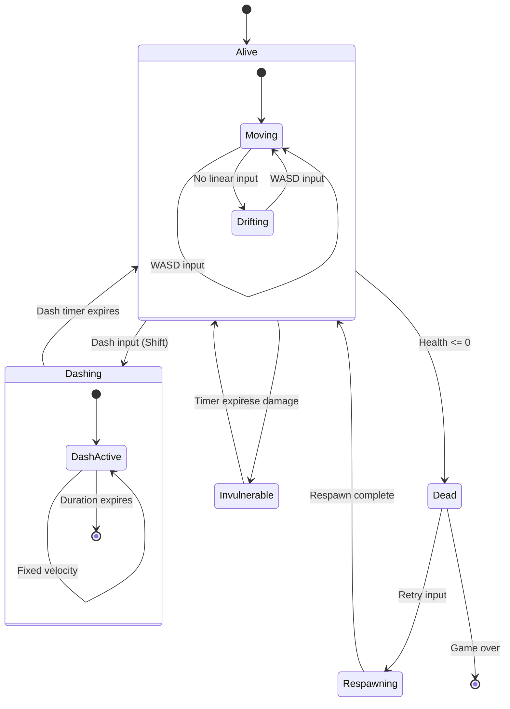
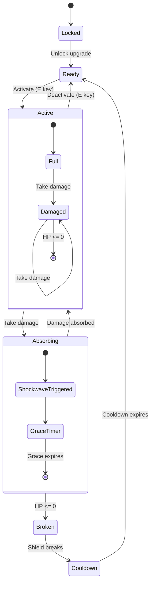
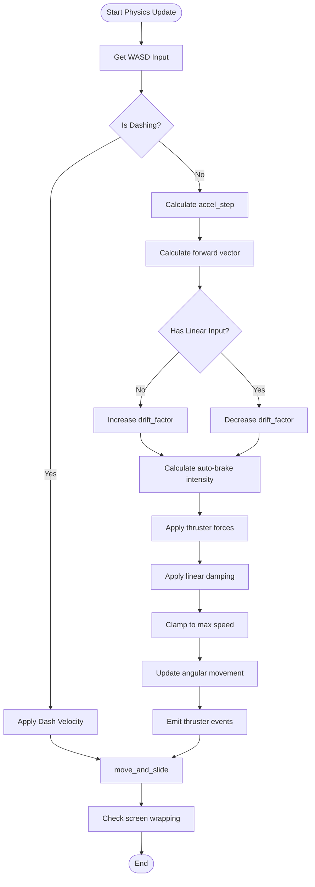
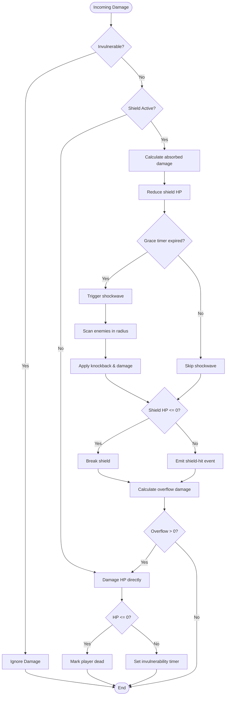
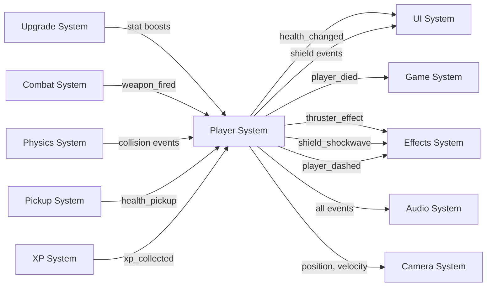

# Player System - Godot 3D Migration Guide

## Table of Contents

1. [System Overview](#1-system-overview)
2. [Data Structure](#2-data-structure)
3. [Movement System](#3-movement-system)
4. [Drift System](#4-drift-system)
5. [Rotation System](#5-rotation-system)
6. [Shield System](#6-shield-system)
7. [Shield Shockwave](#7-shield-shockwave)
8. [Health System](#8-health-system)
9. [Thruster System](#9-thruster-system)
10. [Weapon Recoil](#10-weapon-recoil)
11. [Dash System](#11-dash-system-new-feature)
12. [Screen Wrapping](#12-screen-wrapping)
13. [Godot Implementation](#13-godot-implementation-scene-structure)
14. [Configuration Parameters](#14-configuration-parameters-table)
15. [Mathematical Formulas](#15-mathematical-formulas)
16. [State Diagrams](#16-state-diagrams)
17. [System Integration](#17-system-integration)
18. [References](#18-references)

---

## 1. System Overview

### Concept

The Player System controls a spaceship in a top-down physics-based environment using WASD input. The ship uses acceleration-based movement (not velocity-based), features an activatable shield with HP-based absorption, and includes a new directional dash mechanic for enhanced mobility.

### Six Integrated Subsystems

#### 1. Movement System

- WASD input for directional control
- Acceleration-based physics with linear damping
- Angular rotation with acceleration and damping
- Automatic drift-braking when no input is detected
- Seamless screen wrapping teleportation

#### 2. Shield System

- Activatable via E key
- HP-based damage absorption (50-125 HP depending on upgrade level)
- Cooldown system (20s-13s, reduced with upgrades)
- Generates shockwave knockback on impact (radius: 300, force: 350)
- 5 progressive upgrade levels

#### 3. Health System

- Base HP pool (100, upgradeable)
- Damage absorption priority: Shield → HP
- Invulnerability timer (0.5s after damage, 3s after respawn)
- Healing via collectibles
- Death state management

#### 4. Thruster System

- 4 independent thrusters: Main (forward), Aux (backward), SideL (CW rotation), SideR (CCW rotation)
- Intensity tracking (0-1 range) for visual/audio feedback
- Visual upgrade levels (0-5) control appearance
- Automatic activation for drift-braking

#### 5. Weapon Recoil

- Visual offset feedback when firing
- Exponential decay (0.85 rate) for snappy feel
- Applied as position offset to ship rendering

#### 6. Dash System (NEW)

- Directional dash mechanic (Shift key)
- Cooldown-based (2.0s suggested)
- Invulnerability frames during dash (0.15s suggested)
- Trail particle effect
- Fixed velocity (500, ~2.3x max speed)

### Gameplay Purpose

Provides responsive, tactile ship control with multiple defensive layers (shield + HP + invulnerability) and enhanced mobility through dash, creating engaging combat and evasion mechanics.

---

## 2. Data Structure

This section maps the JavaScript `PlayerSystem` data structure to GDScript equivalents for Godot 3D implementation.

### JavaScript Structure Reference

Source: `src/modules/PlayerSystem.js` lines 100-158

### GDScript Implementation

```gdscript
class_name Player
extends CharacterBody3D

# ===================
# SIGNALS
# ===================
signal health_changed(current: int, maximum: int)
signal shield_activated(level: int, max_hp: int)
signal shield_hit(remaining_hp: int, max_hp: int, damage: int)
signal shield_broken(level: int)
signal shield_recharged(level: int)
signal player_died(position: Vector3, stats: Dictionary)
signal player_respawned(position: Vector3)
signal player_dashed(position: Vector3, direction: Vector3, speed: float)
signal thruster_effect(data: Dictionary)

# ===================
# MOVEMENT & POSITION
# ===================
# Godot CharacterBody3D uses internal velocity property
var ship_velocity: Vector3 = Vector3.ZERO  # Used for custom velocity tracking
var angle: float = 0.0  # Rotation angle in radians
var target_angle: float = 0.0  # Future: smooth rotation target
var angular_velocity: float = 0.0  # Angular velocity in rad/s
var drift_factor: float = 0.0  # Drift auto-brake factor (0-1)

# ===================
# MOVEMENT CONFIGURATION
# ===================
@export_group("Movement")
@export var max_speed: float = 220.0
@export var acceleration: float = 280.0
@export var rotation_speed: float = 8.0
@export var linear_damping: float = 3.1
@export var angular_damping: float = 6.2

# ===================
# PLAYER STATS
# ===================
@export_group("Player Stats")
@export var health: int = 100
@export var max_health: int = 100
@export var damage: int = 25
@export var multishot: int = 1
@export var magnetism_radius: float = 70.0
@export var hull_bounding_radius: float = 24.0
@export var shield_padding: float = 0.0

# ===================
# VISUAL UPGRADE LEVELS
# ===================
@export_group("Visual Levels")
@export_range(0, 5) var thruster_visual_level: int = 0
@export_range(0, 5) var rcs_visual_level: int = 0
@export_range(0, 3) var braking_visual_level: int = 0

# ===================
# THRUSTER STATE
# ===================
var last_thruster_state: Dictionary = {
	"main": 0.0,
	"aux": 0.0,
	"sideL": 0.0,
	"sideR": 0.0
}

# ===================
# WEAPON RECOIL
# ===================
var recoil_offset: Vector2 = Vector2.ZERO
var recoil_decay: float = 0.85

# ===================
# SHIELD STATE
# ===================
@export_group("Shield")
var shield_upgrade_level: int = 0
var shield_max_hp: int = 0
var shield_hp: int = 0
var shield_cooldown_timer: float = 0.0
var shield_max_cooldown: float = 0.0
var shield_was_in_cooldown: bool = false
var is_shield_active: bool = false
var invulnerable_timer: float = 0.0
var shield_hit_grace_timer: float = 0.0

# ===================
# DEATH/RETRY STATE
# ===================
var is_dead: bool = false
var is_retrying: bool = false
var _quit_explosion_hidden: bool = false

# ===================
# DASH STATE (NEW)
# ===================
@export_group("Dash")
var is_dashing: bool = false
var dash_cooldown_timer: float = 0.0
@export var dash_max_cooldown: float = 2.0
@export var dash_duration: float = 0.2
@export var dash_speed: float = 500.0
@export var dash_invulnerability_duration: float = 0.15
var dash_timer: float = 0.0
var dash_direction: Vector3 = Vector3.ZERO

# ===================
# NODE REFERENCES
# ===================
@onready var collision_shape: CollisionShape3D = $CollisionShape3D
@onready var mesh_instance: MeshInstance3D = $MeshInstance3D
@onready var shield_area: Area3D = $ShieldArea
@onready var dash_trail: GPUParticles3D = $DashTrail
@onready var thruster_main: GPUParticles3D = $Thrusters/ThrusterMain
@onready var thruster_aux: GPUParticles3D = $Thrusters/ThrusterAux
@onready var thruster_side_l: GPUParticles3D = $Thrusters/ThrusterSideL
@onready var thruster_side_r: GPUParticles3D = $Thrusters/ThrusterSideR
```

### JS to GDScript Type Mapping

| JavaScript          | GDScript                        | Notes                            |
| ------------------- | ------------------------------- | -------------------------------- |
| `{x, y}` (Vector2)  | `Vector3(x, 0, z)`              | 2D→3D: XY plane → XZ plane (y=0) |
| `position` (object) | `global_position` (Vector3)     | Built-in property                |
| `velocity` (object) | `velocity` (Vector3)            | CharacterBody3D property         |
| `angle` (float)     | `angle` (float) or `rotation.y` | Rotation around Y-axis           |
| `boolean`           | `bool`                          | Direct mapping                   |
| `number`            | `float`/`int`                   | Context-dependent                |

---

## 3. Movement System

### Concept

Movement is **acceleration-based** rather than velocity-based. WASD input controls thrusters that apply forces to the ship each frame. Rotation uses angular velocity (not instantaneous). When no linear input is detected, an automatic drift-brake system activates. Screen wrapping provides seamless teleportation at boundaries.

### Source Reference

`src/modules/PlayerSystem.js` lines 646-716 (`updateMovement`)

### Algorithm Flow

1. **Calculate acceleration step**: `accelStep = acceleration × deltaTime`
2. **Calculate forward vector**: `{x: cos(angle), y: sin(angle)}`
3. **Determine thruster intensities** based on input:
   - `thrMain = 1` if input.up, else `0`
   - `thrAux = 1` if input.down, else `0`
   - `thrSideR = 1` if input.left (CCW torque)
   - `thrSideL = 1` if input.right (CW torque)
4. **Apply drift auto-brake** if no linear input (see [Section 4](#4-drift-system))
5. **Apply thruster forces**:
   - Main: `velocity += forward × accelStep × thrMain`
   - Aux: `velocity -= forward × accelStep × thrAux`
6. **Apply linear damping**: `velocity × exp(-linearDamping × deltaTime)`
7. **Clamp velocity** to `maxSpeed`
8. **Apply angular rotation** (see [Section 5](#5-rotation-system))
9. **Emit thruster events** for visual/audio feedback

### GDScript Implementation

```gdscript
const SHIP_SIZE = 48.0  # Adjust based on hull size

func _physics_process(delta: float) -> void:
	if is_dead or is_retrying:
		return

	# Get movement input
	var input = get_movement_input()

	# Update dash
	update_dash(delta)

	# Update movement (skip if dashing)
	if not is_dashing:
		update_movement(delta, input)

	# Apply velocity to CharacterBody3D
	velocity = ship_velocity
	move_and_slide()

	# Screen wrapping
	update_screen_wrapping()

	# Update timers
	update_timers(delta)

func get_movement_input() -> Dictionary:
	return {
		"up": Input.is_action_pressed("move_up"),
		"down": Input.is_action_pressed("move_down"),
		"left": Input.is_action_pressed("move_left"),
		"right": Input.is_action_pressed("move_right")
	}

func update_movement(delta: float, input: Dictionary) -> void:
	var accel_step = acceleration * delta
	var forward = Vector3(cos(angle), 0, sin(angle))  # XZ plane

	# Thruster intensities
	var thr_main = 1.0 if input.up else 0.0
	var thr_aux = 1.0 if input.down else 0.0
	var thr_side_r = 1.0 if input.left else 0.0
	var thr_side_l = 1.0 if input.right else 0.0

	var is_main_manual = input.up
	var is_aux_manual = input.down

	# Drift auto-brake
	var no_linear_input = not input.up and not input.down
	var speed = ship_velocity.length()

	if no_linear_input:
		drift_factor = min(1.0, drift_factor + DRIFT_RAMP_SPEED * delta)
	else:
		drift_factor = max(0.0, drift_factor - DRIFT_DECAY_SPEED * delta)

	var drift_brake_scale = 1.0 - drift_factor * DRIFT_BRAKE_REDUCTION

	# Auto-damping thrusters (activate without manual input)
	if no_linear_input and speed > 2.0:
		var proj = ship_velocity.dot(forward)
		var k_base = max(0.35, min(1.0, abs(proj) / (max_speed * 0.8)))
		var k = k_base * drift_brake_scale

		if proj > 0:
			thr_aux = max(thr_aux, k)
			is_aux_manual = false
		elif proj < 0:
			thr_main = max(thr_main, k)
			is_main_manual = false

	# Apply thruster forces
	if thr_main > 0:
		ship_velocity += forward * accel_step * thr_main
	if thr_aux > 0:
		ship_velocity -= forward * accel_step * thr_aux

	# Linear damping
	var linear_damp = exp(-linear_damping * delta)
	ship_velocity *= linear_damp

	# Clamp maximum velocity
	var current_speed = ship_velocity.length()
	if current_speed > max_speed:
		ship_velocity = ship_velocity.normalized() * max_speed

	# Angular rotation
	update_angular_movement(delta, thr_side_r, thr_side_l)

	# Emit thruster effects
	emit_thruster_effects(forward, thr_main, thr_aux, thr_side_l, thr_side_r, is_main_manual, is_aux_manual)
```

### Godot-Specific Notes

- **Use `CharacterBody3D`**, not `RigidBody3D`, for greater control over physics
- Use the `velocity` property and `move_and_slide()` for position integration
- **2D→3D projection**: XY plane → XZ plane (Y=0 for top-down view)
- Camera positioned at `(0, 500, 0)` looking down with `rotation(-90°, 0, 0)`

---

## 4. Drift System

### Concept

When the player releases W/S keys (no linear input), the `drift_factor` increases progressively, automatically activating thrusters to brake the ship. A `brake_reduction` parameter allows for controlled drifting. When the player resumes input, `drift_factor` decays rapidly.

### Source Reference

`src/modules/PlayerSystem.js` lines 664-693 and constants lines 24-28

### Parameters

| Parameter               | Default | Description                                  |
| ----------------------- | ------- | -------------------------------------------- |
| `DRIFT_RAMP_SPEED`      | 2.8     | Speed of drift factor increase               |
| `DRIFT_DECAY_SPEED`     | 5.2     | Speed of drift factor decrease               |
| `DRIFT_BRAKE_REDUCTION` | 0.4     | Brake effectiveness reduction (allows drift) |

### Algorithm

1. **If no linear input**:
   - `driftFactor = min(1, driftFactor + rampSpeed × deltaTime)`
2. **If linear input active**:
   - `driftFactor = max(0, driftFactor - decaySpeed × deltaTime)`
3. **Calculate brake scale**: `driftBrakeScale = 1 - driftFactor × brakeReduction`
4. **If no input AND speed > 2**:
   - Calculate velocity projection onto forward: `proj = velocity · forward`
   - Calculate base intensity: `kBase = max(0.35, min(1, |proj| / (maxSpeed × 0.8)))`
   - Calculate final intensity: `k = kBase × driftBrakeScale`
   - **If `proj > 0`**: Activate aux thruster (brake forward motion)
   - **If `proj < 0`**: Activate main thruster (brake backward motion)

### GDScript Implementation

```gdscript
const DRIFT_RAMP_SPEED = 2.8
const DRIFT_DECAY_SPEED = 5.2
const DRIFT_BRAKE_REDUCTION = 0.4

func update_drift_auto_brake(delta: float, input: Dictionary, forward: Vector3) -> Dictionary:
	var no_linear_input = not input.up and not input.down
	var speed = ship_velocity.length()

	# Update drift factor
	if no_linear_input:
		drift_factor = min(1.0, drift_factor + DRIFT_RAMP_SPEED * delta)
	else:
		drift_factor = max(0.0, drift_factor - DRIFT_DECAY_SPEED * delta)

	var drift_brake_scale = 1.0 - drift_factor * DRIFT_BRAKE_REDUCTION

	# Auto-brake thrusters
	var auto_main = 0.0
	var auto_aux = 0.0

	if no_linear_input and speed > 2.0:
		var proj = ship_velocity.dot(forward)
		var k_base = max(0.35, min(1.0, abs(proj) / (max_speed * 0.8)))
		var k = k_base * drift_brake_scale

		if proj > 0:
			auto_aux = k
		elif proj < 0:
			auto_main = k

	return {"auto_main": auto_main, "auto_aux": auto_aux}
```

### Implementation Notes

- Execute **before** applying manual thruster forces
- Use `max()` to combine auto-brake with manual input
- **Visual feedback**: Auto-brake thrusters should have different color/intensity from manual thrusters
- Consider adding a subtle UI indicator showing drift factor for player feedback

---

## 5. Rotation System

### Concept

Rotation uses **angular velocity** rather than instantaneous rotation. A/D input applies **angular acceleration**. Angular damping naturally decelerates rotation when no input is active. Angular velocity is clamped to `rotationSpeed`.

### Source Reference

`src/modules/PlayerSystem.js` lines 718-735

### Algorithm

1. **Calculate rotation acceleration**: `rotationAccel = rotationSpeed × deltaTime`
2. **Calculate angular acceleration**:
   - If `thrSideR` (A/Left): `angularAccel -= rotationAccel` (CCW)
   - If `thrSideL` (D/Right): `angularAccel += rotationAccel` (CW)
3. **Apply acceleration**: `angularVelocity += angularAccel`
4. **Apply angular damping**: `angularVelocity × exp(-angularDamping × deltaTime)`
5. **Clamp angular velocity**: `clamp(angularVelocity, -rotationSpeed, rotationSpeed)`
6. **Integrate angle**: `angle += angularVelocity × deltaTime`
7. **Wrap angle**: Keep angle in range `[-π, π]`

### GDScript Implementation

```gdscript
func update_angular_movement(delta: float, thr_side_r: float, thr_side_l: float) -> void:
	var rotation_accel = rotation_speed * delta
	var angular_accel = 0.0

	if thr_side_r > 0:
		angular_accel -= rotation_accel  # CCW (A/Left)
	if thr_side_l > 0:
		angular_accel += rotation_accel  # CW (D/Right)

	angular_velocity += angular_accel

	# Angular damping
	var angular_damp = exp(-angular_damping * delta)
	angular_velocity *= angular_damp

	# Clamp angular velocity
	angular_velocity = clamp(angular_velocity, -rotation_speed, rotation_speed)

	# Integrate angle
	angle = wrap_angle(angle + angular_velocity * delta)

	# Apply to node rotation (Y-axis for top-down)
	rotation.y = angle

func wrap_angle(a: float) -> float:
	while a > PI:
		a -= TAU
	while a < -PI:
		a += TAU
	return a
```

### Implementation Notes

- Use `rotation.y` for angle in XZ plane (top-down view)
- Alternatively, maintain custom `angle` variable and apply via `transform.basis`
- Emit side thruster events for visual/audio feedback
- Consider adding rotation inertia visualization (trail particles from side thrusters)

---

## 6. Shield System

### Concept

An activatable shield (E key) that absorbs damage before HP. The shield is **HP-based** (not hit-based), ranging from 50-125 HP depending on upgrade level. After breaking, it enters cooldown (20s-13s, reduced with upgrades). On damage absorption, it generates a shockwave that knocks back nearby enemies. The system features 5 progressive upgrade levels.

### Source Reference

- `src/modules/PlayerSystem.js` lines 391-563
- `src/data/constants/gameplay.js` lines 30-51

### Shield Level Configuration

| Level | Max HP | Cooldown | Impact Damage | Special Feature                                     |
| ----- | ------ | -------- | ------------- | --------------------------------------------------- |
| 1     | 50     | 20s      | 10            | Unlock shield ability                               |
| 2     | 75     | 20s      | 14            | +25 HP                                              |
| 3     | 75     | 15s      | 18            | -5s cooldown                                        |
| 4     | 100    | 15s      | 22            | +25 HP                                              |
| 5     | 125    | 13s      | 26            | +25 HP, -2s cooldown, deflective explosion on break |

### Constants

| Constant                         | Value | Description                          |
| -------------------------------- | ----- | ------------------------------------ |
| `SHIELD_COOLDOWN_DURATION`       | 20s   | Base cooldown duration               |
| `SHIELD_SHOCKWAVE_RADIUS`        | 300   | Shockwave effect radius              |
| `SHIELD_SHOCKWAVE_FORCE`         | 350   | Knockback force                      |
| `SHIELD_HIT_GRACE_TIME`          | 0.28s | Time between consecutive absorptions |
| `SHIELD_COLLISION_BOUNCE`        | 0.85  | Bounce coefficient                   |
| `SHIELD_REFLECT_SPEED`           | 95    | Velocity increment on impact         |
| `SHIELD_IMPACT_DAMAGE_BASE`      | 10    | Base impact damage                   |
| `SHIELD_IMPACT_DAMAGE_PER_LEVEL` | 4     | Additional damage per level          |

### Activation Algorithm

1. Validate shield is unlocked (`shieldUpgradeLevel > 0`)
2. Validate shield is not already active
3. Validate shield is not in cooldown
4. Validate shield has HP configured (`shieldMaxHP > 0`)
5. Activate shield: `isShieldActive = true`, `shieldHP = shieldMaxHP`
6. Emit `shield-activated` event
7. Emit `shield-stats-changed` event for UI update

### GDScript Implementation

```gdscript
const SHIELD_LEVEL_CONFIG = {
	1: {"max_hp": 50, "cooldown": 20.0},
	2: {"max_hp": 75, "cooldown": 20.0},
	3: {"max_hp": 75, "cooldown": 15.0},
	4: {"max_hp": 100, "cooldown": 15.0},
	5: {"max_hp": 125, "cooldown": 13.0}
}

func _input(event: InputEvent) -> void:
	if event.is_action_pressed("activate_shield"):
		activate_shield()

func activate_shield() -> bool:
	if shield_upgrade_level <= 0:
		emit_shield_activation_failed("locked")
		return false

	if is_shield_active:
		emit_shield_activation_failed("active")
		return false

	if shield_cooldown_timer > 0:
		emit_shield_activation_failed("cooldown")
		return false

	if shield_max_hp <= 0:
		emit_shield_activation_failed("unavailable")
		return false

	is_shield_active = true
	shield_hp = shield_max_hp
	shield_was_in_cooldown = false

	shield_activated.emit(shield_upgrade_level, shield_max_hp)
	emit_shield_stats()

	# Visual/Audio feedback
	play_shield_activation_effect()

	return true

func apply_shield_level(level: int) -> void:
	var config = SHIELD_LEVEL_CONFIG.get(level)
	if not config:
		push_warning("Invalid shield level: %d" % level)
		return

	shield_upgrade_level = level
	shield_max_hp = config.max_hp
	shield_max_cooldown = config.cooldown

	# Restore shield if not in cooldown
	if is_shield_active:
		shield_hp = shield_max_hp
	elif shield_cooldown_timer <= 0:
		shield_hp = shield_max_hp
	else:
		shield_hp = min(shield_hp, shield_max_hp)

	# Level 1: reset cooldown
	if level == 1:
		shield_cooldown_timer = 0.0
		shield_was_in_cooldown = false
	else:
		shield_cooldown_timer = min(shield_cooldown_timer, shield_max_cooldown)

	emit_shield_stats()

func emit_shield_stats() -> void:
	# Emit for UI update
	EventBus.shield_stats_changed.emit({
		"level": shield_upgrade_level,
		"hp": shield_hp,
		"max_hp": shield_max_hp,
		"cooldown_timer": shield_cooldown_timer,
		"max_cooldown": shield_max_cooldown,
		"is_active": is_shield_active
	})

func emit_shield_activation_failed(reason: String) -> void:
	EventBus.shield_activation_failed.emit({"reason": reason})
```

### Implementation Notes

- Use `Area3D` node for shield collision detection
- Connect `body_entered` signal to detect incoming projectiles/enemies
- Use `Timer` node for cooldown management
- Emit signals for UI to update shield bar and cooldown display
- Visual: Expanding sphere mesh with animated shader (opacity pulse)

---

## 7. Shield Shockwave

### Concept

When the shield absorbs damage, it emits a shockwave that pushes nearby enemies radially and deals impact damage. A grace timer prevents shockwave spam from rapid consecutive hits.

### Source Reference

`src/data/constants/gameplay.js` lines 50-56
`src/modules/PhysicsSystem.js` (shockwave implementation)

### Parameters

| Parameter                        | Value | Description                     |
| -------------------------------- | ----- | ------------------------------- |
| `SHIELD_SHOCKWAVE_RADIUS`        | 300   | Shockwave detection radius      |
| `SHIELD_SHOCKWAVE_FORCE`         | 350   | Knockback force magnitude       |
| `SHIELD_IMPACT_DAMAGE_BASE`      | 10    | Base impact damage              |
| `SHIELD_IMPACT_DAMAGE_PER_LEVEL` | 4     | Damage scaling per level        |
| `SHIELD_HIT_GRACE_TIME`          | 0.28s | Minimum time between shockwaves |
| `SHIELD_COLLISION_BOUNCE`        | 0.85  | Bounce coefficient              |
| `SHIELD_REFLECT_SPEED`           | 95    | Speed boost on reflection       |

### Damage Absorption Algorithm

1. Validate `incomingDamage > 0`
2. If shield inactive: return full damage (no absorption)
3. Calculate `absorbed = min(shieldHP, incomingDamage)`
4. Calculate `overflow = max(0, incomingDamage - absorbed)`
5. Reduce shield HP: `shieldHP -= absorbed`
6. Emit `shield-hit` event with remaining HP
7. **Trigger shockwave** if grace timer expired
8. If `shieldHP <= 0`: call `breakShield()`
9. Return overflow damage (passes to HP system)

### GDScript Implementation

```gdscript
const SHIELD_SHOCKWAVE_RADIUS = 300.0
const SHIELD_SHOCKWAVE_FORCE = 350.0
const SHIELD_HIT_GRACE_TIME = 0.28
const SHIELD_IMPACT_DAMAGE_BASE = 10
const SHIELD_IMPACT_DAMAGE_PER_LEVEL = 4

func shield_took_damage(damage_amount: float) -> float:
	var incoming_damage = max(0.0, damage_amount)

	if not is_shield_active or shield_max_hp <= 0:
		return incoming_damage

	var previous_hp = shield_hp
	var absorbed = min(previous_hp, incoming_damage)
	var overflow = max(0.0, incoming_damage - absorbed)

	shield_hp = max(0, previous_hp - int(absorbed))

	shield_hit.emit(shield_hp, shield_max_hp, int(absorbed))

	# Trigger shockwave (if grace time expired)
	if shield_hit_grace_timer <= 0:
		trigger_shield_shockwave()
		shield_hit_grace_timer = SHIELD_HIT_GRACE_TIME

	if shield_hp <= 0:
		break_shield()
	else:
		emit_shield_stats()

	return overflow

func trigger_shield_shockwave() -> void:
	var impact_damage = SHIELD_IMPACT_DAMAGE_BASE + SHIELD_IMPACT_DAMAGE_PER_LEVEL * max(0, shield_upgrade_level - 1)
	var force_multiplier = 1.0 + max(0, shield_upgrade_level - 1) * 0.22
	var force = SHIELD_SHOCKWAVE_FORCE * force_multiplier

	# Scan nearby enemies
	var space_state = get_world_3d().direct_space_state
	var query = PhysicsShapeQueryParameters3D.new()
	var sphere = SphereShape3D.new()
	sphere.radius = SHIELD_SHOCKWAVE_RADIUS
	query.shape = sphere
	query.transform = global_transform
	query.collision_mask = 0b0010  # Enemy layer

	var results = space_state.intersect_shape(query)

	for result in results:
		var enemy = result.collider
		if not enemy or not enemy.is_in_group("enemies"):
			continue

		# Calculate radial direction
		var dx = enemy.global_position.x - global_position.x
		var dz = enemy.global_position.z - global_position.z
		var distance = sqrt(dx * dx + dz * dz)

		if distance > SHIELD_SHOCKWAVE_RADIUS or distance < 0.01:
			continue

		# Apply knockback
		var normalized_dx = dx / distance
		var normalized_dz = dz / distance
		var knockback = Vector3(normalized_dx * force, 0, normalized_dz * force)

		if enemy.has_method("apply_impulse"):
			enemy.apply_impulse(knockback)
		elif enemy.has_method("apply_knockback"):
			enemy.apply_knockback(knockback)

		# Apply impact damage
		if enemy.has_method("take_damage"):
			enemy.take_damage(impact_damage)

	# Emit event for VFX/SFX
	EventBus.shield_shockwave.emit({
		"position": global_position,
		"radius": SHIELD_SHOCKWAVE_RADIUS,
		"force": force,
		"damage": impact_damage,
		"level": shield_upgrade_level
	})

	# Visual effect
	spawn_shockwave_effect(global_position, SHIELD_SHOCKWAVE_RADIUS)

func break_shield() -> void:
	if not is_shield_active:
		return

	is_shield_active = false
	shield_hp = 0

	shield_broken.emit(shield_upgrade_level)

	# Level 5: Deflective explosion on shield break
	if shield_upgrade_level >= 5:
		EventBus.shield_deflective_explosion.emit({
			"position": global_position,
			"level": shield_upgrade_level
		})
		spawn_deflective_explosion()

	# Start cooldown
	if shield_max_cooldown > 0:
		shield_cooldown_timer = shield_max_cooldown
		shield_was_in_cooldown = true
	else:
		shield_cooldown_timer = 0.0
		shield_was_in_cooldown = false
		shield_recharged.emit(shield_upgrade_level)
		shield_hp = shield_max_hp

	emit_shield_stats()

	# Visual/Audio feedback
	play_shield_break_effect()

func update_timers(delta: float) -> void:
	# Shield cooldown
	if shield_cooldown_timer > 0:
		shield_cooldown_timer = max(0.0, shield_cooldown_timer - delta)

		# Recharge when cooldown expires
		if shield_cooldown_timer <= 0 and shield_was_in_cooldown:
			shield_was_in_cooldown = false
			if shield_max_hp > 0:
				shield_hp = shield_max_hp
				shield_recharged.emit(shield_upgrade_level)
				emit_shield_stats()

	# Grace timer
	if shield_hit_grace_timer > 0:
		shield_hit_grace_timer = max(0.0, shield_hit_grace_timer - delta)

	# Invulnerability timer
	if invulnerable_timer > 0:
		invulnerable_timer = max(0.0, invulnerable_timer - delta)

	# Dash cooldown
	if dash_cooldown_timer > 0:
		dash_cooldown_timer = max(0.0, dash_cooldown_timer - delta)
```

### Implementation Notes

- Use `PhysicsShapeQueryParameters3D` with `SphereShape3D` for efficient area queries
- Set collision mask to enemy layer only
- Apply impulse to enemies if they use `RigidBody3D`, otherwise use custom knockback method
- Create expanding ring visual effect (particle system or animated mesh)
- Play impact sound with pitch variation based on shield level

---

## 8. Health System

### Concept

HP pool system (100 base, upgradeable) where damage is absorbed by the shield first, with overflow passing to HP. Invulnerability timer (0.5s) prevents multi-hit damage. Healing is possible via collectibles. Death occurs when HP reaches 0.

### Source Reference

`src/modules/PlayerSystem.js` lines 1039-1096

### Constants

| Constant                          | Value | Description                         |
| --------------------------------- | ----- | ----------------------------------- |
| `PLAYER_INITIAL_HEALTH`           | 100   | Starting HP                         |
| `PLAYER_INVULNERABILITY_DURATION` | 0.5s  | Invulnerability after taking damage |
| `PLAYER_RESPAWN_INVULNERABILITY`  | 3.0s  | Invulnerability after respawn       |

### Damage Algorithm

1. Validate `damageAmount > 0`
2. Check invulnerability timer (return early if active)
3. If shield active: call `shieldTookDamage()`, get overflow
4. If overflow > 0 or shield inactive:
   - Reduce HP: `health = max(0, health - remainingDamage)`
   - Emit `player-health-changed` event
   - If HP <= 0: call `markDead()`
5. Activate invulnerability timer (0.5s)
6. Return current HP

### GDScript Implementation

```gdscript
const PLAYER_INVULNERABILITY_DURATION = 0.5
const PLAYER_RESPAWN_INVULNERABILITY = 3.0

func take_damage(amount: float) -> int:
	var damage_amount = max(0.0, amount)
	if damage_amount <= 0:
		return health

	# Check invulnerability
	if invulnerable_timer > 0:
		return health

	var remaining_damage = damage_amount

	# Shield absorbs first
	if is_shield_active:
		var overflow = shield_took_damage(damage_amount)
		if overflow <= 0:
			return health
		remaining_damage = max(0.0, overflow)

	# Apply damage to HP
	var previous_health = health
	health = max(0, health - int(remaining_damage))

	if health != previous_health:
		health_changed.emit(health, max_health)

		# Visual/Audio feedback
		play_damage_effect()
		screen_shake(remaining_damage)

	# Activate invulnerability
	invulnerable_timer = PLAYER_INVULNERABILITY_DURATION

	# Death
	if health <= 0:
		mark_dead()

	return health

func heal(amount: float) -> int:
	if is_dead:
		return 0

	var old_health = health
	health = min(max_health, health + int(amount))
	var actual_healing = health - old_health

	if actual_healing > 0:
		EventBus.player_healed.emit({
			"amount": actual_healing,
			"current_health": health,
			"max_health": max_health
		})

		# Visual/Audio feedback
		play_heal_effect()

	return actual_healing

func mark_dead() -> void:
	if is_dead:
		return

	is_dead = true
	is_retrying = false

	# Stop all thrusters
	stop_all_thruster_sounds()

	# Deactivate shield
	if is_shield_active:
		is_shield_active = false

	# Emit death event
	player_died.emit(global_position, get_stats())

	# Visual: Death explosion
	spawn_death_explosion()

	# Hide ship mesh
	mesh_instance.visible = false
	collision_shape.disabled = true

	# Trigger game over sequence
	EventBus.game_over.emit(get_stats())

func respawn(spawn_position: Vector3) -> void:
	# Reset position
	global_position = spawn_position
	angle = 0.0
	rotation.y = 0.0

	# Reset velocity
	ship_velocity = Vector3.ZERO
	velocity = Vector3.ZERO
	angular_velocity = 0.0

	# Reset health
	health = max_health

	# Reset shield (if unlocked)
	if shield_upgrade_level > 0:
		shield_hp = shield_max_hp
		shield_cooldown_timer = 0.0
		shield_was_in_cooldown = false

	# Reset state
	is_dead = false
	is_retrying = false
	_quit_explosion_hidden = false

	# Invulnerability period
	invulnerable_timer = PLAYER_RESPAWN_INVULNERABILITY

	# Show ship
	mesh_instance.visible = true
	collision_shape.disabled = false

	# Visual effect
	spawn_respawn_effect()

	# Emit event
	player_respawned.emit(spawn_position)

func get_stats() -> Dictionary:
	return {
		"health": health,
		"max_health": max_health,
		"damage": damage,
		"multishot": multishot,
		"shield_level": shield_upgrade_level,
		"thruster_level": thruster_visual_level,
		"rcs_level": rcs_visual_level
	}

func stop_all_thruster_sounds() -> void:
	EventBus.thruster_stop_all.emit()
```

### Implementation Notes

- Use flashing/transparency animation during invulnerability
- Emit `health_changed` signal for UI health bar updates
- Create death explosion particle effect with camera shake
- Store player stats for game over screen display
- Consider adding damage number popups for visual feedback

---

## 9. Thruster System

### Concept

Four independent thrusters provide propulsion: Main (forward), Aux (backward), SideL (CW rotation), SideR (CCW rotation). Each thruster has an intensity value (0-1) calculated from input and auto-brake. Visual upgrade levels (0-5) control appearance. Audio feedback modulates pitch/volume based on intensity.

### Source Reference

`src/modules/PlayerSystem.js` lines 737-795

### Thruster Configuration

| Thruster  | Function            | Position                    | Direction           | Visual Level Range        |
| --------- | ------------------- | --------------------------- | ------------------- | ------------------------- |
| **Main**  | Forward thrust (W)  | Rear of ship (-0.8 × size)  | Forward             | 0-5 (thrusterVisualLevel) |
| **Aux**   | Backward thrust (S) | Front of ship (+0.8 × size) | Backward            | 0-3 (brakingVisualLevel)  |
| **SideL** | CW rotation (D)     | Left side (-0.52 × size)    | Perpendicular right | 0-5 (rcsVisualLevel)      |
| **SideR** | CCW rotation (A)    | Right side (+0.52 × size)   | Perpendicular left  | 0-5 (rcsVisualLevel)      |

### Algorithm

1. Calculate thruster intensities from input + auto-brake
2. For each active thruster:
   - Calculate world position (local to world transform)
   - Calculate direction vector (local to world rotation)
   - Emit `thruster-effect` event with intensity, type, visual level
3. Update `lastThrusterState` for next frame comparison
4. Audio system modulates pitch/volume based on intensity

### GDScript Implementation

```gdscript
const SHIP_SIZE = 48.0

func emit_thruster_effects(
	forward: Vector3,
	thr_main: float,
	thr_aux: float,
	thr_side_l: float,
	thr_side_r: float,
	is_main_manual: bool,
	is_aux_manual: bool
) -> void:
	# Main thruster (forward)
	if thr_main > 0 or last_thruster_state.main > 0:
		var thruster_pos = get_local_to_world(Vector2(-SHIP_SIZE * 0.8, 0))
		thruster_effect.emit({
			"position": thruster_pos,
			"direction": forward,
			"intensity": thr_main,
			"type": "main",
			"visual_level": thruster_visual_level,
			"is_automatic": not is_main_manual
		})

		# Update particle system
		thruster_main.emitting = thr_main > 0
		update_thruster_particles(thruster_main, thr_main)

		last_thruster_state.main = thr_main

	# Aux thruster (braking)
	if thr_aux > 0 or last_thruster_state.aux > 0:
		var thruster_pos = get_local_to_world(Vector2(SHIP_SIZE * 0.8, 0))
		thruster_effect.emit({
			"position": thruster_pos,
			"direction": -forward,
			"intensity": thr_aux,
			"type": "aux",
			"visual_level": braking_visual_level,
			"is_automatic": not is_aux_manual
		})

		thruster_aux.emitting = thr_aux > 0
		update_thruster_particles(thruster_aux, thr_aux)

		last_thruster_state.aux = thr_aux

	# Side thrusters (rotation)
	if thr_side_l > 0 or last_thruster_state.sideL > 0:
		var thruster_pos = get_local_to_world(Vector2(0, -SHIP_SIZE * 0.52))
		var dir = get_local_direction(Vector2(0, 1))
		thruster_effect.emit({
			"position": thruster_pos,
			"direction": dir,
			"intensity": thr_side_l,
			"type": "side",
			"visual_level": rcs_visual_level
		})

		thruster_side_l.emitting = thr_side_l > 0
		update_thruster_particles(thruster_side_l, thr_side_l)

		last_thruster_state.sideL = thr_side_l

	if thr_side_r > 0 or last_thruster_state.sideR > 0:
		var thruster_pos = get_local_to_world(Vector2(0, SHIP_SIZE * 0.52))
		var dir = get_local_direction(Vector2(0, -1))
		thruster_effect.emit({
			"position": thruster_pos,
			"direction": dir,
			"intensity": thr_side_r,
			"type": "side",
			"visual_level": rcs_visual_level
		})

		thruster_side_r.emitting = thr_side_r > 0
		update_thruster_particles(thruster_side_r, thr_side_r)

		last_thruster_state.sideR = thr_side_r

func get_local_to_world(local: Vector2) -> Vector3:
	var cos_a = cos(angle)
	var sin_a = sin(angle)
	return Vector3(
		global_position.x + (local.x * cos_a - local.y * sin_a),
		0,
		global_position.z + (local.x * sin_a + local.y * cos_a)
	)

func get_local_direction(local: Vector2) -> Vector3:
	var cos_a = cos(angle)
	var sin_a = sin(angle)
	return Vector3(
		local.x * cos_a - local.y * sin_a,
		0,
		local.x * sin_a + local.y * cos_a
	).normalized()

func update_thruster_particles(thruster: GPUParticles3D, intensity: float) -> void:
	if not thruster:
		return

	# Modulate particle amount and scale based on intensity
	var process_material = thruster.process_material as ParticleProcessMaterial
	if process_material:
		process_material.scale_min = 0.5 + intensity * 0.5
		process_material.scale_max = 1.0 + intensity * 1.0
		process_material.initial_velocity_min = 50 + intensity * 50
		process_material.initial_velocity_max = 100 + intensity * 100

	# Modulate color based on visual level and intensity
	var color = get_thruster_color(intensity)
	thruster.modulate = color

func get_thruster_color(intensity: float) -> Color:
	# Blue (cold) to white (hot) based on intensity
	var cold = Color(0.3, 0.5, 1.0)  # Blue
	var hot = Color(1.0, 0.9, 0.7)   # White-yellow
	return cold.lerp(hot, intensity)
```

### Implementation Notes

- Use `GPUParticles3D` for each thruster (better performance than CPUParticles3D)
- Configure `ParticleProcessMaterial` with:
  - `emission_shape = BOX` with appropriate dimensions
  - `direction` pointing opposite to thrust direction
  - `initial_velocity` scaled by intensity
  - `gravity = Vector3.ZERO` (space environment)
  - `damping` for trail fade
- **Audio**: Connect to audio system via EventBus, modulate pitch (0.8-1.2) and volume (0-1) based on intensity
- See [docs/godot-migration/mechanics-thrusters.md](mechanics-thrusters.md) for complete thruster implementation details

---

## 10. Weapon Recoil

### Concept

When firing weapons, the ship recoils slightly (visual offset only, no physics). The recoil offset decays exponentially over time for a snappy feel. Offset is cleared when very small to prevent jitter.

### Source Reference

`src/modules/PlayerSystem.js` lines 143-145, 617-623

### Constants

| Constant           | Value | Description                       |
| ------------------ | ----- | --------------------------------- |
| `RECOIL_DECAY`     | 0.85  | Exponential decay rate (fast)     |
| `RECOIL_THRESHOLD` | 0.01  | Clear threshold to prevent jitter |

### Algorithm

1. **On weapon fire**: `recoilOffset += recoilForce × direction` (applied by CombatSystem)
2. **Each frame**: `recoilOffset × recoilDecay`
3. If `|recoilOffset.x| < threshold`: `recoilOffset.x = 0`
4. If `|recoilOffset.y| < threshold`: `recoilOffset.y = 0`
5. Apply offset to ship rendering position

### GDScript Implementation

```gdscript
const RECOIL_DECAY = 0.85
const RECOIL_THRESHOLD = 0.01

func _process(delta: float) -> void:
	# Update recoil (decay)
	recoil_offset *= RECOIL_DECAY

	# Clear when very small
	if abs(recoil_offset.x) < RECOIL_THRESHOLD:
		recoil_offset.x = 0.0
	if abs(recoil_offset.y) < RECOIL_THRESHOLD:
		recoil_offset.y = 0.0

	# Apply recoil offset to visual (not physics)
	apply_recoil_visual()

func apply_weapon_recoil(force: float, direction: Vector3) -> void:
	# Called when weapon_fired event is emitted
	recoil_offset.x -= direction.x * force
	recoil_offset.y -= direction.z * force  # 2D→3D: y→z

func apply_recoil_visual() -> void:
	if mesh_instance:
		# Apply offset to mesh position (not physics body)
		# Convert 2D recoil to 3D offset
		var offset_3d = Vector3(recoil_offset.x, 0, recoil_offset.y)
		mesh_instance.position = offset_3d

func _on_weapon_fired(weapon_data: Dictionary) -> void:
	# Connect to EventBus.weapon_fired signal
	var direction = weapon_data.get("direction", Vector3.FORWARD)
	var recoil_force = weapon_data.get("recoil", 5.0)
	apply_weapon_recoil(recoil_force, direction)
```

### Implementation Notes

- Apply recoil offset to **visual rendering only**, not physics body
- Use `MeshInstance3D.position` for offset (relative to parent CharacterBody3D)
- Recoil force scales with weapon damage/type
- Consider adding subtle camera shake for additional feedback
- See [docs/godot-migration/mechanics-weapon-feedback.md](mechanics-weapon-feedback.md) for complete weapon feedback system

---

## 11. Dash System (NEW FEATURE)

### Concept

A directional dash ability (Shift key) that propels the player in the movement direction. This feature **does not exist in the JavaScript codebase** and is a new addition for the Godot implementation. It includes cooldown management, invulnerability frames, trail visual effects, and fixed velocity during dash.

### Design Specifications

| Parameter              | Suggested Value | Description                            |
| ---------------------- | --------------- | -------------------------------------- |
| `DASH_COOLDOWN`        | 2.0s            | Time between dashes                    |
| `DASH_DURATION`        | 0.2s            | How long dash lasts                    |
| `DASH_SPEED`           | 500             | Velocity during dash (~2.3x max speed) |
| `DASH_INVULNERABILITY` | 0.15s           | Invulnerability frames                 |
| `DASH_TRAIL_LIFETIME`  | 0.5s            | Trail particle lifetime                |

### Activation Algorithm

1. Validate dash not in cooldown
2. Validate player not dead
3. **Determine dash direction**:
   - If movement input active: Use input direction
   - If no input: Use current facing direction (forward)
4. Activate dash state: `isDashing = true`, `dashTimer = dashDuration`
5. Store direction: `dashDirection = normalized direction`
6. Activate invulnerability: `invulnerableTimer = dashInvulnerability`
7. Start cooldown: `dashCooldownTimer = dashMaxCooldown`
8. Emit `player-dashed` event
9. Activate trail particles

### Update Algorithm

1. If `isDashing`:
   - Decrement `dashTimer`
   - Apply fixed velocity: `velocity = dashDirection × dashSpeed`
   - If `dashTimer <= 0`: Deactivate dash
2. If not dashing:
   - Decrement `dashCooldownTimer`

### GDScript Implementation

```gdscript
const DASH_COOLDOWN = 2.0
const DASH_DURATION = 0.2
const DASH_SPEED = 500.0
const DASH_INVULNERABILITY = 0.15

func _input(event: InputEvent) -> void:
	if event.is_action_pressed("dash"):
		var input = get_movement_input()
		activate_dash(input)

func activate_dash(input: Dictionary) -> bool:
	if dash_cooldown_timer > 0:
		# Visual feedback: shake UI dash icon
		EventBus.dash_on_cooldown.emit(dash_cooldown_timer)
		return false

	if is_dead or is_retrying:
		return false

	# Determine dash direction
	var dash_dir = Vector3.ZERO

	if input.up or input.down or input.left or input.right:
		# Use input direction
		var input_x = 0.0
		var input_z = 0.0

		if input.up:
			input_z -= 1.0
		if input.down:
			input_z += 1.0
		if input.left:
			input_x -= 1.0
		if input.right:
			input_x += 1.0

		dash_dir = Vector3(input_x, 0, input_z).normalized()

		# Rotate based on camera if needed (for screen-relative controls)
		# dash_dir = dash_dir.rotated(Vector3.UP, camera.rotation.y)
	else:
		# Use current facing direction (forward)
		dash_dir = Vector3(cos(angle), 0, sin(angle))

	# Activate dash
	is_dashing = true
	dash_timer = DASH_DURATION
	dash_direction = dash_dir
	invulnerable_timer = DASH_INVULNERABILITY
	dash_cooldown_timer = DASH_COOLDOWN

	# Emit event
	player_dashed.emit(global_position, dash_direction, DASH_SPEED)

	# Visual/Audio feedback
	dash_trail.emitting = true
	play_dash_sound()
	spawn_dash_start_effect()

	return true

func update_dash(delta: float) -> void:
	if is_dashing:
		dash_timer -= delta

		# Apply fixed velocity during dash
		ship_velocity = dash_direction * DASH_SPEED

		# Disable rotation during dash
		angular_velocity = 0

		# End dash
		if dash_timer <= 0:
			is_dashing = false
			dash_trail.emitting = false
			spawn_dash_end_effect()
	else:
		# Decrement cooldown
		if dash_cooldown_timer > 0:
			dash_cooldown_timer = max(0.0, dash_cooldown_timer - delta)

func play_dash_sound() -> void:
	EventBus.audio_play_sfx.emit({
		"sound": "dash_whoosh",
		"volume": 1.0,
		"pitch": 1.0
	})

func spawn_dash_start_effect() -> void:
	# Instantiate dash start particle burst
	var burst = preload("res://effects/dash_burst.tscn").instantiate()
	burst.global_position = global_position
	burst.rotation.y = angle
	get_parent().add_child(burst)

func spawn_dash_end_effect() -> void:
	# Instantiate dash end particle burst
	var burst = preload("res://effects/dash_end.tscn").instantiate()
	burst.global_position = global_position
	get_parent().add_child(burst)
```

### Trail Particle Configuration

```gdscript
# DashTrail (GPUParticles3D) configuration
# In Godot Editor or via script:
var trail_material = ParticleProcessMaterial.new()
trail_material.emission_shape = ParticleProcessMaterial.EMISSION_SHAPE_BOX
trail_material.emission_box_extents = Vector3(2, 2, 2)
trail_material.direction = Vector3.BACK  # Opposite to dash direction
trail_material.initial_velocity_min = 50
trail_material.initial_velocity_max = 100
trail_material.gravity = Vector3.ZERO
trail_material.damping_min = 2.0
trail_material.damping_max = 4.0
trail_material.scale_min = 1.0
trail_material.scale_max = 2.0
trail_material.color_ramp = create_dash_color_ramp()

dash_trail.process_material = trail_material
dash_trail.amount = 50
dash_trail.lifetime = 0.5
dash_trail.speed_scale = 1.0
dash_trail.emitting = false

func create_dash_color_ramp() -> Gradient:
	var gradient = Gradient.new()
	gradient.add_point(0.0, Color(0.5, 0.8, 1.0, 1.0))  # Bright cyan
	gradient.add_point(1.0, Color(0.2, 0.4, 0.8, 0.0))  # Fade to transparent blue
	return gradient
```

### Implementation Notes

- Use `Input.is_action_pressed("dash")` for Shift key detection
- Add input action in Project Settings: `dash` → `Shift`
- **Directional control**: Dash in WASD direction if pressed, else forward
- **Invulnerability**: Set `invulnerable_timer` to prevent damage during dash
- **Screen shake**: Add camera shake on dash activation for impact
- **UI indicator**: Show cooldown timer on HUD dash icon
- **Balance considerations**:
  - 2.0s cooldown prevents spam
  - 0.2s duration = 100 units travel distance at 500 speed
  - 0.15s invulnerability = 75% of dash duration (tight timing)

---

## 12. Screen Wrapping

### Concept

When the player exits one side of the game area, they seamlessly reappear on the opposite side. Velocity and rotation are preserved (no physics disruption).

### Source Reference

`src/modules/PlayerSystem.js` lines 797-807

### Algorithm

1. If `position.x < 0`: `position.x = GAME_WIDTH`
2. If `position.x > GAME_WIDTH`: `position.x = 0`
3. If `position.z < 0`: `position.z = GAME_HEIGHT` (2D→3D: y→z)
4. If `position.z > GAME_HEIGHT`: `position.z = 0`
5. Preserve `velocity`, `angular_velocity`, `angle`

### GDScript Implementation

```gdscript
const GAME_WIDTH = 800.0
const GAME_HEIGHT = 600.0

func update_screen_wrapping() -> void:
	var pos = global_position
	var wrapped = false

	# Horizontal wrapping
	if pos.x < 0:
		pos.x = GAME_WIDTH
		wrapped = true
	elif pos.x > GAME_WIDTH:
		pos.x = 0
		wrapped = true

	# Vertical wrapping (Z-axis in 3D)
	if pos.z < 0:
		pos.z = GAME_HEIGHT
		wrapped = true
	elif pos.z > GAME_HEIGHT:
		pos.z = 0
		wrapped = true

	# Apply wrapped position
	if wrapped:
		global_position = pos
		# Velocity is preserved automatically
		# Optional: emit event for visual feedback
		if wrapped:
			spawn_wrap_fade_effect()

func spawn_wrap_fade_effect() -> void:
	# Optional: Create fade-in effect when wrapping
	# Can use AnimationPlayer to fade opacity
	pass
```

### Implementation Notes

- Execute **after** `move_and_slide()`
- Use `global_position` for teleportation
- **Do NOT reset velocity** - preserve momentum for seamless feel
- **Optional enhancements**:
  - Fade effect during wrap (opacity 1.0 → 0.5 → 1.0)
  - Ghost image at exit position for 0.1s
  - Particle trail connecting exit/entry points
- Consider boundary buffer (wrap at -10 instead of 0) to hide teleport

---

## 13. Godot Implementation: Scene Structure

### Scene Hierarchy

```
Player (CharacterBody3D)
├─ CollisionShape3D
│  └─ shape: CapsuleShape3D (radius: 12, height: 36)
│     OR ConvexPolygonShape3D (custom hull shape)
├─ Visual (Node3D)
│  ├─ MeshInstance3D (hull mesh - procedural or imported)
│  │  └─ material: ShaderMaterial (player_shader.gdshader)
│  └─ ShieldVisual (MeshInstance3D)
│     ├─ mesh: SphereMesh (radius: hull + padding)
│     └─ material: ShaderMaterial (shield_shader.gdshader)
├─ ShieldArea (Area3D)
│  ├─ CollisionShape3D
│  │  └─ shape: SphereShape3D (radius: hull + padding)
│  └─ monitoring: true, monitorable: true
├─ Thrusters (Node3D)
│  ├─ ThrusterMain (GPUParticles3D)
│  │  ├─ position: Vector3(0, 0, 19.2)  # Rear
│  │  ├─ rotation: Vector3(0, 180, 0)
│  │  └─ process_material: ParticleProcessMaterial
│  ├─ ThrusterAux (GPUParticles3D)
│  │  ├─ position: Vector3(0, 0, -19.2)  # Front
│  │  └─ process_material: ParticleProcessMaterial
│  ├─ ThrusterSideL (GPUParticles3D)
│  │  ├─ position: Vector3(-12.5, 0, 0)  # Left
│  │  ├─ rotation: Vector3(0, -90, 0)
│  │  └─ process_material: ParticleProcessMaterial
│  └─ ThrusterSideR (GPUParticles3D)
│     ├─ position: Vector3(12.5, 0, 0)  # Right
│     ├─ rotation: Vector3(0, 90, 0)
│     └─ process_material: ParticleProcessMaterial
├─ DashTrail (GPUParticles3D)
│  ├─ emitting: false
│  ├─ lifetime: 0.5
│  ├─ amount: 50
│  └─ process_material: ParticleProcessMaterial
├─ Timers (Node)
│  ├─ ShieldCooldownTimer (Timer)
│  │  ├─ wait_time: 20.0
│  │  ├─ one_shot: false
│  │  └─ autostart: false
│  ├─ InvulnerabilityTimer (Timer)
│  │  └─ wait_time: 0.5
│  ├─ DashCooldownTimer (Timer)
│  │  └─ wait_time: 2.0
│  └─ ShieldGraceTimer (Timer)
│     └─ wait_time: 0.28
├─ AnimationPlayer
│  ├─ dash_animation
│  ├─ damage_flash
│  ├─ shield_activate
│  └─ death_explosion
└─ Camera3D
   ├─ position: Vector3(0, 500, 0)
   ├─ rotation: Vector3(-90, 0, 0)
   ├─ projection: ORTHOGONAL (for top-down) or PERSPECTIVE
   └─ size: 400 (if orthogonal)
```

### Material Setup

#### Player Shader (player_shader.gdshader)

```glsl
shader_type spatial;

uniform vec4 base_color : source_color = vec4(0.7, 0.8, 1.0, 1.0);
uniform vec4 accent_color : source_color = vec4(0.3, 0.6, 1.0, 1.0);
uniform float glow_intensity : hint_range(0.0, 2.0) = 0.5;
uniform float invulnerability_flash : hint_range(0.0, 1.0) = 0.0;

void fragment() {
	// Base color with accent
	ALBEDO = mix(base_color.rgb, accent_color.rgb, 0.3);

	// Emission glow
	EMISSION = accent_color.rgb * glow_intensity;

	// Invulnerability flash effect
	if (invulnerability_flash > 0.0) {
		ALBEDO = mix(ALBEDO, vec3(1.0), invulnerability_flash * 0.7);
		EMISSION += vec3(1.0) * invulnerability_flash * 0.5;
	}

	METALLIC = 0.6;
	ROUGHNESS = 0.3;
}
```

#### Shield Shader (shield_shader.gdshader)

```glsl
shader_type spatial;
render_mode blend_add, depth_draw_never, cull_disabled, unshaded;

uniform vec4 shield_color : source_color = vec4(0.3, 0.8, 1.0, 0.3);
uniform float shield_strength : hint_range(0.0, 1.0) = 1.0;
uniform float hit_flash : hint_range(0.0, 1.0) = 0.0;
uniform vec2 hit_position = vec2(0.0);
uniform float time : hint_range(0.0, 100.0);

void fragment() {
	// Fresnel effect for edge glow
	vec3 normal = normalize(NORMAL);
	vec3 view = normalize(CAMERA_POSITION_WORLD - VERTEX);
	float fresnel = 1.0 - max(dot(normal, view), 0.0);
	fresnel = pow(fresnel, 3.0);

	// Hexagonal pattern
	vec2 uv = UV * 10.0;
	float pattern = sin(uv.x * 6.28) * sin(uv.y * 6.28);
	pattern = smoothstep(0.3, 0.7, pattern);

	// Hit flash wave
	float dist_to_hit = length(UV - hit_position);
	float wave = smoothstep(0.3, 0.0, abs(dist_to_hit - time * 0.5));

	// Combine effects
	vec3 color = shield_color.rgb;
	float alpha = shield_color.a * fresnel * shield_strength;
	alpha += pattern * 0.1;
	alpha += wave * hit_flash;

	ALBEDO = color;
	ALPHA = clamp(alpha, 0.0, 1.0);
}
```

### Script Structure (Player.gd)

```gdscript
class_name Player
extends CharacterBody3D

# [Data structure from Section 2]

func _ready() -> void:
	setup_event_listeners()
	initialize_stats()
	setup_timers()
	setup_particle_systems()

func setup_event_listeners() -> void:
	EventBus.upgrade_damage_boost.connect(_on_damage_boost)
	EventBus.upgrade_speed_boost.connect(_on_speed_boost)
	EventBus.upgrade_acceleration_boost.connect(_on_acceleration_boost)
	EventBus.upgrade_rotation_boost.connect(_on_rotation_boost)
	EventBus.upgrade_health_boost.connect(_on_health_boost)
	EventBus.upgrade_deflector_shield.connect(_on_deflector_shield)
	EventBus.weapon_fired.connect(_on_weapon_fired)

func _physics_process(delta: float) -> void:
	if is_dead or is_retrying:
		return

	var input = get_movement_input()
	update_dash(delta)

	if not is_dashing:
		update_movement(delta, input)

	velocity = ship_velocity
	move_and_slide()

	update_screen_wrapping()
	update_timers(delta)

func _process(delta: float) -> void:
	# Visual updates (recoil, animations)
	update_recoil(delta)
	update_invulnerability_visual()
	update_shield_visual()

# [Implement all functions from previous sections]
```

### Input Mapping

Configure in Project Settings → Input Map:

| Action            | Key Binding        | Description       |
| ----------------- | ------------------ | ----------------- |
| `move_up`         | W                  | Forward thrust    |
| `move_down`       | S                  | Backward thrust   |
| `move_left`       | A                  | Rotate left (CCW) |
| `move_right`      | D                  | Rotate right (CW) |
| `activate_shield` | E                  | Toggle shield     |
| `dash`            | Shift              | Dash ability      |
| `fire_weapon`     | Space / Mouse Left | Fire weapon       |

---

## 14. Configuration Parameters Table

Complete reference of all configurable parameters from the JavaScript codebase.

### Movement Parameters

| Parameter              | Default Value | Unit  | Description              | Source         |
| ---------------------- | ------------- | ----- | ------------------------ | -------------- |
| `SHIP_ACCELERATION`    | 280           | px/s² | Linear acceleration      | `physics.js:4` |
| `SHIP_MAX_SPEED`       | 220           | px/s  | Maximum velocity         | `physics.js:5` |
| `SHIP_LINEAR_DAMPING`  | 3.1           | s⁻¹   | Linear velocity damping  | `physics.js:6` |
| `SHIP_ROTATION_SPEED`  | 8             | rad/s | Angular acceleration     | `physics.js:7` |
| `SHIP_ANGULAR_DAMPING` | 6.2           | s⁻¹   | Angular velocity damping | `physics.js:8` |
| `SHIP_MASS`            | 60            | kg    | Ship mass (physics)      | `physics.js:9` |

### Drift Parameters

| Parameter               | Default Value | Unit | Description                   | Source               |
| ----------------------- | ------------- | ---- | ----------------------------- | -------------------- |
| `DRIFT_RAMP_SPEED`      | 2.8           | s⁻¹  | Drift factor increase rate    | `PlayerSystem.js:25` |
| `DRIFT_DECAY_SPEED`     | 5.2           | s⁻¹  | Drift factor decrease rate    | `PlayerSystem.js:26` |
| `DRIFT_BRAKE_REDUCTION` | 0.4           | -    | Brake effectiveness reduction | `PlayerSystem.js:27` |

### Shield Parameters

| Parameter                        | Default Value | Unit | Description                | Source           |
| -------------------------------- | ------------- | ---- | -------------------------- | ---------------- |
| `SHIELD_DEFAULT_HITS`            | 3             | hits | Legacy hit-based (unused)  | `gameplay.js:48` |
| `SHIELD_COOLDOWN_DURATION`       | 20            | s    | Base cooldown duration     | `gameplay.js:49` |
| `SHIELD_SHOCKWAVE_RADIUS`        | 300           | px   | Shockwave detection radius | `gameplay.js:50` |
| `SHIELD_SHOCKWAVE_FORCE`         | 350           | -    | Knockback force magnitude  | `gameplay.js:51` |
| `SHIELD_HIT_GRACE_TIME`          | 0.28          | s    | Time between shockwaves    | `gameplay.js:52` |
| `SHIELD_COLLISION_BOUNCE`        | 0.85          | -    | Bounce coefficient         | `gameplay.js:53` |
| `SHIELD_REFLECT_SPEED`           | 95            | px/s | Velocity boost on reflect  | `gameplay.js:54` |
| `SHIELD_IMPACT_DAMAGE_BASE`      | 10            | dmg  | Base impact damage         | `gameplay.js:55` |
| `SHIELD_IMPACT_DAMAGE_PER_LEVEL` | 4             | dmg  | Damage scaling per level   | `gameplay.js:56` |

### Shield Level Progression

| Level | Max HP | Cooldown (s) | Impact Damage | Source                  |
| ----- | ------ | ------------ | ------------- | ----------------------- |
| 1     | 50     | 20           | 10            | `PlayerSystem.js:31-34` |
| 2     | 75     | 20           | 14            | `PlayerSystem.js:35-38` |
| 3     | 75     | 15           | 18            | `PlayerSystem.js:39-42` |
| 4     | 100    | 15           | 22            | `PlayerSystem.js:43-46` |
| 5     | 125    | 13           | 26            | `PlayerSystem.js:47-50` |

### Health Parameters

| Parameter                         | Default Value | Unit | Description                   | Source                  |
| --------------------------------- | ------------- | ---- | ----------------------------- | ----------------------- |
| `PLAYER_INITIAL_HEALTH`           | 100           | HP   | Starting health               | `PlayerSystem.js:117`   |
| `PLAYER_INVULNERABILITY_DURATION` | 0.5           | s    | Invulnerability after damage  | `PhysicsSystem.js:1632` |
| `PLAYER_RESPAWN_INVULNERABILITY`  | 3.0           | s    | Invulnerability after respawn | `PlayerSystem.js:1234`  |

### Recoil Parameters

| Parameter          | Default Value | Unit | Description            | Source                |
| ------------------ | ------------- | ---- | ---------------------- | --------------------- |
| `RECOIL_DECAY`     | 0.85          | -    | Exponential decay rate | `PlayerSystem.js:145` |
| `RECOIL_THRESHOLD` | 0.01          | px   | Clear threshold        | `PlayerSystem.js:621` |

### Dash Parameters (NEW)

| Parameter              | Suggested Value | Unit | Description             | Source |
| ---------------------- | --------------- | ---- | ----------------------- | ------ |
| `DASH_COOLDOWN`        | 2.0             | s    | Cooldown duration       | New    |
| `DASH_DURATION`        | 0.2             | s    | Dash active duration    | New    |
| `DASH_SPEED`           | 500             | px/s | Velocity during dash    | New    |
| `DASH_INVULNERABILITY` | 0.15            | s    | Invulnerability frames  | New    |
| `DASH_TRAIL_LIFETIME`  | 0.5             | s    | Trail particle lifetime | New    |

### Screen Wrapping Parameters

| Parameter     | Default Value | Unit | Description      | Source          |
| ------------- | ------------- | ---- | ---------------- | --------------- |
| `GAME_WIDTH`  | 800           | px   | Game area width  | `GameSystem.js` |
| `GAME_HEIGHT` | 600           | px   | Game area height | `GameSystem.js` |

---

## 15. Mathematical Formulas

### Linear Motion

**Acceleration Integration:**

```
v(t + Δt) = v(t) + a · Δt
```

**Linear Damping:**

```
v(t + Δt) = v(t) · e^(-λ · Δt)
```

Where `λ = linear_damping = 3.1 s⁻¹`

**Combined Motion (Euler Integration):**

```
v_new = (v_old + a · Δt) · e^(-λ · Δt)
x_new = x_old + v_new · Δt
```

**Velocity Clamping:**

```
if |v| > v_max:
    v = (v / |v|) · v_max
```

### Angular Motion

**Angular Acceleration:**

```
ω(t + Δt) = ω(t) + α · Δt
```

**Angular Damping:**

```
ω(t + Δt) = ω(t) · e^(-λ_angular · Δt)
```

Where `λ_angular = angular_damping = 6.2 s⁻¹`

**Angle Integration:**

```
θ(t + Δt) = wrap(θ(t) + ω(t) · Δt, -π, π)
```

### Drift System

**Drift Factor Update:**

```
if no_input:
    f_drift(t + Δt) = min(1, f_drift(t) + k_ramp · Δt)
else:
    f_drift(t + Δt) = max(0, f_drift(t) - k_decay · Δt)
```

Where `k_ramp = 2.8`, `k_decay = 5.2`

**Auto-Brake Intensity:**

```
proj = v · forward
k_base = clamp(|proj| / (0.8 · v_max), 0.35, 1.0)
k_brake = k_base · (1 - f_drift · brake_reduction)
```

### Shield Damage Absorption

**Damage Distribution:**

```
absorbed = min(shield_HP, incoming_damage)
overflow = max(0, incoming_damage - absorbed)
shield_HP_new = max(0, shield_HP - absorbed)
health_new = max(0, health - overflow)
```

**Impact Damage Scaling:**

```
damage_impact = damage_base + damage_per_level · max(0, level - 1)
damage_impact = 10 + 4 · max(0, level - 1)
```

### Shockwave Knockback

**Radial Force Application:**

```
Δr = enemy_pos - player_pos
distance = |Δr|
direction = Δr / distance
force_multiplier = 1 + max(0, shield_level - 1) · 0.22
impulse = direction · force_base · force_multiplier
```

### Recoil Decay

**Exponential Decay:**

```
offset(t + Δt) = offset(t) · decay_rate
offset(t + Δt) = offset(t) · 0.85
```

**Threshold Clamping:**

```
if |offset_x| < threshold:
    offset_x = 0
if |offset_y| < threshold:
    offset_y = 0
```

### Coordinate Transformations (2D → 3D)

**JavaScript (2D) → Godot (3D):**

```
JS: {x, y}  →  Godot: Vector3(x, 0, y)
```

**Local to World Position:**

```
cos_a = cos(angle)
sin_a = sin(angle)
world_x = pos.x + (local_x · cos_a - local_y · sin_a)
world_z = pos.z + (local_x · sin_a + local_y · cos_a)
```

**Local to World Direction:**

```
world_dir.x = local_x · cos_a - local_y · sin_a
world_dir.z = local_x · sin_a + local_y · cos_a
world_dir = normalize(world_dir)
```

---

## 16. State Diagrams

### Player State Machine



### Shield State Machine



### Movement Flow Diagram



### Combat Flow Diagram



---

## 17. System Integration

### EventBus Signals

The Player System emits and listens to the following signals for integration with other systems:

#### Emitted Signals

| Signal             | Parameters                                                                                 | Description               | Listeners                               |
| ------------------ | ------------------------------------------------------------------------------------------ | ------------------------- | --------------------------------------- |
| `health_changed`   | `current: int, max: int`                                                                   | Player HP changed         | UI, AudioSystem                         |
| `shield_activated` | `level: int, max_hp: int`                                                                  | Shield activated          | UI, EffectsSystem, AudioSystem          |
| `shield_hit`       | `remaining_hp: int, max_hp: int, damage: int`                                              | Shield absorbed damage    | UI, EffectsSystem, AudioSystem          |
| `shield_broken`    | `level: int`                                                                               | Shield broke              | UI, EffectsSystem, AudioSystem          |
| `shield_recharged` | `level: int`                                                                               | Shield cooldown completed | UI, AudioSystem                         |
| `shield_shockwave` | `position: Vector3, radius: float, force: float, damage: int, level: int`                  | Shockwave triggered       | EffectsSystem, AudioSystem              |
| `player_died`      | `position: Vector3, stats: Dictionary`                                                     | Player death              | GameSystem, UI, AudioSystem             |
| `player_respawned` | `position: Vector3`                                                                        | Player respawn            | EffectsSystem, AudioSystem, EnemySystem |
| `player_dashed`    | `position: Vector3, direction: Vector3, speed: float`                                      | Dash activated            | EffectsSystem, AudioSystem, Camera      |
| `thruster_effect`  | `position: Vector3, direction: Vector3, intensity: float, type: String, visual_level: int` | Thruster activation       | EffectsSystem, AudioSystem              |
| `player_healed`    | `amount: int, current_health: int, max_health: int`                                        | Player healed             | UI, EffectsSystem, AudioSystem          |

#### Subscribed Signals

| Signal                       | Source        | Handler                  | Action                  |
| ---------------------------- | ------------- | ------------------------ | ----------------------- |
| `upgrade_damage_boost`       | UpgradeSystem | `_on_damage_boost`       | Increase damage stat    |
| `upgrade_speed_boost`        | UpgradeSystem | `_on_speed_boost`        | Increase max_speed      |
| `upgrade_acceleration_boost` | UpgradeSystem | `_on_acceleration_boost` | Increase acceleration   |
| `upgrade_rotation_boost`     | UpgradeSystem | `_on_rotation_boost`     | Increase rotation_speed |
| `upgrade_health_boost`       | UpgradeSystem | `_on_health_boost`       | Increase max_health     |
| `upgrade_deflector_shield`   | UpgradeSystem | `_on_deflector_shield`   | Apply shield level      |
| `weapon_fired`               | CombatSystem  | `_on_weapon_fired`       | Apply recoil            |
| `xp_orb_collected`           | XPSystem      | `_on_xp_collected`       | Update XP               |
| `health_pickup_collected`    | PickupSystem  | `_on_health_pickup`      | Heal player             |

### System Dependencies



### Integration Code Example

```gdscript
# EventBus.gd (Autoload singleton)
extends Node

# Player signals
signal health_changed(current: int, maximum: int)
signal shield_activated(level: int, max_hp: int)
signal shield_hit(remaining_hp: int, max_hp: int, damage: int)
signal shield_broken(level: int)
signal shield_recharged(level: int)
signal shield_shockwave(data: Dictionary)
signal player_died(position: Vector3, stats: Dictionary)
signal player_respawned(position: Vector3)
signal player_dashed(position: Vector3, direction: Vector3, speed: float)
signal thruster_effect(data: Dictionary)
signal player_healed(data: Dictionary)

# Upgrade signals
signal upgrade_damage_boost(amount: int)
signal upgrade_speed_boost(amount: float)
signal upgrade_acceleration_boost(amount: float)
signal upgrade_rotation_boost(amount: float)
signal upgrade_health_boost(amount: int)
signal upgrade_deflector_shield(level: int)

# Combat signals
signal weapon_fired(data: Dictionary)

# Pickup signals
signal health_pickup_collected(amount: int)
signal xp_collected(amount: int)

# Player.gd
func setup_event_listeners() -> void:
	EventBus.upgrade_damage_boost.connect(_on_damage_boost)
	EventBus.upgrade_speed_boost.connect(_on_speed_boost)
	EventBus.upgrade_acceleration_boost.connect(_on_acceleration_boost)
	EventBus.upgrade_rotation_boost.connect(_on_rotation_boost)
	EventBus.upgrade_health_boost.connect(_on_health_boost)
	EventBus.upgrade_deflector_shield.connect(_on_deflector_shield)
	EventBus.weapon_fired.connect(_on_weapon_fired)
	EventBus.health_pickup_collected.connect(_on_health_pickup)
	EventBus.xp_collected.connect(_on_xp_collected)

func _on_damage_boost(amount: int) -> void:
	damage += amount
	print("Damage boosted: %d (total: %d)" % [amount, damage])

func _on_deflector_shield(level: int) -> void:
	apply_shield_level(level)
	print("Shield upgraded to level %d" % level)

func _on_weapon_fired(data: Dictionary) -> void:
	var direction = data.get("direction", Vector3.FORWARD)
	var recoil_force = data.get("recoil", 5.0)
	apply_weapon_recoil(recoil_force, direction)

func _on_health_pickup(amount: int) -> void:
	heal(amount)
```

---

## 18. References

### JavaScript Source Files Analyzed

| File                             | Lines Analyzed | Key Content                           |
| -------------------------------- | -------------- | ------------------------------------- |
| `src/modules/PlayerSystem.js`    | 1-1287 (full)  | Complete player system implementation |
| `src/data/constants/physics.js`  | 1-20           | Movement physics constants            |
| `src/data/constants/gameplay.js` | 30-57          | Shield and combat constants           |
| `src/modules/PhysicsSystem.js`   | 1630-1640      | Invulnerability duration              |
| `src/modules/EffectsSystem.js`   | -              | Shield shockwave visual effects       |

### Key JavaScript Functions Referenced

#### PlayerSystem.js

| Function                | Lines     | Description                          |
| ----------------------- | --------- | ------------------------------------ |
| `constructor`           | 53-162    | Initialization, data structure setup |
| `setupEventListeners`   | 302-389   | Event subscriptions                  |
| `activateShield`        | 391-428   | Shield activation logic              |
| `shieldTookDamage`      | 430-497   | Damage absorption algorithm          |
| `breakShield`           | 499-540   | Shield breaking logic                |
| `applyShieldLevel`      | 542-563   | Shield upgrade application           |
| `update`                | 565-615   | Main update loop                     |
| `updateMovement`        | 646-716   | Movement physics                     |
| `updateAngularMovement` | 718-735   | Rotation physics                     |
| `emitThrusterEffects`   | 737-795   | Thruster emission                    |
| `updateScreenWrapping`  | 797-807   | Boundary wrapping                    |
| `takeDamage`            | 1039-1096 | Damage handling                      |
| `heal`                  | 1098-1121 | Healing logic                        |
| `markDead`              | 1155-1184 | Death state                          |
| `doRespawn`             | 1186-1264 | Respawn logic                        |

### Constants Summary

#### Movement (physics.js)

```javascript
SHIP_ACCELERATION: 280; // px/s²
SHIP_MAX_SPEED: 220; // px/s
SHIP_LINEAR_DAMPING: 3.1; // s⁻¹
SHIP_ROTATION_SPEED: 8; // rad/s
SHIP_ANGULAR_DAMPING: 6.2; // s⁻¹
SHIP_MASS: 60; // kg
```

#### Drift (PlayerSystem.js:24-28)

```javascript
DRIFT_SETTINGS: {
    rampSpeed: 2.8,            // s⁻¹
    decaySpeed: 5.2,           // s⁻¹
    brakeReduction: 0.4        // -
}
```

#### Shield (gameplay.js:48-56)

```javascript
SHIELD_DEFAULT_HITS: 3; // legacy
SHIELD_COOLDOWN_DURATION: 20; // s
SHIELD_SHOCKWAVE_RADIUS: 300; // px
SHIELD_SHOCKWAVE_FORCE: 350; // -
SHIELD_HIT_GRACE_TIME: 0.28; // s
SHIELD_COLLISION_BOUNCE: 0.85; // -
SHIELD_REFLECT_SPEED: 95; // px/s
SHIELD_IMPACT_DAMAGE_BASE: 10; // dmg
SHIELD_IMPACT_DAMAGE_PER_LEVEL: 4; // dmg
```

#### Shield Levels (PlayerSystem.js:30-51)

```javascript
SHIELD_LEVEL_CONFIG: {
    1: { maxHP: 50,  cooldown: 20 },
    2: { maxHP: 75,  cooldown: 20 },
    3: { maxHP: 75,  cooldown: 15 },
    4: { maxHP: 100, cooldown: 15 },
    5: { maxHP: 125, cooldown: 13 }
}
```

### Godot Documentation References

- [CharacterBody3D](https://docs.godotengine.org/en/stable/classes/class_characterbody3d.html)
- [Area3D](https://docs.godotengine.org/en/stable/classes/class_area3d.html)
- [GPUParticles3D](https://docs.godotengine.org/en/stable/classes/class_gpuparticles3d.html)
- [PhysicsShapeQueryParameters3D](https://docs.godotengine.org/en/stable/classes/class_physicsshapequeryparameters3d.html)
- [Shaders](https://docs.godotengine.org/en/stable/tutorials/shaders/index.html)

### Related Migration Documents

- [docs/godot-migration/mechanics-thrusters.md](mechanics-thrusters.md) - Detailed thruster implementation
- [docs/godot-migration/mechanics-weapon-feedback.md](mechanics-weapon-feedback.md) - Weapon recoil and feedback
- [docs/godot-migration/mechanics-combat-targeting.md](mechanics-combat-targeting.md) - Combat system integration
- [docs/godot-migration/mechanics-xp-orbs.md](mechanics-xp-orbs.md) - XP magnetism integration

---

## End of Document

This document provides a comprehensive technical reference for implementing the Player System in Godot 3D. All algorithms, formulas, and implementation details have been extracted from the JavaScript codebase (`PlayerSystem.js`, `physics.js`, `gameplay.js`) and adapted for Godot's 3D environment with the XZ plane for top-down gameplay.

**Next Steps:**

1. Create Player scene hierarchy in Godot
2. Implement `Player.gd` script with all subsystems
3. Configure particle systems for thrusters and dash trail
4. Create shader materials for player and shield visuals
5. Set up EventBus autoload for signal communication
6. Test movement physics parameters for feel
7. Balance dash cooldown and invulnerability duration
8. Create visual effects for shield shockwave
9. Implement UI elements for health/shield/dash cooldown
10. Integrate with existing combat and upgrade systems

**Document Version:** 1.0
**Last Updated:** Based on JavaScript codebase analysis
**Target Engine:** Godot 4.x
