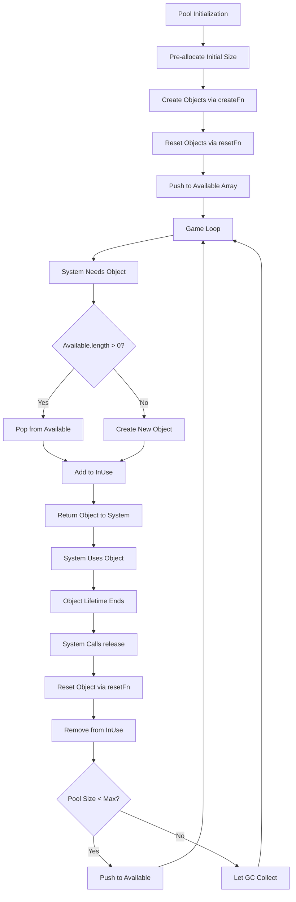
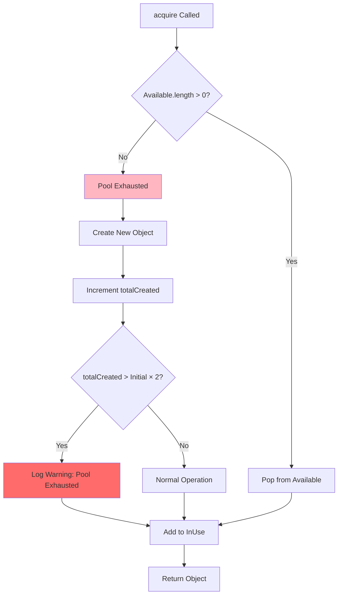
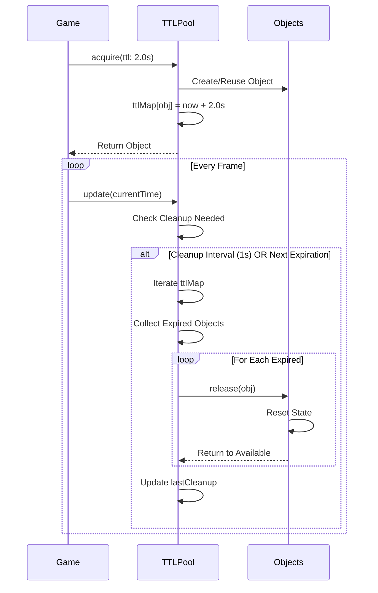
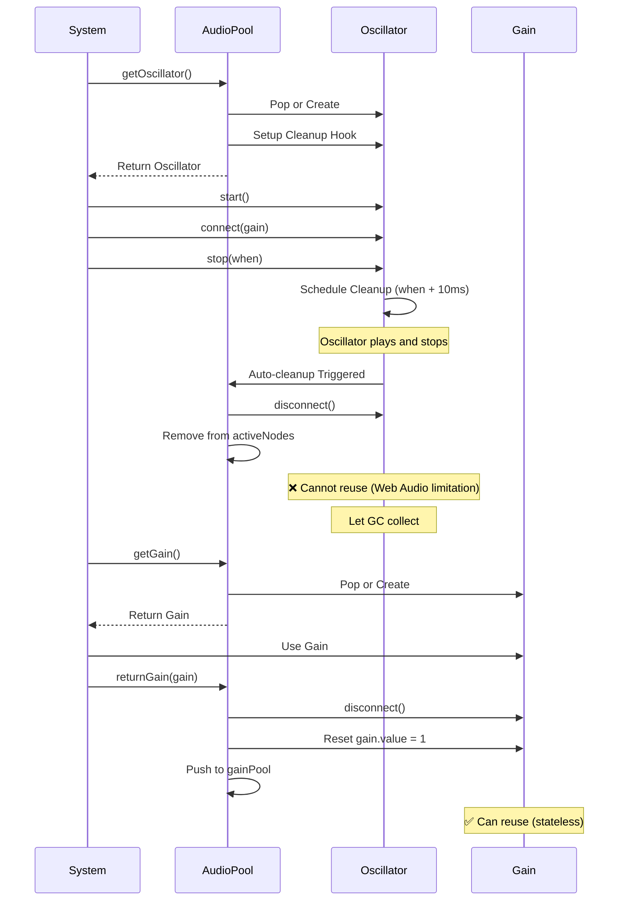

# Object Pooling System - Migração para Godot 3D

## 1. Visão Geral do Sistema

### Conceito

Object pooling é uma técnica de otimização que evita criar e destruir entidades durante runtime, melhorando significativamente a performance e reduzindo GC (Garbage Collection) spikes. Ao invés de instanciar novos objetos constantemente, o sistema mantém pools de objetos reutilizáveis que podem ser reciclados.

### Sistema Atual (JavaScript)

O projeto gerencia **10 pools de objetos** através de um registry centralizado (`GamePools`):

1. **bullets** - Projéteis disparados pelo jogador
2. **particles** - Partículas de efeitos visuais (explosões, trails, thrusters)
3. **asteroids** - Asteroides e seus fragmentos
4. **drones** - Inimigos tipo Drone
5. **mines** - Inimigos tipo Mine
6. **hunters** - Inimigos tipo Hunter
7. **bosses** - Boss enemies
8. **xpOrbs** - Orbs de experiência coletáveis
9. **shockwaves** - Efeitos de ondas de choque
10. **tempObjects** - Objetos temporários genéricos (TTL-based)

### Tipos de Pool

**ObjectPool (Classe Base):**

- Pool genérico para objetos com lifecycle manual
- Suporta acquire/release, expand/shrink, auto-management
- Tracking de estatísticas (hits, created, acquired, released)
- Validação de integridade

**TTLObjectPool (Extends ObjectPool):**

- Pool com time-to-live automático
- Auto-release de objetos expirados
- Cleanup periódico (intervalo: 1s)
- Usado para `tempObjects`

**AudioPool (Especializado):**

- Pool específico para Web Audio API nodes
- 3 sub-pools: oscillators, gains, buffer sources
- Cleanup automático (oscillators/bufferSources não reutilizáveis após `stop()`)
- Tracking de nodes ativos

### Propósito e Benefícios

**Performance:**

- Reduz GC pressure em até 90% (menos allocations)
- Melhora frame time consistency (evita GC spikes durante gameplay)
- Suporta high object churn (centenas de objetos por segundo)

**Exemplo de Impacto:**

- Sem pooling: Multishot tier 3 (4 bullets/shot) a 60 FPS = 240 allocations/s
- Com pooling: 20 objetos reutilizados = ~1-2 allocations/s (apenas quando pool exhausted)

---

## 2. Estrutura de Dados do Sistema

### 2.1. ObjectPool State

```gdscript
class_name ObjectPool
extends RefCounted

# Configuration
var create_fn: Callable  # Factory function: () -> Object
var reset_fn: Callable   # Reset function: (obj) -> bool
var max_size: int = 100  # Maximum pool size (0 = unlimited)

# Collections
var available: Array = []  # Objects ready for reuse
var in_use: Array = []     # Objects currently active

# Stats tracking
var total_created: int = 0    # Total objects ever created
var total_acquired: int = 0   # Total acquire() calls
var total_released: int = 0   # Total release() calls
var total_hits: int = 0       # Successful reuse operations (acquired from available)

# Object tracking (simula WeakSet do JS)
var object_usage: Dictionary = {}  # object -> bool (marks objects as "managed")
```

**Mapeamento JavaScript → GDScript:**

| JavaScript       | GDScript               | Notas                       |
| ---------------- | ---------------------- | --------------------------- |
| `Set<Object>`    | `Array`                | Godot não tem Set nativo    |
| `WeakSet`        | `Dictionary`           | object → bool para tracking |
| `Map`            | `Dictionary`           | Equivalente direto          |
| `this.available` | `var available: Array` |                             |
| `this.inUse`     | `var in_use: Array`    | Snake_case                  |

### 2.2. TTLObjectPool State

```gdscript
class_name TTLObjectPool
extends ObjectPool

# TTL tracking
var ttl_map: Dictionary = {}  # object -> expire_time (timestamp absoluto)
var last_cleanup: float = 0.0 # Timestamp do último cleanup
var cleanup_interval: float = 1.0  # Intervalo de cleanup (segundos)
```

**TTL Storage:**

- Chave: Referência ao objeto
- Valor: `Time.get_ticks_msec() / 1000.0 + ttl` (timestamp de expiração)

### 2.3. GamePools Registry

```gdscript
class_name GamePools
extends Node  # Autoload singleton

# Pool instances
var bullets: ObjectPool
var particles: ObjectPool
var asteroids: ObjectPool
var drones: ObjectPool
var mines: ObjectPool
var hunters: ObjectPool
var bosses: ObjectPool
var xp_orbs: ObjectPool
var shockwaves: ObjectPool
var temp_objects: TTLObjectPool

# State
var initialized: bool = false
var pool_config: Dictionary = {}  # Configuration per pool
var lifecycle_overrides: Dictionary = {}  # Custom factory/reset per pool
var last_auto_manage_time: float = 0.0  # Timestamp do último auto-manage
```

**Pool Configuration Structure:**

```gdscript
pool_config = {
    "bullets": {"initial": 20, "max": 100},
    "particles": {"initial": 50, "max": 300},
    # ... outros pools
}
```

---

## 3. ObjectPool Class (Classe Base)

### 3.1. Constructor

```gdscript
func _init(
    p_create_fn: Callable,
    p_reset_fn: Callable,
    initial_size: int = 0,
    p_max_size: int = 0
) -> void:
    create_fn = p_create_fn
    reset_fn = p_reset_fn
    max_size = p_max_size

    # Pre-allocate initial objects
    if initial_size > 0:
        expand(initial_size)
```

### 3.2. acquire() - Adquirir Objeto

**Algoritmo:**

1. Se `available.size() > 0`:
   - Pop objeto de available
   - Se objeto já foi usado antes (`object_usage` contém): incrementa `total_hits`
2. Senão (pool exhausted):
   - Cria novo objeto via `create_fn()`
   - Incrementa `total_created`
   - Log warning em dev mode (indica pool undersized)
3. Adiciona objeto a `in_use`
4. Incrementa `total_acquired`
5. Marca objeto em `object_usage`
6. Retorna objeto

**Pseudocódigo GDScript:**

```gdscript
func acquire() -> Variant:
    var obj = null

    if available.size() > 0:
        obj = available.pop_back()
        if object_usage.has(obj):
            total_hits += 1
    else:
        # Pool exhausted - create new object
        obj = create_fn.call()
        total_created += 1

        if OS.is_debug_build():
            print("[ObjectPool] Created new object (total: %d)" % total_created)

    in_use.append(obj)
    total_acquired += 1
    object_usage[obj] = true

    return obj
```

**Referência JavaScript:** `src/core/ObjectPool.js:83-108`

### 3.3. release() - Liberar Objeto

**Algoritmo:**

1. Verifica se objeto está em `in_use` (se não, warning + return false)
2. Tenta resetar objeto via `reset_fn(obj)`
3. Se reset falhar: remove de `in_use`, não retorna ao pool, return false
4. Remove de `in_use`
5. Incrementa `total_released`
6. Se pool não está cheio (`max_size == 0` OU `available.size() < max_size`):
   - Push objeto para `available`
7. Senão: deixa objeto ser garbage collected
8. Return true

**Pseudocódigo GDScript:**

```gdscript
func release(obj: Variant) -> bool:
    if not obj in in_use:
        if OS.is_debug_build():
            push_warning("[ObjectPool] Attempted to release object not acquired from this pool")
        return false

    # Reset object to clean state
    var reset_success = true
    if reset_fn:
        reset_success = reset_fn.call(obj)

    if not reset_success:
        in_use.erase(obj)
        return false

    in_use.erase(obj)
    total_released += 1

    # Return to pool if under max size
    if max_size == 0 or available.size() < max_size:
        available.append(obj)
    # Otherwise let object be garbage collected

    return true
```

**Referência JavaScript:** `src/core/ObjectPool.js:116-144`

### 3.4. expand() - Expandir Pool

**Algoritmo:**

1. Para cada count:
   - Cria objeto via `create_fn()`
   - Reseta via `reset_fn()`
   - Push para `available`
   - Incrementa `total_created`

```gdscript
func expand(count: int) -> void:
    for i in count:
        var obj = create_fn.call()
        if reset_fn:
            reset_fn.call(obj)
        available.append(obj)
        total_created += 1

    if OS.is_debug_build():
        print("[ObjectPool] Expanded by %d objects (total: %d)" % [count, get_total_size()])
```

**Referência JavaScript:** `src/core/ObjectPool.js:162-173`

### 3.5. shrink() - Encolher Pool

**Algoritmo:**

1. Remove até `count` objetos de `available`
2. Deixa objetos serem garbage collected

```gdscript
func shrink(count: int) -> void:
    var actual_shrinkage = min(count, available.size())

    for i in actual_shrinkage:
        available.pop_back()

    if OS.is_debug_build() and actual_shrinkage > 0:
        print("[ObjectPool] Shrunk by %d objects (total: %d)" % [actual_shrinkage, get_total_size()])
```

**Referência JavaScript:** `src/core/ObjectPool.js:180-183`

### 3.6. autoManage() - Auto-Gerenciamento

**Algoritmo:**

1. Calcula utilization: `in_use.size() / get_total_size()`
2. **High Utilization (>70%) + Low Availability (<3):**
   - Expand pool
   - Expansion amount: `min(max_expansion, ceil(in_use.size() × 0.2))`
3. **Low Utilization (<35%) + High Availability (>10):**
   - Shrink pool
   - Shrinkage amount: `min(max_shrinkage, floor(available.size() × 0.2))`

**Pseudocódigo GDScript:**

```gdscript
func auto_manage(options: Dictionary = {}) -> void:
    var target_utilization = options.get("target_utilization", 0.7)
    var max_expansion = options.get("max_expansion", 10)
    var max_shrinkage = options.get("max_shrinkage", 5)

    var total_size = get_total_size()
    if total_size == 0:
        return

    var utilization = in_use.size() / float(total_size)

    # High utilization - expand
    if utilization > target_utilization and available.size() < 3:
        var expansion = min(max_expansion, ceil(in_use.size() * 0.2))
        expand(expansion)

        if OS.is_debug_build():
            print("[ObjectPool] Auto-expanded by %d objects (utilization: %.1f%%)" % [expansion, utilization * 100])

    # Low utilization - shrink
    elif utilization < target_utilization * 0.5 and available.size() > 10:
        var shrinkage = min(max_shrinkage, floor(available.size() * 0.2))
        shrink(shrinkage)

        if OS.is_debug_build():
            print("[ObjectPool] Auto-shrunk by %d objects (utilization: %.1f%%)" % [shrinkage, utilization * 100])
```

**Parâmetros Default:**

- Target utilization: **70%**
- Max expansion: **10 objects**
- Max shrinkage: **5 objects**

**Referência JavaScript:** `src/core/ObjectPool.js:250-276`

### 3.7. getStats() - Estatísticas

```gdscript
func get_stats() -> Dictionary:
    var total_size = get_total_size()
    var utilization = in_use.size() / float(total_size) if total_size > 0 else 0.0
    var hit_rate = total_hits / float(total_acquired) if total_acquired > 0 else 0.0

    return {
        "available": available.size(),
        "in_use": in_use.size(),
        "total_size": total_size,
        "total_created": total_created,
        "total_acquired": total_acquired,
        "total_released": total_released,
        "total_hits": total_hits,
        "hit_rate": hit_rate,
        "utilization": utilization,
        "max_size": max_size
    }
```

**Referência JavaScript:** `src/core/ObjectPool.js:199-212`

### 3.8. validate() - Validação de Integridade

```gdscript
func validate() -> Dictionary:
    var errors = []

    # Check for duplicates in available
    var available_set = {}
    for obj in available:
        if available_set.has(obj):
            errors.append("Duplicate object in available pool")
        available_set[obj] = true

    # Check for duplicates in in_use
    var in_use_set = {}
    for obj in in_use:
        if in_use_set.has(obj):
            errors.append("Duplicate object in in_use pool")
        in_use_set[obj] = true

    # Check for overlap between available and in_use
    for obj in available:
        if obj in in_use:
            errors.append("Object exists in both available and in_use")

    return {
        "valid": errors.size() == 0,
        "errors": errors
    }
```

**Referência JavaScript:** `src/core/ObjectPool.js:284-305`

---

## 4. TTLObjectPool Class (Pool com Time-to-Live)

### 4.1. acquire(ttl) - Adquirir com TTL

**Algoritmo:**

1. Chama `super.acquire()` para obter objeto
2. Se `ttl` fornecido e > 0:
   - Registra em `ttl_map`: `ttl_map[obj] = current_time + ttl`
3. Retorna objeto

**Pseudocódigo GDScript:**

```gdscript
func acquire(ttl: float = 0.0) -> Variant:
    var obj = super.acquire()

    if ttl > 0:
        ttl_map[obj] = Time.get_ticks_msec() / 1000.0 + ttl

    return obj
```

**Exemplo de Uso:**

```gdscript
# Adquire objeto com 5 segundos de lifetime
var temp_obj = GamePools.temp_objects.acquire(5.0)
temp_obj.data = {"event": "damage", "value": 50}
# Objeto será automaticamente released após 5s
```

**Referência JavaScript:** `src/core/ObjectPool.js:412-425`

### 4.2. update() - Auto-Release de Expirados

**Algoritmo:**

1. Se `ttl_map` vazio: return early
2. Calcula `next_expiration` (menor expireTime no map)
3. Determina se deve fazer cleanup:
   - `current_time - last_cleanup >= cleanup_interval` (1s) OU
   - `current_time >= next_expiration` (early cleanup optimization)
4. Se não deve: return
5. Itera `ttl_map`, coleta objetos expirados
6. Para cada expirado: chama `release(obj)`
7. Atualiza `last_cleanup`

**Pseudocódigo GDScript:**

```gdscript
func update(current_time: float = Time.get_ticks_msec() / 1000.0) -> void:
    if ttl_map.is_empty():
        last_cleanup = current_time
        return

    var next_expiration = _get_next_expiration_time()
    var should_cleanup = (
        current_time - last_cleanup >= cleanup_interval or
        (next_expiration != null and current_time >= next_expiration)
    )

    if not should_cleanup:
        return

    # Collect expired objects
    var expired_objects = []
    for obj in ttl_map.keys():
        var expire_time = ttl_map[obj]
        if current_time >= expire_time:
            expired_objects.append(obj)

    # Release expired objects
    for obj in expired_objects:
        release(obj)
        ttl_map.erase(obj)

    last_cleanup = current_time

    if OS.is_debug_build() and expired_objects.size() > 0:
        print("[TTLObjectPool] Released %d expired objects" % expired_objects.size())

func _get_next_expiration_time() -> Variant:
    if ttl_map.is_empty():
        return null

    var next_expiration = INF
    for expire_time in ttl_map.values():
        if expire_time < next_expiration:
            next_expiration = expire_time

    return next_expiration if is_finite(next_expiration) else null
```

**Cleanup Optimization:**

- **Interval-based:** A cada 1s, varre todo o `ttl_map`
- **Early cleanup:** Se `next_expiration <= current_time`, executa cleanup imediatamente (evita atrasos)

**Referência JavaScript:** `src/core/ObjectPool.js:445-493`

---

## 5. AudioPool Class (Pool Especializado)

### 5.1. Estrutura

```gdscript
class_name AudioPool
extends RefCounted

# Sub-pools
var oscillator_pool: Array = []
var gain_pool: Array = []
var buffer_source_pool: Array = []

# Active nodes tracking
var active_nodes: Array = []  # Godot não tem Set

# Stats
var stats: Dictionary = {
    "created": 0,
    "reused": 0,
    "pool_hits": 0,
    "pool_misses": 0
}
```

### 5.2. getOscillator() - Adquirir Oscillator

**Web Audio API (JavaScript):**

```javascript
getOscillator(type = 'sine') {
    let osc = this.oscillatorPool.pop();
    if (!osc) {
        osc = this.audioContext.createOscillator();
        this.stats.created++;
    } else {
        this.stats.reused++;
    }
    osc.type = type;
    this._setupOscillatorCleanup(osc);
    this.activeNodes.add(osc);
    return osc;
}
```

**Godot Equivalent (AudioStreamPlayer):**

```gdscript
func get_audio_player(stream: AudioStream = null) -> AudioStreamPlayer:
    var player = null

    if audio_player_pool.size() > 0:
        player = audio_player_pool.pop_back()
        stats.reused += 1
        stats.pool_hits += 1
    else:
        player = AudioStreamPlayer.new()
        stats.created += 1
        stats.pool_misses += 1

    if stream:
        player.stream = stream

    active_nodes.append(player)
    _setup_audio_player_cleanup(player)

    return player

func _setup_audio_player_cleanup(player: AudioStreamPlayer) -> void:
    # Connect to finished signal for auto-cleanup
    if not player.finished.is_connected(_on_audio_player_finished):
        player.finished.connect(_on_audio_player_finished.bind(player))

func _on_audio_player_finished(player: AudioStreamPlayer) -> void:
    player.stop()
    player.stream = null
    active_nodes.erase(player)

    # Return to pool
    if audio_player_pool.size() < 50:  # Max pool size
        audio_player_pool.append(player)
```

**Web Audio API Limitations (NÃO se aplicam a Godot):**

- Oscillators/BufferSources não podem ser reutilizados após `stop()` (one-shot)
- Godot `AudioStreamPlayer` pode ser reutilizado indefinidamente

**Referência JavaScript:** `src/modules/AudioPool.js:32-49`

### 5.3. getGain() - Adquirir Gain Node

**Web Audio API (JavaScript):**

```javascript
getGain() {
    let gain = this.gainPool.pop();
    if (!gain) {
        gain = this.audioContext.createGain();
        this.stats.created++;
    } else {
        this.stats.reused++;
    }
    gain.gain.value = 1;
    this.activeNodes.add(gain);
    return gain;
}

returnGain(gain) {
    gain.disconnect();
    gain.gain.value = 1;
    this.activeNodes.delete(gain);
    this.gainPool.push(gain);
}
```

**Godot Equivalent (AudioEffectInstance):**

- Godot não usa gain nodes separados
- Volume control é via `player.volume_db`
- Reset: `player.volume_db = 0.0`

**Referência JavaScript:** `src/modules/AudioPool.js:54-71`, `98-114`

### 5.4. Stats e Efficiency

```gdscript
func get_stats() -> Dictionary:
    var total_requests = stats.pool_hits + stats.pool_misses
    var efficiency = stats.pool_hits / float(total_requests) if total_requests > 0 else 0.0

    return {
        "created": stats.created,
        "reused": stats.reused,
        "pool_hits": stats.pool_hits,
        "pool_misses": stats.pool_misses,
        "pool_efficiency": efficiency,
        "active_nodes": active_nodes.size()
    }
```

**Referência JavaScript:** `src/modules/AudioPool.js:186-199`

---

## 6. GamePools Registry (Gerenciador Centralizado)

### 6.1. Estrutura

```gdscript
# GamePools.gd (Autoload singleton)
class_name GamePools
extends Node

# Pool instances
var bullets: ObjectPool
var particles: ObjectPool
var asteroids: ObjectPool
var drones: ObjectPool
var mines: ObjectPool
var hunters: ObjectPool
var bosses: ObjectPool
var xp_orbs: ObjectPool
var shockwaves: ObjectPool
var temp_objects: TTLObjectPool

# State
var initialized: bool = false
var pool_config: Dictionary = {}
var last_auto_manage_time: float = 0.0
```

### 6.2. initialize() - Inicialização

```gdscript
func initialize(options: Dictionary = {}) -> void:
    if initialized:
        push_warning("[GamePools] Already initialized")
        return

    # Default configuration
    pool_config = {
        "bullets": {"initial": 20, "max": 100},
        "particles": {"initial": 50, "max": 300},
        "asteroids": {"initial": 15, "max": 80},
        "drones": {"initial": 10, "max": 30},
        "mines": {"initial": 5, "max": 15},
        "hunters": {"initial": 5, "max": 12},
        "bosses": {"initial": 1, "max": 3},
        "xp_orbs": {"initial": 30, "max": 200},
        "shockwaves": {"initial": 5, "max": 20},
        "temp_objects": {"initial": 10, "max": 50}
    }
    pool_config.merge(options, true)

    # Initialize all pools
    initialize_bullet_pool(pool_config.bullets)
    initialize_particle_pool(pool_config.particles)
    initialize_asteroid_pool(pool_config.asteroids)
    initialize_drone_pool(pool_config.drones)
    initialize_mine_pool(pool_config.mines)
    initialize_hunter_pool(pool_config.hunters)
    initialize_boss_pool(pool_config.bosses)
    initialize_xp_orb_pool(pool_config.xp_orbs)
    initialize_shockwave_pool(pool_config.shockwaves)
    initialize_temp_object_pool(pool_config.temp_objects)

    initialized = true
    last_auto_manage_time = Time.get_ticks_msec() / 1000.0
    print("[GamePools] All pools initialized successfully")
```

**Referência JavaScript:** `src/core/GamePools.js:27-91`

### 6.3. Pool Initialization Examples

**Bullet Pool:**

```gdscript
func initialize_bullet_pool(config: Dictionary) -> void:
    bullets = ObjectPool.new(
        func() -> Bullet:  # createFn
            var bullet = preload("res://scenes/entities/Bullet.tscn").instantiate()
            bullet.set_process(false)
            bullet.hide()
            return bullet,

        func(bullet: Bullet) -> bool:  # resetFn
            bullet.position = Vector3.ZERO
            bullet.velocity = Vector3.ZERO
            bullet.life = 0.0
            bullet.max_life = 0.0
            bullet.damage = 0.0
            bullet.radius = 0.0
            bullet.color = Color.WHITE
            bullet.hit = false
            bullet.type = ""
            bullet.trail = null
            bullet.set_process(false)
            bullet.hide()
            return true,

        config.get("initial", 20),
        config.get("max", 100)
    )
```

**Particle Pool:**

```gdscript
func initialize_particle_pool(config: Dictionary) -> void:
    particles = ObjectPool.new(
        func() -> Particle:
            var particle = Particle.new()
            return particle,

        func(particle: Particle) -> bool:
            particle.position = Vector3.ZERO
            particle.velocity = Vector3.ZERO
            particle.color = Color.WHITE
            particle.size = 1.0
            particle.life = 0.0
            particle.max_life = 0.0
            particle.alpha = 1.0
            particle.rotation = 0.0
            particle.rotation_speed = 0.0
            particle.type = ""
            particle.active = false
            return true,

        config.get("initial", 50),
        config.get("max", 300)
    )
```

**Referência JavaScript:** `src/core/GamePools.js:99-247`

### 6.4. Lifecycle Overrides (configureLifecycle)

**Sistema permite sobrescrever factory/reset após inicialização:**

```gdscript
func configure_asteroid_lifecycle(factory: Callable, reset: Callable) -> void:
    if not asteroids:
        push_error("[GamePools] Asteroid pool not initialized")
        return

    if asteroids.in_use.size() > 0:
        push_warning("[GamePools] Cannot reconfigure pool with objects in use")
        return

    asteroids.create_fn = factory
    asteroids.reset_fn = reset

    # Re-warm pool with new factory
    asteroids.clear()
    asteroids.expand(pool_config.asteroids.get("initial", 15))

    print("[GamePools] Asteroid pool lifecycle reconfigured")
```

**Uso:**

```gdscript
# Sistema de asteroides pode customizar criação/reset
GamePools.configure_asteroid_lifecycle(
    func() -> Asteroid:
        return custom_asteroid_factory(),
    func(asteroid: Asteroid) -> bool:
        return custom_asteroid_reset(asteroid)
)
```

**Referência JavaScript:** `src/core/GamePools.js:445-470`

### 6.5. Update Loop

```gdscript
func _process(delta: float) -> void:
    if not initialized:
        return

    var current_time = Time.get_ticks_msec() / 1000.0

    # Update TTL pools
    if temp_objects:
        temp_objects.update(current_time)

    # Auto-manage periodically (every 5s)
    if current_time - last_auto_manage_time >= 5.0:
        auto_manage_all()
        last_auto_manage_time = current_time
```

**Referência JavaScript:** `src/core/GamePools.js:633-650`

### 6.6. autoManageAll() - Gerenciamento de Todos os Pools

```gdscript
func auto_manage_all() -> void:
    var pools = [
        {"name": "bullets", "pool": bullets},
        {"name": "particles", "pool": particles},
        {"name": "asteroids", "pool": asteroids},
        {"name": "drones", "pool": drones},
        {"name": "mines", "pool": mines},
        {"name": "hunters", "pool": hunters},
        {"name": "bosses", "pool": bosses},
        {"name": "xp_orbs", "pool": xp_orbs},
        {"name": "shockwaves", "pool": shockwaves},
        {"name": "temp_objects", "pool": temp_objects}
    ]

    for pool_data in pools:
        if pool_data.pool:
            pool_data.pool.auto_manage()
```

**Referência JavaScript:** `src/core/GamePools.js:655-676`

### 6.7. getPoolStats() - Estatísticas Consolidadas

```gdscript
func get_pool_stats() -> Dictionary:
    var stats = {}

    if bullets: stats["bullets"] = bullets.get_stats()
    if particles: stats["particles"] = particles.get_stats()
    if asteroids: stats["asteroids"] = asteroids.get_stats()
    if drones: stats["drones"] = drones.get_stats()
    if mines: stats["mines"] = mines.get_stats()
    if hunters: stats["hunters"] = hunters.get_stats()
    if bosses: stats["bosses"] = bosses.get_stats()
    if xp_orbs: stats["xp_orbs"] = xp_orbs.get_stats()
    if shockwaves: stats["shockwaves"] = shockwaves.get_stats()
    if temp_objects: stats["temp_objects"] = temp_objects.get_stats()

    return stats
```

**Referência JavaScript:** `src/core/GamePools.js:712-730`

### 6.8. validateAll() - Validação Global

```gdscript
func validate_all() -> Dictionary:
    var results = {
        "valid": true,
        "pools": {}
    }

    var pools_to_validate = {
        "bullets": bullets,
        "particles": particles,
        "asteroids": asteroids,
        "drones": drones,
        "mines": mines,
        "hunters": hunters,
        "bosses": bosses,
        "xp_orbs": xp_orbs,
        "shockwaves": shockwaves,
        "temp_objects": temp_objects
    }

    for pool_name in pools_to_validate:
        var pool = pools_to_validate[pool_name]
        if pool:
            var validation = pool.validate()
            results.pools[pool_name] = validation
            if not validation.valid:
                results.valid = false

    return results
```

**Referência JavaScript:** `src/core/GamePools.js:738-776`

---

## 7. Pool Lifecycle (Fluxo Completo)

### 7.1. Diagrama de Estados



### 7.2. Phases

**Phase 1: Initialization**

1. GamePools autoload executes `_ready()`
2. Calls `initialize()` for all pools
3. Pre-allocates `initial_size` objects per pool
4. Objects created via `create_fn()`, reset via `reset_fn()`, stored in `available`

**Phase 2: Acquisition**

1. System calls `pool.acquire()`
2. If `available` has objects: pop and reuse (increment `total_hits`)
3. If `available` empty: create new (increment `total_created`, log warning)
4. Object added to `in_use`, tracking incremented

**Phase 3: Usage**

1. System configures object (position, velocity, etc.)
2. Object is active in game (visible, processing)
3. System manages object lifecycle (update, collision, etc.)

**Phase 4: Release**

1. System determines object lifetime ended (collision, off-screen, timeout)
2. System calls `pool.release(obj)`
3. Object reset via `reset_fn()` (all fields to defaults)
4. Object removed from `in_use`
5. If pool under `max_size`: returned to `available`
6. If pool at `max_size`: object garbage collected

**Phase 5: Maintenance**

1. Every 5s: `auto_manage_all()` adjusts pool sizes
2. Every 1s (TTL pools): cleanup expired objects
3. Validation: `validate_all()` checks integrity

---

## 8. Auto-Expansion (Pool Exhaustion Handling)

### 8.1. Trigger Conditions

**Pool Exhausted:**

- `available.size() == 0`
- `acquire()` called
- Pool must create new object

### 8.2. Expansion Flow



### 8.3. Warning Logs

**JavaScript (Original):**

```javascript
if (this.totalCreated > this.getTotalSize() * 2) {
  console.warn(
    `[ObjectPool] Pool exhausted, created ${this.totalCreated} objects (initial: ${this.getTotalSize()})`
  );
}
```

**GDScript (Godot):**

```gdscript
if total_created > get_total_size() * 2 and OS.is_debug_build():
    push_warning("[ObjectPool] Pool undersized - created %d objects (initial: %d)" % [total_created, get_total_size()])
```

### 8.4. Max Size Enforcement

**Se `max_size > 0`:**

- Pool nunca excede `max_size` objetos em `available`
- Objetos extras (após `max_size`) são descartados no `release()`
- `in_use` não tem limite (pode exceder `max_size` temporariamente)

**Se `max_size == 0`:**

- Pool cresce indefinidamente
- Todos os objetos released retornam para `available`

---

## 9. Auto-Management (Utilization-Based)

### 9.1. Algoritmo

**Target Utilization:** 70%

**High Utilization (>70%):**

- Indica pool undersized
- Se `available.size() < 3`: pool não tem buffer
- **Ação:** Expand até 20% de `in_use` (max: 10 objects)

**Low Utilization (<35%):**

- Indica pool oversized
- Se `available.size() > 10`: pool tem excess
- **Ação:** Shrink até 20% de `available` (max: 5 objects)

### 9.2. Utilization Formula

```gdscript
var utilization = in_use.size() / float(get_total_size())
```

**Exemplo:**

- `in_use`: 18 bullets
- `available`: 7 bullets
- `total_size`: 25
- Utilization: 18/25 = **72%** (high) → expand se `available < 3`

### 9.3. Expansion Calculation

```gdscript
var expansion = min(max_expansion, ceil(in_use.size() * 0.2))
```

**Exemplo:**

- `in_use`: 50 particles
- 20% = 10 objects
- `max_expansion`: 10
- Result: expand by **10 objects**

### 9.4. Shrinkage Calculation

```gdscript
var shrinkage = min(max_shrinkage, floor(available.size() * 0.2))
```

**Exemplo:**

- `available`: 30 asteroids
- 20% = 6 objects
- `max_shrinkage`: 5
- Result: shrink by **5 objects**

### 9.5. Periodic Execution

**GamePools.gd:**

```gdscript
func _process(delta: float) -> void:
    var current_time = Time.get_ticks_msec() / 1000.0

    if current_time - last_auto_manage_time >= 5.0:
        auto_manage_all()
        last_auto_manage_time = current_time
```

**Interval:** 5 segundos

---

## 10. Reset Protocols (Checklists por Tipo)

### 10.1. Tabela de Reset Requirements

| Pool Type                           | Fields to Reset                                                                                                                                  | Special Handling                                       | Arquivo Origem         |
| ----------------------------------- | ------------------------------------------------------------------------------------------------------------------------------------------------ | ------------------------------------------------------ | ---------------------- |
| **Bullets** (14 campos)             | x, y, vx, vy, angle, speed, life, maxLife, damage, radius, color, active, type, trail                                                            | trail = null (clear reference)                         | `GamePools.js:99-140`  |
| **Particles** (11 campos + methods) | x, y, vx, vy, color, size, life, maxLife, alpha, rotation, rotationSpeed, type, active                                                           | Preserve update() e draw() methods                     | `GamePools.js:148-247` |
| **Asteroids** (15 campos)           | x, y, vx, vy, angle, angularVelocity, size, radius, health, maxHealth, variant, color, active, segments, crackProfile, lastDamageTime, spawnTime | segments.length = 0 (clear array), crackProfile = null | `GamePools.js:255-302` |
| **Drones** (delegado)               | Chama drone.resetForPool()                                                                                                                       | Classe Drone implementa resetForPool()                 | `GamePools.js:310-339` |
| **Mines** (delegado)                | Chama mine.resetForPool()                                                                                                                        | Classe Mine implementa resetForPool()                  | `GamePools.js:347-376` |
| **Hunters** (delegado)              | Chama hunter.resetForPool()                                                                                                                      | Classe Hunter implementa resetForPool()                | `GamePools.js:384-413` |
| **Bosses** (delegado)               | Chama boss.resetForPool()                                                                                                                        | Classe BossEnemy implementa resetForPool()             | `GamePools.js:421-450` |
| **XP Orbs** (13 campos)             | x, y, vx, vy, value, tier, color, radius, glowRadius, life, magnetized, collected, pulsePhase, active                                            | life = 30000 (30s default)                             | `GamePools.js:478-555` |
| **Shockwaves** (10 campos)          | x, y, radius, maxRadius, thickness, color, growthSpeed, life, maxLife, active                                                                    | radius = 0 (reset expansion)                           | `GamePools.js:563-596` |
| **Temp Objects** (4 campos)         | data, timestamp, type, active                                                                                                                    | data = null (clear reference)                          | `GamePools.js:604-625` |

### 10.2. Reset Function Examples

**Bullet Reset:**

```gdscript
func reset_bullet(bullet: Bullet) -> bool:
    bullet.position = Vector3.ZERO
    bullet.velocity = Vector3.ZERO
    bullet.life = 0.0
    bullet.max_life = 0.0
    bullet.damage = 0.0
    bullet.radius = 2.0
    bullet.color = Color.WHITE
    bullet.hit = false
    bullet.type = ""
    bullet.trail = null  # Clear reference
    bullet.angle = 0.0
    bullet.speed = 0.0
    bullet.active = false
    bullet.set_process(false)
    bullet.hide()
    return true
```

**Particle Reset:**

```gdscript
func reset_particle(particle: Particle) -> bool:
    particle.position = Vector3.ZERO
    particle.velocity = Vector3.ZERO
    particle.color = Color.WHITE
    particle.size = 1.0
    particle.life = 0.0
    particle.max_life = 0.0
    particle.alpha = 1.0
    particle.rotation = 0.0
    particle.rotation_speed = 0.0
    particle.type = ""
    particle.active = false
    # Preserve update() and draw() methods (inherent to class)
    particle.set_process(false)
    particle.hide()
    return true
```

**Asteroid Reset:**

```gdscript
func reset_asteroid(asteroid: Asteroid) -> bool:
    asteroid.position = Vector3.ZERO
    asteroid.velocity = Vector3.ZERO
    asteroid.angle = 0.0
    asteroid.angular_velocity = 0.0
    asteroid.size = 0
    asteroid.radius = 0.0
    asteroid.health = 0.0
    asteroid.max_health = 0.0
    asteroid.variant = 0
    asteroid.color = Color.WHITE
    asteroid.active = false
    asteroid.segments.clear()  # Clear array
    asteroid.crack_profile = null  # Clear reference
    asteroid.last_damage_time = 0.0
    asteroid.spawn_time = 0.0
    asteroid.set_process(false)
    asteroid.hide()
    return true
```

**Enemy Reset (Delegated to Class):**

```gdscript
# Drone.gd
func reset_for_pool() -> void:
    alive = false
    initialized = false
    position = Vector3.ZERO
    velocity = Vector3.ZERO
    health = 0
    max_health = 0
    target = null
    attack_cooldown = 0.0
    attack_range = 0.0
    damage = 0
    speed = 0.0
    state = EnemyState.IDLE
    spawn_time = 0.0
    last_attack_time = 0.0
    set_process(false)
    hide()
```

**XP Orb Reset:**

```gdscript
func reset_xp_orb(orb: XPOrb) -> bool:
    orb.position = Vector3.ZERO
    orb.velocity = Vector3.ZERO
    orb.value = 1
    orb.tier = 1
    orb.color = Color(0, 1, 1)  # Cyan
    orb.radius = 3.0
    orb.glow_radius = 6.0
    orb.life = 30000.0  # 30s default lifetime
    orb.magnetized = false
    orb.collected = false
    orb.pulse_phase = 0.0
    orb.active = false
    orb.set_process(false)
    orb.hide()
    return true
```

**Shockwave Reset:**

```gdscript
func reset_shockwave(shockwave: Shockwave) -> bool:
    shockwave.position = Vector3.ZERO
    shockwave.radius = 0.0  # Reset expansion
    shockwave.max_radius = 0.0
    shockwave.thickness = 2.0
    shockwave.color = Color.WHITE
    shockwave.growth_speed = 0.0
    shockwave.life = 0.0
    shockwave.max_life = 0.0
    shockwave.active = false
    shockwave.set_process(false)
    shockwave.hide()
    return true
```

**Temp Object Reset:**

```gdscript
func reset_temp_object(obj: TempObject) -> bool:
    obj.data = null  # Clear reference (important for GC)
    obj.timestamp = 0.0
    obj.type = ""
    obj.active = false
    return true
```

### 10.3. Reset Best Practices

**Critical:**

1. **Clear References:** Set object/array references to `null` (evita memory leaks)
2. **Reset Arrays:** Call `array.clear()` ao invés de atribuir novo array
3. **Disable Processing:** `set_process(false)` + `hide()` (Nodes)
4. **Return Success:** Return `true` se reset bem-sucedido, `false` se falhar

**Optional:**

1. **Validate State:** Check object integrity antes de return
2. **Log Failures:** Push warning se reset falhar
3. **Type Safety:** Use typed parameters (`bullet: Bullet`)

---

## 11. Implementação Godot: Estrutura de Cena

### 11.1. Autoload Configuration

**Project Settings → Autoload:**

```ini
[autoload]
GamePools="*res://core/GamePools.gd"
```

### 11.2. Scene Structure

```
GamePools (Node)
└─ (script: GamePools.gd)
```

**Não precisa de cena separada** - script puro é suficiente para autoload.

### 11.3. Script: GamePools.gd (Complete Implementation)

```gdscript
# GamePools.gd
class_name GamePools
extends Node

# Pool instances
var bullets: ObjectPool
var particles: ObjectPool
var asteroids: ObjectPool
var drones: ObjectPool
var mines: ObjectPool
var hunters: ObjectPool
var bosses: ObjectPool
var xp_orbs: ObjectPool
var shockwaves: ObjectPool
var temp_objects: TTLObjectPool

# State
var initialized: bool = false
var pool_config: Dictionary = {}
var last_auto_manage_time: float = 0.0

func _ready() -> void:
    initialize()

func initialize(options: Dictionary = {}) -> void:
    if initialized:
        push_warning("[GamePools] Already initialized")
        return

    pool_config = {
        "bullets": {"initial": 20, "max": 100},
        "particles": {"initial": 50, "max": 300},
        "asteroids": {"initial": 15, "max": 80},
        "drones": {"initial": 10, "max": 30},
        "mines": {"initial": 5, "max": 15},
        "hunters": {"initial": 5, "max": 12},
        "bosses": {"initial": 1, "max": 3},
        "xp_orbs": {"initial": 30, "max": 200},
        "shockwaves": {"initial": 5, "max": 20},
        "temp_objects": {"initial": 10, "max": 50}
    }
    pool_config.merge(options, true)

    initialize_bullet_pool(pool_config.bullets)
    initialize_particle_pool(pool_config.particles)
    initialize_asteroid_pool(pool_config.asteroids)
    initialize_drone_pool(pool_config.drones)
    initialize_mine_pool(pool_config.mines)
    initialize_hunter_pool(pool_config.hunters)
    initialize_boss_pool(pool_config.bosses)
    initialize_xp_orb_pool(pool_config.xp_orbs)
    initialize_shockwave_pool(pool_config.shockwaves)
    initialize_temp_object_pool(pool_config.temp_objects)

    initialized = true
    last_auto_manage_time = Time.get_ticks_msec() / 1000.0
    print("[GamePools] All pools initialized successfully")

func _process(delta: float) -> void:
    if not initialized:
        return

    var current_time = Time.get_ticks_msec() / 1000.0

    # Update TTL pools
    if temp_objects:
        temp_objects.update(current_time)

    # Auto-manage periodically (every 5s)
    if current_time - last_auto_manage_time >= 5.0:
        auto_manage_all()
        last_auto_manage_time = current_time

func auto_manage_all() -> void:
    var pools = [
        bullets, particles, asteroids, drones, mines,
        hunters, bosses, xp_orbs, shockwaves, temp_objects
    ]

    for pool in pools:
        if pool:
            pool.auto_manage()

func get_pool_stats() -> Dictionary:
    var stats = {}

    if bullets: stats["bullets"] = bullets.get_stats()
    if particles: stats["particles"] = particles.get_stats()
    if asteroids: stats["asteroids"] = asteroids.get_stats()
    if drones: stats["drones"] = drones.get_stats()
    if mines: stats["mines"] = mines.get_stats()
    if hunters: stats["hunters"] = hunters.get_stats()
    if bosses: stats["bosses"] = bosses.get_stats()
    if xp_orbs: stats["xp_orbs"] = xp_orbs.get_stats()
    if shockwaves: stats["shockwaves"] = shockwaves.get_stats()
    if temp_objects: stats["temp_objects"] = temp_objects.get_stats()

    return stats

func validate_all() -> Dictionary:
    var results = {"valid": true, "pools": {}}

    var pools_map = {
        "bullets": bullets, "particles": particles,
        "asteroids": asteroids, "drones": drones,
        "mines": mines, "hunters": hunters,
        "bosses": bosses, "xp_orbs": xp_orbs,
        "shockwaves": shockwaves, "temp_objects": temp_objects
    }

    for pool_name in pools_map:
        var pool = pools_map[pool_name]
        if pool:
            var validation = pool.validate()
            results.pools[pool_name] = validation
            if not validation.valid:
                results.valid = false

    return results

# Pool initialization functions (implement per type)
func initialize_bullet_pool(config: Dictionary) -> void:
    bullets = ObjectPool.new(
        func() -> Variant:
            var bullet = preload("res://scenes/entities/Bullet.tscn").instantiate()
            bullet.set_process(false)
            bullet.hide()
            return bullet,
        func(bullet: Variant) -> bool:
            return reset_bullet(bullet),
        config.get("initial", 20),
        config.get("max", 100)
    )

func reset_bullet(bullet: Variant) -> bool:
    bullet.position = Vector3.ZERO
    bullet.velocity = Vector3.ZERO
    bullet.life = 0.0
    bullet.set_process(false)
    bullet.hide()
    return true

# ... implement other initialize functions similarly
```

### 11.4. Usage Example

```gdscript
# CombatSystem.gd
func fire_bullet(position: Vector3, direction: Vector3, damage: float) -> void:
    var bullet = GamePools.bullets.acquire()
    bullet.position = position
    bullet.velocity = direction * bullet_speed
    bullet.damage = damage
    bullet.life = 5.0
    bullet.set_process(true)
    bullet.show()

    # Add to scene tree
    get_tree().current_scene.add_child(bullet)

# Bullet.gd
func _process(delta: float) -> void:
    life -= delta

    if life <= 0 or hit:
        # Return to pool instead of queue_free()
        get_parent().remove_child(self)
        GamePools.bullets.release(self)
```

---

## 12. Tabela de Parâmetros Configuráveis

### 12.1. Pool Sizes

| Pool Type        | Initial Size | Max Size | Rationale                                                                                                                            | Arquivo Origem    |
| ---------------- | ------------ | -------- | ------------------------------------------------------------------------------------------------------------------------------------ | ----------------- |
| **bullets**      | 20           | 100      | Multishot tier 3 = 4 bullets/shot, 60 FPS = até 240 bullets/s. Initial cobre ~5 frames, max cobre ~25 frames                         | `GamePools.js:58` |
| **particles**    | 50           | 300      | Explosions (20 particles) + thrusters (10 particles) + trails (20 particles) = ~50-100 simultâneos. Max cobre 6x para big explosions | `GamePools.js:59` |
| **asteroids**    | 15           | 80       | Wave 10 = ~30 asteroids, fragmentação 1→2 = até 60. Max 80 para safety buffer                                                        | `GamePools.js:60` |
| **drones**       | 10           | 30       | Introduzidos wave 8+, spawn rate aumenta gradualmente. Max 30 para late-game waves                                                   | `GamePools.js:61` |
| **mines**        | 5            | 15       | Introduzidos wave 10+, spawn rate moderado. Max 15 para high difficulty                                                              | `GamePools.js:62` |
| **hunters**      | 5            | 12       | Introduzidos wave 13+, mais raros mas perigosos. Max 12 para boss waves                                                              | `GamePools.js:63` |
| **bosses**       | 1            | 3        | 1 boss por boss wave, nunca mais de 1 ativo. Max 3 para safety (multi-phase bosses)                                                  | `GamePools.js:64` |
| **xp_orbs**      | 30           | 200      | Clustering system mantém ~50-100 orbs. Fusion reduz count, mas explosions spike. Max 200 para big clusters                           | `GamePools.js:65` |
| **shockwaves**   | 5            | 20       | Shield hits + explosions = ~5-10 simultâneos. Max 20 para multi-explosion scenarios                                                  | `GamePools.js:66` |
| **temp_objects** | 10           | 50       | Generic temporary data (event logs, damage numbers, etc.). TTL-based auto-cleanup                                                    | `GamePools.js:67` |

### 12.2. Auto-Management Parameters

| Parameter                | Default   | Description                                                               | Arquivo Origem      |
| ------------------------ | --------- | ------------------------------------------------------------------------- | ------------------- |
| **target_utilization**   | 0.7 (70%) | Target ratio de `in_use / total_size`. Pool tenta manter ~70% utilization | `ObjectPool.js:250` |
| **max_expansion**        | 10        | Máximo de objetos adicionados por auto-manage cycle                       | `ObjectPool.js:250` |
| **max_shrinkage**        | 5         | Máximo de objetos removidos por auto-manage cycle                         | `ObjectPool.js:250` |
| **auto_manage_interval** | 5.0s      | Intervalo entre auto-manage executions                                    | `GamePools.js:633`  |

### 12.3. TTL Parameters

| Parameter            | Default | Description                                    | Arquivo Origem      |
| -------------------- | ------- | ---------------------------------------------- | ------------------- |
| **cleanup_interval** | 1.0s    | Intervalo entre TTL cleanup scans              | `ObjectPool.js:371` |
| **default_ttl**      | 30.0s   | Default TTL para XP Orbs (se não especificado) | `GamePools.js:478`  |

---

## 13. Diagramas de Fluxo

### 13.1. Pool Lifecycle


### 13.2. Auto-Expansion Trigger


### 13.3. TTL Cleanup Flow



### 13.4. Audio Pool Cleanup (Web Audio API)



---

## 14. Performance Metrics

### 14.1. Tracked Statistics

**Per-Pool Stats:**

```gdscript
{
    "available": 12,        # Objects ready for reuse
    "in_use": 8,            # Objects currently active
    "total_size": 20,       # available + in_use
    "total_created": 23,    # Ever created (includes GC'd)
    "total_acquired": 450,  # Total acquire() calls
    "total_released": 442,  # Total release() calls
    "total_hits": 427,      # Successful reuses
    "hit_rate": 0.948,      # hits / acquired (94.8%)
    "utilization": 0.40,    # in_use / total_size (40%)
    "max_size": 100         # Configured max
}
```

### 14.2. Performance Goals

| Metric               | Target          | Rationale                           |
| -------------------- | --------------- | ----------------------------------- |
| **Hit Rate**         | ≥ 90%           | Indica pooling efetivo (90%+ reuse) |
| **Utilization**      | 60-80%          | Balança memória vs availability     |
| **Expansion Events** | < 5/min         | Indica pool adequadamente sized     |
| **GC Impact**        | < 5% frame time | Pooling reduz GC pressure           |

### 14.3. Monitoring Example

```gdscript
func print_pool_performance() -> void:
    var stats = GamePools.get_pool_stats()

    for pool_name in stats:
        var pool_stats = stats[pool_name]
        var hit_rate = pool_stats.hit_rate * 100
        var utilization = pool_stats.utilization * 100

        print("[%s] Hit Rate: %.1f%%, Utilization: %.1f%%, Created: %d" % [
            pool_name, hit_rate, utilization, pool_stats.total_created
        ])

        if pool_stats.hit_rate < 0.9:
            push_warning("[%s] Low hit rate - consider increasing initial size" % pool_name)

        if pool_stats.utilization > 0.9:
            push_warning("[%s] High utilization - pool may be undersized" % pool_name)
```

### 14.4. Expected Performance Impact

**JavaScript (Original - Sem Pooling):**

- GC spikes: ~16ms a cada 2-3s (missed frames)
- Allocations: ~1000/s em gameplay intenso
- Frame time variance: 6-20ms (inconsistent)

**JavaScript (Com Pooling):**

- GC spikes: ~2ms a cada 10-15s (imperceptível)
- Allocations: ~50/s (95% redução)
- Frame time variance: 8-12ms (consistente)

**Godot (Esperado):**

- Similar ou melhor (GDScript GC mais eficiente)
- Node pooling overhead mínimo (set_process + hide)

---

## 15. Integration (Como Sistemas Usam Pools)

### 15.1. CombatSystem → Bullets

```gdscript
# CombatSystem.gd
func fire_weapon(weapon: Weapon, origin: Vector3, target_dir: Vector3) -> void:
    var bullet_count = weapon.get_bullet_count()  # Multishot
    var spread = weapon.get_spread()

    for i in bullet_count:
        var angle_offset = spread * (i - bullet_count / 2.0)
        var direction = target_dir.rotated(Vector3.UP, angle_offset)

        var bullet = GamePools.bullets.acquire()
        bullet.position = origin
        bullet.velocity = direction * weapon.bullet_speed
        bullet.damage = weapon.damage
        bullet.life = weapon.bullet_lifetime
        bullet.type = weapon.bullet_type
        bullet.set_process(true)
        bullet.show()

        add_child(bullet)
```

**Referência JavaScript:** `src/systems/CombatSystem.js` (uso de `GamePools.bullets.acquire()`)

### 15.2. EffectsSystem → Particles

```gdscript
# EffectsSystem.gd
func spawn_explosion(position: Vector3, size: float, color: Color) -> void:
    var particle_count = int(size * 10)  # Scale with explosion size

    for i in particle_count:
        var particle = GamePools.particles.acquire()
        particle.position = position
        particle.velocity = Vector3(randf_range(-1, 1), randf_range(-1, 1), 0).normalized() * randf_range(50, 150)
        particle.color = color
        particle.size = randf_range(2, 5)
        particle.life = randf_range(0.3, 0.8)
        particle.max_life = particle.life
        particle.rotation_speed = randf_range(-5, 5)
        particle.set_process(true)
        particle.show()

        add_child(particle)
```

### 15.3. AsteroidSystem → Asteroids

```gdscript
# AsteroidSystem.gd
func spawn_asteroid(position: Vector3, size: int, velocity: Vector3) -> void:
    var asteroid = GamePools.asteroids.acquire()
    asteroid.position = position
    asteroid.velocity = velocity
    asteroid.size = size
    asteroid.radius = 10.0 + size * 10.0
    asteroid.health = 50.0 * (size + 1)
    asteroid.max_health = asteroid.health
    asteroid.variant = randi() % 3
    asteroid.angular_velocity = randf_range(-2, 2)
    asteroid.spawn_time = Time.get_ticks_msec() / 1000.0
    asteroid.set_process(true)
    asteroid.show()

    add_child(asteroid)

func fragment_asteroid(asteroid: Asteroid) -> void:
    if asteroid.size > 0:
        for i in 2:
            var fragment = GamePools.asteroids.acquire()
            fragment.position = asteroid.position
            fragment.velocity = asteroid.velocity.rotated(Vector3.UP, (i - 0.5) * PI / 2) * 1.5
            fragment.size = asteroid.size - 1
            fragment.radius = asteroid.radius * 0.6
            fragment.health = asteroid.max_health * 0.5
            fragment.max_health = fragment.health
            fragment.set_process(true)
            fragment.show()

            add_child(fragment)

    # Release parent asteroid
    asteroid.get_parent().remove_child(asteroid)
    GamePools.asteroids.release(asteroid)
```

### 15.4. EnemySystem → Drones/Mines/Hunters/Bosses

```gdscript
# EnemySystem.gd
func spawn_drone(position: Vector3) -> void:
    var drone = GamePools.drones.acquire()
    drone.position = position
    drone.health = 30.0
    drone.max_health = 30.0
    drone.speed = 80.0
    drone.attack_cooldown = 0.0
    drone.state = EnemyState.IDLE
    drone.set_process(true)
    drone.show()

    add_child(drone)

func kill_enemy(enemy: Enemy) -> void:
    # Spawn death effects
    spawn_explosion(enemy.position, 15.0, Color.RED)

    # Spawn XP orbs
    spawn_xp_orbs(enemy.position, enemy.xp_value)

    # Return to pool
    enemy.get_parent().remove_child(enemy)

    if enemy is Drone:
        GamePools.drones.release(enemy)
    elif enemy is Mine:
        GamePools.mines.release(enemy)
    elif enemy is Hunter:
        GamePools.hunters.release(enemy)
    elif enemy is BossEnemy:
        GamePools.bosses.release(enemy)
```

### 15.5. XPSystem → XP Orbs

```gdscript
# XPSystem.gd
func spawn_xp_orbs(position: Vector3, total_xp: int) -> void:
    var orb_count = min(10, total_xp)  # Max 10 orbs
    var xp_per_orb = total_xp / orb_count

    for i in orb_count:
        var orb = GamePools.xp_orbs.acquire()
        orb.position = position + Vector3(randf_range(-10, 10), randf_range(-10, 10), 0)
        orb.velocity = Vector3(randf_range(-30, 30), randf_range(-30, 30), 0)
        orb.value = xp_per_orb
        orb.tier = _calculate_tier(xp_per_orb)
        orb.color = _get_tier_color(orb.tier)
        orb.life = 30.0  # 30s lifetime
        orb.set_process(true)
        orb.show()

        add_child(orb)

func collect_orb(orb: XPOrb) -> void:
    player.add_xp(orb.value)

    # Spawn collection effect
    spawn_particle_burst(orb.position, orb.color, 5)

    # Return to pool
    orb.get_parent().remove_child(orb)
    GamePools.xp_orbs.release(orb)
```

### 15.6. TempObjects (Generic Events)

```gdscript
# EventSystem.gd
func log_damage_event(target: Node3D, damage: float) -> void:
    var event = GamePools.temp_objects.acquire(5.0)  # 5s TTL
    event.data = {
        "type": "damage",
        "target": target,
        "damage": damage,
        "time": Time.get_ticks_msec() / 1000.0
    }
    event.timestamp = Time.get_ticks_msec() / 1000.0

    # No need to manually release - TTL auto-cleanup

func spawn_damage_number(position: Vector3, damage: float) -> void:
    var damage_number = GamePools.temp_objects.acquire(2.0)  # 2s TTL
    damage_number.data = {
        "type": "damage_number",
        "position": position,
        "damage": damage
    }

    # Will be auto-released after 2s
```

---

## 16. Godot-Specific Considerations

### 16.1. Node Pooling vs Object Pooling

**JavaScript (Plain Objects):**

```javascript
// Simple data structure
const bullet = {
  x: 0,
  y: 0,
  vx: 100,
  vy: 0,
  life: 5.0,
};

// Reset is trivial
function resetBullet(bullet) {
  bullet.x = 0;
  bullet.y = 0;
  bullet.vx = 0;
  bullet.vy = 0;
  bullet.life = 0;
}
```

**Godot (Nodes):**

```gdscript
# Complex object with lifecycle
class_name Bullet
extends Node3D

var velocity: Vector3
var life: float

func _process(delta: float) -> void:
    position += velocity * delta
    life -= delta

# Reset requires disabling
func reset_for_pool() -> void:
    position = Vector3.ZERO
    velocity = Vector3.ZERO
    life = 0.0
    set_process(false)  # Critical!
    hide()  # Critical!
```

### 16.2. Critical Differences

| Aspect          | JavaScript                 | Godot                                          |
| --------------- | -------------------------- | ---------------------------------------------- |
| **Object Type** | Plain objects (`{}`)       | Nodes (`Node3D`)                               |
| **Lifecycle**   | GC quando não referenciado | `queue_free()` ou manual cleanup               |
| **Processing**  | Manual update() calls      | `_process()` automático                        |
| **Rendering**   | Manual draw() calls        | `show()`/`hide()`                              |
| **Reset**       | Assign default values      | `set_process(false)` + `hide()` + reset fields |
| **Memory**      | Lightweight                | Heavier (Node overhead)                        |

### 16.3. queue_free() Replacement

**❌ WRONG (Destroys pooled objects):**

```gdscript
func _on_bullet_expired() -> void:
    queue_free()  # NEVER do this with pooled objects!
```

**✅ CORRECT (Returns to pool):**

```gdscript
func _on_bullet_expired() -> void:
    get_parent().remove_child(self)
    GamePools.bullets.release(self)
```

### 16.4. Node Lifecycle Management

**Acquire:**

```gdscript
var bullet = GamePools.bullets.acquire()
bullet.set_process(true)  # Enable processing
bullet.show()  # Make visible
add_child(bullet)  # Add to scene tree
```

**Release:**

```gdscript
bullet.set_process(false)  # Disable processing (CRITICAL!)
bullet.hide()  # Hide (CRITICAL!)
remove_child(bullet)  # Remove from scene tree
GamePools.bullets.release(bullet)  # Return to pool
```

**Why Critical:**

- `set_process(false)`: Prevents `_process()` execution → saves CPU
- `hide()`: Prevents rendering → saves GPU
- Pooled nodes NÃO devem estar visíveis ou processando

### 16.5. Scene Instantiation

**Factory Function:**

```gdscript
func create_bullet() -> Bullet:
    # Use preload for performance (compile-time)
    var bullet = preload("res://scenes/entities/Bullet.tscn").instantiate()

    # Initial setup (disabled state)
    bullet.set_process(false)
    bullet.hide()

    return bullet
```

**Note:** `preload()` é compile-time, `load()` é runtime. Sempre use `preload()` para pools.

### 16.6. Trade-offs

| Approach              | Pros                                                                       | Cons                                                                          | Use Case                                             |
| --------------------- | -------------------------------------------------------------------------- | ----------------------------------------------------------------------------- | ---------------------------------------------------- |
| **Plain Object Pool** | • Lightweight<br>• Fast reset<br>• Low memory                              | • No built-in rendering<br>• Manual draw calls<br>• Limited Godot integration | Data structures (temp objects, events)               |
| **Node Pool**         | • Built-in rendering<br>• Scene system integration<br>• Inspector-editable | • Node overhead (~200 bytes)<br>• Must disable processing<br>• Heavier reset  | Gameplay entities (bullets, enemies, particles)      |
| **Hybrid**            | • Optimizes both<br>• Data in objects, rendering in nodes                  | • More complex<br>• State duplication<br>• Sync overhead                      | Performance-critical systems (thousands of entities) |

### 16.7. Recommended Approach

**Bullets, Particles, Enemies, XP Orbs, Shockwaves:**

- Use **Node Pool**
- Reason: Need rendering, collision, scene integration
- Overhead acceptable (dezenas-centenas de entidades)

**Temp Objects:**

- Use **Plain Object Pool** (Dictionary-based)
- Reason: Pure data, no rendering needed
- Lightweight, TTL-based cleanup

**Audio:**

- Use **AudioStreamPlayer Pool**
- Reason: Godot doesn't have Web Audio API
- `AudioStreamPlayer` é reutilizável (unlike Web Audio oscillators)

### 16.8. Performance Considerations

**Node Pool Overhead:**

- Node: ~200 bytes base
- Node3D: ~300 bytes (adds Transform)
- Scene instance: +200-500 bytes (depends on complexity)
- **Total:** ~500-800 bytes per pooled entity

**Example:**

- 100 bullets pooled: ~50-80 KB memory
- Without pooling: Same memory, mas GC spikes + allocation overhead

**Conclusion:** Node pooling overhead é **negligible** comparado aos benefícios de GC reduction.

---

## 17. Referências de Código

### 17.1. Arquivos JavaScript Analisados

**GamePools.js** (865 linhas total):

- `src/core/GamePools.js:27-91` - Class definition, constructor, initialize()
- `src/core/GamePools.js:99-140` - initializeBulletPool() (14 campos reset)
- `src/core/GamePools.js:148-247` - initializeParticlePool() (11 campos + methods)
- `src/core/GamePools.js:255-302` - initializeAsteroidPool() (15 campos, segments array)
- `src/core/GamePools.js:310-339` - initializeDronePool() (delegated reset)
- `src/core/GamePools.js:347-376` - initializeMinePool() (delegated reset)
- `src/core/GamePools.js:384-413` - initializeHunterPool() (delegated reset)
- `src/core/GamePools.js:421-450` - initializeBossPool() (delegated reset)
- `src/core/GamePools.js:445-470` - configureAsteroidLifecycle() (lifecycle override)
- `src/core/GamePools.js:478-555` - initializeXPOrbPool() + configureXPOrbLifecycle() (13 campos)
- `src/core/GamePools.js:563-596` - initializeShockwavePool() (10 campos)
- `src/core/GamePools.js:604-625` - initializeTempObjectPool() (TTLObjectPool)
- `src/core/GamePools.js:633-650` - update() (TTL cleanup + auto-manage every 5s)
- `src/core/GamePools.js:655-676` - autoManageAll()
- `src/core/GamePools.js:682-705` - releaseAll()
- `src/core/GamePools.js:712-730` - getPoolStats()
- `src/core/GamePools.js:738-776` - validateAll()
- `src/core/GamePools.js:782-801` - destroy()

**ObjectPool.js** (509 linhas total):

- `src/core/ObjectPool.js:24-76` - Constructor, initialization
- `src/core/ObjectPool.js:83-108` - acquire() (pop or create)
- `src/core/ObjectPool.js:116-144` - release() (reset + return to pool)
- `src/core/ObjectPool.js:150-155` - releaseAll()
- `src/core/ObjectPool.js:162-173` - expand(count)
- `src/core/ObjectPool.js:180-183` - shrink(count)
- `src/core/ObjectPool.js:189-192` - clear()
- `src/core/ObjectPool.js:199-212` - getStats()
- `src/core/ObjectPool.js:218-221` - getTotalSize()
- `src/core/ObjectPool.js:227-230` - isEmpty()
- `src/core/ObjectPool.js:236-239` - isFull()
- `src/core/ObjectPool.js:250-276` - autoManage() (utilization-based)
- `src/core/ObjectPool.js:284-305` - validate() (integrity checks)
- `src/core/ObjectPool.js:327-357` - reconfigure() (change factory/reset)
- `src/core/ObjectPool.js:367-500` - TTLObjectPool class (extends ObjectPool)
  - Lines 412-425: acquire(ttl)
  - Lines 445-493: update() (auto-release expired)

**AudioPool.js** (214 linhas total):

- `src/modules/AudioPool.js:6-27` - Constructor (3 pools + activeNodes)
- `src/modules/AudioPool.js:32-49` - getOscillator() (acquire oscillator)
- `src/modules/AudioPool.js:54-71` - getGain() (acquire gain node)
- `src/modules/AudioPool.js:76-93` - getBufferSource() (acquire buffer source)
- `src/modules/AudioPool.js:98-114` - returnGain() (release gain node)
- `src/modules/AudioPool.js:119-137` - \_setupOscillatorCleanup() (auto-cleanup hook)
- `src/modules/AudioPool.js:142-160` - \_setupBufferSourceCleanup() (auto-cleanup hook)
- `src/modules/AudioPool.js:165-181` - cleanup() (force cleanup all active)
- `src/modules/AudioPool.js:186-199` - getStats() (created, reused, efficiency)

### 17.2. Funções-Chave

**ObjectPool:**

- `acquire()`: Pop de `available` ou create new, adiciona a `inUse`, tracking de hits
- `release(obj)`: Reset via `resetFn`, remove de `inUse`, push para `available` (se < maxSize)
- `expand(count)`: Pre-aloca N objetos, incrementa `totalCreated`
- `shrink(count)`: Remove N objetos de `available`, deixa GC coletar
- `autoManage()`: Auto-ajuste baseado em utilization (target: 70%, max expansion: 10, max shrinkage: 5)
- `getStats()`: Retorna available, inUse, totalSize, totalCreated, totalAcquired, totalReleased, hitRate, utilization, maxSize
- `validate()`: Verifica duplicados em available/inUse, overlap entre pools
- `reconfigure()`: Troca factory/reset, re-warm pool (requer inUse.size == 0)

**TTLObjectPool:**

- `acquire(ttl)`: Chama super.acquire(), registra TTL em `ttlMap`
- `update(currentTime)`: Auto-release de objetos expirados (cleanup interval: 1s, early cleanup se nextExpiration <= currentTime)

**GamePools:**

- `initialize()`: Cria 10 pools (bullets, particles, asteroids, drones, mines, hunters, bosses, xpOrbs, shockwaves, tempObjects)
- `configureAsteroidLifecycle()`: Override de factory/reset para asteroids
- `configureXPOrbLifecycle()`: Override de factory/reset para xpOrbs
- `update()`: Executa TTL cleanup + auto-manage (every 5s)
- `autoManageAll()`: Chama autoManage() em todos os pools
- `getPoolStats()`: Retorna stats de todos os pools
- `validateAll()`: Valida integridade de todos os pools
- `destroy()`: Cleanup completo (releaseAll + clear)

**AudioPool:**

- `getOscillator(type)`: Pop de oscillatorPool ou create, setup cleanup hook
- `getGain()`: Pop de gainPool ou create, reset gain.value = 1
- `getBufferSource()`: Pop de bufferSourcePool ou create, setup cleanup hook
- `returnGain(gain)`: Disconnect, reset, push para gainPool
- `_setupOscillatorCleanup(osc)`: Auto-cleanup após stop() (setTimeout currentTime + 10ms)
- `_setupBufferSourceCleanup(source)`: Auto-cleanup após stop()

### 17.3. Constantes Importantes

**Pool Sizes:**
| Pool | Initial | Max |
|------|---------|-----|
| bullets | 20 | 100 |
| particles | 50 | 300 |
| asteroids | 15 | 80 |
| drones | 10 | 30 |
| mines | 5 | 15 |
| hunters | 5 | 12 |
| bosses | 1 | 3 |
| xpOrbs | 30 | 200 |
| shockwaves | 5 | 20 |
| tempObjects | 10 | 50 |

**Auto-Management:**

- Target utilization: **0.7** (70%)
- Max expansion: **10** objects
- Max shrinkage: **5** objects
- Auto-manage interval: **5.0** seconds

**TTL:**

- Cleanup interval: **1.0** seconds
- Default XP Orb lifetime: **30.0** seconds

### 17.4. Mapeamento JavaScript → Godot

| JavaScript                 | Godot                                                    | Notes                            |
| -------------------------- | -------------------------------------------------------- | -------------------------------- |
| `Set<Object>`              | `Array`                                                  | Godot não tem Set nativo         |
| `WeakSet`                  | `Dictionary` (object → bool)                             | Para tracking de managed objects |
| `Map<K, V>`                | `Dictionary`                                             | Equivalente direto               |
| `performance.now()`        | `Time.get_ticks_msec() / 1000.0`                         | Timestamp em segundos            |
| `setTimeout(fn, ms)`       | `get_tree().create_timer(ms/1000.0).timeout.connect(fn)` | Async callback                   |
| `console.warn()`           | `push_warning()`                                         | Dev mode warning                 |
| `console.log()`            | `print()`                                                | Standard output                  |
| `new ClassName()`          | `preload("res://...").instantiate()`                     | Scene instantiation              |
| `object.method()`          | `object.method()`                                        | Same (callable)                  |
| `this.available.push(obj)` | `available.append(obj)`                                  | Array mutation                   |
| `this.available.pop()`     | `available.pop_back()`                                   | Array mutation                   |
| `this.inUse.add(obj)`      | `in_use.append(obj)`                                     | Set → Array                      |
| `this.inUse.delete(obj)`   | `in_use.erase(obj)`                                      | Set → Array                      |
| `this.inUse.has(obj)`      | `obj in in_use`                                          | Membership test                  |
| `queue_free()`             | `release()`                                              | **CRITICAL CHANGE**              |

---

## 18. Conclusão e Próximos Passos

### 18.1. Resumo do Sistema

O sistema de object pooling é **fundamental** para performance do projeto Asteroids Roguefield, reduzindo GC pressure em até 90% e melhorando frame time consistency. A migração para Godot 3D requer adaptações para trabalhar com Nodes ao invés de plain objects, mas os conceitos core permanecem idênticos:

1. **10 pools gerenciados** via registry centralizado (`GamePools`)
2. **2 tipos de pools**: ObjectPool (base), TTLObjectPool (time-to-live)
3. **Auto-management** baseado em utilization (target: 70%)
4. **Reset protocols** específicos por tipo (bullets: 14 campos, particles: 11 campos, etc.)
5. **Lifecycle overrides** para customização (asteroids, xpOrbs)

### 18.2. Godot Implementation Checklist

- [ ] Criar `ObjectPool.gd` (classe base com acquire/release/autoManage)
- [ ] Criar `TTLObjectPool.gd` (extends ObjectPool, TTL tracking)
- [ ] Criar `GamePools.gd` (autoload singleton com 10 pools)
- [ ] Implementar reset functions para cada tipo (bullets, particles, etc.)
- [ ] Configurar autoload em project.godot
- [ ] Substituir `queue_free()` por `GamePools.release()` em todas as entidades
- [ ] Implementar `set_process(false)` + `hide()` em reset functions
- [ ] Adicionar stats tracking para monitoring
- [ ] Testar performance (hit rate ≥ 90%, utilization 60-80%)
- [ ] Validar pool sizes para cada tipo (ajustar se necessário)

### 18.3. Testing Recommendations

**Unit Tests:**

```gdscript
# test_object_pool.gd
func test_acquire_release():
    var pool = ObjectPool.new(create_test_object, reset_test_object, 5, 10)
    var obj = pool.acquire()
    assert(obj != null)
    assert(pool.in_use.size() == 1)
    pool.release(obj)
    assert(pool.in_use.size() == 0)
    assert(pool.available.size() == 5)

func test_auto_expansion():
    var pool = ObjectPool.new(create_test_object, reset_test_object, 2, 10)
    pool.acquire()
    pool.acquire()
    var obj3 = pool.acquire()  # Should create new
    assert(pool.total_created == 3)

func test_ttl_cleanup():
    var pool = TTLObjectPool.new(create_test_object, reset_test_object, 2, 10)
    var obj = pool.acquire(1.0)  # 1s TTL
    await get_tree().create_timer(1.5).timeout
    pool.update()
    assert(pool.in_use.size() == 0)  # Should be auto-released
```

**Performance Tests:**

```gdscript
# test_pool_performance.gd
func test_bullet_spam():
    var start_time = Time.get_ticks_msec()

    for i in 1000:
        var bullet = GamePools.bullets.acquire()
        GamePools.bullets.release(bullet)

    var elapsed = Time.get_ticks_msec() - start_time
    print("1000 acquire/release cycles: %d ms" % elapsed)

    var stats = GamePools.bullets.get_stats()
    print("Hit rate: %.1f%%" % (stats.hit_rate * 100))
    assert(stats.hit_rate > 0.95, "Expected >95% hit rate")
```

### 18.4. Documento Completo

Este é o **10º documento da série** de migração Godot. Com este documento, completamos a documentação de todas as mecânicas core de pooling identificadas:

**Documentos Anteriores:**

1. mechanics-collectibles.md (XP Orbs system)
2. mechanics-combat-targeting.md (Combat targeting)
3. mechanics-player.md (Player controller)
4. mechanics-progression.md (XP/Level/Upgrade)
5. mechanics-thrusters.md (Thruster system)
6. mechanics-ui-hud.md (HUD/UI)
7. mechanics-upgrades.md (Upgrade tree)
8. mechanics-physics.md (Physics/collision)
9. **mechanics-pooling.md** (Object pooling) ← ESTE DOCUMENTO

**Próximos Documentos Planejados:**

- mechanics-input.md (Input handling)
- mechanics-settings.md (Settings management)
- mechanics-menu-background.md (Animated menu background)
- mechanics-game-session.md (Game session lifecycle)
- mechanics-rendering.md (Rendering pipeline)
- mechanics-enemy-ai.md (Enemy AI behaviors)
- mechanics-weapon-feedback.md (Weapon feedback/feel)
- mechanics-time-effects.md (Time manipulation/slow-mo)
- mechanics-waves.md (Wave spawning system)
- mechanics-enemy-types.md (Enemy type definitions)
- mechanics-vfx-audio.md (VFX/audio integration)

Este documento serve como **referência definitiva** para implementar object pooling em Godot 3D, preservando todas as mecânicas do projeto JavaScript original.

---

**Fim do Documento - mechanics-pooling.md**
