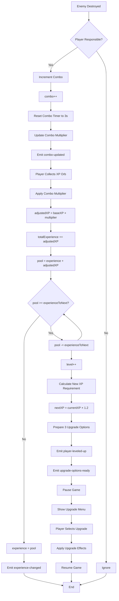
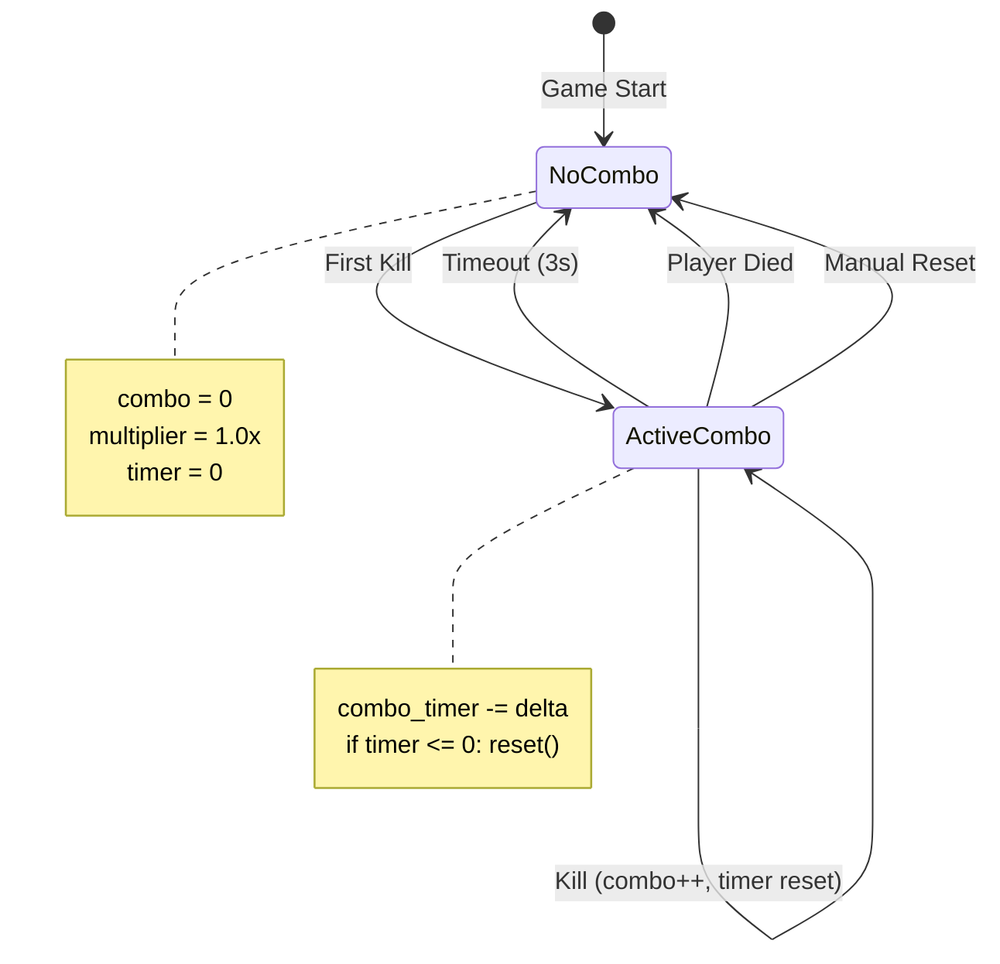
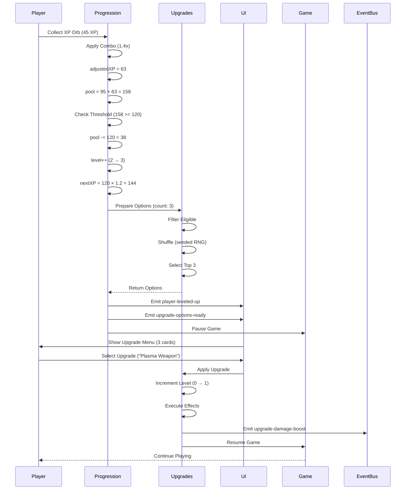
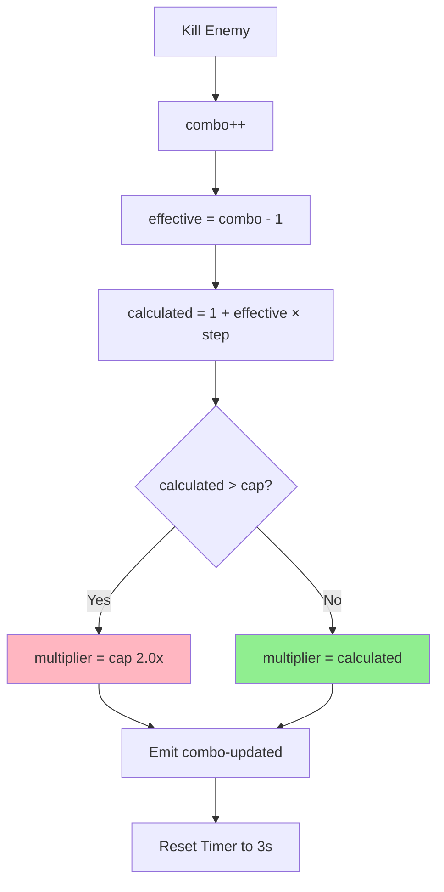
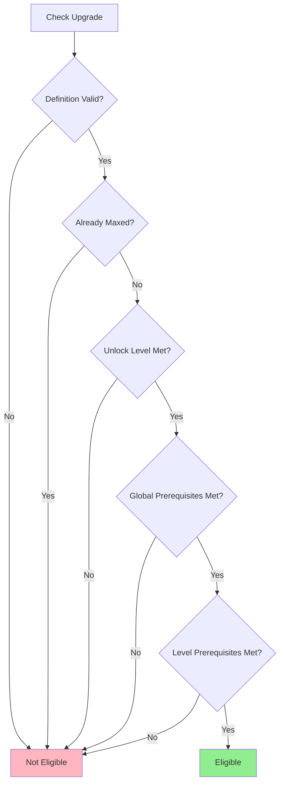

# Progression System (XP, Levels, Combos) - Godot Migration Guide

**Status**: Draft
**Related Systems**: XP Orbs, Enemy System, Upgrade System, UI System
**JavaScript References**: `src/modules/ProgressionSystem.js`, `src/modules/UpgradeSystem.js`
**Last Updated**: 2025-10-30

---

## Table of Contents
1. [Visão Geral do Sistema](#1-visão-geral-do-sistema)
2. [Estrutura de Dados do Sistema](#2-estrutura-de-dados-do-sistema)
3. [XP Collection (Coleta de XP)](#3-xp-collection-coleta-de-xp)
4. [Level-Up System (Sistema de Níveis)](#4-level-up-system-sistema-de-níveis)
5. [Combo System (Sistema de Combos)](#5-combo-system-sistema-de-combos)
6. [Upgrade Selection (Seleção de Upgrades)](#6-upgrade-selection-seleção-de-upgrades)
7. [Serialization (Save/Load State)](#7-serialization-saveload-state)
8. [Implementação Godot: Estrutura de Cena](#8-implementação-godot-estrutura-de-cena)
9. [Tabela de Parâmetros Configuráveis](#9-tabela-de-parâmetros-configuráveis)
10. [Fórmulas Matemáticas](#10-fórmulas-matemáticas)
11. [Diagramas de Fluxo](#11-diagramas-de-fluxo)
12. [Integração com Outros Sistemas](#12-integração-com-outros-sistemas)
13. [Visual Feedback e UI](#13-visual-feedback-e-ui)
14. [Considerações de Performance](#14-considerações-de-performance)
15. [Referências de Código](#15-referências-de-código)

---

## 1. Visão Geral do Sistema

### Conceito
O sistema de progressão gerencia a experiência (XP), níveis e multiplicador de combo do player, recompensando habilidade através de combos baseados em kills consecutivos e fornecendo progressão contínua através de levels e upgrades.

### Três Subsistemas Integrados

#### **XP System**
- Coleta de XP via orbs deixados por inimigos
- Acumulação até threshold (experienceToNext)
- Level-up automático ao atingir threshold
- Suporte a múltiplos level-ups simultâneos

#### **Level System**
- Scaling exponencial de XP requirement (1.2x por nível)
- Cálculo dinâmico de XP necessário para próximo nível
- Recompensas de upgrade a cada level-up
- Preparação de N opções (padrão: 3) via weighted random

#### **Combo System**
- Contador de kills consecutivos (incrementa a cada enemy-destroyed)
- Multiplicador de XP crescente (1.0x → 2.0x)
- Timeout de 3 segundos (reseta sem kills)
- Visual feedback em tempo real (timer circular decrescente)

### Propósito no Gameplay
- **Recompensar Skill**: Combos altos = mais XP = level-ups mais rápidos
- **Progressão Contínua**: Levels fornecem upgrades permanentes
- **Risk/Reward**: Manter combo requer agressividade, mas timeout pune passividade
- **Feedback Loop**: XP → Level → Upgrade → Mais poder → Mais kills → Mais XP

---

## 2. Estrutura de Dados do Sistema

### Campos Principais

Baseado em `ProgressionSystem.js` linhas 18-88:

| Campo | Tipo | Valor Inicial | Descrição |
|-------|------|---------------|-----------|
| **Progression State** |
| `level` | int | 1 | Nível atual do player |
| `experience` | int | 0 | XP acumulado no nível atual (0 a experienceToNext) |
| `experienceToNext` | int | 100 | XP necessário para próximo nível |
| `totalExperience` | int | 0 | XP total coletado desde o início da sessão |
| **Combo State** |
| `currentCombo` | int | 0 | Contador de kills consecutivos |
| `comboTimer` | float | 0.0 | Timer de timeout do combo (decrementa com delta) |
| `comboTimeout` | float | 3.0 | Duração do timeout (configurável) |
| `comboMultiplier` | float | 1.0 | Multiplicador de XP baseado em combo (1.0 a 2.0) |
| `comboMultiplierStep` | float | 0.1 | Incremento por kill |
| `comboMultiplierCap` | float | 2.0 | Cap do multiplicador |
| **Configuration** |
| `levelScaling` | float | 1.2 | Fator de scaling exponencial |
| `upgradeRollCount` | int | 3 | Número de opções de upgrade no level-up |
| **Upgrade State** |
| `appliedUpgrades` | Dictionary | {} | Mapa de upgradeId → level aplicado |
| `pendingUpgradeOptions` | Array | [] | Opções de upgrade disponíveis no level-up atual |

### Mapeamento GDScript

```gdscript
class_name ProgressionSystem
extends Node

# Signals
signal experience_changed(current: int, needed: int, level: int, percentage: float)
signal combo_updated(combo_count: int, multiplier: float, remaining_time: float, timeout: float)
signal combo_broken(previous_combo: int, previous_multiplier: float, reason: String, silent: bool)
signal player_leveled_up(new_level: int, previous_requirement: int, next_requirement: int)
signal upgrade_options_ready(level: int, options: Array, pool_size: int, total_definitions: int)

# Progression state
var level: int = 1
var experience: int = 0
var experience_to_next: int = 100
var total_experience: int = 0

# Combo state
var current_combo: int = 0
var combo_timer: float = 0.0
var combo_timeout: float = 3.0
var combo_multiplier: float = 1.0
var combo_multiplier_step: float = 0.1
var combo_multiplier_cap: float = 2.0

# Configuration
var level_scaling: float = 1.2
var upgrade_roll_count: int = 3

# Upgrade state
var applied_upgrades: Dictionary = {}  # upgrade_id -> level
var pending_upgrade_options: Array = []

# Services (injected via dependency injection or autoload)
var upgrade_manager: UpgradeManager
var xp_orb_manager: XPOrbManager
var player: Player
var ui_manager: UIManager
```

### Observações de Implementação

1. **Integer Math**: Campos de XP usam `int` para evitar floating point drift
2. **Timer Manual**: `comboTimer` decrementa com `delta` em `_process()`
3. **Finite Validation**: Sempre validar `is_finite()` para valores numéricos externos
4. **Signals**: Todos os eventos usam signals (event-driven architecture)
5. **Service References**: Cachear referências de serviços no `_ready()`

---

## 3. XP Collection (Coleta de XP)

### Conceito

Baseado em `ProgressionSystem.js` linhas 287-318:

- Player coleta XP orbs que emitem evento `xp-orb-collected`
- ProgressionSystem escuta evento e chama `collectXP(amount)`
- Aplica combo multiplier ao valor base
- Acumula XP e processa level-ups em loop (pode subir múltiplos níveis de uma vez)
- Emite `experience-changed` e `player-leveled-up` para cada nível ganho

### Algoritmo

1. **Validação**: Verifica se `amount > 0` e `is_finite(amount)`
2. **Aplica Multiplier**: `adjustedValue = round(baseXP × comboMultiplier)`
3. **Acumula Total XP**: `totalExperience += adjustedValue`
4. **Cria Pool**: `pool = experience + adjustedValue`
5. **Loop de Level-Up**:
   - Enquanto `pool >= experienceToNext`:
     - Subtrai `experienceToNext` do pool
     - Incrementa `levelsGained`
     - Chama `applyLevelUp()` e armazena context
6. **Atualiza XP Residual**: `experience = pool`
7. **Emite Eventos**: `experience-changed` + múltiplos `player-leveled-up`

### Pseudocódigo GDScript

```gdscript
func collect_xp(amount: float) -> Dictionary:
    # Validação de entrada
    if not is_finite(amount) or amount <= 0:
        push_warning("ProgressionSystem: Invalid XP amount: %s" % amount)
        return {"gained": 0, "levels": 0}

    # Aplica combo multiplier (mínimo 1.0x)
    var multiplier = max(1.0, combo_multiplier)
    var adjusted_value = max(1, int(round(amount * multiplier)))

    # Acumula XP total
    total_experience += adjusted_value

    # Processa level-ups em loop (suporta múltiplos níveis)
    var pool = experience + adjusted_value
    var levels_gained = 0
    var level_contexts = []

    while pool >= experience_to_next:
        pool -= experience_to_next
        levels_gained += 1
        var context = apply_level_up()
        level_contexts.append(context)

    # Atualiza XP residual
    experience = pool

    # Emite evento de mudança de XP
    emit_experience_changed()

    # Emite eventos de level-up (um por nível ganho)
    for context in level_contexts:
        emit_level_up(context)

    return {
        "gained": adjusted_value,
        "levels": levels_gained,
        "contexts": level_contexts
    }

func emit_experience_changed() -> void:
    var percentage = float(experience) / float(experience_to_next) if experience_to_next > 0 else 0.0
    experience_changed.emit(experience, experience_to_next, level, percentage)
```

### Implementação Godot

**Event Connection:**
```gdscript
func _ready() -> void:
    # Conecta ao evento de coleta de XP orb
    EventBus.xp_orb_collected.connect(_on_xp_orb_collected)

func _on_xp_orb_collected(data: Dictionary) -> void:
    var amount = data.get("value", 0)
    if is_finite(amount) and amount > 0:
        collect_xp(amount)
```

**UI Update:**
- Conectar signal `experience_changed` para atualizar progress bar
- Usar `Tween` para animar fill (duration: 0.3s)
- Exibir label com "Level X" + "XP: current/needed"

**Exemplo de Uso:**
```gdscript
# Orb coletado com valor base 45 XP
# Combo atual: 5 kills (multiplier = 1.4x)
# adjustedValue = round(45 × 1.4) = 63 XP

# Se experience = 95 e experienceToNext = 120:
# pool = 95 + 63 = 158
# 158 >= 120 → level-up (pool = 38, level = 2 → 3)
# 38 < nextXP → para loop
# experience = 38 (residual para próximo nível)
```

---

## 4. Level-Up System (Sistema de Níveis)

### Conceito

Baseado em `ProgressionSystem.js` linhas 338-374:

- Ao atingir XP threshold, incrementa `level`
- Calcula novo XP requirement usando scaling exponencial (1.2x)
- Prepara N opções de upgrade (padrão: 3) via weighted random
- Pausa o jogo e exibe menu de seleção de upgrade
- Retorna context com level, requirements e upgrade options

### Fórmula de Scaling

**Fórmula Recursiva:**
```
XP(n+1) = XP(n) × levelScaling

onde:
XP(1) = PROGRESSION_INITIAL_XP_REQUIREMENT (100)
levelScaling = PROGRESSION_LEVEL_SCALING (1.2)
```

**Exemplo de Progressão (levelScaling = 1.2):**

| Level | XP Necessário | XP Acumulado | Incremento |
|-------|---------------|--------------|------------|
| 1 → 2 | 100 | 100 | - |
| 2 → 3 | 120 | 220 | +20 |
| 3 → 4 | 144 | 364 | +24 |
| 4 → 5 | 172 | 536 | +28 |
| 5 → 6 | 206 | 742 | +34 |
| 10 → 11 | 516 | 2577 | +85 |
| 15 → 16 | 1270 | 8064 | +212 |
| 20 → 21 | 3211 | 24154 | +535 |

### Pseudocódigo GDScript

```gdscript
func apply_level_up() -> Dictionary:
    # Incrementa level
    level += 1

    # Armazena requirement anterior
    var previous_requirement = experience_to_next

    # Calcula novo requirement (scaling exponencial)
    experience_to_next = int(floor(experience_to_next * level_scaling))

    # Prepara opções de upgrade
    var upgrade_context = prepare_upgrade_options(upgrade_roll_count)

    # Retorna context completo
    return {
        "level": level,
        "previous_requirement": previous_requirement,
        "next_requirement": experience_to_next,
        "options": upgrade_context.options,
        "pool_size": upgrade_context.pool_size,
        "total_definitions": upgrade_context.total_definitions
    }

func emit_level_up(context: Dictionary) -> void:
    # Emite evento de level-up
    player_leveled_up.emit(
        context.level,
        context.previous_requirement,
        context.next_requirement
    )

    # Emite opções de upgrade
    upgrade_options_ready.emit(
        context.level,
        context.options,
        context.pool_size,
        context.total_definitions
    )

    # Pausa o jogo para seleção de upgrade
    get_tree().paused = true
```

### Implementação Godot

**Pause Logic:**
```gdscript
# Pausar jogo ao exibir upgrade menu
func show_upgrade_menu(options: Array) -> void:
    upgrade_menu.show_options(options)
    get_tree().paused = true

# Resumir jogo após seleção
func _on_upgrade_selected(upgrade_id: String) -> void:
    upgrade_manager.apply_upgrade(upgrade_id)
    get_tree().paused = false
```

**Level-Up Animation:**
- Screen flash branco (alpha: 0.3, duration: 0.2s)
- Text "LEVEL UP!" com scale animation (1.0 → 1.5 → 1.0)
- Burst de partículas douradas ao redor do player
- SFX com pitch 1.2

---

## 5. Combo System (Sistema de Combos)

### Conceito

Baseado em `ProgressionSystem.js` linhas 202-272, 320-336:

- Cada kill incrementa combo counter
- Combo aumenta multiplicador de XP linearmente (step: 0.1, cap: 2.0)
- Timer de timeout (3s) reseta se player não matar inimigos
- Visual feedback: combo count + multiplier + timer circular decrescente

### 5.1. Increment Combo

**Algoritmo:**
1. Incrementa `currentCombo` (floor + 1)
2. Reseta `comboTimer` para `comboTimeout` (3s)
3. Recalcula `comboMultiplier`
4. Emite `combo-updated`

**Pseudocódigo GDScript:**
```gdscript
func increment_combo(context: Dictionary = {}) -> void:
    # Incrementa combo (sempre inteiro)
    current_combo = max(0, int(floor(current_combo))) + 1

    # Reseta timer para timeout configurado
    combo_timer = combo_timeout

    # Recalcula multiplier
    update_combo_multiplier()

    # Emite evento de atualização
    emit_combo_updated({
        "reason": context.get("reason", "combo-increment"),
        "enemy": context.get("enemy"),
        "payload": context.get("payload")
    })

func update_combo_multiplier() -> void:
    var step = max(0.0, combo_multiplier_step)
    var cap = max(1.0, combo_multiplier_cap)

    # Fórmula: 1 + (combo - 1) × step
    var effective_combo = max(0, int(floor(current_combo)) - 1)
    var calculated = 1.0 + float(effective_combo) * step

    # Aplica cap
    combo_multiplier = min(cap, max(1.0, calculated))

func emit_combo_updated(extra: Dictionary = {}) -> void:
    combo_updated.emit(
        current_combo,
        combo_multiplier,
        combo_timer,
        combo_timeout
    )
```

**Fórmula de Multiplier:**
```
multiplier = 1 + (combo - 1) × step

Exemplo (step = 0.1, cap = 2.0):
Combo 1:  1 + (1-1) × 0.1 = 1.0x
Combo 2:  1 + (2-1) × 0.1 = 1.1x
Combo 5:  1 + (5-1) × 0.1 = 1.4x
Combo 10: 1 + (10-1) × 0.1 = 1.9x
Combo 11+: 1 + (11-1) × 0.1 = 2.0x (capped)
```

### 5.2. Combo Timeout

**Algoritmo:**
1. A cada frame, decrementa `comboTimer` por `delta`
2. Se `comboTimer <= 0` e `currentCombo > 0`:
   - Chama `resetCombo()`
   - Emite `combo-broken`

**Pseudocódigo GDScript:**
```gdscript
func _process(delta: float) -> void:
    update_combo_timer(delta)

func update_combo_timer(delta: float) -> void:
    if current_combo <= 0 or combo_timer <= 0:
        return

    var previous_timer = combo_timer
    combo_timer = max(0.0, combo_timer - delta)

    # Emite update para UI (timer visual)
    if combo_timer > 0:
        combo_updated.emit(current_combo, combo_multiplier, combo_timer, combo_timeout)

    # Timeout atingido
    if previous_timer > 0 and combo_timer <= 0:
        reset_combo({"reason": "timeout", "force": true})

func reset_combo(options: Dictionary = {}) -> void:
    var silent = options.get("silent", false)
    var reason = options.get("reason", "reset")
    var force = options.get("force", false)
    var emit_event = options.get("emit", true)

    # Armazena valores anteriores
    var previous_combo = max(0, int(floor(current_combo)))
    var previous_multiplier = max(1.0, combo_multiplier)
    var had_combo = previous_combo > 0 or previous_multiplier > 1.0 or combo_timer > 0

    # Reseta estado
    current_combo = 0
    combo_timer = 0.0
    combo_multiplier = 1.0

    # Emite evento se necessário
    if not emit_event:
        return

    if not force and not had_combo:
        return

    combo_broken.emit(
        previous_combo,
        previous_multiplier,
        reason,
        silent
    )
```

**Implementação Godot (Alternativa com Timer Node):**
```gdscript
# Nodes
@onready var combo_timer_node: Timer = $ComboTimer

func _ready() -> void:
    combo_timer_node.wait_time = combo_timeout
    combo_timer_node.one_shot = true
    combo_timer_node.timeout.connect(_on_combo_timeout)

func increment_combo(context: Dictionary = {}) -> void:
    current_combo += 1
    combo_timer_node.start()  # Reseta timer automaticamente
    update_combo_multiplier()
    emit_combo_updated(context)

func _on_combo_timeout() -> void:
    reset_combo({"reason": "timeout", "force": true})
```

### 5.3. Enemy Destroyed Handler

**Algoritmo:**
1. Escuta evento `enemy-destroyed`
2. Valida se player é responsável pela morte (verifica `cause`, `source.type`, `source.owner`)
3. Se sim, chama `incrementCombo()`

**Pseudocódigo GDScript:**
```gdscript
func _ready() -> void:
    EventBus.enemy_destroyed.connect(_on_enemy_destroyed)

func _on_enemy_destroyed(data: Dictionary) -> void:
    if not is_player_responsible_for_enemy_death(data):
        return

    increment_combo({
        "enemy": data.get("enemy"),
        "payload": data,
        "reason": "enemy-destroyed"
    })

func is_player_responsible_for_enemy_death(data: Dictionary) -> bool:
    if not data or data.is_empty():
        return false

    # Extrai causa
    var cause = ""
    if data.has("cause") and data.cause is String:
        cause = data.cause.to_lower()
    elif data.has("reason") and data.reason is String:
        cause = data.reason.to_lower()
    elif data.has("source") and data.source is Dictionary and data.source.has("cause"):
        cause = data.source.cause.to_lower()

    if cause.is_empty():
        return false

    # Valida causa
    if cause == "damage":
        return true

    if cause.begins_with("player-") or cause == "player":
        return true

    # Valida source
    if data.has("source") and data.source is Dictionary:
        var source_type = data.source.get("type", "").to_lower()
        if source_type == "player":
            return true

        var source_owner = data.source.get("owner", "").to_lower()
        if source_owner == "player":
            return true

    return false
```

---

## 6. Upgrade Selection (Seleção de Upgrades)

### Conceito

Baseado em `UpgradeSystem.js` linhas 95-143, 150-187:

- Ao subir de nível, sistema filtra upgrades elegíveis
- Elegível = não maxado + prerequisites atendidos + unlock level atingido
- Shuffles lista com seeded RNG (determinístico)
- Retorna top N opções (padrão: 3)
- Player escolhe 1 upgrade, sistema aplica effects

### 6.1. Prepare Upgrade Options

**Algoritmo:**
1. Filtra `upgradeDefinitions` usando `isUpgradeSelectable()`
2. Se pool vazio, retorna array vazio
3. Shuffles pool usando Fisher-Yates com seeded RNG
4. Seleciona top N (padrão: 3)
5. Mapeia para `buildUpgradeOption()` (adiciona metadata)
6. Armazena em `pendingUpgradeOptions`
7. Retorna `{options, poolSize, totalDefinitions}`

**Pseudocódigo GDScript:**
```gdscript
func prepare_upgrade_options(count: int = 3) -> Dictionary:
    # Filtra elegíveis
    var eligible = []
    for definition in upgrade_definitions:
        if is_upgrade_selectable(definition):
            eligible.append(definition)

    var requested = max(0, int(count))
    var capped_count = min(requested, eligible.size())

    if eligible.is_empty() or capped_count == 0:
        pending_upgrade_options = []
        return {
            "options": [],
            "pool_size": 0,
            "total_definitions": upgrade_definitions.size()
        }

    # Shuffles com seeded RNG (Fisher-Yates)
    var rng = random_service.get_fork("upgrades.selection")
    var pool = eligible.duplicate()

    for i in range(pool.size() - 1, 0, -1):
        var swap_index = rng.randi_range(0, i)
        var temp = pool[i]
        pool[i] = pool[swap_index]
        pool[swap_index] = temp

    # Seleciona top N
    var selection = pool.slice(0, capped_count)
    var options = []
    for definition in selection:
        var option = build_upgrade_option(definition)
        if option:
            options.append(option)

    pending_upgrade_options = options

    return {
        "options": options,
        "pool_size": eligible.size(),
        "total_definitions": upgrade_definitions.size()
    }

func build_upgrade_option(definition: Dictionary) -> Dictionary:
    var current_level = get_upgrade_count(definition.id)
    var next_level = current_level + 1
    var level_definition = definition.levels[current_level] if current_level < definition.levels.size() else null

    if not level_definition:
        return {}

    return {
        "id": definition.id,
        "name": definition.name,
        "description": definition.description,
        "icon": definition.icon,
        "current_level": current_level,
        "next_level": next_level,
        "max_level": definition.levels.size(),
        "rank": level_definition.rank,
        "effects": level_definition.effects,
        "highlights": level_definition.get("highlights", [])
    }
```

### 6.2. Is Upgrade Selectable

**Algoritmo:**
1. Valida se definition é válido
2. Verifica se upgrade já está maxado (`currentLevel >= maxLevel`)
3. Verifica se player atingiu `unlockLevel`
4. Valida prerequisites globais (base requirements)
5. Valida prerequisites do próximo nível (level requirements)
6. Retorna `true` se todas as validações passarem

**Pseudocódigo GDScript:**
```gdscript
func is_upgrade_selectable(definition: Dictionary) -> bool:
    if not definition or definition.is_empty():
        return false

    var levels = definition.get("levels", [])
    var max_level = levels.size()
    var current_level = get_upgrade_count(definition.id)

    # Verifica se maxado
    if max_level > 0 and current_level >= max_level:
        return false

    # Verifica unlock level
    if definition.has("unlock_level") and is_finite(definition.unlock_level):
        if level < definition.unlock_level:
            return false

    # Valida prerequisites globais
    var prerequisites = collect_raw_prerequisites(definition)
    for requirement in prerequisites:
        if not evaluate_prerequisite(requirement):
            return false

    # Valida prerequisites do próximo nível
    var level_requirements = collect_level_prerequisites(definition, current_level)
    for requirement in level_requirements:
        if not evaluate_prerequisite(requirement):
            return false

    return true

func evaluate_prerequisite(prerequisite: Dictionary) -> bool:
    if not prerequisite or prerequisite.is_empty():
        return true

    if prerequisite.type == "player-level":
        return level >= prerequisite.get("level", 1)

    if prerequisite.type == "upgrade":
        var required_level = prerequisite.get("level", 1)
        return get_upgrade_count(prerequisite.id) >= required_level

    return true

func get_upgrade_count(upgrade_id: String) -> int:
    return applied_upgrades.get(upgrade_id, 0)

func collect_raw_prerequisites(definition: Dictionary) -> Array:
    var prerequisites = []
    if definition.has("prerequisites") and definition.prerequisites is Array:
        prerequisites.append_array(definition.prerequisites)
    return prerequisites

func collect_level_prerequisites(definition: Dictionary, current_level: int) -> Array:
    var prerequisites = []
    var levels = definition.get("levels", [])
    if current_level < levels.size():
        var level_definition = levels[current_level]
        if level_definition.has("prerequisites") and level_definition.prerequisites is Array:
            prerequisites.append_array(level_definition.prerequisites)
    return prerequisites
```

### Tipos de Prerequisites

**1. Player Level**
```gdscript
{
    "type": "player-level",
    "level": 3
}
# Requer player level 3+
```

**2. Upgrade**
```gdscript
{
    "type": "upgrade",
    "id": "multishot",
    "level": 1
}
# Requer outro upgrade no nível especificado
```

### Exemplo: Targeting Suite Tier 3

```gdscript
{
    "id": "targeting_suite",
    "name": "Targeting Suite",
    "unlock_level": 3,
    "levels": [
        {
            "rank": 1,
            "name": "Adaptive Acquisition",
            "effects": [...]
        },
        {
            "rank": 2,
            "name": "Dynamic Prediction",
            "effects": [...]
        },
        {
            "rank": 3,
            "name": "Coordinated Locks",
            "prerequisites": [
                {"type": "upgrade", "id": "multishot", "level": 1}
            ],
            "effects": [...]
        }
    ]
}
```

**Validação:**
- Tier 1: Disponível no level 3+ (unlock_level)
- Tier 2: Disponível após aplicar Tier 1
- Tier 3: Disponível após aplicar Tier 2 **E** ter Multishot nível 1+

---

## 7. Serialization (Save/Load State)

### Conceito

Baseado em `ProgressionSystem.js` linhas 449-595:

- Sistema suporta save/load completo de estado para retry system
- Serializa: level, XP, totalXP, appliedUpgrades, comboState
- Deserializa: Restaura estado exato, emite eventos para sincronizar UI
- Usado por GameSessionService para snapshot/restore em retry

### Pseudocódigo GDScript

```gdscript
func serialize() -> Dictionary:
    return {
        "level": level,
        "experience": experience,
        "experience_to_next": experience_to_next,
        "total_experience": total_experience,
        "applied_upgrades": applied_upgrades.duplicate(),
        "combo_state": {
            "combo_count": current_combo,
            "combo_timer": combo_timer,
            "combo_timeout": combo_timeout,
            "combo_multiplier": combo_multiplier
        }
    }

func deserialize(data: Dictionary, options: Dictionary = {}) -> void:
    if not data or data.is_empty():
        push_warning("ProgressionSystem: Cannot deserialize empty data")
        return

    # Restaura progression state
    level = data.get("level", 1)
    experience = data.get("experience", 0)
    experience_to_next = data.get("experience_to_next", 100)
    total_experience = data.get("total_experience", 0)

    # Restaura upgrades
    var upgrades = data.get("applied_upgrades", {})
    applied_upgrades = upgrades.duplicate() if upgrades is Dictionary else {}
    pending_upgrade_options = []

    # Restaura combo state
    var combo_data = data.get("combo_state", {})
    if combo_data and combo_data is Dictionary:
        current_combo = max(0, int(combo_data.get("combo_count", 0)))
        combo_timer = max(0.0, combo_data.get("combo_timer", 0.0))
        combo_timeout = combo_data.get("combo_timeout", 3.0)

        # Restaura multiplier ou recalcula
        if current_combo > 0 and combo_timer > 0:
            var restored_multiplier = combo_data.get("combo_multiplier", 1.0)
            if is_finite(restored_multiplier) and restored_multiplier >= 1.0:
                combo_multiplier = min(max(1.0, restored_multiplier), combo_multiplier_cap)
            else:
                update_combo_multiplier()
        else:
            combo_timer = 0.0
            combo_multiplier = 1.0
            current_combo = 0
    else:
        # Reset combo se dados inválidos
        current_combo = 0
        combo_timer = 0.0
        combo_multiplier = 1.0

    # Emite eventos se não suprimido
    var suppress_events = options.get("suppress_events", false)
    if not suppress_events:
        emit_experience_changed()

        if current_combo > 0:
            emit_combo_updated({"reason": "deserialize", "silent": true})
        else:
            reset_combo({"reason": "deserialize", "silent": true, "force": true})

func export_state() -> Dictionary:
    return serialize()

func import_state(snapshot: Dictionary) -> bool:
    deserialize(snapshot)
    return true
```

### Implementação Godot

**Save to Disk (opcional):**
```gdscript
func save_to_file(file_path: String) -> bool:
    var config = ConfigFile.new()
    var data = serialize()

    for key in data.keys():
        config.set_value("progression", key, data[key])

    var error = config.save(file_path)
    return error == OK

func load_from_file(file_path: String) -> bool:
    var config = ConfigFile.new()
    var error = config.load(file_path)

    if error != OK:
        return false

    var data = {}
    for key in config.get_section_keys("progression"):
        data[key] = config.get_value("progression", key)

    deserialize(data)
    return true
```

**Retry System Integration:**
```gdscript
# GameSessionManager.gd
func create_checkpoint() -> void:
    checkpoint_data["progression"] = progression_system.export_state()

func restore_checkpoint() -> void:
    if checkpoint_data.has("progression"):
        progression_system.import_state(checkpoint_data["progression"])
```

---

## 8. Implementação Godot: Estrutura de Cena

### Scene: ProgressionSystem.tscn

```
ProgressionSystem (Node)
├─ ComboTimer (Timer)
│  ├─ wait_time: 3.0
│  ├─ one_shot: true
│  └─ autostart: false
└─ (script: ProgressionSystem.gd)
```

### Script: ProgressionSystem.gd (Completo)

```gdscript
class_name ProgressionSystem
extends Node

## Sistema de progressão (XP, níveis, combos)
##
## Gerencia experiência, level-ups, combo multipliers e seleção de upgrades.
## Baseado em ProgressionSystem.js do projeto JavaScript.

# Signals
signal experience_changed(current: int, needed: int, level: int, percentage: float)
signal combo_updated(combo_count: int, multiplier: float, remaining_time: float, timeout: float)
signal combo_broken(previous_combo: int, previous_multiplier: float, reason: String, silent: bool)
signal player_leveled_up(new_level: int, previous_requirement: int, next_requirement: int)
signal upgrade_options_ready(level: int, options: Array, pool_size: int, total_definitions: int)

# Nodes
@onready var combo_timer_node: Timer = $ComboTimer

# Progression state
var level: int = 1
var experience: int = 0
var experience_to_next: int = 100
var total_experience: int = 0

# Combo state
var current_combo: int = 0
var combo_timer: float = 0.0
var combo_timeout: float = 3.0
var combo_multiplier: float = 1.0
var combo_multiplier_step: float = 0.1
var combo_multiplier_cap: float = 2.0

# Configuration
var level_scaling: float = 1.2
var upgrade_roll_count: int = 3

# Upgrade state
var applied_upgrades: Dictionary = {}  # upgrade_id -> level
var pending_upgrade_options: Array = []

# Services (injected or autoload)
var upgrade_manager: UpgradeManager
var upgrade_definitions: Array = []
var random_service: RandomService

func _ready() -> void:
    initialize()
    setup_event_listeners()

    if combo_timer_node:
        combo_timer_node.timeout.connect(_on_combo_timeout)

func initialize() -> void:
    # Load constants from GameConstants autoload
    level = GameConstants.PROGRESSION_INITIAL_LEVEL
    experience = 0
    experience_to_next = GameConstants.PROGRESSION_INITIAL_XP_REQUIREMENT
    total_experience = 0

    current_combo = 0
    combo_timer = 0.0
    combo_timeout = GameConstants.PROGRESSION_COMBO_TIMEOUT
    combo_multiplier = 1.0
    combo_multiplier_step = GameConstants.PROGRESSION_COMBO_MULTIPLIER_STEP
    combo_multiplier_cap = GameConstants.PROGRESSION_COMBO_MULTIPLIER_CAP

    level_scaling = GameConstants.PROGRESSION_LEVEL_SCALING
    upgrade_roll_count = GameConstants.PROGRESSION_UPGRADE_ROLL_COUNT

    applied_upgrades = {}
    pending_upgrade_options = []

    # Resolve service dependencies
    upgrade_manager = get_node("/root/UpgradeManager") if has_node("/root/UpgradeManager") else null
    random_service = get_node("/root/RandomService") if has_node("/root/RandomService") else null

func setup_event_listeners() -> void:
    EventBus.xp_orb_collected.connect(_on_xp_orb_collected)
    EventBus.enemy_destroyed.connect(_on_enemy_destroyed)
    EventBus.progression_reset.connect(_on_progression_reset)
    EventBus.player_reset.connect(_on_player_reset)
    EventBus.player_died.connect(_on_player_died)

func _on_xp_orb_collected(data: Dictionary) -> void:
    var amount = data.get("value", 0)
    if is_finite(amount) and amount > 0:
        collect_xp(amount)

func _on_enemy_destroyed(data: Dictionary) -> void:
    if is_player_responsible_for_enemy_death(data):
        increment_combo({
            "enemy": data.get("enemy"),
            "payload": data,
            "reason": "enemy-destroyed"
        })

func _on_combo_timeout() -> void:
    reset_combo({"reason": "timeout", "force": true})

func _on_progression_reset() -> void:
    reset_combo({"reason": "progression-reset", "silent": true, "force": true})

func _on_player_reset() -> void:
    reset_combo({"reason": "player-reset", "silent": true, "force": true})

func _on_player_died() -> void:
    reset_combo({"reason": "player-died", "silent": false, "force": true})

func _process(delta: float) -> void:
    update_combo_timer(delta)

# XP Collection (Section 3)
func collect_xp(amount: float) -> Dictionary:
    if not is_finite(amount) or amount <= 0:
        push_warning("ProgressionSystem: Invalid XP amount: %s" % amount)
        return {"gained": 0, "levels": 0}

    var multiplier = max(1.0, combo_multiplier)
    var adjusted_value = max(1, int(round(amount * multiplier)))

    total_experience += adjusted_value

    var pool = experience + adjusted_value
    var levels_gained = 0
    var level_contexts = []

    while pool >= experience_to_next:
        pool -= experience_to_next
        levels_gained += 1
        var context = apply_level_up()
        level_contexts.append(context)

    experience = pool
    emit_experience_changed()

    for context in level_contexts:
        emit_level_up(context)

    return {
        "gained": adjusted_value,
        "levels": levels_gained,
        "contexts": level_contexts
    }

func emit_experience_changed() -> void:
    var percentage = float(experience) / float(experience_to_next) if experience_to_next > 0 else 0.0
    experience_changed.emit(experience, experience_to_next, level, percentage)

# Level-Up System (Section 4)
func apply_level_up() -> Dictionary:
    level += 1
    var previous_requirement = experience_to_next
    experience_to_next = int(floor(experience_to_next * level_scaling))

    var upgrade_context = prepare_upgrade_options(upgrade_roll_count)

    return {
        "level": level,
        "previous_requirement": previous_requirement,
        "next_requirement": experience_to_next,
        "options": upgrade_context.options,
        "pool_size": upgrade_context.pool_size,
        "total_definitions": upgrade_context.total_definitions
    }

func emit_level_up(context: Dictionary) -> void:
    player_leveled_up.emit(
        context.level,
        context.previous_requirement,
        context.next_requirement
    )

    upgrade_options_ready.emit(
        context.level,
        context.options,
        context.pool_size,
        context.total_definitions
    )

    get_tree().paused = true

# Combo System (Section 5)
func increment_combo(context: Dictionary = {}) -> void:
    current_combo = max(0, int(floor(current_combo))) + 1

    if combo_timer_node:
        combo_timer_node.start()
    else:
        combo_timer = combo_timeout

    update_combo_multiplier()
    emit_combo_updated(context)

func update_combo_multiplier() -> void:
    var step = max(0.0, combo_multiplier_step)
    var cap = max(1.0, combo_multiplier_cap)

    var effective_combo = max(0, int(floor(current_combo)) - 1)
    var calculated = 1.0 + float(effective_combo) * step

    combo_multiplier = min(cap, max(1.0, calculated))

func emit_combo_updated(extra: Dictionary = {}) -> void:
    combo_updated.emit(
        current_combo,
        combo_multiplier,
        combo_timer,
        combo_timeout
    )

func update_combo_timer(delta: float) -> void:
    if current_combo <= 0 or combo_timer <= 0:
        return

    var previous_timer = combo_timer
    combo_timer = max(0.0, combo_timer - delta)

    if combo_timer > 0:
        combo_updated.emit(current_combo, combo_multiplier, combo_timer, combo_timeout)

    if previous_timer > 0 and combo_timer <= 0:
        reset_combo({"reason": "timeout", "force": true})

func reset_combo(options: Dictionary = {}) -> void:
    var silent = options.get("silent", false)
    var reason = options.get("reason", "reset")
    var force = options.get("force", false)
    var emit_event = options.get("emit", true)

    var previous_combo = max(0, int(floor(current_combo)))
    var previous_multiplier = max(1.0, combo_multiplier)
    var had_combo = previous_combo > 0 or previous_multiplier > 1.0 or combo_timer > 0

    current_combo = 0
    combo_timer = 0.0
    combo_multiplier = 1.0

    if combo_timer_node:
        combo_timer_node.stop()

    if not emit_event:
        return

    if not force and not had_combo:
        return

    combo_broken.emit(
        previous_combo,
        previous_multiplier,
        reason,
        silent
    )

func is_player_responsible_for_enemy_death(data: Dictionary) -> bool:
    if not data or data.is_empty():
        return false

    var cause = ""
    if data.has("cause") and data.cause is String:
        cause = data.cause.to_lower()
    elif data.has("reason") and data.reason is String:
        cause = data.reason.to_lower()
    elif data.has("source") and data.source is Dictionary and data.source.has("cause"):
        cause = data.source.cause.to_lower()

    if cause.is_empty():
        return false

    if cause == "damage":
        return true

    if cause.begins_with("player-") or cause == "player":
        return true

    if data.has("source") and data.source is Dictionary:
        var source_type = data.source.get("type", "").to_lower()
        if source_type == "player":
            return true

        var source_owner = data.source.get("owner", "").to_lower()
        if source_owner == "player":
            return true

    return false

# Upgrade Selection (Section 6)
func prepare_upgrade_options(count: int = 3) -> Dictionary:
    var eligible = []
    for definition in upgrade_definitions:
        if is_upgrade_selectable(definition):
            eligible.append(definition)

    var requested = max(0, int(count))
    var capped_count = min(requested, eligible.size())

    if eligible.is_empty() or capped_count == 0:
        pending_upgrade_options = []
        return {
            "options": [],
            "pool_size": 0,
            "total_definitions": upgrade_definitions.size()
        }

    var pool = eligible.duplicate()

    if random_service:
        var rng = random_service.get_fork("upgrades.selection")
        for i in range(pool.size() - 1, 0, -1):
            var swap_index = rng.randi_range(0, i)
            var temp = pool[i]
            pool[i] = pool[swap_index]
            pool[swap_index] = temp

    var selection = pool.slice(0, capped_count)
    var options = []
    for definition in selection:
        var option = build_upgrade_option(definition)
        if option and not option.is_empty():
            options.append(option)

    pending_upgrade_options = options

    return {
        "options": options,
        "pool_size": eligible.size(),
        "total_definitions": upgrade_definitions.size()
    }

func is_upgrade_selectable(definition: Dictionary) -> bool:
    if not definition or definition.is_empty():
        return false

    var levels = definition.get("levels", [])
    var max_level = levels.size()
    var current_level = get_upgrade_count(definition.id)

    if max_level > 0 and current_level >= max_level:
        return false

    if definition.has("unlock_level") and is_finite(definition.unlock_level):
        if level < definition.unlock_level:
            return false

    var prerequisites = collect_raw_prerequisites(definition)
    for requirement in prerequisites:
        if not evaluate_prerequisite(requirement):
            return false

    var level_requirements = collect_level_prerequisites(definition, current_level)
    for requirement in level_requirements:
        if not evaluate_prerequisite(requirement):
            return false

    return true

func evaluate_prerequisite(prerequisite: Dictionary) -> bool:
    if not prerequisite or prerequisite.is_empty():
        return true

    if prerequisite.type == "player-level":
        return level >= prerequisite.get("level", 1)

    if prerequisite.type == "upgrade":
        var required_level = prerequisite.get("level", 1)
        return get_upgrade_count(prerequisite.id) >= required_level

    return true

func get_upgrade_count(upgrade_id: String) -> int:
    return applied_upgrades.get(upgrade_id, 0)

func collect_raw_prerequisites(definition: Dictionary) -> Array:
    var prerequisites = []
    if definition.has("prerequisites") and definition.prerequisites is Array:
        prerequisites.append_array(definition.prerequisites)
    return prerequisites

func collect_level_prerequisites(definition: Dictionary, current_level: int) -> Array:
    var prerequisites = []
    var levels = definition.get("levels", [])
    if current_level < levels.size():
        var level_definition = levels[current_level]
        if level_definition.has("prerequisites") and level_definition.prerequisites is Array:
            prerequisites.append_array(level_definition.prerequisites)
    return prerequisites

func build_upgrade_option(definition: Dictionary) -> Dictionary:
    var current_level = get_upgrade_count(definition.id)
    var next_level = current_level + 1
    var level_definition = definition.levels[current_level] if current_level < definition.levels.size() else null

    if not level_definition:
        return {}

    return {
        "id": definition.id,
        "name": definition.name,
        "description": definition.description,
        "icon": definition.icon,
        "current_level": current_level,
        "next_level": next_level,
        "max_level": definition.levels.size(),
        "rank": level_definition.rank,
        "effects": level_definition.effects,
        "highlights": level_definition.get("highlights", [])
    }

# Serialization (Section 7)
func serialize() -> Dictionary:
    return {
        "level": level,
        "experience": experience,
        "experience_to_next": experience_to_next,
        "total_experience": total_experience,
        "applied_upgrades": applied_upgrades.duplicate(),
        "combo_state": {
            "combo_count": current_combo,
            "combo_timer": combo_timer,
            "combo_timeout": combo_timeout,
            "combo_multiplier": combo_multiplier
        }
    }

func deserialize(data: Dictionary, options: Dictionary = {}) -> void:
    if not data or data.is_empty():
        push_warning("ProgressionSystem: Cannot deserialize empty data")
        return

    level = data.get("level", 1)
    experience = data.get("experience", 0)
    experience_to_next = data.get("experience_to_next", 100)
    total_experience = data.get("total_experience", 0)

    var upgrades = data.get("applied_upgrades", {})
    applied_upgrades = upgrades.duplicate() if upgrades is Dictionary else {}
    pending_upgrade_options = []

    var combo_data = data.get("combo_state", {})
    if combo_data and combo_data is Dictionary:
        current_combo = max(0, int(combo_data.get("combo_count", 0)))
        combo_timer = max(0.0, combo_data.get("combo_timer", 0.0))
        combo_timeout = combo_data.get("combo_timeout", 3.0)

        if current_combo > 0 and combo_timer > 0:
            var restored_multiplier = combo_data.get("combo_multiplier", 1.0)
            if is_finite(restored_multiplier) and restored_multiplier >= 1.0:
                combo_multiplier = min(max(1.0, restored_multiplier), combo_multiplier_cap)
            else:
                update_combo_multiplier()
        else:
            combo_timer = 0.0
            combo_multiplier = 1.0
            current_combo = 0
    else:
        current_combo = 0
        combo_timer = 0.0
        combo_multiplier = 1.0

    var suppress_events = options.get("suppress_events", false)
    if not suppress_events:
        emit_experience_changed()

        if current_combo > 0:
            emit_combo_updated({"reason": "deserialize", "silent": true})
        else:
            reset_combo({"reason": "deserialize", "silent": true, "force": true})

func export_state() -> Dictionary:
    return serialize()

func import_state(snapshot: Dictionary) -> bool:
    deserialize(snapshot)
    return true
```

---

## 9. Tabela de Parâmetros Configuráveis

| Parâmetro | Valor Padrão | Descrição | Arquivo Origem |
|-----------|--------------|-----------|----------------|
| **Progression** |
| `PROGRESSION_INITIAL_LEVEL` | 1 | Nível inicial do player | `GameConstants.js:56` |
| `PROGRESSION_INITIAL_XP_REQUIREMENT` | 100 | XP necessário para level 2 | `GameConstants.js:57` |
| `PROGRESSION_LEVEL_SCALING` | 1.2 | Fator de scaling exponencial | `GameConstants.js:58` |
| `PROGRESSION_UPGRADE_ROLL_COUNT` | 3 | Número de opções de upgrade | `GameConstants.js:59` |
| `PROGRESSION_UPGRADE_FALLBACK_COUNT` | 3 | Fallback se roll count inválido | `GameConstants.js:60` |
| **Combo System** |
| `PROGRESSION_COMBO_TIMEOUT` | 3.0 | Timeout do combo (segundos) | `GameConstants.js:61` |
| `PROGRESSION_COMBO_MULTIPLIER_STEP` | 0.1 | Incremento por kill | `GameConstants.js:62` |
| `PROGRESSION_COMBO_MULTIPLIER_CAP` | 2.0 | Cap do multiplicador | `GameConstants.js:63` |

### Implementação em Godot

**GameConstants.gd (autoload):**
```gdscript
extends Node

# Progression
const PROGRESSION_INITIAL_LEVEL = 1
const PROGRESSION_INITIAL_XP_REQUIREMENT = 100
const PROGRESSION_LEVEL_SCALING = 1.2
const PROGRESSION_UPGRADE_ROLL_COUNT = 3
const PROGRESSION_UPGRADE_FALLBACK_COUNT = 3

# Combo System
const PROGRESSION_COMBO_TIMEOUT = 3.0
const PROGRESSION_COMBO_MULTIPLIER_STEP = 0.1
const PROGRESSION_COMBO_MULTIPLIER_CAP = 2.0
```

**Nota sobre Level Scaling:**
- O código JavaScript atual usa **1.2x** (`GameConstants.js:58`)
- Valor mais agressivo (1.3x) resultaria em progressão mais rápida
- Recomendação: Testar ambos valores durante balancing

---

## 10. Fórmulas Matemáticas

### 10.1. XP Requirement Scaling (Exponencial)

**Fórmula Recursiva:**
```
XP(n+1) = XP(n) × levelScaling

onde:
XP(1) = PROGRESSION_INITIAL_XP_REQUIREMENT (100)
levelScaling = PROGRESSION_LEVEL_SCALING (1.2)
```

**Fórmula Fechada:**
```
XP(n) = XP(1) × levelScaling^(n-1)

Exemplo:
XP(10) = 100 × 1.2^9 = 100 × 5.16 = 516 XP
XP(20) = 100 × 1.2^19 = 100 × 32.11 = 3211 XP
```

**Tabela de Progressão (levelScaling = 1.2):**

| Level | XP Necessário | XP Acumulado | Incremento |
|-------|---------------|--------------|------------|
| 1 → 2 | 100 | 100 | - |
| 2 → 3 | 120 | 220 | +20 (20%) |
| 3 → 4 | 144 | 364 | +24 (20%) |
| 4 → 5 | 172 | 536 | +28 (19.4%) |
| 5 → 6 | 206 | 742 | +34 (19.8%) |
| 6 → 7 | 247 | 989 | +41 (19.9%) |
| 7 → 8 | 296 | 1285 | +49 (19.8%) |
| 8 → 9 | 355 | 1640 | +59 (19.9%) |
| 9 → 10 | 426 | 2066 | +71 (20%) |
| 10 → 11 | 511 | 2577 | +85 (19.9%) |
| 15 → 16 | 1270 | 8064 | +212 (20%) |
| 20 → 21 | 3211 | 24154 | +535 (20%) |

### 10.2. Combo Multiplier (Linear com Cap)

**Fórmula:**
```
multiplier = min(cap, 1 + (combo - 1) × step)

onde:
step = PROGRESSION_COMBO_MULTIPLIER_STEP (0.1)
cap = PROGRESSION_COMBO_MULTIPLIER_CAP (2.0)
```

**Tabela de Progressão (step = 0.1, cap = 2.0):**

| Combo | Multiplier | XP Boost | Exemplo (100 XP base) |
|-------|------------|----------|----------------------|
| 1 | 1.0x | +0% | 100 XP |
| 2 | 1.1x | +10% | 110 XP |
| 3 | 1.2x | +20% | 120 XP |
| 4 | 1.3x | +30% | 130 XP |
| 5 | 1.4x | +40% | 140 XP |
| 6 | 1.5x | +50% | 150 XP |
| 7 | 1.6x | +60% | 160 XP |
| 8 | 1.7x | +70% | 170 XP |
| 9 | 1.8x | +80% | 180 XP |
| 10 | 1.9x | +90% | 190 XP |
| 11+ | 2.0x | +100% | 200 XP (capped) |

**Observação:** Combo cap é atingido em **11 kills consecutivos** (sem timeout de 3s).

### 10.3. Adjusted XP (Com Combo)

**Fórmula:**
```
adjustedXP = max(1, round(baseXP × comboMultiplier))

Exemplo:
baseXP = 45 (orb yellow)
combo = 5 (multiplier = 1.4x)
adjustedXP = max(1, round(45 × 1.4)) = 63 XP
```

**Implementação GDScript:**
```gdscript
var adjusted_value = max(1, int(round(base_xp * combo_multiplier)))
```

---

## 11. Diagramas de Fluxo

### Diagrama 1: Pipeline Completo (Kill → XP → Level-Up)



### Diagrama 2: Combo System Flow



### Diagrama 3: Level-Up e Upgrade Selection



### Diagrama 4: Combo Multiplier Calculation



### Diagrama 5: Upgrade Eligibility Check



---

## 12. Integração com Outros Sistemas

### 12.1. XP Orb System

**Interface necessária:**
```gdscript
# XPOrbManager.gd
signal xp_orb_collected(value: int, orb_class: String, position: Vector3)

func _on_orb_collected(orb: XPOrb) -> void:
    EventBus.xp_orb_collected.emit({
        "value": orb.value,
        "orb_class": orb.orb_class,
        "position": orb.global_position
    })
```

**Consumo:**
```gdscript
# ProgressionSystem.gd
func _ready() -> void:
    EventBus.xp_orb_collected.connect(_on_xp_orb_collected)

func _on_xp_orb_collected(data: Dictionary) -> void:
    var amount = data.get("value", 0)
    collect_xp(amount)
```

### 12.2. Enemy System

**Interface necessária:**
```gdscript
# EnemyManager.gd
signal enemy_destroyed(enemy_id: String, cause: String, source: Dictionary)

func _on_enemy_destroyed(enemy: Enemy) -> void:
    EventBus.enemy_destroyed.emit({
        "enemy": enemy,
        "cause": "damage",
        "source": {"type": "player", "owner": "player"}
    })
```

**Consumo:**
```gdscript
# ProgressionSystem.gd
func _ready() -> void:
    EventBus.enemy_destroyed.connect(_on_enemy_destroyed)

func _on_enemy_destroyed(data: Dictionary) -> void:
    if is_player_responsible_for_enemy_death(data):
        increment_combo({"enemy": data.enemy})
```

### 12.3. UI System

**Eventos consumidos:**
```gdscript
# UIManager.gd
func _ready() -> void:
    EventBus.experience_changed.connect(_on_experience_changed)
    EventBus.combo_updated.connect(_on_combo_updated)
    EventBus.combo_broken.connect(_on_combo_broken)
    EventBus.player_leveled_up.connect(_on_player_leveled_up)
    EventBus.upgrade_options_ready.connect(_on_upgrade_options_ready)

func _on_experience_changed(current: int, needed: int, level: int, percentage: float) -> void:
    xp_bar.value = percentage * 100
    level_label.text = "Level %d" % level

func _on_combo_updated(combo_count: int, multiplier: float, remaining_time: float, timeout: float) -> void:
    combo_label.text = "x%d (%.1fx)" % [combo_count, multiplier]
    combo_timer_bar.value = (remaining_time / timeout) * 100

func _on_combo_broken(previous_combo: int, previous_multiplier: float, reason: String, silent: bool) -> void:
    if not silent:
        show_combo_break_animation(previous_combo)
    combo_label.text = ""
    combo_timer_bar.value = 0

func _on_player_leveled_up(new_level: int, previous_requirement: int, next_requirement: int) -> void:
    show_level_up_animation(new_level)
    play_level_up_sfx()

func _on_upgrade_options_ready(level: int, options: Array, pool_size: int, total_definitions: int) -> void:
    show_upgrade_menu(options)
    get_tree().paused = true
```

### 12.4. Upgrade Manager

**Interface necessária:**
```gdscript
# UpgradeManager.gd
func apply_upgrade(upgrade_id: String) -> bool:
    var definition = upgrade_lookup.get(upgrade_id)
    if not definition:
        return false

    var current_level = progression_system.get_upgrade_count(upgrade_id)
    var level_definition = definition.levels[current_level]

    # Aplica effects
    for effect in level_definition.effects:
        if effect.type == "event":
            EventBus.emit_signal(effect.event, effect.payload)

    # Incrementa level
    progression_system.applied_upgrades[upgrade_id] = current_level + 1

    # Emite evento
    EventBus.upgrade_applied.emit({
        "upgrade_id": upgrade_id,
        "level": current_level + 1
    })

    return true
```

### 12.5. Player System

**Interface necessária:**
```gdscript
# Player.gd
func get_stats() -> Dictionary:
    return {
        "health": health,
        "max_health": max_health,
        "damage": damage,
        "multishot": multishot,
        "magnetism_radius": magnetism_radius,
        "shield_level": shield_upgrade_level
    }
```

**Consumo (via UpgradeSystem):**
```gdscript
# ProgressionSystem.gd
func evaluate_prerequisite(prerequisite: Dictionary) -> bool:
    if prerequisite.type == "player-level":
        return level >= prerequisite.level
    # ...
```

---

## 13. Visual Feedback e UI

### 13.1. XP Bar (Progress Bar)

**Especificações:**
- **Tipo**: `ProgressBar` (linear) ou `TextureProgressBar` (circular)
- **Range**: 0-100 (percentage)
- **Fill Direction**: Left to Right (linear) ou Clockwise (circular)
- **Colors**: Gradient (blue → cyan → white)
- **Animation**: Smooth fill ao coletar XP (Tween, duration: 0.3s)
- **Label**: "Level X" + "XP: current/needed"

**Implementação:**
```gdscript
# HUD.gd
@onready var xp_bar: ProgressBar = $XPBar
@onready var level_label: Label = $LevelLabel

func _on_experience_changed(current: int, needed: int, level: int, percentage: float) -> void:
    # Anima fill
    var tween = create_tween()
    tween.tween_property(xp_bar, "value", percentage * 100, 0.3)

    # Atualiza labels
    level_label.text = "Level %d" % level
    xp_bar.get_node("Label").text = "%d / %d" % [current, needed]
```

### 13.2. Combo Display (Counter + Timer)

**Especificações:**
- **Combo Count**: Label com "x5" (combo count)
- **Multiplier**: Label com "(1.4x)" (multiplier)
- **Timer Visual**: Circular progress bar decrescente (3s → 0s)
- **Colors**: Gradient baseado em multiplier (white → yellow → orange → red)
- **Animation**: Pulse ao incrementar combo, shake ao quebrar

**Implementação:**
```gdscript
# HUD.gd
@onready var combo_label: Label = $ComboLabel
@onready var combo_timer_bar: TextureProgressBar = $ComboTimerBar

func _on_combo_updated(combo_count: int, multiplier: float, remaining_time: float, timeout: float) -> void:
    combo_label.text = "x%d (%.1fx)" % [combo_count, multiplier]
    combo_timer_bar.value = (remaining_time / timeout) * 100

    # Color gradient baseado em multiplier
    var color = lerp(Color.WHITE, Color.RED, (multiplier - 1.0) / 1.0)
    combo_label.modulate = color

    # Pulse animation
    var tween = create_tween()
    tween.tween_property(combo_label, "scale", Vector2(1.2, 1.2), 0.1)
    tween.tween_property(combo_label, "scale", Vector2(1.0, 1.0), 0.1)

func _on_combo_broken(previous_combo: int, previous_multiplier: float, reason: String, silent: bool) -> void:
    if not silent:
        # Shake animation
        var tween = create_tween()
        tween.tween_property(combo_label, "position:x", combo_label.position.x + 5, 0.05)
        tween.tween_property(combo_label, "position:x", combo_label.position.x - 5, 0.05)
        tween.tween_property(combo_label, "position:x", combo_label.position.x, 0.05)

        # Fade out
        tween.tween_property(combo_label, "modulate:a", 0.0, 0.3)

    combo_label.text = ""
    combo_timer_bar.value = 0
```

### 13.3. Level-Up Animation

**Especificações:**
- **Flash**: Screen flash branco (alpha: 0.3, duration: 0.2s)
- **Text**: "LEVEL UP!" com scale animation (1.0 → 1.5 → 1.0)
- **Particles**: Burst de partículas douradas ao redor do player
- **SFX**: Som de level-up (pitch: 1.2, volume: 0.8)
- **Duration**: 1.5s total antes de exibir upgrade menu

**Implementação:**
```gdscript
# UIManager.gd
func show_level_up_animation(new_level: int) -> void:
    # Screen flash
    var flash = ColorRect.new()
    flash.color = Color(1, 1, 1, 0.3)
    flash.set_anchors_preset(Control.PRESET_FULL_RECT)
    add_child(flash)

    var tween = create_tween()
    tween.tween_property(flash, "modulate:a", 0.0, 0.2)
    tween.tween_callback(flash.queue_free)

    # Text animation
    var label = Label.new()
    label.text = "LEVEL UP!"
    label.add_theme_font_size_override("font_size", 48)
    label.position = Vector2(400, 300)  # Center
    add_child(label)

    var text_tween = create_tween()
    text_tween.tween_property(label, "scale", Vector2(1.5, 1.5), 0.3)
    text_tween.tween_property(label, "scale", Vector2(1.0, 1.0), 0.3)
    text_tween.tween_property(label, "modulate:a", 0.0, 0.5)
    text_tween.tween_callback(label.queue_free)

    # Particles
    spawn_level_up_particles(player.global_position)

    # SFX
    play_level_up_sfx()
```

### 13.4. Upgrade Menu (Cards)

**Especificações:**
- **Layout**: 3-4 cards horizontais (center screen)
- **Card Content**: Icon, Name, Description, Level ("Nv. 1/3"), Highlights
- **Hover Effect**: Scale 1.05, glow border
- **Selection**: Click ou keyboard (1, 2, 3)
- **Background**: Semi-transparent overlay (alpha: 0.7)

**Implementação:**
```gdscript
# UpgradeMenu.gd
class_name UpgradeMenu
extends CanvasLayer

@onready var card_container: HBoxContainer = $Panel/CardContainer
var card_scene = preload("res://scenes/ui/UpgradeCard.tscn")

func show_options(options: Array) -> void:
    # Limpa cards anteriores
    for child in card_container.get_children():
        child.queue_free()

    # Cria cards
    for i in range(options.size()):
        var option = options[i]
        var card = card_scene.instantiate()
        card.setup(option, i + 1)  # Pass hotkey number
        card.selected.connect(_on_card_selected)
        card_container.add_child(card)

    visible = true
    get_tree().paused = true

func _on_card_selected(upgrade_id: String) -> void:
    upgrade_manager.apply_upgrade(upgrade_id)
    visible = false
    get_tree().paused = false
```

**Card Structure:**
```
UpgradeCard (PanelContainer)
├─ VBoxContainer
│  ├─ Icon (TextureRect)
│  ├─ Name (Label)
│  ├─ Level (Label) "Nv. 1/3"
│  ├─ Description (RichTextLabel)
│  └─ Highlights (VBoxContainer)
│     ├─ Highlight1 (Label) "• +25% damage"
│     └─ Highlight2 (Label) "• Applies to all weapons"
└─ (script: UpgradeCard.gd)
```

---

## 14. Considerações de Performance

### Otimizações Implementadas

1. **Event-Driven Architecture**
   - Usa signals ao invés de polling
   - Zero overhead quando idle
   - Apenas processa quando eventos relevantes ocorrem

2. **Lazy Evaluation**
   - Upgrade eligibility só é calculada no level-up
   - Não valida prerequisites todo frame
   - Cacheia resultados quando possível

3. **Cached Services**
   - Resolve services uma vez no `_ready()`
   - Cacheia referências de UpgradeManager, Player, UI
   - Evita lookups repetidos

4. **Integer Math**
   - Usa `int(floor())` para XP e combo
   - Evita floating point drift
   - Garante determinismo em serialization

5. **Early Return**
   - Valida inputs antes de processar
   - Retorna cedo se combo <= 0 ou timer <= 0
   - Evita cálculos desnecessários

### Godot-Specific Optimizations

1. **Timer Node**
   - Usar `Timer` node ao invés de manual delta tracking
   - Engine-level optimization
   - Mais eficiente que `_process()` manual

2. **Resource Files**
   - Usar `Resource` files (.tres) para upgrade definitions
   - Carregamento lazy via `ResourceLoader`
   - Cacheia automaticamente

3. **Dictionary Lookup**
   - Cachear upgrade lookup em `Dictionary`
   - O(1) access time
   - Evitar linear search em arrays

4. **Pause Logic**
   - Usar `get_tree().paused = true`
   - Pausa todos os nodes com `process_mode = PROCESS_MODE_PAUSABLE`
   - Mais eficiente que custom pause logic

### Profiling Estimates

| Operação | Custo Estimado | Frequência |
|----------|----------------|------------|
| XP Collection | ~0.1ms | Por orb coletado |
| Level-Up | ~1-2ms | Por level ganho |
| Combo Update | ~0.05ms | Por frame (se combo > 0) |
| Upgrade Selection | ~2-5ms | Por level-up |
| Serialization | ~0.5ms | On-demand |

**Total overhead**: <0.2ms por frame (desprezível para 60fps)

### Memory Usage

| Componente | Tamanho | Observações |
|------------|---------|-------------|
| ProgressionSystem | ~200 bytes | State básico |
| appliedUpgrades | ~50 bytes/upgrade | Dictionary overhead |
| pendingUpgradeOptions | ~500 bytes | Array de 3 options |
| **Total** | **<2KB** | Negligível |

---

## 15. Referências de Código

### Arquivos JavaScript Analisados

| Arquivo | Linhas | Descrição |
|---------|--------|-----------|
| **src/modules/ProgressionSystem.js** | 1-616 | Sistema completo de progressão |
| `constructor()` | 18-88 | Inicialização de state |
| `setupEventListeners()` | 104-128 | Event handlers setup |
| `handleEnemyDestroyed()` | 132-142 | Enemy kill handler |
| `isPlayerResponsibleForEnemyDeath()` | 144-200 | Validação de causa |
| `incrementCombo()` | 202-237 | Incremento de combo |
| `updateComboMultiplier()` | 239-254 | Cálculo de multiplier |
| `resetCombo()` | 256-272 | Reset de combo |
| `handleXPOrbCollected()` | 274-285 | XP orb handler |
| `collectXP()` | 287-318 | Coleta de XP com loop de level-up |
| `updateComboTimer()` | 320-336 | Timer decrement |
| `applyLevelUp()` | 338-374 | Level-up logic |
| `serialize()` | 449-475 | Serialization |
| `deserialize()` | 477-595 | Deserialization |
| **src/modules/UpgradeSystem.js** | 1-886 | Sistema base de upgrades |
| `prepareUpgradeOptions()` | 95-143 | Upgrade selection |
| `isUpgradeSelectable()` | 150-187 | Eligibility check |
| `collectRawPrerequisites()` | 189-197 | Global prerequisites |
| `collectLevelPrerequisites()` | 199-214 | Level prerequisites |
| `evaluatePrerequisite()` | 216-320 | Prerequisite validation |
| `applyUpgrade()` | 702-811 | Upgrade application |
| **src/core/GameConstants.js** | 56-63 | Constantes de progressão |
| **src/data/constants/gameplay.js** | - | Constantes adicionais |
| **src/data/upgrades/offense.js** | 1-232 | Upgrade definitions (exemplo) |

### Eventos Importantes

**Emitidos:**
- `experience-changed(current, needed, level, percentage)` - XP atualizado
- `combo-updated(count, multiplier, remaining, timeout)` - Combo atualizado
- `combo-broken(prevCombo, prevMultiplier, reason, silent)` - Combo quebrado
- `player-leveled-up(newLevel, prevReq, nextReq)` - Level-up
- `upgrade-options-ready(level, options, poolSize, total)` - Opções prontas

**Consumidos:**
- `xp-orb-collected(value, orbClass, position)` - Orb coletado
- `enemy-destroyed(enemy, cause, source)` - Inimigo morto
- `progression-reset()` - Reset solicitado
- `player-reset()` - Player resetado
- `player-died()` - Player morreu

### Próximos Passos

1. **Implementar GameConstants.gd** com constantes de progressão
2. **Criar ProgressionSystem.tscn** e script base
3. **Configurar EventBus.gd** com signals necessários
4. **Integrar com XPOrbSystem** (ver [mechanics-xp-orbs.md](mechanics-xp-orbs.md))
5. **Implementar UpgradeManager** (ver upgrade system docs)
6. **Criar UI components** (XP bar, combo display, upgrade menu)
7. **Testar balancing** (level scaling, combo timeout, multiplier cap)

---

**Documento criado a partir de análise detalhada do código JavaScript original.**
**Para mais informações sobre sistemas relacionados, consulte:**
- [XP Orbs System](mechanics-xp-orbs.md)
- [Combat & Targeting](mechanics-combat-targeting.md)
- Upgrade System (a ser documentado)
