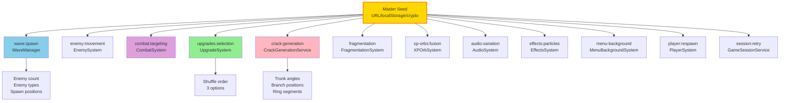
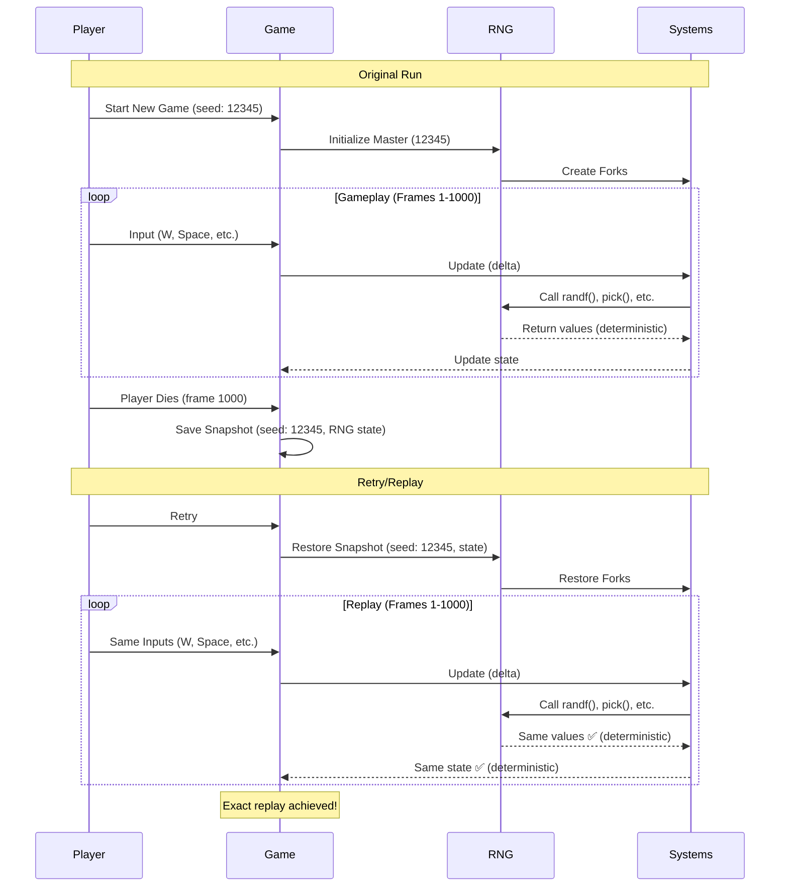
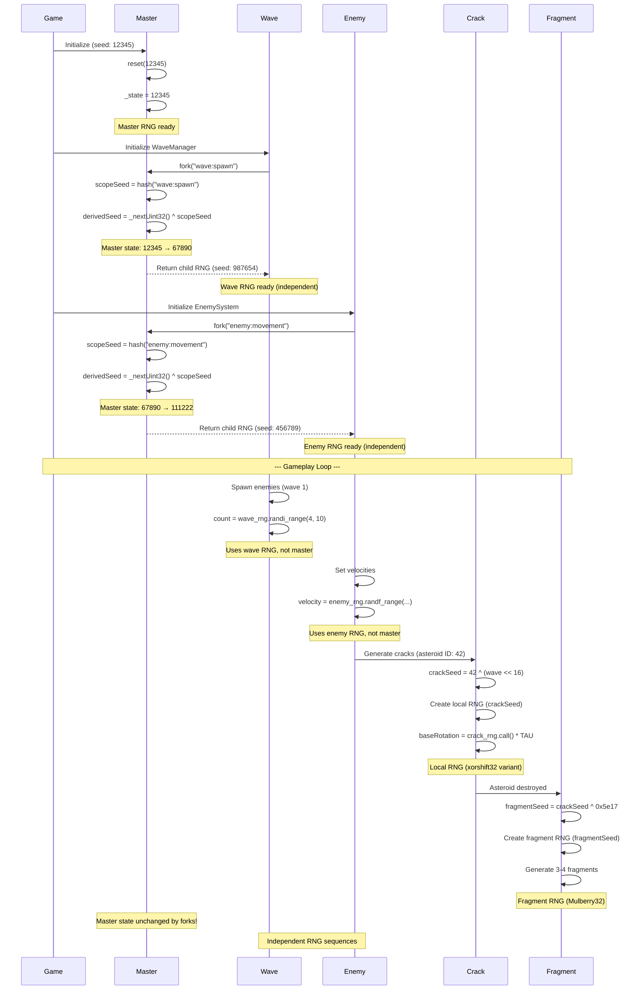
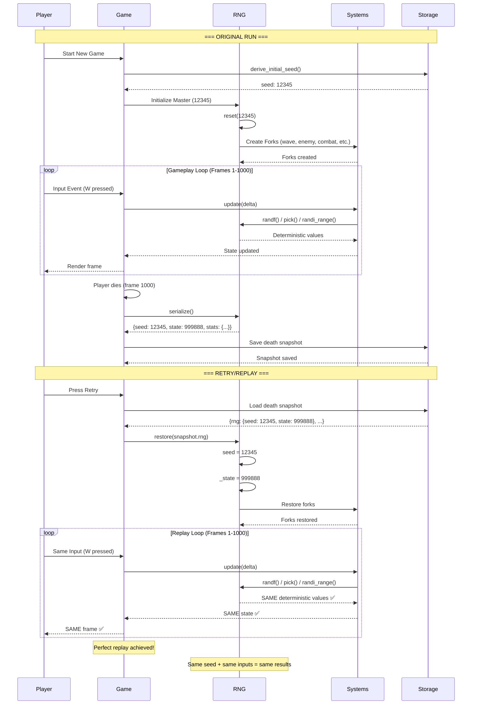

# Godot Migration Guide: Random System (Deterministic RNG)

**Status:** Draft
**Prioridade:** Alta
**Complexidade:** Média
**Documento:** 10/12 da série de migração

---

## 1. Visão Geral do Sistema

### Conceito

O sistema de randomness do ASTEROIDS_ROGUEFIELD é um **RNG (Random Number Generator) determinístico** baseado em seeds que garante **reprodutibilidade total** de gameplay. Isso significa que, dada a mesma seed inicial e a mesma sequência de inputs do jogador, o jogo sempre produzirá exatamente os mesmos resultados.

### Características Principais

**Deterministic Replay:**

- Mesma seed + mesmos inputs = mesma sequência de eventos
- Útil para debugging (reproduzir bugs exatamente)
- Útil para balancing (testar mudanças com mesma sequência)
- Útil para replay (compartilhar runs com outros jogadores)

**Fork System:**

- Cada subsistema tem seu próprio fork de RNG (independente)
- Master RNG não é afetado por calls dos forks
- Derived seeds garantem independência e reprodutibilidade
- Scope labels identificam cada fork ("wave:spawn", "upgrades.selection")

**Serialization:**

- Save/load completo de RNG state para retry system
- Snapshot inclui: seed, state interno, estatísticas de uso
- Integração com death snapshot para retry após morte

**Propósitos:**

1. **Debugging**: Reproduzir bugs exatamente com mesma seed
2. **Balancing**: Testar mudanças de design com mesma sequência
3. **Replay**: Compartilhar runs interessantes
4. **Testing**: Validar comportamento determinístico

---

## 2. Estrutura de Dados do Sistema

### Campos Principais

Baseado em `RandomService.js` linhas 18-43:

```gdscript
class_name RandomService
extends RefCounted

# Constants
const UINT32_MAX: int = 0xFFFFFFFF
const UINT32_FACTOR: float = 1.0 / (UINT32_MAX + 1.0)
const SEED_HISTORY_LIMIT: int = 10
const MULBERRY32_MAGIC: int = 0x6d2b79f5

# State
var seed: int = 0              # Seed inicial (imutável após reset)
var _state: int = 0            # Estado interno do Mulberry32 (muta a cada call)

# Statistics tracking
var _stats: Dictionary = {
    "calls": {
        "reset": 0,
        "float": 0,
        "int": 0,
        "range": 0,
        "chance": 0,
        "pick": 0,
        "weighted_pick": 0,
        "uuid": 0,
        "fork": 0,
        "serialize": 0,
        "restore": 0
    },
    "seeds": {
        "initial": null,       # Seed inicial (nunca muda)
        "current": null,       # Seed atual
        "history": [],         # Últimos 10 seeds usados (FIFO)
        "forks": {}            # Mapa de scope label → derived seed
    }
}

func _init(initial_seed: int = Time.get_ticks_msec()) -> void:
    reset(initial_seed)
```

### Constantes do Sistema

| Constante            | Valor      | Descrição                                |
| -------------------- | ---------- | ---------------------------------------- |
| `UINT32_MAX`         | 0xFFFFFFFF | Máximo valor uint32 (4,294,967,295)      |
| `UINT32_FACTOR`      | 1 / (2^32) | Fator de conversão para [0,1)            |
| `SEED_HISTORY_LIMIT` | 10         | Tamanho do histórico de seeds (FIFO)     |
| `MULBERRY32_MAGIC`   | 0x6d2b79f5 | Constante mágica do Mulberry32 algorithm |

### Mapeamento JS → GDScript

| JavaScript               | GDScript                                      | Notas                        |
| ------------------------ | --------------------------------------------- | ---------------------------- |
| `class RandomService`    | `class_name RandomService extends RefCounted` | RefCounted para auto-cleanup |
| `this.seed`              | `var seed: int`                               | Seed inicial                 |
| `this._state`            | `var _state: int`                             | Estado interno privado       |
| `this._stats`            | `var _stats: Dictionary`                      | Stats de uso                 |
| `Map<string, number>`    | `Dictionary`                                  | Godot usa Dictionary         |
| `>>> 0` (unsigned shift) | `& UINT32_MAX`                                | Godot não tem >>>            |
| `Math.imul(a, b)`        | `_imul(a, b)`                                 | Implementação customizada    |

---

## 3. Mulberry32 Algorithm (Core PRNG)

### Conceito

**Mulberry32** é um PRNG (Pseudo-Random Number Generator) de 32-bit desenvolvido por Tommy Ettinger. Características:

- **Período**: ~2^32 (4.3 bilhões de valores antes de repetir)
- **State-based**: Muta `_state` a cada chamada
- **Mixing function**: Usa XOR shifts e multiplicações para distribuição uniforme
- **Performance**: ~2-3x mais rápido que `Math.random()` em JavaScript
- **Qualidade**: Boa distribuição uniforme, passa testes básicos de randomness

### Algoritmo Completo

Baseado em `RandomService.js` linhas 75-82:

```
// Pseudocódigo matemático
state = (state + 0x6d2b79f5) >>> 0      // 1. Incremento com magic constant
t = state
t = imul(t ^ (t >>> 15), t | 1)         // 2. Mix 1: XOR shift + multiply
t ^= t + imul(t ^ (t >>> 7), t | 61)    // 3. Mix 2: XOR + multiply
return (t ^ (t >>> 14)) >>> 0           // 4. Final XOR shift
```

**Passo a passo:**

1. **Incremento**: Adiciona constante mágica e força uint32
2. **Mix 1**: XOR shift de 15 bits + multiplicação com número ímpar
3. **Mix 2**: XOR shift de 7 bits + multiplicação com 61
4. **Final**: XOR shift de 14 bits para output final

### Implementação GDScript

```gdscript
func _next_uint32() -> int:
    """
    Mulberry32 PRNG algorithm.
    Returns: uint32 value (0 to 0xFFFFFFFF)
    """
    # Step 1: Increment state with magic constant
    _state = (_state + MULBERRY32_MAGIC) & UINT32_MAX
    var t = _state

    # Step 2: Mix 1 - XOR shift + multiply
    t = _imul(t ^ (t >> 15), t | 1) & UINT32_MAX

    # Step 3: Mix 2 - XOR + multiply
    t = (t ^ (t + _imul(t ^ (t >> 7), t | 61))) & UINT32_MAX

    # Step 4: Final XOR shift
    return (t ^ (t >> 14)) & UINT32_MAX

func _imul(a: int, b: int) -> int:
    """
    32-bit signed integer multiplication (equivalent to Math.imul).
    Godot doesn't have Math.imul, so we implement it manually.
    """
    var ah = (a >> 16) & 0xFFFF
    var al = a & 0xFFFF
    var bh = (b >> 16) & 0xFFFF
    var bl = b & 0xFFFF
    return ((al * bl) + (((ah * bl + al * bh) << 16) >>> 0)) & UINT32_MAX

func randf() -> float:
    """
    Returns random float in range [0, 1).
    """
    _stats.calls.float += 1
    return _next_uint32() * UINT32_FACTOR
```

### Comparação com Godot Built-in

| Feature                     | Mulberry32 (Custom)            | PCG32 (Godot)                |
| --------------------------- | ------------------------------ | ---------------------------- |
| Período                     | 2^32 (~4.3B)                   | 2^64 (muito maior)           |
| Velocidade                  | Rápido                         | Rápido                       |
| Qualidade                   | Boa                            | Excelente                    |
| Determinismo cross-platform | ✅ Sim (se implementado igual) | ❌ Não (implementação varia) |
| Compatibilidade com JS      | ✅ 100%                        | ❌ Sequências diferentes     |

**Recomendação**: Implementar Mulberry32 customizado para garantir **100% compatibilidade** com o projeto JavaScript original.

---

## 4. Seed Normalization (Normalização de Seed)

### Conceito

O sistema aceita múltiplos tipos de seed e os normaliza para **uint32** (0 a 0xFFFFFFFF):

- **Number**: Trunca para 32-bit
- **String**: Converte via hash (DJB2-like algorithm)
- **BigInt**: Trunca para 32-bit (JavaScript only)

Baseado em `RandomService.js` linhas 45-59.

### Hash String Algorithm (DJB2-like)

```
// Pseudocódigo
hash = 0
for each char in string:
    hash = (hash << 5) - hash + charCode(char)  // hash * 33 + char
    hash |= 0                                    // Force to 32 bits
return hash >>> 0                                // Unsigned
```

**Características:**

- **DJB2 variant**: Dan Bernstein hash (muito usado)
- **Collision-resistant**: Boa distribuição para strings
- **Rápido**: O(n) linear no tamanho da string

### Implementação GDScript

```gdscript
func _normalize_seed(seed_value: Variant) -> int:
    """
    Normalizes various seed types to uint32.
    Accepts: int, float, String
    Returns: uint32 value (0 to 0xFFFFFFFF)
    """
    if seed_value is int:
        return seed_value & UINT32_MAX

    if seed_value is float:
        return int(seed_value) & UINT32_MAX

    if seed_value is String:
        return _hash_string(seed_value)

    push_error("RandomService: Unsupported seed type: %s" % typeof(seed_value))
    return 0

func _hash_string(input: String) -> int:
    """
    DJB2-like hash algorithm for strings.
    Compatible with JavaScript implementation.
    """
    var hash = 0
    for i in range(input.length()):
        # hash * 33 + charCode
        hash = ((hash << 5) - hash + input.unicode_at(i)) & UINT32_MAX
    return hash
```

### Exemplos de Uso

```gdscript
# Seed numérico
var rng1 = RandomService.new(12345)

# Seed string
var rng2 = RandomService.new("my-game-seed")
# Hash interno: _hash_string("my-game-seed") → 0x7A3B8C9D (exemplo)

# Seed float
var rng3 = RandomService.new(1234.56)
# Truncado para: 1234
```

### Alternativa: Godot Built-in Hash

```gdscript
# Opção mais simples (mas hashes diferentes de JS)
func _hash_string_godot(input: String) -> int:
    return input.hash() & UINT32_MAX
```

**Trade-off**: `String.hash()` de Godot é **mais simples**, mas gera **hashes diferentes** do JavaScript. Para 100% compatibilidade, use DJB2 customizado.

---

## 5. Fork System (Sistema de Forks)

### Conceito

O **fork system** permite criar **child RNGs** com seeds derivadas do master RNG. Características:

- **Independence**: Child RNG não afeta master state
- **Derived seed**: `master._nextUint32() ^ scopeHash`
- **Scope labels**: Identificadores textuais ("wave:spawn", "upgrades.selection")
- **Reprodutibilidade**: Mesma seed master = mesmas derived seeds

Baseado em `RandomService.js` linhas 215-236.

### Algoritmo de Derivação

```
1. Se scopeOrSeed é undefined:
   derivedSeed = master._nextUint32()

2. Se scopeOrSeed é number/bigint:
   derivedSeed = normalize(scopeOrSeed)

3. Se scopeOrSeed é string:
   scopeSeed = normalize(scopeOrSeed)  // Hash da string
   derivedSeed = master._nextUint32() ^ scopeSeed
```

**Por que XOR?**

- Combina randomness do master com scope label
- Garante seeds diferentes para scopes diferentes
- Operação rápida e reversível

### Implementação GDScript

```gdscript
func fork(scope_or_seed: Variant = null) -> RandomService:
    """
    Creates a child RNG with derived seed.

    Args:
        scope_or_seed: Seed derivation source
            - null: Use next random uint32
            - int/float: Use as direct seed
            - String: Hash string and XOR with next uint32

    Returns:
        New RandomService instance with derived seed
    """
    _stats.calls.fork += 1

    var derived_seed: int
    var scope_label: String = "fork"

    if scope_or_seed == null:
        # No scope: use next random value
        derived_seed = _next_uint32()

    elif scope_or_seed is int or scope_or_seed is float:
        # Direct seed value
        derived_seed = _normalize_seed(scope_or_seed)
        scope_label = "seed:%s" % str(scope_or_seed)

    else:
        # String scope: hash and XOR with master
        scope_label = "scope:%s" % str(scope_or_seed)
        var scope_seed = _normalize_seed(str(scope_or_seed))
        derived_seed = _next_uint32() ^ scope_seed

    # Force uint32
    derived_seed = derived_seed & UINT32_MAX

    # Track fork in stats
    _stats.seeds.forks[scope_label] = derived_seed
    _push_seed_history(derived_seed)

    # Create and return child RNG
    return RandomService.new(derived_seed)

func _push_seed_history(seed_value: int) -> void:
    """
    Adds seed to history (FIFO queue, max 10 entries).
    """
    _stats.seeds.history.append(seed_value)
    if _stats.seeds.history.size() > SEED_HISTORY_LIMIT:
        _stats.seeds.history.pop_front()
```

### Exemplo de Uso Completo

```gdscript
# Create master RNG
var master_rng = RandomService.new(12345)

# Fork para wave spawning
var wave_rng = master_rng.fork("wave:spawn")
var enemy_count = wave_rng.randi_range(4, 10)
print("Enemy count: %d" % enemy_count)  # Ex: 7

# Fork para upgrade selection
var upgrade_rng = master_rng.fork("upgrades.selection")
var selected = upgrade_rng.pick(["plasma", "multishot", "shield"])
print("Selected upgrade: %s" % selected)  # Ex: "multishot"

# Fork para combat targeting
var combat_rng = master_rng.fork("combat:targeting")
var jitter = combat_rng.randf_range(-5, 5)
print("Targeting jitter: %.2f" % jitter)  # Ex: -2.35

# Master RNG não foi afetado pelos forks
var master_value = master_rng.randf()
print("Master value: %.4f" % master_value)  # Sequência independente

# Verificar stats
print("Forks created: %d" % master_rng._stats.calls.fork)  # 3
print("Fork seeds: %s" % master_rng._stats.seeds.forks)
# Output: {"scope:wave:spawn": 987654, "scope:upgrades.selection": 456789, "scope:combat:targeting": 234567}
```

### Diagrama de Independence

```
Master RNG (seed: 12345)
├─ state: 12345 → 67890 → 11111 → 22222 → 33333
│
├─ Fork "wave:spawn" (seed: 987654)
│  └─ state: 987654 → 111222 → 333444 → ...
│     (independente do master)
│
├─ Fork "upgrades.selection" (seed: 456789)
│  └─ state: 456789 → 999888 → 777666 → ...
│     (independente do master e de wave)
│
└─ Fork "combat:targeting" (seed: 234567)
   └─ state: 234567 → 555444 → 333222 → ...
      (independente de todos)
```

---

## 6. API Methods (Métodos da API)

### 6.1. float() - Random Float [0, 1)

**Descrição**: Retorna float no intervalo [0, 1) (inclusive 0, exclusive 1).

```gdscript
func randf() -> float:
    """
    Returns random float in range [0, 1).
    Equivalent to Math.random() in JavaScript.
    """
    _stats.calls.float += 1
    return _next_uint32() * UINT32_FACTOR
```

**Exemplo:**

```gdscript
var rng = RandomService.new(12345)
print(rng.randf())  # Ex: 0.7234
print(rng.randf())  # Ex: 0.1892
print(rng.randf())  # Ex: 0.9456
```

---

### 6.2. int(min, max) - Random Integer [min, max]

**Descrição**: Retorna inteiro no intervalo [min, max] (ambos inclusive).

```gdscript
func randi_range(min_val: int, max_val: int) -> int:
    """
    Returns random integer in range [min, max] (inclusive).

    Args:
        min_val: Minimum value (inclusive)
        max_val: Maximum value (inclusive)

    Returns:
        Random integer
    """
    _stats.calls.int += 1

    var low = min(min_val, max_val)
    var high = max(min_val, max_val)
    var span = high - low + 1

    # Use float conversion to avoid modulo bias
    var value = int(_next_uint32() * span * UINT32_FACTOR)
    return low + value
```

**Exemplo:**

```gdscript
var rng = RandomService.new(12345)
print(rng.randi_range(1, 10))   # Ex: 7
print(rng.randi_range(50, 100)) # Ex: 83
print(rng.randi_range(0, 1))    # Ex: 0 (coin flip)
```

**Por que não usar modulo?**

- `value % span` introduz **modulo bias** (distribuição não uniforme)
- Multiplicação por span é **matematicamente mais justo**

---

### 6.3. range(min, max) - Random Float [min, max]

**Descrição**: Retorna float no intervalo [min, max] (ambos inclusive).

```gdscript
func randf_range(min_val: float, max_val: float) -> float:
    """
    Returns random float in range [min, max].

    Args:
        min_val: Minimum value
        max_val: Maximum value

    Returns:
        Random float
    """
    _stats.calls.range += 1

    if max_val == min_val:
        return min_val

    var low = min(min_val, max_val)
    var high = max(min_val, max_val)

    return low + (high - low) * randf()
```

**Exemplo:**

```gdscript
var rng = RandomService.new(12345)
print(rng.randf_range(0.0, 1.0))     # Ex: 0.7234
print(rng.randf_range(-10.0, 10.0))  # Ex: -3.56
print(rng.randf_range(100.0, 200.0)) # Ex: 157.89
```

---

### 6.4. chance(probability) - Boolean Roll

**Descrição**: Retorna `true` com probabilidade especificada.

```gdscript
func chance(probability: float) -> bool:
    """
    Returns true with given probability.

    Args:
        probability: Chance of returning true (0.0 to 1.0)
            - 0.0 or less: always false
            - 1.0 or more: always true
            - 0.5: 50% chance

    Returns:
        Boolean result
    """
    _stats.calls.chance += 1

    if probability <= 0:
        return false
    if probability >= 1:
        return true

    return randf() < probability
```

**Exemplo:**

```gdscript
var rng = RandomService.new(12345)

# 70% chance de spawn
if rng.chance(0.7):
    print("Enemy spawned!")

# 5% chance de critical hit
if rng.chance(0.05):
    print("Critical hit!")

# 100% chance (sempre true)
if rng.chance(1.0):
    print("Always happens")
```

---

### 6.5. pick(array) - Random Element

**Descrição**: Retorna elemento aleatório de um array.

```gdscript
func pick(array: Array) -> Variant:
    """
    Returns random element from array.

    Args:
        array: Array to pick from

    Returns:
        Random element, or null if array is empty
    """
    _stats.calls.pick += 1

    if array.is_empty():
        return null

    var index = randi_range(0, array.size() - 1)
    return array[index]
```

**Exemplo:**

```gdscript
var rng = RandomService.new(12345)

var weapons = ["pistol", "shotgun", "rifle"]
print(rng.pick(weapons))  # Ex: "shotgun"

var colors = ["red", "green", "blue", "yellow"]
print(rng.pick(colors))  # Ex: "blue"

var empty = []
print(rng.pick(empty))  # null
```

---

### 6.6. weightedPick(weights) - Weighted Random

**Descrição**: Retorna elemento com probabilidade proporcional aos pesos.

```gdscript
func weighted_pick(weights: Variant) -> Variant:
    """
    Returns random element based on weights.

    Args:
        weights: Can be:
            - Dictionary: {value1: weight1, value2: weight2, ...}
            - Array of [value, weight] pairs: [[value1, weight1], ...]
            - Array of {value, weight} dicts: [{value: v1, weight: w1}, ...]

    Returns:
        Randomly selected value, or null if no valid weights
    """
    _stats.calls.weighted_pick += 1

    var entries = []

    # Parse input format
    if weights is Dictionary:
        for key in weights.keys():
            entries.append({"value": key, "weight": weights[key]})

    elif weights is Array:
        for item in weights:
            if item is Array and item.size() == 2:
                # [value, weight] pair
                entries.append({"value": item[0], "weight": item[1]})
            elif item is Dictionary:
                # {value: x, weight: y} dict
                entries.append({"value": item.value, "weight": item.weight})
            else:
                # Assume uniform weight
                entries.append({"value": item, "weight": 1})
    else:
        push_error("weighted_pick expects Dictionary or Array")
        return null

    # Calculate total weight
    var total = 0.0
    for entry in entries:
        var w = float(entry.weight) if entry.weight is float or entry.weight is int else 0.0
        total += w

    if total <= 0:
        return null

    # Threshold selection
    var threshold = randf_range(0, total)
    for entry in entries:
        var w = float(entry.weight) if entry.weight is float or entry.weight is int else 0.0
        if w <= 0:
            continue
        if threshold < w:
            return entry.value
        threshold -= w

    # Fallback (should never happen due to floating point)
    return entries[entries.size() - 1].value if not entries.is_empty() else null
```

**Exemplo:**

```gdscript
var rng = RandomService.new(12345)

# Dictionary format
var enemy_types = {
    "common": 70,      # 70% chance
    "elite": 20,       # 20% chance
    "boss": 10         # 10% chance
}
print(rng.weighted_pick(enemy_types))  # Ex: "common" (mais provável)

# Array of pairs format
var loot = [
    ["gold", 50],
    ["health", 30],
    ["ammo", 20]
]
print(rng.weighted_pick(loot))  # Ex: "gold"

# Dictionary with complex weights
var variants = {
    "common": 70.0,
    "iron": 8.0,
    "denseCore": 7.0,
    "gold": 0.4,       # Muito raro (0.4%)
    "volatile": 6.5,
    "parasite": 4.5,
    "crystal": 1.5
}
print(rng.weighted_pick(variants))  # Ex: "iron"
```

**Algoritmo Threshold:**

```
total = 70 + 20 + 10 = 100
threshold = randf_range(0, 100) = 45.3

Iteração:
- "common" (weight 70): 45.3 < 70? YES → return "common"
```

---

### 6.7. uuid(scope) - Unique ID

**Descrição**: Gera identificador único baseado em RNG.

```gdscript
func uuid(scope: String = "global") -> String:
    """
    Generates unique ID using RNG state.

    Args:
        scope: Prefix for the UUID

    Returns:
        String in format "scope-xxxxxxxx-xxxxxxxx"
    """
    _stats.calls.uuid += 1

    var segment = func() -> String:
        return "%08x" % _next_uint32()

    var part_a = segment.call()
    var part_b = segment.call()

    return "%s-%s-%s" % [scope, part_a.substr(0, 8), part_b.substr(0, 8)]
```

**Exemplo:**

```gdscript
var rng = RandomService.new(12345)

print(rng.uuid())                    # Ex: "global-7a3b8c9d-f1e2d3c4"
print(rng.uuid("enemy"))             # Ex: "enemy-a1b2c3d4-e5f6a7b8"
print(rng.uuid("particle"))          # Ex: "particle-12345678-9abcdef0"
```

**Uso Típico:**

- Identificadores de entidades geradas proceduralmente
- Cache keys para sistemas de pooling
- Debug labels para tracking de objetos

---

## 7. Serialization (Save/Load State)

### Conceito

O sistema de serialização permite **salvar e restaurar** o estado completo do RNG, incluindo:

- Seed inicial
- Estado interno (\_state)
- Estatísticas de uso (calls, seeds history, forks)

Usado principalmente pelo **retry system** para restaurar RNG exato após morte do jogador.

Baseado em `RandomService.js` linhas 238-265.

### Implementação GDScript

```gdscript
func serialize() -> Dictionary:
    """
    Exports complete RNG state for persistence.

    Returns:
        Dictionary with keys:
            - seed: Initial seed (uint32)
            - state: Internal Mulberry32 state (uint32)
            - stats: Deep clone of statistics
    """
    _stats.calls.serialize += 1

    return {
        "seed": seed & UINT32_MAX,
        "state": _state & UINT32_MAX,
        "stats": _stats.duplicate(true)  # Deep clone
    }

func restore(snapshot: Dictionary) -> void:
    """
    Restores RNG state from snapshot.

    Args:
        snapshot: Dictionary from serialize()
    """
    _stats.calls.restore += 1

    if not snapshot or not snapshot is Dictionary:
        push_error("RandomService.restore() expects Dictionary")
        return

    if not snapshot.has("seed") or not snapshot.has("state"):
        push_error("RandomService.restore() invalid snapshot payload")
        return

    # Restore core state
    seed = snapshot.seed & UINT32_MAX
    _state = snapshot.state & UINT32_MAX

    # Restore stats (if present)
    if snapshot.has("stats"):
        _stats = snapshot.stats.duplicate(true)
    else:
        # Fallback: reconstruct minimal stats
        _stats.seeds.current = seed
        _push_seed_history(seed)

func debug_snapshot() -> Dictionary:
    """
    Returns snapshot for debugging (same as serialize).
    """
    return {
        "seed": seed & UINT32_MAX,
        "state": _state & UINT32_MAX,
        "stats": _stats.duplicate(true)
    }
```

### Exemplo de Uso: Retry System

```gdscript
# GameSessionService.gd

var master_rng: RandomService

func create_death_snapshot() -> Dictionary:
    """
    Creates snapshot of game state for retry.
    """
    return {
        "player": player.serialize(),
        "enemies": enemy_system.serialize(),
        "progression": progression_system.serialize(),
        "rng": master_rng.serialize()  # ← RNG state included
    }

func restore_from_snapshot(snapshot: Dictionary) -> void:
    """
    Restores game state from death snapshot.
    IMPORTANT: Restore RNG FIRST before other systems!
    """
    # Restore RNG first (other systems may fork during init)
    master_rng.restore(snapshot.rng)

    # Then restore other systems
    player.deserialize(snapshot.player)
    enemy_system.deserialize(snapshot.enemies)
    progression_system.deserialize(snapshot.progression)

    print("[Retry] RNG restored to seed: %d, state: %d" % [master_rng.seed, master_rng._state])
```

### Exemplo de Snapshot JSON

```json
{
  "seed": 12345,
  "state": 67890,
  "stats": {
    "calls": {
      "reset": 1,
      "float": 42,
      "int": 17,
      "range": 8,
      "chance": 23,
      "pick": 5,
      "weighted_pick": 3,
      "uuid": 2,
      "fork": 6,
      "serialize": 1,
      "restore": 0
    },
    "seeds": {
      "initial": 12345,
      "current": 12345,
      "history": [12345, 987654, 456789, 234567],
      "forks": {
        "scope:wave:spawn": 987654,
        "scope:upgrades.selection": 456789,
        "scope:combat:targeting": 234567
      }
    }
  }
}
```

### Persistência em Arquivo

```gdscript
# Save to file
func save_rng_snapshot(path: String) -> void:
    var snapshot = master_rng.serialize()
    var file = FileAccess.open(path, FileAccess.WRITE)
    file.store_string(JSON.stringify(snapshot, "\t"))
    file.close()

# Load from file
func load_rng_snapshot(path: String) -> void:
    var file = FileAccess.open(path, FileAccess.READ)
    var json_string = file.get_as_text()
    file.close()

    var snapshot = JSON.parse_string(json_string)
    master_rng.restore(snapshot)
```

---

## 8. Seed Management (Gerenciamento de Seed)

### Conceito

O sistema gerencia a **derivação e persistência** de seeds para garantir reprodutibilidade entre sessões de jogo.

Baseado em `GameSessionService.js` linhas 1905-2019.

### Derivation Chain (Cadeia de Derivação)

```
1. URL params (?seed=12345)
   ↓ (se não encontrado)
2. localStorage.getItem('last-seed')
   ↓ (se não encontrado)
3. crypto.getRandomValues(new Uint32Array(1))[0]
   ↓ (se crypto não disponível)
4. Math.random() * UINT32_MAX
```

**Prioridades:**

1. **URL params** (mais alta): Permite forçar seed específica para testes
2. **localStorage**: Permite replay da última sessão
3. **crypto.getRandomValues**: Seed verdadeiramente aleatória (segura)
4. **Math.random**: Fallback (menos seguro)

### Implementação GDScript

```gdscript
# RandomService.gd (static methods)

const STORAGE_PATH = "user://game_settings.cfg"
const STORAGE_SECTION = "rng"
const STORAGE_KEY_LAST_SEED = "last_seed"

static func derive_initial_seed() -> int:
    """
    Derives initial seed using priority chain:
    1. ConfigFile (localStorage equivalent)
    2. Crypto random (OS entropy)

    Returns:
        uint32 seed value
    """
    # 1. Check stored seed (localStorage)
    var config = ConfigFile.new()
    if config.load(STORAGE_PATH) == OK:
        if config.has_section_key(STORAGE_SECTION, STORAGE_KEY_LAST_SEED):
            var stored = config.get_value(STORAGE_SECTION, STORAGE_KEY_LAST_SEED)
            if stored is int:
                print("[RandomService] Using stored seed: %d" % stored)
                return stored & UINT32_MAX

    # 2. Generate crypto random seed (OS entropy)
    var crypto_rng = RandomNumberGenerator.new()
    crypto_rng.randomize()  # Uses OS entropy source
    var crypto_seed = crypto_rng.randi()

    print("[RandomService] Generated crypto seed: %d" % crypto_seed)
    return crypto_seed & UINT32_MAX

static func persist_seed(seed_value: int) -> void:
    """
    Persists seed to storage for next session.

    Args:
        seed_value: Seed to persist
    """
    var config = ConfigFile.new()
    config.load(STORAGE_PATH)  # Ignore error if file doesn't exist

    config.set_value(STORAGE_SECTION, STORAGE_KEY_LAST_SEED, seed_value & UINT32_MAX)
    config.save(STORAGE_PATH)

    print("[RandomService] Persisted seed: %d" % seed_value)

static func clear_persisted_seed() -> void:
    """
    Clears stored seed (forces new random seed next session).
    """
    var config = ConfigFile.new()
    if config.load(STORAGE_PATH) == OK:
        config.erase_section_key(STORAGE_SECTION, STORAGE_KEY_LAST_SEED)
        config.save(STORAGE_PATH)
        print("[RandomService] Cleared persisted seed")
```

### Uso no GameSessionService

```gdscript
# GameSessionService.gd

var master_rng: RandomService

func _ready() -> void:
    # Derive and persist seed
    var initial_seed = RandomService.derive_initial_seed()
    master_rng = RandomService.new(initial_seed)
    RandomService.persist_seed(initial_seed)

    print("[GameSession] Master RNG initialized with seed: %d" % initial_seed)

func start_new_game(override_seed: int = -1) -> void:
    """
    Starts new game with optional seed override.
    """
    var seed = override_seed if override_seed >= 0 else RandomService.derive_initial_seed()

    master_rng.reset(seed)
    RandomService.persist_seed(seed)

    print("[GameSession] New game started with seed: %d" % seed)
```

### URL Params (Web Export Only)

Para export web, Godot permite ler URL params via JavaScript:

```gdscript
# WebSeedManager.gd (para HTML5 export)

static func get_seed_from_url() -> int:
    """
    Reads ?seed=12345 from URL (web export only).
    Returns -1 if not found.
    """
    if OS.has_feature("web"):
        var js_code = "new URLSearchParams(window.location.search).get('seed')"
        var seed_string = JavaScriptBridge.eval(js_code)

        if seed_string and seed_string.is_valid_int():
            var seed = int(seed_string)
            print("[WebSeed] Using URL seed: %d" % seed)
            return seed & 0xFFFFFFFF

    return -1

# Uso:
func _ready():
    var url_seed = WebSeedManager.get_seed_from_url()
    var seed = url_seed if url_seed >= 0 else RandomService.derive_initial_seed()
    master_rng = RandomService.new(seed)
```

---

## 9. Fork Hierarchy (Hierarquia de Forks)

### Árvore Completa de Forks

```
Master Seed (12345)
├─ wave:spawn (WaveManager)
│  └─ Determina: enemy count, enemy types, spawn positions
│
├─ enemy:movement (EnemySystem)
│  └─ Determina: velocidades iniciais, direções, behaviors
│
├─ combat:targeting (CombatSystem)
│  └─ Determina: target selection jitter, multishot spread
│
├─ upgrades.selection (UpgradeSystem)
│  └─ Determina: Fisher-Yates shuffle de eligible upgrades
│
├─ crack:generation (CrackGenerationService)
│  └─ Determina: trunk angles, branch positions, ring segments
│
├─ fragmentation (FragmentationSystem)
│  └─ Determina: fragment velocities, spawn angles, radial distances
│
├─ xp-orbs:fusion (XPOrbSystem)
│  └─ Determina: cluster detection order, fusion timing
│
├─ audio:variation (AudioSystem)
│  └─ Determina: pitch variation, frequency jitter, noise buffers
│
├─ effects:particles (EffectsSystem)
│  └─ Determina: particle jitter, spread, lifetime variation
│
├─ menu-background (MenuBackgroundSystem)
│  └─ Determina: asteroid positions, velocities, collision timing
│
├─ player:respawn (PlayerSystem)
│  └─ Determina: safe spawn point selection
│
└─ session:retry (GameSessionService)
   └─ Determina: retry countdown variation (se houver)
```

### Diagrama Mermaid



### Exemplo de Inicialização Completa

```gdscript
# GameSessionService.gd

var master_rng: RandomService
var subsystem_rngs: Dictionary = {}

func initialize_rng_system(seed: int) -> void:
    """
    Initializes master RNG and creates all subsystem forks.
    """
    # Create master RNG
    master_rng = RandomService.new(seed)
    RandomService.persist_seed(seed)

    # Create all forks
    subsystem_rngs["wave"] = master_rng.fork("wave:spawn")
    subsystem_rngs["enemy"] = master_rng.fork("enemy:movement")
    subsystem_rngs["combat"] = master_rng.fork("combat:targeting")
    subsystem_rngs["upgrades"] = master_rng.fork("upgrades.selection")
    subsystem_rngs["crack"] = master_rng.fork("crack:generation")
    subsystem_rngs["fragmentation"] = master_rng.fork("fragmentation")
    subsystem_rngs["xp_orbs"] = master_rng.fork("xp-orbs:fusion")
    subsystem_rngs["audio"] = master_rng.fork("audio:variation")
    subsystem_rngs["effects"] = master_rng.fork("effects:particles")
    subsystem_rngs["menu"] = master_rng.fork("menu-background")
    subsystem_rngs["player"] = master_rng.fork("player:respawn")
    subsystem_rngs["session"] = master_rng.fork("session:retry")

    print("[RNG] Initialized master seed: %d" % seed)
    print("[RNG] Created %d subsystem forks" % subsystem_rngs.size())

    # Debug: print all fork seeds
    for scope in subsystem_rngs.keys():
        var fork_seed = subsystem_rngs[scope].seed
        print("  [Fork] %s → seed: %d" % [scope, fork_seed])

func get_subsystem_rng(scope: String) -> RandomService:
    """
    Returns RNG for specific subsystem.
    """
    if not subsystem_rngs.has(scope):
        push_error("[RNG] Unknown subsystem scope: %s" % scope)
        return master_rng  # Fallback to master

    return subsystem_rngs[scope]
```

### Uso nos Subsistemas

```gdscript
# WaveManager.gd
var wave_rng: RandomService

func _ready() -> void:
    wave_rng = GameSession.get_subsystem_rng("wave")

func spawn_enemies(wave: int) -> void:
    var count = wave_rng.randi_range(4, 10)
    for i in range(count):
        spawn_enemy(wave_rng)

# UpgradeSystem.gd
var upgrade_rng: RandomService

func _ready() -> void:
    upgrade_rng = GameSession.get_subsystem_rng("upgrades")

func prepare_options() -> Array:
    var pool = eligible_upgrades.duplicate()
    shuffle_array(pool, upgrade_rng)
    return pool.slice(0, 3)
```

---

## 10. Use Cases (7 Casos de Uso Práticos)

### 10.1. Crack Generation (Padrões de Rachadura)

**Contexto**: Asteroids precisam de crack patterns determinísticos para fragmentação consistente.

**Arquivo origem**: `CrackGenerationService.js` linhas 26-34, 262-263

**Implementação GDScript:**

```gdscript
# CrackGenerationService.gd

static func create_seeded_random(seed: int) -> Callable:
    """
    Creates local RNG function using xorshift32 variant.
    Used for crack pattern generation.
    """
    var state = seed & 0xFFFFFFFF

    return func() -> float:
        # xorshift32 variant (different from Mulberry32)
        state = (state + 0x6d2b79f5) & 0xFFFFFFFF
        var t = ((state ^ (state >> 15)) * (1 | state)) & 0xFFFFFFFF
        t = (t ^ (t + ((t ^ (t >> 7)) * (61 | t)) & 0xFFFFFFFF)) & 0xFFFFFFFF
        return float((t ^ (t >> 14)) & 0xFFFFFFFF) / 4294967296.0

func generate_crack_pattern(asteroid_id: int, wave: int, generation: int) -> Array:
    """
    Generates deterministic crack pattern for asteroid.
    """
    # Derive seed from asteroid properties
    var crack_seed = asteroid_id ^ (wave << 16) ^ (generation << 8)
    var crack_rng = create_seeded_random(crack_seed ^ 0x9e3779)

    # Generate base rotation
    var base_rotation = crack_rng.call() * TAU

    # Generate trunk angles
    var trunk_count = 3
    var trunk_angles = []
    for i in range(trunk_count):
        var angle = base_rotation + (i * TAU / trunk_count)
        angle += (crack_rng.call() - 0.5) * 0.5  # Jitter
        trunk_angles.append(angle)

    return trunk_angles
```

**Determinismo**: Mesma `asteroid_id + wave + generation` = mesmos crack patterns.

---

### 10.2. Upgrade Selection (Fisher-Yates Shuffle)

**Contexto**: Player level up apresenta 3 upgrade options aleatórias mas determinísticas.

**Arquivo origem**: `UpgradeSystem.js` linhas 95-143

**Implementação GDScript:**

```gdscript
# UpgradeSystem.gd

var upgrade_rng: RandomService

func _ready() -> void:
    upgrade_rng = GameSession.get_subsystem_rng("upgrades")

func prepare_upgrade_options(count: int = 3) -> Array:
    """
    Selects random upgrades using Fisher-Yates shuffle.
    """
    var eligible = filter_eligible_upgrades()

    if eligible.size() <= count:
        return eligible  # Return all if not enough

    var pool = eligible.duplicate()

    # Fisher-Yates shuffle
    for i in range(pool.size() - 1, 0, -1):
        var swap_index = upgrade_rng.randi_range(0, i)
        var temp = pool[i]
        pool[i] = pool[swap_index]
        pool[swap_index] = temp

    # Return first N elements
    return pool.slice(0, count)

func filter_eligible_upgrades() -> Array:
    """
    Returns upgrades that can currently be selected.
    """
    var eligible = []
    for upgrade in all_upgrades:
        if can_select_upgrade(upgrade):
            eligible.append(upgrade)
    return eligible
```

**Determinismo**: Mesma seed + mesmos eligible upgrades = mesmas 3 opções na mesma ordem.

---

### 10.3. Enemy Variants (Weighted Random)

**Contexto**: Enemy spawning usa weighted random para determinar variant types.

**Arquivo origem**: `asteroid-configs.js` linhas 964-1002

**Implementação GDScript:**

```gdscript
# EnemySystem.gd

var enemy_rng: RandomService

func _ready() -> void:
    enemy_rng = GameSession.get_subsystem_rng("enemy")

func spawn_random_asteroid(position: Vector3) -> void:
    """
    Spawns asteroid with weighted variant selection.
    """
    var variant_weights = {
        "common": 70.0,      # 70% relative weight
        "iron": 8.0,         # 8%
        "denseCore": 7.0,    # 7%
        "gold": 0.4,         # 0.4% (very rare)
        "volatile": 6.5,     # 6.5%
        "parasite": 4.5,     # 4.5%
        "crystal": 1.5       # 1.5%
    }

    var variant = enemy_rng.weighted_pick(variant_weights)

    var asteroid = asteroid_scene.instantiate()
    asteroid.set_variant(variant)
    asteroid.global_position = position
    add_child(asteroid)

    print("[Enemy] Spawned %s asteroid at %s" % [variant, position])
```

**Determinismo**: Mesma seed = mesma sequência de variant types.

---

### 10.4. Fragmentation (Fragment Velocities)

**Contexto**: Quando asteroid é destruído, spawna fragmentos com velocidades determinísticas.

**Arquivo origem**: `FragmentationSystem.js` linhas 99-177

**Implementação GDScript:**

```gdscript
# FragmentationSystem.gd

func fragment_asteroid(asteroid: Node3D, crack_seed: int) -> void:
    """
    Spawns fragments with deterministic velocities.
    """
    # Derive fragment seed from crack seed
    var fragment_seed = crack_seed ^ 0x5e17
    var fragment_rng = RandomService.new(fragment_seed)

    # Generate fragments
    var fragment_count = fragment_rng.randi_range(3, 4)
    var base_speed = asteroid.velocity.length() * 0.5

    for i in range(fragment_count):
        var fragment = fragment_scene.instantiate()

        # Random angle and speed
        var angle = fragment_rng.randf() * TAU
        var speed_multiplier = fragment_rng.randf_range(0.85, 1.2)
        var speed = base_speed * speed_multiplier

        # Set velocity
        var direction = Vector3(cos(angle), 0, sin(angle))
        fragment.velocity = direction * speed

        # Random position offset
        var offset = direction * fragment_rng.randf_range(0.5, 1.5)
        fragment.global_position = asteroid.global_position + offset

        add_child(fragment)
```

**Determinismo**: Mesma `crack_seed` = mesmos fragmentos com mesmas velocidades.

---

### 10.5. XP Orb Fusion (Cluster Detection)

**Contexto**: XP orbs fusionam em clusters determinísticos.

**Arquivo origem**: `XPOrbSystem.js` linhas 1265-1397

**Implementação GDScript:**

```gdscript
# XPOrbSystem.gd

var xp_rng: RandomService

func _ready() -> void:
    xp_rng = GameSession.get_subsystem_rng("xp_orbs")

func process_orb_fusion(delta: float) -> void:
    """
    Detects and initiates orb fusion deterministically.
    """
    # Find clusters (deterministic order via RNG)
    var blue_clusters = find_orb_clusters("blue", 1)

    if not blue_clusters.is_empty():
        # Use RNG to select cluster (if multiple)
        var cluster = xp_rng.pick(blue_clusters)
        initiate_orb_fusion("blue", "green", cluster)
        return

    var green_clusters = find_orb_clusters("green", 1)
    if not green_clusters.is_empty():
        var cluster = xp_rng.pick(green_clusters)
        initiate_orb_fusion("green", "orange", cluster)
        return

func find_orb_clusters(tier: String, required_count: int) -> Array:
    """
    Finds clusters of orbs (deterministic search order).
    """
    var orbs = get_orbs_by_tier(tier)
    var clusters = []

    # Shuffle search order for determinism
    var shuffled = orbs.duplicate()
    for i in range(shuffled.size() - 1, 0, -1):
        var j = xp_rng.randi_range(0, i)
        var temp = shuffled[i]
        shuffled[i] = shuffled[j]
        shuffled[j] = temp

    # Detect clusters
    for orb in shuffled:
        var nearby = find_nearby_orbs(orb, tier, required_count)
        if nearby.size() >= required_count:
            clusters.append(nearby)

    return clusters
```

**Determinismo**: Mesma seed = mesma ordem de detecção de clusters.

---

### 10.6. Audio Variation (Pitch/Frequency)

**Contexto**: Audio playback varia pitch/frequency para evitar repetição.

**Arquivo origem**: `AudioSystem.js` linhas 57-68

**Implementação GDScript:**

```gdscript
# AudioSystem.gd

var audio_rng: RandomService

func _ready() -> void:
    audio_rng = GameSession.get_subsystem_rng("audio")

func play_sound(sound_name: String, position: Vector3) -> void:
    """
    Plays sound with randomized pitch variation.
    """
    var player = AudioStreamPlayer3D.new()
    player.stream = load("res://audio/sfx/%s.ogg" % sound_name)
    player.global_position = position

    # Randomize pitch
    var pitch_variation = audio_rng.randf_range(-0.1, 0.1)
    player.pitch_scale = 1.0 + pitch_variation

    # Randomize volume slightly
    var volume_variation = audio_rng.randf_range(-2.0, 2.0)
    player.volume_db = 0.0 + volume_variation

    add_child(player)
    player.play()

    # Auto-remove when finished
    player.finished.connect(func(): player.queue_free())

func generate_noise_buffer(size: int) -> PackedFloat32Array:
    """
    Generates deterministic noise buffer for audio effects.
    """
    var buffer = PackedFloat32Array()
    buffer.resize(size)

    for i in range(size):
        buffer[i] = audio_rng.randf_range(-1.0, 1.0)

    return buffer
```

**Determinismo**: Mesma seed = mesmas variações de pitch/frequency.

---

### 10.7. Particle Effects (Jitter/Spread)

**Contexto**: Particle systems usam randomness para jitter, spread, lifetime variation.

**Arquivo origem**: `EffectsSystem.js` linhas 1954-2068

**Implementação GDScript:**

```gdscript
# EffectsSystem.gd

var effects_rng: RandomService

func _ready() -> void:
    effects_rng = GameSession.get_subsystem_rng("effects")

func spawn_explosion_particles(position: Vector3, particle_count: int) -> void:
    """
    Spawns explosion particles with deterministic variation.
    """
    for i in range(particle_count):
        var particle = particle_scene.instantiate()

        # Random position jitter
        var jitter = Vector3(
            effects_rng.randf_range(-0.5, 0.5),
            effects_rng.randf_range(-0.5, 0.5),
            effects_rng.randf_range(-0.5, 0.5)
        )
        particle.global_position = position + jitter

        # Random velocity spread
        var angle = effects_rng.randf() * TAU
        var elevation = effects_rng.randf_range(-PI/4, PI/4)
        var speed_base = 5.0
        var speed = speed_base * effects_rng.randf_range(0.8, 1.6)

        var direction = Vector3(
            cos(angle) * cos(elevation),
            sin(elevation),
            sin(angle) * cos(elevation)
        )
        particle.velocity = direction * speed

        # Random lifetime variation
        var lifetime_base = 1.0
        particle.lifetime = lifetime_base * effects_rng.randf_range(0.8, 1.2)

        add_child(particle)
```

**Determinismo**: Mesma seed = mesmos particle patterns.

---

## 11. Deterministic Replay (Replay Determinístico)

### Conceito

**Deterministic replay** garante que, dada a **mesma seed** e os **mesmos inputs**, o jogo produzirá **exatamente os mesmos resultados**.

**Aplicações:**

- **Debugging**: Reproduzir bugs exatamente como ocorreram
- **Balancing**: Testar mudanças de design com mesma sequência de eventos
- **Competitive play**: Comparar runs diferentes na mesma seed
- **Content sharing**: Compartilhar runs interessantes com outros jogadores

### Exemplo de Replay Scenario Completo

**Configuração:**

- Seed: `12345`
- Inputs: `[W, Space, W, W, D, Space, ...]` (sequência exata de teclas e timing)

**Run Original (Seed: 12345):**

```
Frame 1:
  - Wave 1 spawns 4 asteroids
  - Positions: [100,0,50], [200,0,80], [300,0,120], [400,0,90]
  - Variants: [common, common, iron, common]

Frame 60:
  - Player reaches level 2
  - Upgrade options: ["Plasma Bolts", "Multishot", "Shield Generator"]

Frame 120:
  - Player selects "Plasma Bolts" (index 0)
  - Upgrade applied

Frame 180:
  - Asteroid at [100,0,50] destroyed (health depleted)
  - Spawns 3 fragments
  - Fragment velocities: [2.3, 45°], [1.8, 120°], [2.1, 270°]
  - XP orbs spawn: 5 blue orbs at positions [...]

Frame 240:
  - Blue orbs cluster detected at [150,0,60]
  - Fusion initiated: blue → green
  - Audio pitch variation: +0.05

Frame 300:
  - Wave 2 spawns 5 asteroids
  - Positions: [50,0,100], [150,0,150], ...
```

**Replay (Seed: 12345, mesmos inputs):**

```
Frame 1:
  - Wave 1 spawns 4 asteroids ✅ MATCH
  - Positions: [100,0,50], [200,0,80], [300,0,120], [400,0,90] ✅ MATCH
  - Variants: [common, common, iron, common] ✅ MATCH

Frame 60:
  - Player reaches level 2 ✅ MATCH
  - Upgrade options: ["Plasma Bolts", "Multishot", "Shield Generator"] ✅ MATCH

Frame 120:
  - Player selects "Plasma Bolts" (index 0) ✅ MATCH
  - Upgrade applied ✅ MATCH

Frame 180:
  - Asteroid at [100,0,50] destroyed ✅ MATCH
  - Spawns 3 fragments ✅ MATCH
  - Fragment velocities: [2.3, 45°], [1.8, 120°], [2.1, 270°] ✅ MATCH
  - XP orbs spawn: 5 blue orbs at positions [...] ✅ MATCH

Frame 240:
  - Blue orbs cluster detected at [150,0,60] ✅ MATCH
  - Fusion initiated: blue → green ✅ MATCH
  - Audio pitch variation: +0.05 ✅ MATCH

Frame 300:
  - Wave 2 spawns 5 asteroids ✅ MATCH
  - Positions: [50,0,100], [150,0,150], ... ✅ MATCH
```

**Resultado**: ✅ **100% identical replay**

### Implementação: Replay System

```gdscript
# ReplaySystem.gd

class_name ReplaySystem
extends Node

var recorded_inputs: Array = []
var current_frame: int = 0

func start_recording(seed: int) -> void:
    """
    Starts recording inputs for replay.
    """
    recorded_inputs.clear()
    current_frame = 0

    # Initialize RNG with known seed
    GameSession.initialize_rng_system(seed)

    print("[Replay] Recording started with seed: %d" % seed)

func record_input(input_event: Dictionary) -> void:
    """
    Records input event with frame timestamp.
    """
    recorded_inputs.append({
        "frame": current_frame,
        "event": input_event
    })

func save_replay(path: String) -> void:
    """
    Saves replay to file.
    """
    var replay_data = {
        "seed": GameSession.master_rng.seed,
        "inputs": recorded_inputs,
        "metadata": {
            "version": "1.0",
            "timestamp": Time.get_unix_time_from_system(),
            "total_frames": current_frame
        }
    }

    var file = FileAccess.open(path, FileAccess.WRITE)
    file.store_string(JSON.stringify(replay_data, "\t"))
    file.close()

    print("[Replay] Saved to: %s" % path)

func load_replay(path: String) -> Dictionary:
    """
    Loads replay from file.
    """
    var file = FileAccess.open(path, FileAccess.READ)
    var json_string = file.get_as_text()
    file.close()

    var replay_data = JSON.parse_string(json_string)

    print("[Replay] Loaded from: %s" % path)
    print("[Replay] Seed: %d, Frames: %d" % [replay_data.seed, replay_data.metadata.total_frames])

    return replay_data

func start_playback(replay_data: Dictionary) -> void:
    """
    Starts replay playback.
    """
    current_frame = 0

    # Initialize RNG with replay seed (CRITICAL!)
    GameSession.initialize_rng_system(replay_data.seed)

    # Setup input playback
    for input_record in replay_data.inputs:
        # Schedule input injection at exact frame
        pass  # Implementation depends on input system

    print("[Replay] Playback started")

func _process(delta: float) -> void:
    current_frame += 1
```

### Diagrama de Fluxo: Replay Scenario



### Requisitos para Determinismo Perfeito

1. **Fixed timestep**: Usar `_physics_process(delta)` com delta fixo
2. **Deterministic physics**: Godot physics é determinístico se timestep fixo
3. **No external randomness**: Todos os valores aleatórios vêm de RandomService
4. **Serializable state**: Todos os sistemas podem ser salvos/restaurados
5. **Input replay**: Inputs devem ser reproduzidos exatamente

---

## 12. Implementação Godot: Estrutura de Cena

### Scene Tree

```
Autoloads (Project Settings)
└─ RandomService (singleton)

Ou:

GameSession (Node)
├─ RandomService (script property)
└─ SubsystemRNGs (Dictionary property)
```

### Opção 1: Autoload Singleton (Recomendado)

**Project.godot:**

```ini
[autoload]
RandomService="*res://core/RandomService.gd"
```

**Script: res://core/RandomService.gd**

```gdscript
class_name RandomService
extends Node

# (implementação completa das seções anteriores)

var master_seed: int
var _master_state: int

func _ready() -> void:
    var initial_seed = derive_initial_seed()
    reset(initial_seed)
    persist_seed(initial_seed)
    print("[RandomService] Initialized with seed: %d" % initial_seed)
```

**Uso Global:**

```gdscript
# Qualquer script pode acessar diretamente
var value = RandomService.randf()
var enemy_count = RandomService.randi_range(4, 10)
var wave_rng = RandomService.fork("wave:spawn")
```

**Prós:**

- Acesso global simples
- Singleton pattern (1 instância)
- Fácil de usar

**Contras:**

- Acoplamento global
- Dificulta testing unitário

---

### Opção 2: Service Locator / Dependency Injection

**GameSessionService.gd:**

```gdscript
class_name GameSessionService
extends Node

var random_service: RandomService
var subsystem_rngs: Dictionary = {}

func _ready() -> void:
    # Create RandomService instance
    random_service = RandomService.new()
    random_service.reset(RandomService.derive_initial_seed())

    # Create subsystem forks
    subsystem_rngs["wave"] = random_service.fork("wave:spawn")
    subsystem_rngs["enemy"] = random_service.fork("enemy:movement")
    # ... etc

func get_subsystem_rng(scope: String) -> RandomService:
    return subsystem_rngs.get(scope, random_service)
```

**Uso:**

```gdscript
# WaveManager.gd
@onready var game_session: GameSessionService = get_node("/root/GameSession")
var wave_rng: RandomService

func _ready() -> void:
    wave_rng = game_session.get_subsystem_rng("wave")
```

**Prós:**

- Melhor testabilidade
- Injeção de dependência explícita
- Facilita mocking em testes

**Contras:**

- Mais verboso
- Requer referências explícitas

---

### Recomendação Final

**Para ASTEROIDS_ROGUEFIELD**: Usar **Opção 1 (Autoload Singleton)** porque:

- Simplifica acesso em todos os sistemas
- RNG é serviço fundamental usado em todos os lugares
- Godot design patterns favorecem Autoloads para serviços globais
- Projeto já usa Autoloads para outros serviços (EventBus, AudioSystem)

---

## 13. Tabela de Parâmetros Configuráveis

| Categoria       | Parâmetro                   | Valor Padrão                 | Tipo           | Descrição                                | Arquivo Origem             |
| --------------- | --------------------------- | ---------------------------- | -------------- | ---------------------------------------- | -------------------------- |
| **Algorithm**   |
|                 | `MULBERRY32_MAGIC`          | `0x6d2b79f5`                 | `const int`    | Constante mágica do Mulberry32 algorithm | `RandomService.js:77`      |
|                 | `UINT32_MAX`                | `0xFFFFFFFF`                 | `const int`    | Máximo valor uint32 (4,294,967,295)      | `RandomService.js:1`       |
|                 | `UINT32_FACTOR`             | `1/(2^32)`                   | `const float`  | Fator de conversão uint32 → [0,1)        | `RandomService.js:2`       |
| **Stats**       |
|                 | `SEED_HISTORY_LIMIT`        | `10`                         | `const int`    | Tamanho do histórico de seeds (FIFO)     | `RandomService.js:3`       |
| **Persistence** |
|                 | `STORAGE_PATH`              | `"user://game_settings.cfg"` | `const String` | Path do ConfigFile para persistência     | -                          |
|                 | `STORAGE_SECTION`           | `"rng"`                      | `const String` | Seção do ConfigFile                      | -                          |
|                 | `STORAGE_KEY_LAST_SEED`     | `"last_seed"`                | `const String` | Chave para última seed                   | `GameSessionService.js:11` |
|                 | `STORAGE_KEY_SEED_SNAPSHOT` | `"seed_snapshot"`            | `const String` | Chave para snapshot completo             | `GameSessionService.js:12` |
| **Fork Scopes** |
|                 | Wave Spawning               | `"wave:spawn"`               | `String`       | Scope label para WaveManager             | -                          |
|                 | Enemy Movement              | `"enemy:movement"`           | `String`       | Scope label para EnemySystem             | -                          |
|                 | Combat Targeting            | `"combat:targeting"`         | `String`       | Scope label para CombatSystem            | -                          |
|                 | Upgrade Selection           | `"upgrades.selection"`       | `String`       | Scope label para UpgradeSystem           | -                          |
|                 | Crack Generation            | `"crack:generation"`         | `String`       | Scope label para CrackGenerationService  | -                          |
|                 | Fragmentation               | `"fragmentation"`            | `String`       | Scope label para FragmentationSystem     | -                          |
|                 | XP Orbs Fusion              | `"xp-orbs:fusion"`           | `String`       | Scope label para XPOrbSystem             | -                          |
|                 | Audio Variation             | `"audio:variation"`          | `String`       | Scope label para AudioSystem             | -                          |
|                 | Effects Particles           | `"effects:particles"`        | `String`       | Scope label para EffectsSystem           | -                          |
|                 | Menu Background             | `"menu-background"`          | `String`       | Scope label para MenuBackgroundSystem    | -                          |
|                 | Player Respawn              | `"player:respawn"`           | `String`       | Scope label para PlayerSystem            | -                          |
|                 | Session Retry               | `"session:retry"`            | `String`       | Scope label para GameSessionService      | -                          |

---

## 14. Diagramas de Fluxo

### Diagrama 1: Fork Hierarchy (Detailed)

```mermaid
graph TD
    Master[Master Seed<br/>URL/localStorage/crypto] --> Wave[wave:spawn<br/>WaveManager]
    Master --> Enemy[enemy:movement<br/>EnemySystem]
    Master --> Combat[combat:targeting<br/>CombatSystem]
    Master --> Upgrades[upgrades.selection<br/>UpgradeSystem]
    Master --> Crack[crack:generation<br/>CrackGenerationService]
    Master --> Frag[fragmentation<br/>FragmentationSystem]
    Master --> XP[xp-orbs:fusion<br/>XPOrbSystem]
    Master --> Audio[audio:variation<br/>AudioSystem]
    Master --> Effects[effects:particles<br/>EffectsSystem]
    Master --> Menu[menu-background<br/>MenuBackgroundSystem]
    Master --> Player[player:respawn<br/>PlayerSystem]
    Master --> Session[session:retry<br/>GameSessionService]

    Wave --> WaveOut[• Enemy count<br/>• Enemy types<br/>• Spawn positions<br/>• Spawn timing]
    Enemy --> EnemyOut[• Initial velocities<br/>• Movement directions<br/>• Behavior patterns]
    Combat --> CombatOut[• Target selection jitter<br/>• Multishot spread<br/>• Projectile variance]
    Upgrades --> UpgOut[• Fisher-Yates shuffle<br/>• 3 random options<br/>• Weighted rarities]
    Crack --> CrackOut[• Trunk angles<br/>• Branch positions<br/>• Ring segments<br/>• Crack depth]
    Frag --> FragOut[• Fragment velocities<br/>• Spawn angles<br/>• Radial distances<br/>• Fragment count]
    XP --> XPOut[• Cluster detection order<br/>• Fusion timing<br/>• Animation delays]
    Audio --> AudioOut[• Pitch variation<br/>• Frequency jitter<br/>• Noise buffers<br/>• Volume variance]
    Effects --> EffectsOut[• Particle jitter<br/>• Velocity spread<br/>• Lifetime variation<br/>• Color variance]
    Menu --> MenuOut[• Asteroid positions<br/>• Velocities<br/>• Rotation speeds<br/>• Collision timing]
    Player --> PlayerOut[• Safe spawn point<br/>• Initial direction<br/>• Invulnerability duration]
    Session --> SessionOut[• Retry countdown<br/>• Snapshot timing]

    style Master fill:#FFD700,stroke:#FF8C00,stroke-width:3px
    style Wave fill:#87CEEB
    style Enemy fill:#98FB98
    style Combat fill:#DDA0DD
    style Upgrades fill:#90EE90
    style Crack fill:#FFB6C1
    style Frag fill:#F0E68C
    style XP fill:#ADD8E6
    style Audio fill:#FFE4B5
    style Effects fill:#E0BBE4
    style Menu fill:#C5E1A5
    style Player fill:#FFCCBC
    style Session fill:#B2DFDB
```



### Diagrama 2: Seed Propagation Flow (Detailed)



### Diagrama 3: Deterministic Replay Scenario (Complete)



---

## 15. Stats Tracking (Estatísticas de Uso)

### Conceito

O sistema rastreia **estatísticas de uso** para debugging e análise:

- Número de calls de cada método
- Histórico de seeds usadas
- Forks criados e suas derived seeds

### Estrutura de Stats

```gdscript
var _stats: Dictionary = {
    "calls": {
        "reset": 0,
        "float": 0,
        "int": 0,
        "range": 0,
        "chance": 0,
        "pick": 0,
        "weighted_pick": 0,
        "uuid": 0,
        "fork": 0,
        "serialize": 0,
        "restore": 0
    },
    "seeds": {
        "initial": null,       # Seed inicial (nunca muda)
        "current": null,       # Seed atual
        "history": [],         # Últimos 10 seeds (FIFO)
        "forks": {}            # Mapa scope → derived seed
    }
}
```

### Implementação de Tracking

```gdscript
func _record_call(method_name: String) -> void:
    """
    Records method call in stats.
    """
    if _stats.calls.has(method_name):
        _stats.calls[method_name] += 1

func _push_seed_history(seed_value: int) -> void:
    """
    Adds seed to history (FIFO, max 10).
    """
    _stats.seeds.history.append(seed_value)
    if _stats.seeds.history.size() > SEED_HISTORY_LIMIT:
        _stats.seeds.history.pop_front()

func get_stats() -> Dictionary:
    """
    Returns deep copy of stats for inspection.
    """
    return _stats.duplicate(true)

func print_stats() -> void:
    """
    Prints formatted stats to console.
    """
    print("[RandomService Stats]")
    print("  Seed: %d (initial: %d)" % [_stats.seeds.current, _stats.seeds.initial])
    print("  State: %d" % _state)
    print("\n  Method Calls:")
    for method in _stats.calls.keys():
        var count = _stats.calls[method]
        if count > 0:
            print("    %s: %d" % [method, count])

    print("\n  Fork Seeds:")
    for scope in _stats.seeds.forks.keys():
        var fork_seed = _stats.seeds.forks[scope]
        print("    %s → %d" % [scope, fork_seed])

    print("\n  Seed History: %s" % _stats.seeds.history)
```

### Exemplo de Debug Output

```
[RandomService Stats]
  Seed: 12345 (initial: 12345)
  State: 999888

  Method Calls:
    reset: 1
    float: 42
    int: 17
    range: 8
    chance: 23
    pick: 5
    weighted_pick: 3
    uuid: 2
    fork: 6
    serialize: 1

  Fork Seeds:
    scope:wave:spawn → 987654
    scope:enemy:movement → 456789
    scope:combat:targeting → 234567
    scope:upgrades.selection → 345678
    scope:xp-orbs:fusion → 567890
    scope:audio:variation → 678901

  Seed History: [12345, 987654, 456789, 234567, 345678, 567890, 678901]
```

### Uso para Debugging

```gdscript
# Debug command (console ou dev menu)
func debug_rng_stats() -> void:
    RandomService.print_stats()

    # Check for anomalies
    var stats = RandomService.get_stats()

    if stats.calls.fork > 20:
        push_warning("[Debug] Muitos forks criados: %d" % stats.calls.fork)

    if stats.calls.weighted_pick == 0:
        push_warning("[Debug] weighted_pick nunca foi usado")

    # Validate fork consistency
    for scope in ["wave:spawn", "enemy:movement", "upgrades.selection"]:
        var key = "scope:" + scope
        if not stats.seeds.forks.has(key):
            push_error("[Debug] Fork esperado não foi criado: %s" % scope)
```

---

## 16. Integration com Outros Sistemas

### 16.1. WaveManager Integration

```gdscript
# WaveManager.gd

var wave_rng: RandomService

func _ready() -> void:
    # Get fork from GameSession
    wave_rng = GameSession.get_subsystem_rng("wave")

func spawn_wave(wave_number: int) -> void:
    """
    Spawns enemies for wave using deterministic RNG.
    """
    var enemy_count = calculate_enemy_count(wave_number)
    var spawn_radius = 50.0

    for i in range(enemy_count):
        # Random spawn position on circle
        var angle = wave_rng.randf() * TAU
        var distance = spawn_radius + wave_rng.randf_range(-5, 5)
        var position = Vector3(cos(angle) * distance, 0, sin(angle) * distance)

        # Random enemy variant
        var variant = select_enemy_variant(wave_number)

        spawn_enemy(position, variant)

func select_enemy_variant(wave: int) -> String:
    """
    Selects enemy variant with wave-based weights.
    """
    var weights = {
        "common": 70.0,
        "iron": 8.0,
        "denseCore": 7.0,
        "gold": 0.4 * (1 + wave * 0.1),  # Increases with wave
        "volatile": 6.5,
        "parasite": 4.5,
        "crystal": 1.5
    }

    return wave_rng.weighted_pick(weights)
```

**Ver também**: `docs/godot-migration/mechanics-wave-spawning.md`

---

### 16.2. UpgradeSystem Integration

```gdscript
# UpgradeSystem.gd

var upgrade_rng: RandomService

func _ready() -> void:
    upgrade_rng = GameSession.get_subsystem_rng("upgrades")

func prepare_upgrade_options(count: int = 3) -> Array:
    """
    Prepares random upgrade options using Fisher-Yates shuffle.
    """
    var eligible = filter_eligible_upgrades()

    if eligible.size() <= count:
        return eligible

    # Fisher-Yates shuffle
    var pool = eligible.duplicate()
    for i in range(pool.size() - 1, 0, -1):
        var swap_index = upgrade_rng.randi_range(0, i)
        var temp = pool[i]
        pool[i] = pool[swap_index]
        pool[swap_index] = temp

    return pool.slice(0, count)

func filter_eligible_upgrades() -> Array:
    """
    Returns upgrades that can currently be selected.
    """
    var eligible = []

    for upgrade_id in all_upgrade_ids:
        var config = upgrade_configs[upgrade_id]

        # Check requirements
        if not meets_requirements(config):
            continue

        # Check max level
        var current_level = player_upgrades.get(upgrade_id, 0)
        if current_level >= config.max_level:
            continue

        eligible.append(upgrade_id)

    return eligible
```

**Ver também**: `docs/godot-migration/mechanics-upgrades.md`

---

### 16.3. CrackGenerationService Integration

```gdscript
# CrackGenerationService.gd

static func create_seeded_random(seed: int) -> Callable:
    """
    Creates xorshift32 variant RNG for crack generation.
    This is a LOCAL RNG, not using RandomService forks.
    """
    var state = seed & 0xFFFFFFFF

    return func() -> float:
        # xorshift32 variant (different from Mulberry32)
        state = (state + 0x6d2b79f5) & 0xFFFFFFFF
        var t = ((state ^ (state >> 15)) * (1 | state)) & 0xFFFFFFFF
        t = (t ^ (t + ((t ^ (t >> 7)) * (61 | t)) & 0xFFFFFFFF)) & 0xFFFFFFFF
        return float((t ^ (t >> 14)) & 0xFFFFFFFF) / 4294967296.0

func generate_crack_pattern(
    asteroid: Node3D,
    wave: int,
    generation: int
) -> Dictionary:
    """
    Generates deterministic crack pattern for asteroid.
    """
    # Derive seed from asteroid properties
    var asteroid_id = asteroid.get_instance_id()
    var crack_seed = asteroid_id ^ (wave << 16) ^ (generation << 8)

    # Create local RNG
    var crack_rng = create_seeded_random(crack_seed ^ 0x9e3779)

    # Generate trunk parameters
    var trunk_count = 3
    var trunk_angle_base = crack_rng.call() * TAU
    var trunks = []

    for i in range(trunk_count):
        var angle = trunk_angle_base + (i * TAU / trunk_count)
        angle += (crack_rng.call() - 0.5) * 0.5  # Jitter

        var trunk = {
            "angle": angle,
            "branches": generate_branches(crack_rng, 2)
        }
        trunks.append(trunk)

    return {
        "trunks": trunks,
        "seed": crack_seed
    }

func generate_branches(rng: Callable, count: int) -> Array:
    """
    Generates branch positions along trunk.
    """
    var branches = []
    for i in range(count):
        var distance = rng.call() * 0.8 + 0.1  # 10% to 90% along trunk
        var angle_offset = (rng.call() - 0.5) * PI / 3  # ±30°

        branches.append({
            "distance": distance,
            "angle_offset": angle_offset
        })

    return branches
```

**Ver também**: `docs/godot-migration/mechanics-crack-generation.md`

---

### 16.4. GameSessionService Integration

```gdscript
# GameSessionService.gd

var master_rng: RandomService
var subsystem_rngs: Dictionary = {}

func _ready() -> void:
    initialize_rng_system(RandomService.derive_initial_seed())

func initialize_rng_system(seed: int) -> void:
    """
    Initializes master RNG and all subsystem forks.
    """
    master_rng = RandomService.new(seed)
    RandomService.persist_seed(seed)

    # Create all forks
    subsystem_rngs["wave"] = master_rng.fork("wave:spawn")
    subsystem_rngs["enemy"] = master_rng.fork("enemy:movement")
    subsystem_rngs["combat"] = master_rng.fork("combat:targeting")
    subsystem_rngs["upgrades"] = master_rng.fork("upgrades.selection")
    subsystem_rngs["xp_orbs"] = master_rng.fork("xp-orbs:fusion")
    subsystem_rngs["audio"] = master_rng.fork("audio:variation")
    subsystem_rngs["effects"] = master_rng.fork("effects:particles")
    subsystem_rngs["menu"] = master_rng.fork("menu-background")
    subsystem_rngs["player"] = master_rng.fork("player:respawn")

    print("[GameSession] RNG system initialized (seed: %d)" % seed)

func get_subsystem_rng(scope: String) -> RandomService:
    """
    Returns RNG for specific subsystem.
    """
    return subsystem_rngs.get(scope, master_rng)

func create_death_snapshot() -> Dictionary:
    """
    Creates snapshot for retry system.
    """
    return {
        "player": player.serialize(),
        "enemies": enemy_system.serialize(),
        "progression": progression_system.serialize(),
        "rng": master_rng.serialize()  # ← Include RNG state
    }

func restore_from_snapshot(snapshot: Dictionary) -> void:
    """
    Restores game state from death snapshot.
    IMPORTANT: Restore RNG FIRST!
    """
    # Restore RNG state first (critical!)
    master_rng.restore(snapshot.rng)

    # Re-create forks (they use restored master state)
    initialize_rng_forks()

    # Then restore other systems
    player.deserialize(snapshot.player)
    enemy_system.deserialize(snapshot.enemies)
    progression_system.deserialize(snapshot.progression)

func initialize_rng_forks() -> void:
    """
    Re-creates all subsystem forks from current master state.
    """
    subsystem_rngs["wave"] = master_rng.fork("wave:spawn")
    subsystem_rngs["enemy"] = master_rng.fork("enemy:movement")
    # ... (all forks)
```

**Ver também**: `docs/godot-migration/mechanics-game-session.md`

---

## 17. Comparison: Mulberry32 vs xorshift32 vs Godot Built-in

### Tabela Comparativa Completa

| Feature                | Mulberry32 (Master)             | xorshift32 (Local)              | PCG32 (Godot)                  |
| ---------------------- | ------------------------------- | ------------------------------- | ------------------------------ |
| **Algorithm**          | Mulberry32 (T. Ettinger)        | xorshift32 variant              | PCG (O'Neill)                  |
| **Período**            | ~2^32 (~4.3B)                   | 2^32-1                          | 2^64 (~18 quintillion)         |
| **State Size**         | 32-bit (4 bytes)                | 32-bit (4 bytes)                | 128-bit (16 bytes)             |
| **Speed**              | Fast (~2-3x Math.random)        | Very Fast (fastest)             | Fast                           |
| **Qualidade**          | Good (passa testes básicos)     | Good (menos que Mulberry32)     | Excellent (passa TestU01)      |
| **Uniformidade**       | Boa distribuição                | Boa distribuição                | Excelente distribuição         |
| **Crypto-secure**      | ❌ Não                          | ❌ Não                          | ❌ Não                         |
| **Usado Em**           | RandomService (master, forks)   | CrackGen, Fragmentation         | Godot built-in                 |
| **Compatibilidade JS** | ✅ 100% (se implementado igual) | ✅ 100% (se implementado igual) | ❌ Sequências diferentes       |
| **Implementação**      | Custom class                    | Local callable                  | Godot class built-in           |
| **Memory Overhead**    | Baixo (1 int)                   | Muito baixo (closure)           | Médio (object + 128-bit state) |

### Quando Usar Cada Um

**Mulberry32:**

- ✅ Master RNG e forks principais
- ✅ Quando precisa de 100% compatibilidade com JS
- ✅ Quando precisa de serialization/replay
- ✅ Quando precisa de fork system
- ❌ Quando precisa de período muito longo (>2^32)
- ❌ Quando precisa de segurança criptográfica

**xorshift32:**

- ✅ Scopes locais (crack generation, fragmentation)
- ✅ Quando precisa de máxima performance
- ✅ Quando não precisa de serialization
- ✅ Quando seed é derivada de propriedades (asteroid ID)
- ❌ Quando precisa de qualidade estatística máxima
- ❌ Quando precisa de fork system

**PCG32 (Godot):**

- ✅ Quando não precisa de compatibilidade com JS
- ✅ Quando precisa de período muito longo
- ✅ Quando precisa de qualidade estatística máxima
- ✅ Quando não precisa de replay exato cross-platform
- ❌ Quando precisa de 100% compatibilidade com JS
- ❌ Quando precisa de serialization portável

### Implementação Comparativa

**Mulberry32 (Custom):**

```gdscript
func _next_uint32() -> int:
    _state = (_state + 0x6d2b79f5) & UINT32_MAX
    var t = _state
    t = _imul(t ^ (t >> 15), t | 1) & UINT32_MAX
    t = (t ^ (t + _imul(t ^ (t >> 7), t | 61))) & UINT32_MAX
    return (t ^ (t >> 14)) & UINT32_MAX
```

**xorshift32 (Callable):**

```gdscript
static func create_seeded_random(seed: int) -> Callable:
    var state = seed & 0xFFFFFFFF
    return func() -> float:
        state = (state + 0x6d2b79f5) & 0xFFFFFFFF
        var t = ((state ^ (state >> 15)) * (1 | state)) & 0xFFFFFFFF
        t = (t ^ (t + ((t ^ (t >> 7)) * (61 | t)) & 0xFFFFFFFF)) & 0xFFFFFFFF
        return float((t ^ (t >> 14)) & 0xFFFFFFFF) / 4294967296.0
```

**PCG32 (Godot):**

```gdscript
var rng = RandomNumberGenerator.new()
rng.seed = 12345
var value = rng.randf()  # Sequência DIFERENTE de Mulberry32!
```

### Recomendação Final

Para ASTEROIDS_ROGUEFIELD:

1. **Usar Mulberry32** para master RNG e todos os forks principais (garantir compatibilidade JS)
2. **Usar xorshift32** para scopes locais (crack generation, fragmentation - como no original)
3. **Não usar PCG32** (Godot built-in) para nada que afete gameplay determinístico

---

## 18. Referências de Código

### Arquivos JavaScript Analisados

**RandomService.js** (275 linhas):

- **Linhas 1-3**: Constantes (UINT32_MAX, UINT32_FACTOR, SEED_HISTORY_LIMIT)
- **Linhas 5-12**: `hashString(input)` - DJB2-like hash para strings
- **Linhas 18-43**: Constructor e stats initialization
- **Linhas 45-59**: `_normalizeSeed(seed)` - Normaliza number/string/bigint para uint32
- **Linhas 61-65**: `_recordCall(method)` - Stats tracking
- **Linhas 67-73**: `_pushSeedHistory(seed)` - FIFO queue de seeds
- **Linhas 75-82**: `_nextUint32()` - **Mulberry32 core algorithm**
- **Linhas 84-97**: `reset(seed)` - Inicializa/reseta RNG com nova seed
- **Linhas 99-102**: `float()` - Random float [0,1)
- **Linhas 104-117**: `int(min, max)` - Random integer [min,max]
- **Linhas 119-129**: `range(min, max)` - Random float [min,max]
- **Linhas 131-143**: `chance(probability)` - Boolean roll
- **Linhas 145-155**: `pick(array)` - Random element
- **Linhas 157-204**: `weightedPick(weights)` - Weighted random selection
- **Linhas 206-213**: `uuid(scope)` - Unique ID generation
- **Linhas 215-236**: `fork(scopeOrSeed)` - **Cria child RNG com derived seed**
- **Linhas 238-245**: `serialize()` - Exporta {seed, state, stats}
- **Linhas 247-265**: `restore(snapshot)` - Importa state
- **Linhas 267-273**: `debugSnapshot()` - Debug info

**GameSessionService.js** (~2020 linhas):

- **Linhas 11-12**: Storage keys ("last-seed", "seed-snapshot")
- **Linhas 1905-1977**: `deriveInitialSeed()` - **Seed derivation chain**
  - URL params → localStorage → crypto → Math.random
- **Linhas 1978-2019**: `persistLastSeed()`, `logRNGSnapshot()`

**CrackGenerationService.js** (26-34):

- **Linhas 26-34**: `createSeededRandom(seed)` - **xorshift32 variant**
- **Linha 262-263**: Uso em `generateCrackPattern()`

### Funções-Chave Mapeadas

| Função JS               | Função GDScript          | Descrição                        |
| ----------------------- | ------------------------ | -------------------------------- |
| `_nextUint32()`         | `_next_uint32()`         | Mulberry32 core (state mutation) |
| `float()`               | `randf()`                | Random float [0,1)               |
| `int(min, max)`         | `randi_range(min, max)`  | Random integer [min,max]         |
| `range(min, max)`       | `randf_range(min, max)`  | Random float [min,max]           |
| `chance(prob)`          | `chance(prob)`           | Boolean roll                     |
| `pick(array)`           | `pick(array)`            | Random element                   |
| `weightedPick(weights)` | `weighted_pick(weights)` | Weighted selection               |
| `uuid(scope)`           | `uuid(scope)`            | Unique ID                        |
| `fork(scope)`           | `fork(scope)`            | Create child RNG                 |
| `serialize()`           | `serialize()`            | Export state                     |
| `restore(snapshot)`     | `restore(snapshot)`      | Import state                     |
| `hashString(input)`     | `_hash_string(input)`    | DJB2 hash                        |
| `_normalizeSeed(seed)`  | `_normalize_seed(seed)`  | Seed normalization               |

### Fork Labels Usados no Projeto

| Scope Label            | Sistema              | Arquivo                   |
| ---------------------- | -------------------- | ------------------------- |
| `"wave:spawn"`         | WaveManager          | `WaveManager.js`          |
| `"enemy:movement"`     | EnemySystem          | `EnemySystem.js`          |
| `"combat:targeting"`   | CombatSystem         | `CombatSystem.js`         |
| `"upgrades.selection"` | UpgradeSystem        | `UpgradeSystem.js`        |
| `"xp-orbs:fusion"`     | XPOrbSystem          | `XPOrbSystem.js`          |
| `"audio:variation"`    | AudioSystem          | `AudioSystem.js`          |
| `"effects:particles"`  | EffectsSystem        | `EffectsSystem.js`        |
| `"menu-background"`    | MenuBackgroundSystem | `MenuBackgroundSystem.js` |

### Eventos

**Eventos Emitidos**: Nenhum (RandomService é stateless utility)

**Eventos Consumidos**: Nenhum (RandomService é stateless utility)

### Constantes Importantes

```gdscript
const UINT32_MAX: int = 0xFFFFFFFF           # Máximo uint32
const UINT32_FACTOR: float = 1.0 / (UINT32_MAX + 1.0)  # Conversão [0,1)
const SEED_HISTORY_LIMIT: int = 10           # Histórico de seeds
const MULBERRY32_MAGIC: int = 0x6d2b79f5     # Constante do algoritmo
```

### Mapeamento de Conceitos JS → Godot

| Conceito JavaScript               | Equivalente Godot                   | Notas                       |
| --------------------------------- | ----------------------------------- | --------------------------- |
| `Math.imul(a, b)`                 | `_imul(a, b)` custom                | Godot não tem imul built-in |
| `>>> 0` (unsigned shift)          | `& UINT32_MAX`                      | Godot não tem >>> operator  |
| `Map<K,V>`                        | `Dictionary`                        | Godot usa Dictionary        |
| `Set<T>`                          | `Array` (manual)                    | Godot não tem Set nativo    |
| `JSON.parse(JSON.stringify(obj))` | `obj.duplicate(true)`               | Deep clone                  |
| `localStorage.getItem()`          | `ConfigFile.get_value()`            | Persistência                |
| `localStorage.setItem()`          | `ConfigFile.set_value()`            | Persistência                |
| `crypto.getRandomValues()`        | `RandomNumberGenerator.randomize()` | Crypto random               |
| `URLSearchParams`                 | `JavaScriptBridge.eval()`           | Web export only             |

---

## Próximos Passos

1. **Implementar RandomService.gd**: Criar classe completa com todos os métodos
2. **Testar Mulberry32**: Validar sequências idênticas ao JS (unit tests)
3. **Integrar com GameSession**: Criar master RNG e forks
4. **Integrar com subsistemas**: WaveManager, UpgradeSystem, etc.
5. **Testar serialization**: Validar save/load de RNG state
6. **Testar deterministic replay**: Validar mesma seed = mesmos resultados
7. **Documentar edge cases**: Overflow, modulo bias, floating point precision

---

## Glossário

- **PRNG**: Pseudo-Random Number Generator (gerador de números pseudo-aleatórios)
- **Deterministic**: Mesmos inputs sempre produzem mesmos outputs
- **Seed**: Valor inicial que determina sequência de números aleatórios
- **Fork**: Child RNG com derived seed (independente do parent)
- **Mulberry32**: PRNG algorithm de 32-bit por Tommy Ettinger
- **xorshift**: Família de PRNGs baseados em XOR e bit shifts
- **uint32**: Unsigned 32-bit integer (0 a 4,294,967,295)
- **Modulo bias**: Distribuição não uniforme causada por operador modulo
- **Fisher-Yates shuffle**: Algoritmo para embaralhar arrays uniformemente
- **Weighted random**: Seleção aleatória com probabilidades diferentes
- **DJB2**: Hash algorithm por Dan Bernstein
- **Serialization**: Conversão de objeto para formato persistível (save/load)
- **Snapshot**: Estado completo do sistema em momento específico
- **Replay**: Re-executar sequência exata de eventos

---

**Fim do documento**
