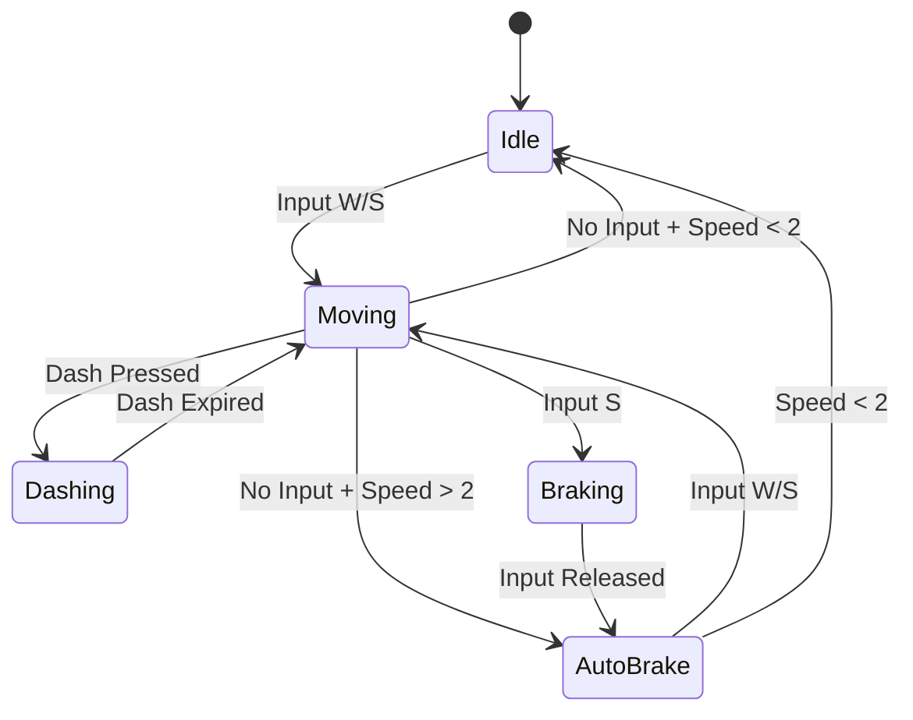
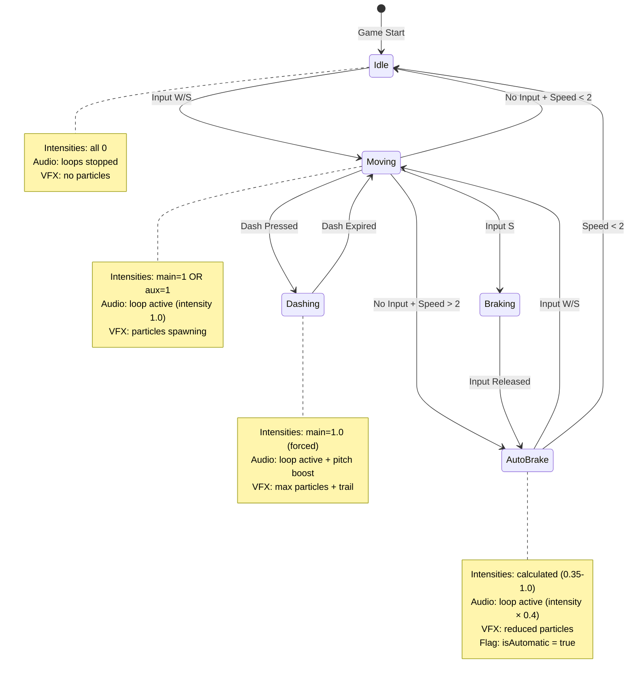
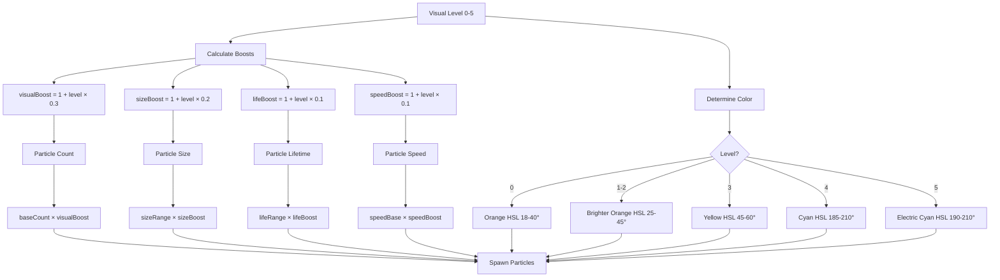
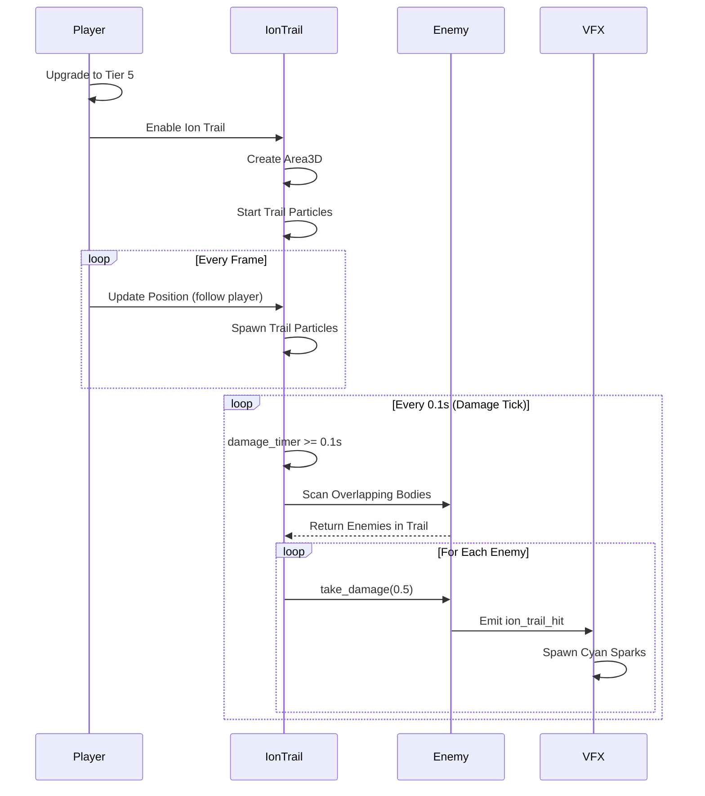

# Thruster System - Godot Migration Guide

## 1. Visão Geral do Sistema

### Conceito

Sistema de propulsão visual e sonoro que responde dinamicamente ao movimento do player e evolui com upgrades. Fornece feedback tátil através de efeitos visuais (particles) e sonoros (síntese procedural) que reforçam a sensação de controle e progressão de poder.

### Componentes Principais

- **4 thrusters independentes**: main (forward), aux (backward), sideL (CW rotation), sideR (CCW rotation)
- **5 níveis visuais progressivos**: blue basic (0) → enhanced blue (1-2) → bright yellow (3) → bright cyan (4) → electric cyan-blue (5)
- **3 fases de audio**: start burst (ignição) → continuous loop (sustain) → stop release (fade)
- **Ion trail damage** (tier 5): Trail que causa dano a inimigos (5 DPS sugerido)

### Propósito

Feedback visual/sonoro tátil que reforça sensação de controle e progressão de poder através de efeitos visuais e sonoros que evoluem com upgrades de mobilidade.

### ⚠️ CORREÇÃO IMPORTANTE

**Tier 5 usa Electric Cyan-Blue (HSL 190-210°), NÃO "white plasma"**. O código JavaScript usa cores cyan brilhantes, não branco.

---

## 2. Estrutura de Dados do Sistema

### Thruster Event Payload

Estrutura emitida a cada frame para cada thruster ativo:

```gdscript
{
    "position": Vector3,      # Posição world-space do thruster
    "direction": Vector3,     # Direção do thrust (normalizado)
    "intensity": float,       # Intensidade 0-1 (0 = off, 1 = max)
    "type": String,           # Tipo: "main", "aux", "side"
    "visual_level": int,      # Nível visual de upgrade (0-5)
    "is_automatic": bool      # Flag indicando auto-brake (opcional)
}
```

### Thruster State (PlayerSystem)

Estado interno do sistema de thrusters no player:

```gdscript
{
    "last_thruster_state": {
        "main": float,        # Intensidade anterior (0-1)
        "aux": float,
        "sideL": float,
        "sideR": float
    },
    "thruster_visual_level": int,    # Nível visual main (0-5)
    "rcs_visual_level": int,         # Nível visual RCS (0-5)
    "braking_visual_level": int      # Nível visual braking (0-3)
}
```

### Thruster Loop State (AudioSystem)

Estado de um loop de audio ativo:

```gdscript
{
    "type": String,           # "main", "retro", "side"
    "variation": int,         # Índice de variação (0-2)
    "intensity": float,       # Intensidade atual (0-1)
    "start_time": float,      # Timestamp de início
    "oscillators": Array,     # [sawOsc, squareOsc]
    "gains": Array,           # [sawGain, squareGain, noiseGain, masterGain]
    "source": BufferSource,   # Noise buffer source (looping)
    "filters": Array          # [bpFilter, hpf, peakLow, peakHigh]
}
```

### Implementação GDScript

```gdscript
class_name ThrusterSystem
extends Node3D

# Thruster nodes
var thruster_main: GPUParticles3D
var thruster_aux: GPUParticles3D
var thruster_side_l: GPUParticles3D
var thruster_side_r: GPUParticles3D
var ion_trail_area: Area3D  # Tier 5 only

# State
var last_thruster_state: Dictionary = {
    "main": 0.0,
    "aux": 0.0,
    "sideL": 0.0,
    "sideR": 0.0
}

# Visual levels
var thruster_visual_level: int = 0
var rcs_visual_level: int = 0
var braking_visual_level: int = 0

# Ion trail (tier 5)
var ion_trail_enabled: bool = false
var ion_trail_damage: float = 5.0  # DPS
var ion_trail_radius: float = 8.0

# Audio
var thruster_audio_players: Dictionary = {}  # type -> AudioStreamPlayer
var thruster_loop_active: Dictionary = {}    # type -> bool
```

**Fonte:** `PlayerSystem.js` linhas 100-158, `AudioSystem.js` linhas 17-306

---

## 3. Thruster Types (4 Thrusters Independentes)

### 3.1. Main Thruster (Forward)

| Propriedade      | Valor                                                     |
| ---------------- | --------------------------------------------------------- |
| **Posição**      | `getLocalToWorld(-SHIP_SIZE × 0.8, 0)` (traseira da nave) |
| **Direção**      | `forward` vector {cos(angle), sin(angle)}                 |
| **Ativação**     | Input W (up) OU auto-brake backward                       |
| **Visual Level** | `thrusterVisualLevel` (0-5)                               |
| **Audio Type**   | 'main'                                                    |
| **Frequency**    | 85 Hz ± 3 Hz                                              |

### 3.2. Aux Thruster (Backward/Braking)

| Propriedade      | Valor                                                  |
| ---------------- | ------------------------------------------------------ |
| **Posição**      | `getLocalToWorld(SHIP_SIZE × 0.8, 0)` (frente da nave) |
| **Direção**      | `-forward` vector {-cos(angle), -sin(angle)}           |
| **Ativação**     | Input S (down) OU auto-brake forward                   |
| **Visual Level** | `brakingVisualLevel` (0-3)                             |
| **Audio Type**   | 'retro'                                                |
| **Frequency**    | 95 Hz ± 4 Hz                                           |

### 3.3. Side Thrusters (Rotation)

#### SideL (Right rotation - CW)

- **Posição:** `getLocalToWorld(0, -SHIP_SIZE × 0.52)` (lado esquerdo)
- **Direção:** `getLocalDirection(0, 1)` (perpendicular)
- **Ativação:** Input D (right)
- **Visual Level:** `rcsVisualLevel` (0-5)
- **Audio Type:** 'side'
- **Frequency:** 110 Hz ± 5 Hz

#### SideR (Left rotation - CCW)

- **Posição:** `getLocalToWorld(0, SHIP_SIZE × 0.52)` (lado direito)
- **Direção:** `getLocalDirection(0, -1)` (perpendicular)
- **Ativação:** Input A (left)
- **Visual Level:** `rcsVisualLevel` (0-5)
- **Audio Type:** 'side'
- **Frequency:** 110 Hz ± 5 Hz

### Implementação Godot

```gdscript
func get_local_to_world(local: Vector2) -> Vector3:
    var cos_a = cos(angle)
    var sin_a = sin(angle)
    return Vector3(
        global_position.x + (local.x * cos_a - local.y * sin_a),
        0,
        global_position.z + (local.x * sin_a + local.y * cos_a)
    )

func get_local_direction(local: Vector2) -> Vector3:
    var cos_a = cos(angle)
    var sin_a = sin(angle)
    return Vector3(
        local.x * cos_a - local.y * sin_a,
        0,
        local.x * sin_a + local.y * cos_a
    )
```

**Fonte:** `PlayerSystem.js` linhas 741-794

---

## 4. Visual Progression (5 Níveis)

### Tabela de Progressão Visual

| Tier | Nome               | Color (Main)                             | Color (Side)                             | Particle Mult | Size Mult | Life Mult | Speed Mult | Spark Prob | Special          |
| ---- | ------------------ | ---------------------------------------- | ---------------------------------------- | ------------- | --------- | --------- | ---------- | ---------- | ---------------- |
| 0    | Blue Basic         | Orange HSL(18-40, 100%, 60-76%)          | Blue HSL(200-225, 100%, 70-88%)          | 1.0x          | 1.0x      | 1.0x      | 1.0x       | 25%        | -                |
| 1    | Enhanced Blue      | Brighter Orange HSL(25-45, 100%, 63-77%) | Blue HSL(200-225, 100%, 70-88%)          | 1.3x          | 1.2x      | 1.1x      | 1.1x       | 34%        | -                |
| 2    | Enhanced Blue      | Brighter Orange HSL(25-45, 100%, 63-77%) | Blue HSL(200-225, 100%, 70-88%)          | 1.6x          | 1.4x      | 1.2x      | 1.2x       | 43%        | -                |
| 3    | Bright Yellow      | Yellow HSL(45-60, 100%, 68-82%)          | Bright Cyan HSL(180-200, 100%, 75-90%)   | 1.9x          | 1.6x      | 1.3x      | 1.3x       | 52%        | -                |
| 4    | Bright Cyan        | Cyan HSL(185-210, 100%, 68-82%)          | Bright Cyan HSL(180-200, 100%, 75-90%)   | 2.2x          | 1.8x      | 1.4x      | 1.4x       | 61%        | -                |
| 5    | Electric Cyan-Blue | Electric Cyan HSL(190-210, 100%, 70-82%) | ELECTRIC CYAN HSL(180-190, 100%, 80-95%) | 2.5x          | 2.0x      | 1.5x      | 1.5x       | 70%        | Ion Trail Damage |

### Fórmulas de Scaling

```gdscript
visualBoost = 1 + (visualLevel × 0.3)  # Particles
sizeBoost = 1 + (visualLevel × 0.2)    # Size
lifeBoost = 1 + (visualLevel × 0.1)    # Lifetime
speedBoost = 1 + (visualLevel × 0.1)   # Speed
sparkProbability = 0.25 + (visualLevel × 0.09)
```

**Exemplo (Tier 5):**

```
visualBoost = 1 + (5 × 0.3) = 2.5x particles
sizeBoost = 1 + (5 × 0.2) = 2.0x size
lifeBoost = 1 + (5 × 0.1) = 1.5x lifetime
speedBoost = 1 + (5 × 0.1) = 1.5x speed
sparkProbability = 0.25 + (5 × 0.09) = 0.70 (70%)
```

### Implementação Godot

- Usar `GPUParticles3D` para cada thruster
- Modular `amount`, `lifetime`, `initial_velocity` baseado em visual level
- Usar `ParticleProcessMaterial` com `color_ramp` para gradient
- Shader customizado para glow effect (tier 4-5)

**Fonte:** `EffectsSystem.js` linhas 1959-2023, `mobility.js` linhas 48-153

---

## 5. VFX Algorithm (Spawn de Particles)

### Conceito

- Spawna N particles por thruster event (3-8 baseado em type e visual level)
- Cada particle tem: position, velocity, color, size, lifetime, type
- Spark particles adicionais (probability 25%-70%)
- Velocity: direção oposta ao thrust (-direction) com jitter

### Pseudocódigo GDScript

```gdscript
func spawn_thruster_vfx(
    world_pos: Vector3,
    direction: Vector3,
    intensity: float,
    type: String,
    visual_level: int
) -> void:
    var i = clamp(intensity, 0.0, 1.0)

    # Scaling baseado em visual level
    var visual_boost = 1.0 + visual_level * 0.3
    var size_boost = 1.0 + visual_level * 0.2
    var life_boost = 1.0 + visual_level * 0.1
    var speed_boost = 1.0 + visual_level * 0.1

    # Parâmetros por tipo
    var base_count: float
    var speed_base: float
    var size_range: Array
    var life_range: Array
    var color_fn: Callable

    match type:
        "main":
            base_count = 3.0 * visual_boost
            speed_base = 120.0 * speed_boost
            size_range = [2.0 * size_boost, 3.2 * size_boost]
            life_range = [0.22 * life_boost, 0.28 * life_boost]
            color_fn = func() -> Color:
                if visual_level >= 5:
                    # RANK 5: Electric cyan-blue
                    return Color.from_hsv(randf_range(0.528, 0.583), 1.0, randf_range(0.70, 0.82))
                elif visual_level >= 4:
                    # RANK 4: Bright cyan
                    return Color.from_hsv(randf_range(0.514, 0.583), 1.0, randf_range(0.68, 0.82))
                elif visual_level >= 3:
                    # RANK 3: Bright yellow
                    return Color.from_hsv(randf_range(0.125, 0.167), 1.0, randf_range(0.68, 0.82))
                elif visual_level >= 1:
                    # RANK 1-2: Brighter orange
                    return Color.from_hsv(randf_range(0.069, 0.125), 1.0, randf_range(0.63, 0.77))
                else:
                    # Base: Standard orange
                    return Color.from_hsv(randf_range(0.050, 0.111), 1.0, randf_range(0.60, 0.76))

        "aux":
            base_count = 2.0 * visual_boost
            speed_base = 105.0 * speed_boost
            size_range = [1.8 * size_boost, 2.6 * size_boost]
            life_range = [0.18 * life_boost, 0.26 * life_boost]
            color_fn = func() -> Color:
                if visual_level >= 3:
                    return Color.from_hsv(randf_range(0.528, 0.583), 1.0, randf_range(0.75, 0.90))
                else:
                    return Color.from_hsv(randf_range(0.556, 0.625), 1.0, randf_range(0.68, 0.86))

        "side":
            base_count = 2.0 * visual_boost
            speed_base = 110.0 * speed_boost
            size_range = [1.6 * size_boost, 2.2 * size_boost]
            life_range = [0.16 * life_boost, 0.22 * life_boost]
            color_fn = func() -> Color:
                if visual_level >= 5:
                    # RANK 5: ELECTRIC CYAN
                    return Color.from_hsv(randf_range(0.500, 0.528), 1.0, randf_range(0.80, 0.95))
                elif visual_level >= 3:
                    # RANK 3+: Bright cyan
                    return Color.from_hsv(randf_range(0.500, 0.556), 1.0, randf_range(0.75, 0.90))
                else:
                    # Base: Standard blue
                    return Color.from_hsv(randf_range(0.556, 0.625), 1.0, randf_range(0.70, 0.88))

    # Calcula particle count baseado em intensity
    var raw_count = base_count * (0.8 + i * 2.0)
    var count = int(raw_count)

    # Spawna particles
    for c in range(count):
        var jitter = (randf() - 0.5) * 0.35
        var spd = speed_base * (0.8 + i * 1.6) * (0.85 + randf() * 0.3)
        var vx = (-direction.x + jitter) * spd + (randf() - 0.5) * 20
        var vz = (-direction.z + jitter) * spd + (randf() - 0.5) * 20
        var size = size_range[0] + randf() * (size_range[1] - size_range[0])
        var life = life_range[0] + randf() * (life_range[1] - life_range[0])

        create_particle(
            world_pos + Vector3((randf() - 0.5) * 3, 0, (randf() - 0.5) * 3),
            Vector3(vx, 0, vz),
            color_fn.call(),
            size,
            life,
            "thruster"
        )

        # Spark particles (probability increases with visual level)
        var spark_probability = 0.25 + visual_level * 0.09
        if randf() < spark_probability:
            var spark_spd = spd * (0.9 + randf() * 0.3)
            var spark_size = (1.2 + randf() * 0.8) * size_boost
            create_particle(
                world_pos,
                Vector3(-direction.x * spark_spd, 0, -direction.z * spark_spd),
                Color.WHITE,
                spark_size,
                0.08 + randf() * 0.06,
                "spark"
            )
```

### Implementação Godot

- Usar `GPUParticles3D` com `one_shot = false` (continuous emission)
- Modular `emitting` baseado em intensity > 0
- Usar `ParticleProcessMaterial` com:
  - `emission_shape = EMISSION_SHAPE_SPHERE` (radius: 3)
  - `direction = -thrust_direction`
  - `initial_velocity_min/max` baseado em speed_base
  - `color_ramp` para gradient (fade to transparent)

**Fonte:** `EffectsSystem.js` linhas 1954-2068

---

## 6. Audio Architecture (ThrusterLoopManager)

### Conceito

- Gerencia loops contínuos de thruster (não one-shot sounds)
- Cada loop usa: 2 oscillators (sawtooth + square) + 1 noise buffer + 4 filters
- Master gain clamped a 0.5 (-6dB) no intensity máximo
- Loops são iniciados, atualizados e parados baseado em intensity thresholds

### Componentes de um Loop

1. **Oscillators:**

   - Sawtooth: gain 0.2, frequency baseFreq
   - Square: gain 0.3, frequency baseFreq

2. **Noise:**

   - Buffer looping (duration 0.8-1.2s)
   - Gain 0.25

3. **Filters:**

   - Bandpass: 1.2-6kHz (Q: 1.2)
   - Highpass: 70Hz
   - Peaking EQ Low: 250Hz, +2-3dB (warmth)
   - Peaking EQ High: 3000Hz, +1.5-2dB (presence)

4. **Master Gain:**
   - Clamped: `min(intensity, 1.0) × 0.5` (max -6dB)

### Signal Chain

```
[Sawtooth Osc] → [Saw Gain 0.2] ─┐
[Square Osc]   → [Square Gain 0.3] ├→ [Bandpass] → [Highpass] → [Peak Low] → [Peak High] → [Master Gain] → Output
[Noise Buffer] → [Noise Gain 0.25] ─┘
```

### Pseudocódigo GDScript

```gdscript
# Godot usa AudioStreamGenerator para síntese procedural
# Alternativa: Pre-renderizar loops e usar AudioStreamPlayer com pitch_scale

class_name ThrusterAudioLoop
extends AudioStreamPlayer

var thruster_type: String  # "main", "retro", "side"
var base_frequency: float  # 85, 95, 110 Hz
var intensity: float = 0.0
var is_active: bool = false

func start_loop(type: String, initial_intensity: float) -> void:
    thruster_type = type
    intensity = clamp(initial_intensity, 0.0, 1.0)

    match type:
        "main":
            base_frequency = 85.0
        "retro":
            base_frequency = 95.0
        "side":
            base_frequency = 110.0

    # Pitch modulation baseado em frequency
    pitch_scale = base_frequency / 100.0  # Normalizado

    # Volume baseado em intensity (clamped a -6dB)
    volume_db = linear_to_db(clamp(intensity, 0.0, 1.0) * 0.5)

    # Inicia playback
    play()
    is_active = true

func update_intensity(new_intensity: float) -> void:
    intensity = clamp(new_intensity, 0.0, 1.0)

    # Smooth ramp (0.05s)
    var tween = create_tween()
    tween.tween_property(self, "volume_db", linear_to_db(intensity * 0.5), 0.05)

func stop_loop() -> void:
    # Fade out suave
    var tween = create_tween()
    tween.tween_property(self, "volume_db", -80.0, 0.1)
    tween.tween_callback(stop)
    is_active = false
```

### Nota sobre Godot

Godot não tem Web Audio API. Alternativas:

1. **AudioStreamGenerator**: Síntese procedural em tempo real (complexo)
2. **Pre-rendered loops**: Renderizar loops offline, usar AudioStreamPlayer com pitch_scale (recomendado)
3. **Hybrid**: Usar AudioStreamPlayer para loop base + AudioStreamGenerator para modulação

**Fonte:** `AudioSystem.js` linhas 17-306

---

## 7. Audio Modulation (Pitch/Volume)

### Conceito

- Pitch e volume modulados por intensity (0-1)
- Intensity 0: silêncio
- Intensity 0.5: volume médio, pitch base
- Intensity 1.0: volume máximo (-6dB), pitch levemente aumentado

### Fórmulas

```
volume = clamp(intensity, 0, 1) × 0.5  // Max -6dB
pitch = baseFreq + variation

onde:
baseFreq = {main: 85, retro: 95, side: 110} Hz
variation = random(-3 a -5, +3 a +5) Hz (depende do tipo)
```

### Update Intensity (smooth ramp)

```gdscript
func update_loop_intensity(type: String, new_intensity: float) -> void:
    var loop = active_loops.get(type)
    if not loop:
        return

    loop.intensity = new_intensity

    # Smooth ramp (0.05s)
    var clamped_intensity = clamp(new_intensity, 0.0, 1.0) * 0.5

    # Godot equivalent (usando Tween)
    var tween = create_tween()
    tween.tween_property(loop, "volume_db", linear_to_db(clamped_intensity), 0.05)
```

### Implementação Godot

- Usar `AudioStreamPlayer.pitch_scale` para pitch modulation
- Usar `AudioStreamPlayer.volume_db` para volume modulation
- Usar `Tween` para smooth ramps (evita clicks)

**Fonte:** `AudioSystem.js` linhas 173-191, 3672-3725

---

## 8. Ion Trail System (Tier 5) - FEATURE NOVA

### Conceito

- Tier 5 upgrade ativa ion trail damage
- Trail segue player, causa dano a inimigos que tocam
- Damage over time: 5 DPS (sugestão)
- Trail radius: 8px (sugestão)
- Trail lifetime: 0.5s (sugestão)
- Visual: Particles cyan brilhantes com glow

### Parâmetros Sugeridos

```gdscript
const ION_TRAIL_DAMAGE = 5.0           # DPS
const ION_TRAIL_RADIUS = 8.0           # Collision radius
const ION_TRAIL_LIFETIME = 0.5         # Particle lifetime (s)
const ION_TRAIL_CHECK_INTERVAL = 0.1   # Damage tick rate (s)
```

### Algoritmo

1. Ao ativar tier 5: cria `Area3D` como child do player
2. A cada frame: spawna trail particles na posição atual
3. A cada 0.1s: escaneia inimigos dentro da Area3D, aplica damage tick
4. Particles têm lifetime 0.5s (trail desaparece gradualmente)

### Pseudocódigo GDScript

```gdscript
class_name IonTrailDamage
extends Area3D

const ION_TRAIL_DAMAGE = 5.0  # DPS
const ION_TRAIL_CHECK_INTERVAL = 0.1  # Damage tick rate

var damage_timer: float = 0.0
var trail_particles: GPUParticles3D

func _ready() -> void:
    # Setup collision
    var collision_shape = CollisionShape3D.new()
    collision_shape.shape = CylinderShape3D.new()
    collision_shape.shape.radius = 8.0
    collision_shape.shape.height = 2.0
    add_child(collision_shape)

    # Setup particles
    trail_particles = GPUParticles3D.new()
    trail_particles.amount = 50
    trail_particles.lifetime = 0.5
    trail_particles.emitting = true
    add_child(trail_particles)

    # Configure particle material
    var material = ParticleProcessMaterial.new()
    material.emission_shape = ParticleProcessMaterial.EMISSION_SHAPE_SPHERE
    material.emission_sphere_radius = 4.0
    material.direction = Vector3(0, 0, 0)  # Radial
    material.initial_velocity_min = 20.0
    material.initial_velocity_max = 40.0
    material.gravity = Vector3.ZERO
    material.color = Color(0.4, 0.9, 1.0, 0.8)  # Cyan brilhante
    trail_particles.process_material = material

func _process(delta: float) -> void:
    damage_timer += delta

    if damage_timer >= ION_TRAIL_CHECK_INTERVAL:
        damage_timer = 0.0
        apply_trail_damage()

func apply_trail_damage() -> void:
    var damage_tick = ION_TRAIL_DAMAGE * ION_TRAIL_CHECK_INTERVAL

    for body in get_overlapping_bodies():
        if body.is_in_group("enemies") and body.has_method("take_damage"):
            body.take_damage(damage_tick)
```

### Implementação Godot

- Criar `Area3D` como child do player (position relativa)
- Usar `CylinderShape3D` (radius: 8, height: 2) para collision
- Usar `GPUParticles3D` para trail visual (cyan glow)
- Damage tick a cada 0.1s (10 ticks/s × 0.5 damage = 5 DPS)
- Emitir signal `ion_trail_damage_applied` para VFX/SFX

**Nota:** Feature nova não implementada no JS, apenas evento `upgrade-ion-trail` emitido em `mobility.js`

---

## 9. Thruster States (Estados de Thruster)

### 9.1. Idle (Sem Input)

- **Intensities:** main=0, aux=0, sideL=0, sideR=0
- **Visual:** Nenhum particle
- **Audio:** Loops parados
- **Transição:** Input detectado → Moving

### 9.2. Moving (Com Input Linear)

- **Intensities:** main=1 (W) OU aux=1 (S)
- **Visual:** Particles spawning continuamente
- **Audio:** Loop ativo com intensity 1.0
- **Transição:** Input parado → Auto-brake OU Dash pressed → Dashing

### 9.3. Auto-brake (Drift System)

- **Intensities:** main=0.35-1.0 OU aux=0.35-1.0 (calculado por drift factor)
- **Visual:** Particles com intensity reduzida
- **Audio:** Loop ativo com intensity × 0.4 (60% reduction), sem burst/release
- **Flag:** `isAutomatic = true`
- **Transição:** Input detectado → Moving OU speed < 2 → Idle

### 9.4. Dashing (NOVO - não existe no JS)

- **Intensities:** main=1.0 (max intensity)
- **Visual:** Particles com max intensity + special trail
- **Audio:** Loop ativo com intensity 1.0 + pitch boost
- **Transição:** Dash expired → Moving

### 9.5. Braking (Input S)

- **Intensities:** aux=1.0
- **Visual:** Aux thruster particles (reverse direction)
- **Audio:** Retro loop ativo
- **Transição:** Input released → Auto-brake OU Idle

### State Machine Diagram



**Fonte:** `PlayerSystem.js` linhas 646-795

---

## 10. Intensity Calculation (Cálculo de Intensidade)

### Algoritmo

1. **Input-based:**

   - W (up): `thrMain = 1.0`
   - S (down): `thrAux = 1.0`
   - A (left): `thrSideR = 1.0`
   - D (right): `thrSideL = 1.0`

2. **Auto-brake (drift system):**

   - Se sem input linear E speed > 2:
     - Calcula projeção: `proj = velocity · forward`
     - Calcula kBase: `max(0.35, min(1, |proj| / (maxSpeed × 0.8)))`
     - Calcula k: `kBase × driftBrakeScale`
     - Se `proj > 0`: `thrAux = max(thrAux, k)`
     - Se `proj < 0`: `thrMain = max(thrMain, k)`

3. **Dash override (NOVO):**
   - Durante dash: `thrMain = 1.0` (force max)

### Pseudocódigo GDScript

```gdscript
func calculate_thruster_intensities(input: Dictionary, is_dashing: bool) -> Dictionary:
    var thr_main = 1.0 if input.up else 0.0
    var thr_aux = 1.0 if input.down else 0.0
    var thr_side_r = 1.0 if input.left else 0.0
    var thr_side_l = 1.0 if input.right else 0.0

    var is_main_manual = input.up
    var is_aux_manual = input.down

    # Dash override
    if is_dashing:
        thr_main = 1.0
        return {
            "main": thr_main,
            "aux": 0.0,
            "sideL": thr_side_l,
            "sideR": thr_side_r,
            "is_main_manual": false,
            "is_aux_manual": false
        }

    # Auto-brake
    var no_linear_input = not input.up and not input.down
    var speed = ship_velocity.length()

    if no_linear_input and speed > 2.0:
        var forward = Vector3(cos(angle), 0, sin(angle))
        var proj = ship_velocity.dot(forward)
        var k_base = max(0.35, min(1.0, abs(proj) / (max_speed * 0.8)))
        var k = k_base * drift_brake_scale

        if proj > 0:
            thr_aux = max(thr_aux, k)
        elif proj < 0:
            thr_main = max(thr_main, k)

    return {
        "main": thr_main,
        "aux": thr_aux,
        "sideL": thr_side_l,
        "sideR": thr_side_r,
        "is_main_manual": is_main_manual,
        "is_aux_manual": is_aux_manual
    }
```

### Implementação Godot

- Executar a cada frame em `_physics_process()`
- Emitir eventos thruster-effect para cada thruster ativo
- Usar `max()` para combinar auto-brake com input manual

**Fonte:** `PlayerSystem.js` linhas 646-693

---

## 11. Implementação Godot: Estrutura de Cena

### Scene: Player.tscn (thruster nodes)

```
Player (CharacterBody3D)
├─ Thrusters (Node3D)
│  ├─ ThrusterMain (GPUParticles3D)
│  │  ├─ position: Vector3(0, 0, SHIP_SIZE × 0.8)  # Traseira
│  │  ├─ rotation: Vector3(0, 180, 0)  # Aponta para trás
│  │  ├─ amount: 30
│  │  ├─ lifetime: 0.25
│  │  ├─ emitting: false
│  │  └─ process_material: ParticleProcessMaterial
│  ├─ ThrusterAux (GPUParticles3D)
│  │  ├─ position: Vector3(0, 0, -SHIP_SIZE × 0.8)  # Frente
│  │  ├─ rotation: Vector3(0, 0, 0)  # Aponta para frente
│  │  └─ (similar config)
│  ├─ ThrusterSideL (GPUParticles3D)
│  │  ├─ position: Vector3(-SHIP_SIZE × 0.52, 0, 0)  # Lado esquerdo
│  │  ├─ rotation: Vector3(0, -90, 0)  # Aponta para esquerda
│  │  └─ (similar config)
│  ├─ ThrusterSideR (GPUParticles3D)
│  │  ├─ position: Vector3(SHIP_SIZE × 0.52, 0, 0)  # Lado direito
│  │  ├─ rotation: Vector3(0, 90, 0)  # Aponta para direita
│  │  └─ (similar config)
│  └─ IonTrailArea (Area3D) - Tier 5 only
│     ├─ CollisionShape3D (CylinderShape3D, radius: 8, height: 2)
│     ├─ IonTrailParticles (GPUParticles3D)
│     └─ (script: IonTrailDamage.gd)
└─ ThrusterAudio (Node)
   ├─ ThrusterMainLoop (AudioStreamPlayer)
   ├─ ThrusterRetroLoop (AudioStreamPlayer)
   └─ ThrusterSideLoop (AudioStreamPlayer)
```

### ParticleProcessMaterial Config (Main Thruster)

```gdscript
var material = ParticleProcessMaterial.new()

# Emission
material.emission_shape = ParticleProcessMaterial.EMISSION_SHAPE_SPHERE
material.emission_sphere_radius = 3.0

# Direction (opposite to thrust)
material.direction = Vector3(0, 0, 1)  # Backward (local space)
material.spread = 20.0  # Cone spread

# Velocity
material.initial_velocity_min = 96.0  # 120 × 0.8
material.initial_velocity_max = 336.0  # 120 × 2.8

# Gravity
material.gravity = Vector3.ZERO

# Damping
material.damping_min = 0.5
material.damping_max = 1.0

# Scale
material.scale_min = 2.0
material.scale_max = 3.2

# Color (gradient)
var gradient = Gradient.new()
gradient.add_point(0.0, Color(1.0, 0.6, 0.2, 1.0))  # Orange
gradient.add_point(0.5, Color(1.0, 0.7, 0.3, 0.8))  # Lighter orange
gradient.add_point(1.0, Color(1.0, 0.8, 0.4, 0.0))  # Fade to transparent
material.color_ramp = gradient
```

### Script: Player.gd (thruster emission)

```gdscript
func emit_thruster_effects(
    forward: Vector3,
    intensities: Dictionary
) -> void:
    # Main thruster
    if intensities.main > 0 or last_thruster_state.main > 0:
        var thruster_pos = get_local_to_world(Vector2(-SHIP_SIZE * 0.8, 0))
        update_thruster_particles(thruster_main, intensities.main)
        EventBus.thruster_effect.emit({
            "position": thruster_pos,
            "direction": forward,
            "intensity": intensities.main,
            "type": "main",
            "visual_level": thruster_visual_level,
            "is_automatic": not intensities.is_main_manual
        })
        last_thruster_state.main = intensities.main

    # Aux thruster
    if intensities.aux > 0 or last_thruster_state.aux > 0:
        var thruster_pos = get_local_to_world(Vector2(SHIP_SIZE * 0.8, 0))
        update_thruster_particles(thruster_aux, intensities.aux)
        EventBus.thruster_effect.emit({
            "position": thruster_pos,
            "direction": -forward,
            "intensity": intensities.aux,
            "type": "aux",
            "visual_level": braking_visual_level,
            "is_automatic": not intensities.is_aux_manual
        })
        last_thruster_state.aux = intensities.aux

    # Side thrusters (similar)
    # ...

func update_thruster_particles(thruster: GPUParticles3D, intensity: float) -> void:
    thruster.emitting = intensity > 0.01

    if thruster.emitting:
        # Modula amount baseado em intensity
        var base_amount = 30
        thruster.amount = int(base_amount * (0.8 + intensity * 2.0))

        # Modula speed via process_material
        var material = thruster.process_material as ParticleProcessMaterial
        if material:
            material.initial_velocity_min = 96.0 * (0.8 + intensity * 1.6)
            material.initial_velocity_max = 336.0 * (0.8 + intensity * 1.6)
```

---

## 12. Tabela de Parâmetros Configuráveis

| Parâmetro                     | Valor Padrão | Descrição                      | Arquivo Origem          |
| ----------------------------- | ------------ | ------------------------------ | ----------------------- |
| **Visual Scaling**            |
| `VISUAL_BOOST_PARTICLES`      | 0.3          | Scaling de particles por level | `EffectsSystem.js:1961` |
| `VISUAL_BOOST_SIZE`           | 0.2          | Scaling de size por level      | `EffectsSystem.js:1962` |
| `VISUAL_BOOST_LIFETIME`       | 0.1          | Scaling de lifetime por level  | `EffectsSystem.js:1963` |
| `VISUAL_BOOST_SPEED`          | 0.1          | Scaling de speed por level     | `EffectsSystem.js:1964` |
| **Main Thruster VFX**         |
| `MAIN_BASE_COUNT`             | 3            | Particle count base            | `EffectsSystem.js:1970` |
| `MAIN_SPEED_BASE`             | 120          | Velocidade base (px/s)         | `EffectsSystem.js:1971` |
| `MAIN_SIZE_RANGE`             | [2.0, 3.2]   | Range de tamanho (px)          | `EffectsSystem.js:1972` |
| `MAIN_LIFE_RANGE`             | [0.22, 0.28] | Range de lifetime (s)          | `EffectsSystem.js:1973` |
| **Aux Thruster VFX**          |
| `AUX_BASE_COUNT`              | 2            | Particle count base            | `EffectsSystem.js:1994` |
| `AUX_SPEED_BASE`              | 105          | Velocidade base (px/s)         | `EffectsSystem.js:1995` |
| `AUX_SIZE_RANGE`              | [1.8, 2.6]   | Range de tamanho (px)          | `EffectsSystem.js:1996` |
| `AUX_LIFE_RANGE`              | [0.18, 0.26] | Range de lifetime (s)          | `EffectsSystem.js:1997` |
| **Side Thruster VFX**         |
| `SIDE_BASE_COUNT`             | 2            | Particle count base            | `EffectsSystem.js:2007` |
| `SIDE_SPEED_BASE`             | 110          | Velocidade base (px/s)         | `EffectsSystem.js:2008` |
| `SIDE_SIZE_RANGE`             | [1.6, 2.2]   | Range de tamanho (px)          | `EffectsSystem.js:2009` |
| `SIDE_LIFE_RANGE`             | [0.16, 0.22] | Range de lifetime (s)          | `EffectsSystem.js:2010` |
| **Spark Particles**           |
| `SPARK_PROBABILITY_BASE`      | 0.25         | Probabilidade base (25%)       | `EffectsSystem.js:2050` |
| `SPARK_PROBABILITY_PER_LEVEL` | 0.09         | Incremento por level (9%)      | `EffectsSystem.js:2050` |
| **Audio Frequencies**         |
| `MAIN_BASE_FREQ`              | 85           | Frequência base (Hz)           | `AudioSystem.js:57`     |
| `MAIN_FREQ_VARIATION`         | [-3, 3]      | Variação (Hz)                  | `AudioSystem.js:58`     |
| `RETRO_BASE_FREQ`             | 95           | Frequência base (Hz)           | `AudioSystem.js:61`     |
| `RETRO_FREQ_VARIATION`        | [-4, 4]      | Variação (Hz)                  | `AudioSystem.js:62`     |
| `SIDE_BASE_FREQ`              | 110          | Frequência base (Hz)           | `AudioSystem.js:66`     |
| `SIDE_FREQ_VARIATION`         | [-5, 5]      | Variação (Hz)                  | `AudioSystem.js:67`     |
| **Audio Durations**           |
| `MAIN_NOISE_DURATION`         | 1.2          | Noise buffer duration (s)      | `AudioSystem.js:59`     |
| `RETRO_NOISE_DURATION`        | 1.0          | Noise buffer duration (s)      | `AudioSystem.js:63`     |
| `SIDE_NOISE_DURATION`         | 0.8          | Noise buffer duration (s)      | `AudioSystem.js:68`     |
| **Audio Start Burst**         |
| `MAIN_BURST_DURATION`         | 0.24         | Burst duration (s)             | `AudioSystem.js:3756`   |
| `MAIN_BURST_PITCH_START`      | 90           | Pitch inicial (Hz)             | `AudioSystem.js:3757`   |
| `MAIN_BURST_PITCH_END`        | 120          | Pitch final (Hz)               | `AudioSystem.js:3758`   |
| `MAIN_BURST_GAIN`             | 0.15         | Gain peak                      | `AudioSystem.js:3759`   |
| **Audio Stop Release**        |
| `MAIN_RELEASE_DURATION`       | 0.20         | Release duration (s)           | `AudioSystem.js:3878`   |
| `MAIN_RELEASE_PITCH_START`    | 110          | Pitch inicial (Hz)             | `AudioSystem.js:3879`   |
| `MAIN_RELEASE_PITCH_END`      | 70           | Pitch final (Hz)               | `AudioSystem.js:3880`   |
| `MAIN_RELEASE_GAIN`           | 0.12         | Gain peak                      | `AudioSystem.js:3881`   |
| **Audio Filters**             |
| `BANDPASS_FREQ_MAIN`          | 3000         | Bandpass frequency (Hz)        | `AudioSystem.js:113`    |
| `BANDPASS_FREQ_RETRO`         | 2500         | Bandpass frequency (Hz)        | `AudioSystem.js:113`    |
| `BANDPASS_FREQ_SIDE`          | 3500         | Bandpass frequency (Hz)        | `AudioSystem.js:113`    |
| `BANDPASS_Q`                  | 1.2          | Bandpass Q factor              | `AudioSystem.js:114`    |
| `HIGHPASS_FREQ`               | 70           | Highpass frequency (Hz)        | `AudioSystem.js:119`    |
| `PEAKING_LOW_FREQ`            | 250          | Peaking EQ low (Hz)            | `AudioSystem.js:123`    |
| `PEAKING_LOW_GAIN`            | 2-3          | Peaking EQ low gain (dB)       | `AudioSystem.js:125`    |
| `PEAKING_HIGH_FREQ`           | 3000         | Peaking EQ high (Hz)           | `AudioSystem.js:129`    |
| `PEAKING_HIGH_GAIN`           | 1.5-2        | Peaking EQ high gain (dB)      | `AudioSystem.js:131`    |
| `LOWPASS_FREQ`                | 2800         | Lowpass frequency (Hz)         | `AudioSystem.js:3827`   |
| **Audio Intensity**           |
| `MASTER_GAIN_CLAMP`           | 0.5          | Max gain (-6dB)                | `AudioSystem.js:135`    |
| `AUTO_BRAKE_INTENSITY_MULT`   | 0.4          | Auto-brake reduction (60%)     | `AudioSystem.js:3682`   |
| **Ion Trail (Tier 5)**        |
| `ION_TRAIL_DAMAGE`            | 5.0          | Damage per second (DPS)        | Sugestão                |
| `ION_TRAIL_RADIUS`            | 8.0          | Trail radius (px)              | Sugestão                |
| `ION_TRAIL_LIFETIME`          | 0.5          | Particle lifetime (s)          | Sugestão                |
| `ION_TRAIL_CHECK_INTERVAL`    | 0.1          | Damage tick rate (s)           | Sugestão                |

---

## 13. Diagramas de Fluxo

### Diagrama 1: Thruster State Machine



### Diagrama 2: Audio Lifecycle (3 Fases)

```mermaid
sequenceDiagram
    participant Player
    participant Event
    participant Audio
    participant Loop

    Player->>Event: Emit thruster-effect (intensity: 0.8)
    Event->>Audio: handleThrusterEffect()
    Audio->>Audio: Check State (not active)

    alt Manual Thruster
        Audio->>Audio: Play Start Burst (triangle wave)
        Note over Audio: Pitch 90→120 Hz, 0.24s
        Audio->>Loop: Start Continuous Loop (delay 160ms)
        Loop->>Loop: Sawtooth + Square + Noise
        Note over Loop: Frequency 85 Hz, Gain 0.4
    else Auto-brake Thruster
        Audio->>Loop: Start Loop Immediately (no burst)
        Note over Loop: Intensity × 0.4 (60% reduction)
    end

    loop Every Frame (intensity > 0)
        Player->>Event: Emit thruster-effect (intensity: 0.6)
        Event->>Audio: handleThrusterEffect()
        Audio->>Loop: Update Intensity (smooth ramp 0.05s)
        Loop->>Loop: Master Gain = 0.6 × 0.5 = 0.3
    end

    Player->>Event: Emit thruster-effect (intensity: 0)
    Event->>Audio: handleThrusterEffect()
    Audio->>Loop: Stop Loop

    alt Manual Thruster
        Audio->>Audio: Play Stop Release (sine wave)
        Note over Audio: Pitch 110→70 Hz, 0.20s
    else Auto-brake Thruster
        Audio->>Audio: Skip Release (silent stop)
    end
```

### Diagrama 3: VFX Scaling por Visual Level



### Diagrama 4: Ion Trail Damage (Tier 5)



---

## 14. Color Palettes (HSL Ranges)

### Main Thruster (Forward)

| Tier | Color Name         | HSL Range                       | RGB Approx | Visual Description     |
| ---- | ------------------ | ------------------------------- | ---------- | ---------------------- |
| 0    | Standard Orange    | H: 18-40°, S: 100%, L: 60-76%   | #F26522    | Laranja padrão         |
| 1-2  | Brighter Orange    | H: 25-45°, S: 100%, L: 63-77%   | #F57C22    | Laranja mais brilhante |
| 3    | Bright Yellow      | H: 45-60°, S: 100%, L: 68-82%   | #FFD633    | Amarelo brilhante      |
| 4    | Bright Cyan        | H: 185-210°, S: 100%, L: 68-82% | #33D4FF    | Cyan brilhante         |
| 5    | Electric Cyan-Blue | H: 190-210°, S: 100%, L: 70-82% | #33DDFF    | Cyan elétrico azulado  |

### Aux Thruster (Braking)

| Tier | Color Name    | HSL Range                       | RGB Approx |
| ---- | ------------- | ------------------------------- | ---------- |
| 0-2  | Standard Blue | H: 200-225°, S: 100%, L: 68-86% | #33A3FF    |
| 3+   | Bright Cyan   | H: 190-210°, S: 100%, L: 75-90% | #66E6FF    |

### Side Thrusters (RCS)

| Tier | Color Name    | HSL Range                       | RGB Approx |
| ---- | ------------- | ------------------------------- | ---------- |
| 0-2  | Standard Blue | H: 200-225°, S: 100%, L: 70-88% | #33AAFF    |
| 3-4  | Bright Cyan   | H: 180-200°, S: 100%, L: 75-90% | #66EEFF    |
| 5    | ELECTRIC CYAN | H: 180-190°, S: 100%, L: 80-95% | #99F5FF    |

### Conversão HSL → Godot

```gdscript
# Godot usa Color.from_hsv(h, s, v)
# HSL → HSV conversion:
# H: same (0-1 range, divide degrees by 360)
# S: same
# V: L + S × min(L, 1-L)

func hsl_to_color(h_deg: float, s: float, l: float) -> Color:
    var h = h_deg / 360.0
    var v = l + s * min(l, 1.0 - l)
    var s_v = 0.0 if v == 0 else 2.0 * (1.0 - l / v)
    return Color.from_hsv(h, s_v, v)

# Exemplo: Orange HSL(30°, 100%, 68%)
var orange = hsl_to_color(30, 1.0, 0.68)
# Resultado: Color(0.965, 0.545, 0.136) ≈ #F68B22
```

**Fonte:** `EffectsSystem.js` linhas 1975-2022

---

## 15. Audio Filters (EQ Chain)

### Filter Chain

```
Input (Osc + Noise) → Bandpass → Highpass → Peaking Low → Peaking High → Master Gain → Output
```

### Especificações

| Filter                  | Type     | Frequency                                       | Q   | Gain      | Purpose                                    |
| ----------------------- | -------- | ----------------------------------------------- | --- | --------- | ------------------------------------------ |
| Bandpass                | bandpass | 3000 Hz (main), 2500 Hz (retro), 3500 Hz (side) | 1.2 | -         | Isola faixa característica de thruster     |
| Highpass                | highpass | 70 Hz                                           | -   | -         | Remove rumble subsônico                    |
| Peaking Low             | peaking  | 250 Hz                                          | 1.0 | +2-3 dB   | Adiciona warmth (graves)                   |
| Peaking High            | peaking  | 3000 Hz                                         | 1.0 | +1.5-2 dB | Adiciona presence (médios-altos)           |
| Lowpass (burst/release) | lowpass  | 1200-2800 Hz                                    | 0.5 | -         | Remove harshness (apenas em burst/release) |

### Frequency Response (aproximado)

```
  Gain (dB)
    +3 ┤     ╭─╮              ╭─╮
    +2 ┤    ╱   ╲            ╱   ╲
    +1 ┤   ╱     ╲          ╱     ╲
     0 ┼──╯       ╰────────╯       ╰──────
    -3 ┤
       └─────────────────────────────────→ Freq (Hz)
         70   250      3000      6000
         HP   Peak1    Peak2     BP cutoff
```

### Implementação Godot

Godot não tem Web Audio API. Alternativas:

1. **AudioEffectFilter**: Usar `AudioEffectHighPassFilter`, `AudioEffectLowPassFilter`, `AudioEffectEQ` no AudioBus
2. **Pre-processing**: Aplicar filters offline ao renderizar loops, usar AudioStreamPlayer
3. **Shader Audio**: Usar compute shader para síntese (avançado)

**Recomendação:** Pre-renderizar 3 loops (main, retro, side) com filters aplicados, usar AudioStreamPlayer com pitch_scale/volume_db modulation.

**Fonte:** `AudioSystem.js` linhas 110-145

---

## 16. Integration com Outros Sistemas

### 16.1. Player System

**Eventos emitidos:**

```gdscript
# Player.gd
func emit_thruster_effects(forward: Vector3, intensities: Dictionary) -> void:
    # Main thruster
    if intensities.main > 0 or last_thruster_state.main > 0:
        var thruster_pos = get_local_to_world(Vector2(-SHIP_SIZE * 0.8, 0))
        EventBus.thruster_effect.emit({
            "position": thruster_pos,
            "direction": forward,
            "intensity": intensities.main,
            "type": "main",
            "visual_level": thruster_visual_level,
            "is_automatic": not intensities.is_main_manual
        })
    # ... outros thrusters
```

### 16.2. Effects System

**Eventos consumidos:**

```gdscript
# EffectsSystem.gd
func _ready() -> void:
    EventBus.thruster_effect.connect(_on_thruster_effect)

func _on_thruster_effect(data: Dictionary) -> void:
    spawn_thruster_vfx(
        data.position,
        data.direction,
        data.intensity,
        data.type,
        data.visual_level
    )
```

### 16.3. Audio System

**Eventos consumidos:**

```gdscript
# AudioSystem.gd
func _ready() -> void:
    EventBus.thruster_effect.connect(_on_thruster_effect)

func _on_thruster_effect(data: Dictionary) -> void:
    var type = data.type
    var intensity = data.intensity
    var is_automatic = data.get("is_automatic", false)

    # Adjust intensity for auto-brake
    if is_automatic:
        intensity *= 0.4  # 60% reduction

    # Start/update/stop loop
    if intensity > 0.05:
        if not thruster_loop_active.get(type, false):
            start_thruster_loop(type, intensity, is_automatic)
        else:
            update_thruster_loop(type, intensity)
    else:
        if thruster_loop_active.get(type, false):
            stop_thruster_loop(type, is_automatic)
```

### 16.4. Upgrade System

**Eventos consumidos:**

```gdscript
# Player.gd
func _ready() -> void:
    EventBus.upgrade_thruster_visual.connect(_on_upgrade_thruster_visual)
    EventBus.upgrade_ion_trail.connect(_on_upgrade_ion_trail)

func _on_upgrade_thruster_visual(data: Dictionary) -> void:
    thruster_visual_level = data.level

func _on_upgrade_ion_trail(data: Dictionary) -> void:
    ion_trail_enabled = data.enabled
    if ion_trail_enabled and not ion_trail_area:
        # Create ion trail area
        ion_trail_area = preload("res://entities/player/IonTrailDamage.tscn").instantiate()
        add_child(ion_trail_area)
```

---

## 17. Performance Optimization

### 17.1. Particle Pooling

```gdscript
# Reusar GPUParticles3D instances ao invés de criar/destruir
class_name ParticlePool
extends Node

var pool: Array[GPUParticles3D] = []
var active_particles: Array[GPUParticles3D] = []

func get_particle() -> GPUParticles3D:
    if pool.is_empty():
        var particle = GPUParticles3D.new()
        # Configure particle...
        return particle
    else:
        var particle = pool.pop_back()
        active_particles.append(particle)
        return particle

func return_particle(particle: GPUParticles3D) -> void:
    particle.emitting = false
    active_particles.erase(particle)
    pool.append(particle)
```

### 17.2. Audio Pooling

```gdscript
# Limitar número de loops simultâneos
const MAX_THRUSTER_LOOPS = 4  # main, aux, sideL, sideR

# Reuse AudioStreamPlayer instances
var audio_pool: Dictionary = {}

func get_audio_player(type: String) -> AudioStreamPlayer:
    if not audio_pool.has(type):
        audio_pool[type] = AudioStreamPlayer.new()
        add_child(audio_pool[type])
    return audio_pool[type]
```

### 17.3. LOD (Level of Detail)

```gdscript
# Reduzir qualidade de thrusters baseado em distância da camera
func update_thruster_lod(distance_to_camera: float) -> void:
    if distance_to_camera > 100:
        # Far: reduce particles, disable audio
        thruster_main.amount = 10
        thruster_audio_players["main"].volume_db = -80
    elif distance_to_camera > 50:
        # Medium: reduce particles
        thruster_main.amount = 20
    else:
        # Near: full quality
        thruster_main.amount = 30
```

### 17.4. Batch Emission

```gdscript
# Agrupar emission de múltiplos thrusters num único frame
func _physics_process(delta: float) -> void:
    var intensities = calculate_thruster_intensities(input, is_dashing)

    # Emit all thrusters em batch
    emit_thruster_effects(forward, intensities)

    # Update all audio loops em batch
    update_all_audio_loops(intensities)
```

### 17.5. Optimization Tips

- **Particle Count:** Ajustar `amount` baseado em settings gráficos
- **Audio Quality:** Usar 22050 Hz sample rate para loops (ao invés de 44100 Hz)
- **Trail Damage:** Usar `PhysicsServer3D.area_get_overlapping_bodies()` ao invés de polling
- **Color Ramps:** Pre-calcular gradients ao invés de calcular por particle
- **Shader Compilation:** Pre-compile shaders no loading screen

---

## 18. Referências

### Arquivos JavaScript Analisados

| Arquivo              | Linhas Relevantes | Descrição                                                 |
| -------------------- | ----------------- | --------------------------------------------------------- |
| **PlayerSystem.js**  | 100-158           | Estrutura de dados do thruster state                      |
| **PlayerSystem.js**  | 646-693           | Intensity calculation (input + auto-brake)                |
| **PlayerSystem.js**  | 741-794           | Thruster emission (4 thrusters, positions, directions)    |
| **EffectsSystem.js** | 1954-2068         | VFX spawn algorithm (particles, colors, sparks)           |
| **EffectsSystem.js** | 1959-2023         | Visual progression scaling (5 tiers)                      |
| **EffectsSystem.js** | 1975-2022         | Color palettes (HSL ranges)                               |
| **AudioSystem.js**   | 17-306            | ThrusterLoopManager (oscillators, noise, filters)         |
| **AudioSystem.js**   | 110-145           | Audio filter chain (bandpass, highpass, peaking EQ)       |
| **AudioSystem.js**   | 173-191           | Audio modulation (pitch/volume formulas)                  |
| **AudioSystem.js**   | 3624-3923         | Thruster sound management (3 fases: burst, loop, release) |
| **AudioSystem.js**   | 3672-3725         | Audio intensity modulation                                |
| **AudioSystem.js**   | 3756-3881         | Burst/release parameters (pitch, duration, gain)          |
| **mobility.js**      | 48-153            | Upgrade progression (5 tiers)                             |
| **mobility.js**      | 143-153           | Tier 5 ion trail event emission                           |

### Funções-Chave

```javascript
// PlayerSystem.js
getLocalToWorld(x, y); // Converte posição local → world
getLocalDirection(x, y); // Converte direção local → world
calculateThrusterIntensities(); // Calcula intensidades (input + auto-brake)
emitThrusterEffects(); // Emite eventos thruster-effect

// EffectsSystem.js
handleThrusterEffect(event); // Handler de evento thruster-effect
spawnThrusterParticles(); // Spawna particles com scaling
calculateVisualBoost(level); // Calcula multipliers de visual level
getThrusterColor(type, level); // Retorna cor HSL baseado em type/level

// AudioSystem.js
ThrusterLoopManager.createLoop(); // Cria loop de audio (osc + noise + filters)
ThrusterLoopManager.updateLoop(); // Atualiza intensity do loop
handleThrusterEffect(event); // Handler de evento thruster-effect (audio)
playStartBurst(); // Play start burst (triangle wave)
playStopRelease(); // Play stop release (sine wave)
```

### Eventos Emitidos/Consumidos

| Evento                     | Emissor        | Consumidor                 | Payload                                                            |
| -------------------------- | -------------- | -------------------------- | ------------------------------------------------------------------ |
| `thruster-effect`          | PlayerSystem   | EffectsSystem, AudioSystem | {position, direction, intensity, type, visual_level, is_automatic} |
| `upgrade-thruster-visual`  | Upgrade System | PlayerSystem               | {level: 0-5}                                                       |
| `upgrade-ion-trail`        | Upgrade System | PlayerSystem               | {enabled: true}                                                    |
| `ion-trail-damage-applied` | IonTrailDamage | VFX System                 | {enemy, damage, position}                                          |

### Conceitos JS → Godot

| JavaScript          | Godot                  | Notas                                             |
| ------------------- | ---------------------- | ------------------------------------------------- |
| `Particle` object   | `GPUParticles3D`       | Usar ParticleProcessMaterial para config          |
| `AudioContext`      | `AudioStreamPlayer`    | Pre-renderizar loops OU usar AudioStreamGenerator |
| `OscillatorNode`    | `AudioStreamGenerator` | Síntese procedural (complexo)                     |
| `BiquadFilterNode`  | `AudioEffectFilter`    | Aplicar no AudioBus                               |
| `GainNode`          | `volume_db` property   | Converter linear → dB                             |
| `EventEmitter`      | `Signal`               | Sistema de sinais Godot                           |
| `setTimeout`        | `Timer` node           | Criar Timer para delays                           |
| `getLocalToWorld()` | `Transform3D.origin`   | Usar transform do Node3D                          |
| HSL color           | `Color.from_hsv()`     | Converter HSL → HSV primeiro                      |

### Recursos Adicionais

- **Godot Particles**: https://docs.godotengine.org/en/stable/classes/class_gpuparticles3d.html
- **Godot Audio**: https://docs.godotengine.org/en/stable/tutorials/audio/audio_streams.html
- **AudioStreamGenerator**: https://docs.godotengine.org/en/stable/classes/class_audiostreamgenerator.html
- **Color Conversion**: https://en.wikipedia.org/wiki/HSL_and_HSV

---

## Conclusão

Este documento fornece uma referência completa para implementar o sistema de thrusters em Godot 3D. As especificações incluem:

✅ **4 thrusters independentes** com posições e direções precisas
✅ **5 níveis visuais** com scaling progressivo e color palettes
✅ **VFX algorithm** com pseudocódigo GDScript completo
✅ **Audio architecture** com 3 fases (burst, loop, release)
✅ **Ion trail damage** (tier 5) com mecânica de damage over time
✅ **Thruster states** e state machine diagram
✅ **Intensity calculation** com auto-brake e dash override
✅ **Implementação Godot** com scene structure e scripts
✅ **Tabela de parâmetros** configuráveis com valores originais
✅ **Diagramas de fluxo** (Mermaid) para visualização
✅ **Color palettes** com conversão HSL → Godot
✅ **Audio filters** e EQ chain specs
✅ **Integration** com Player, Effects, Audio, Upgrades
✅ **Performance** optimization tips
✅ **Referências** completas aos arquivos JavaScript

**Próximos Passos:**

1. Implementar `ThrusterSystem.gd` baseado na estrutura de dados (seção 2)
2. Criar scene `Player.tscn` com 4 GPUParticles3D nodes (seção 11)
3. Implementar `spawn_thruster_vfx()` function (seção 5)
4. Pre-renderizar audio loops ou implementar AudioStreamGenerator (seção 6)
5. Implementar `IonTrailDamage.gd` para tier 5 (seção 8)
6. Testar integração com Player, Effects, Audio systems (seção 16)
7. Otimizar performance usando pooling e LOD (seção 17)
