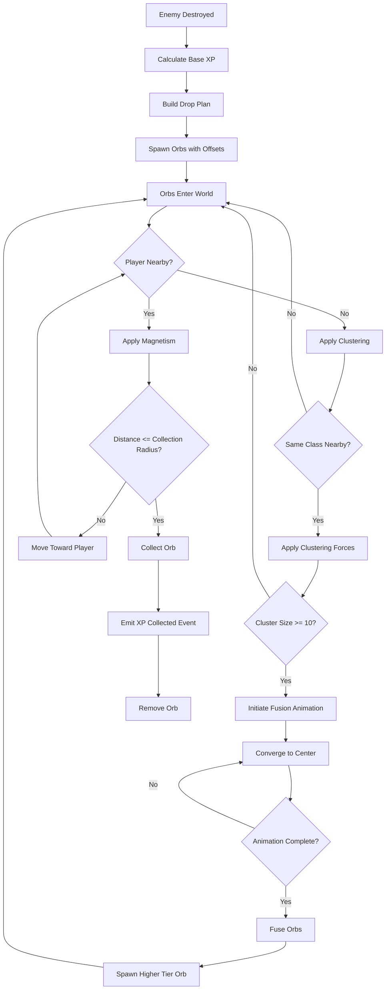
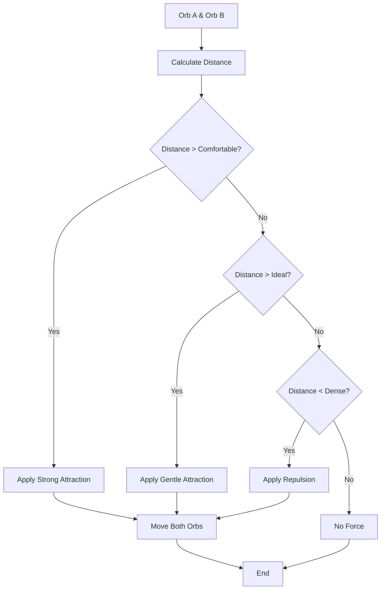
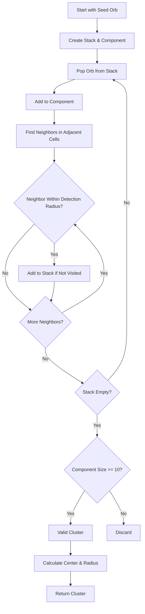

# Sistema de XP Orbs - Migração para Godot 3D

## 1. Visão Geral do Sistema

O sistema de XP Orbs é um mecanismo de progressão visual e tátil que recompensa o jogador por agrupar orbs espacialmente, permitindo fusões em tiers superiores. Os orbs são coletáveis que spawnam quando inimigos são destruídos, são atraídos magneticamente ao jogador e se agrupam entre si da mesma classe, fundindo-se em orbs de maior valor quando formam clusters suficientes.

### Conceito

- **Orbs como coletáveis dinâmicos**: Diferente de itens estáticos, os orbs se movem ativamente no mundo, criando uma experiência interativa
- **Progressão geométrica**: Cada tier concede 3x mais XP que o anterior (5 → 15 → 45 → 135 → 405 → 1215)
- **Recompensa por habilidade**: Agrupar orbs manualmente requer timing e posicionamento, tornando a coleta mais engajante

### 6 Tiers Progressivos

| Tier | Classe  | Valor XP | Cor     | Descrição                               |
| ---- | ------- | -------- | ------- | --------------------------------------- |
| 1    | Blue    | 5        | #4A90E2 | Orb básico, spawna de inimigos pequenos |
| 2    | Green   | 15       | #50C878 | Fusão de 10 blues                       |
| 3    | Yellow  | 45       | #FFD700 | Fusão de 10 greens                      |
| 4    | Purple  | 135      | #9B59B6 | Fusão de 10 yellows                     |
| 5    | Red     | 405      | #E74C3C | Fusão de 10 purples                     |
| 6    | Crystal | 1215     | #00FFFF | Fusão de 10 reds                        |

### Propósito no Gameplay

- **Sistema de progressão**: XP concede experiência para upgrades
- **Feedback visual**: Animações de fusão criam satisfação imediata
- **Recompensa por eficiência**: Jogadores habilidosos ganham mais XP agrupando orbs
- **Elemento de risco/recompensa**: Deixar orbs se fundirem vs. coletar imediatamente

## 2. Estrutura de Dados do Orb

Baseado em `XPOrbSystem.js` linhas 382-398, cada orb possui 17 campos que controlam seu estado completo.

### Campos Principais

| Campo            | Tipo        | Descrição                                  | Valor Padrão |
| ---------------- | ----------- | ------------------------------------------ | ------------ |
| `id`             | String      | UUID único gerado por RandomService        | -            |
| `x, y`           | float       | Posição 2D no mundo (plane XZ no Godot 3D) | -            |
| `value`          | int         | XP concedido ao ser coletado               | 5            |
| `class`          | String      | Classe visual ("blue", "green", etc.)      | "blue"       |
| `tier`           | int         | Tier numérico (1-6)                        | 1            |
| `collected`      | bool        | Flag de coleta (pendente remoção)          | false        |
| `age`            | float       | Tempo de vida em segundos                  | 0.0          |
| `isFusing`       | bool        | Em animação de fusão                       | false        |
| `fusionTimer`    | float       | Timer da animação (0 a duration)           | 0.0          |
| `pulsePhase`     | float       | Fase da animação de pulso (0-2π)           | 0.0          |
| `clusterId`      | String/null | ID do cluster atual                        | null         |
| `source`         | String      | Origem ("drop" ou "fusion")                | "drop"       |
| `pendingRemoval` | bool        | Flag de remoção pendente                   | false        |
| `active`         | bool        | Orb ativo no jogo                          | false        |

### Mapeamento GDScript

```gdscript
class_name XPOrb
extends Area3D

var orb_id: String
var value: int
var orb_class: String  # "blue", "green", etc.
var tier: int
var collected: bool = false
var age: float = 0.0
var is_fusing: bool = false
var fusion_timer: float = 0.0
var pulse_phase: float = 0.0
var cluster_id: String = ""
var source: String = "drop"  # "drop" or "fusion"
var pending_removal: bool = false
var is_active: bool = false
```

### Notas de Implementação

- **Posição 2D→3D**: Campos `x,y` mapeiam para `position.x,z` (Y=0 para plano)
- **UUID**: Gerar via `RandomService` ou Godot's `UUIDTools`
- **Pooling**: Campos `active` e `pendingRemoval` controlam lifecycle
- **Estado**: `collected` marca para remoção, `isFusing` previne interações

## 3. Spatial Hashing (Indexação Espacial)

Algoritmo baseado em `XPOrbSystem.js` linhas 893-940 para detecção eficiente de vizinhos.

### Conceito

- **Grid-based partitioning**: Divide espaço em células quadradas
- **Cell size dinâmico**: `max(fusionDetectionRadius, 24)` pixels
- **Separação por classe**: Orbs agrupados por classe ("blue", "green", etc.)
- **Index sujo**: Reconstruído quando orbs se movem (`spatialIndexDirty`)

### Pseudocódigo GDScript

```gdscript
func build_spatial_index() -> Dictionary:
    var index = {}
    var cell_size = max(fusion_detection_radius, 24.0)

    for orb_class in ORB_CLASSES:
        var pool = orb_pools[orb_class]
        var active_orbs = pool.filter(func(o): return is_orb_active(o))

        if active_orbs.is_empty():
            continue

        var class_data = {
            "cell_size": cell_size,
            "cells": {},
            "orbs": active_orbs
        }

        for orb in active_orbs:
            var cell_x = int(orb.position.x / cell_size)
            var cell_z = int(orb.position.z / cell_size)  # Z no Godot 3D
            var key = "%d:%d" % [cell_x, cell_z]

            if not class_data.cells.has(key):
                class_data.cells[key] = []
            class_data.cells[key].append(orb)

        index[orb_class] = class_data

    spatial_index_dirty = false
    return index
```

### Implementação Godot

- **Dictionary como Map**: Equivalente ao `Map` do JavaScript
- **Reconstrução lazy**: Só quando `spatial_index_dirty = true`
- **Cell size configurável**: Baseado em raio de fusão
- **Performance**: O(n) vs O(n²) para queries de vizinhos

## 4. Magnetismo ao Player

Algoritmo baseado em `XPOrbSystem.js` linhas 942-1086 para atração ao jogador.

### Conceito

- **Atração progressiva**: Orbs atraídos dentro de raio configurável (70px)
- **Boost de proximidade**: Força aumenta quanto mais próximo do jogador
- **Coleta automática**: Quando entra em raio de coleta (ship + orb + padding)
- **Spatial queries**: Usa index para eficiência com centenas de orbs

### Parâmetros

- `magnetismRadius`: Raio de atração (70px, upgradável)
- `magnetismForce`: Força base (150)
- `magnetismBoost`: Multiplicador de proximidade (2.2)
- `collectionRadius`: Raio de coleta automático

### Pseudocódigo GDScript

```gdscript
func update_ship_magnetism(delta: float) -> void:
    var player_pos = player.global_position
    var magnetism_radius = player.get_magnetism_radius()  # Pode ser upgradado
    var magnetism_radius_sq = magnetism_radius * magnetism_radius
    var collection_radius = SHIP_SIZE + ORB_SIZE + (MIN_ORB_DISTANCE * COLLECTION_PADDING)
    var collection_radius_sq = collection_radius * collection_radius

    var index = ensure_spatial_index()
    var cell_size = magnetism_radius  # Aproximação
    var search_range = int(ceil((magnetism_radius + MIN_ORB_DISTANCE) / cell_size))
    var center_cell_x = int(player_pos.x / cell_size)
    var center_cell_z = int(player_pos.z / cell_size)

    for orb_class in index.keys():
        var class_data = index[orb_class]

        for offset_x in range(-search_range, search_range + 1):
            for offset_z in range(-search_range, search_range + 1):
                var key = "%d:%d" % [center_cell_x + offset_x, center_cell_z + offset_z]
                if not class_data.cells.has(key):
                    continue

                var bucket = class_data.cells[key]
                for orb in bucket:
                    if not is_orb_active(orb) or orb.is_fusing:
                        continue

                    var dx = player_pos.x - orb.position.x
                    var dz = player_pos.z - orb.position.z
                    var distance_sq = dx * dx + dz * dz

                    # Coleta imediata se muito próximo
                    if distance_sq <= collection_radius_sq:
                        collect_orb(orb)
                        continue

                    # Aplica magnetismo se dentro do raio
                    if distance_sq > 0 and distance_sq <= magnetism_radius_sq:
                        var distance = sqrt(distance_sq)
                        var normalized_dx = dx / distance
                        var normalized_dz = dz / distance
                        var proximity = 1.0 - min(distance / magnetism_radius, 1.0)
                        var magnet_boost = 1.0 + proximity * MAGNETISM_BOOST
                        var speed = MAGNETISM_FORCE * magnet_boost
                        var step = speed * delta

                        orb.position.x += normalized_dx * step
                        orb.position.z += normalized_dz * step

                        # Verifica coleta após movimento
                        var post_dx = player_pos.x - orb.position.x
                        var post_dz = player_pos.z - orb.position.z
                        if post_dx * post_dx + post_dz * post_dz <= collection_radius_sq:
                            collect_orb(orb)

    invalidate_spatial_index()
```

### Implementação Godot

- **Area3D para coleta**: Signal `body_entered` detecta player
- **Movimento manual**: Via `position.x/z` (sem física)
- **Spatial queries customizadas**: Mais eficiente que `get_overlapping_bodies`

## 5. Clustering entre Orbs

Algoritmo baseado em `XPOrbSystem.js` linhas 1088-1263 para agrupamento.

### Conceito

- **3 zonas de spacing**: Baseadas em `minOrbDistance` (18px)
  - **Comfortable** (>1.12x min): Atração forte
  - **Ideal** (0.95x-1.12x min): Atração suave
  - **Dense** (<0.75x min): Repulsão
- **Forças proporcionais**: Closeness aumenta intensidade
- **Movimento simétrico**: Ambos orbs se movem

### Parâmetros (de `gameplay.js` linhas 25-45)

```javascript
XP_ORB_CLUSTER_CONFIG = {
  radiusMultiplier: 1.55, // Raio de clustering = minOrbDistance * 1.55
  minRadius: 52, // Raio mínimo absoluto
  forceMultiplier: 2.4, // Multiplicador de força base
  detectionRadiusFactor: 0.85, // Fator para raio de detecção de fusão
  detectionMinRadius: 48, // Raio mínimo de detecção
  comfortableSpacingFactor: 1.12, // Zona comfortable
  idealSpacingFactor: 0.95, // Zona ideal
  denseSpacingFactor: 0.75, // Zona dense
  comfortableForceBase: 0.5, // Força base comfortable
  comfortableForceCloseness: 1.5, // Multiplicador de proximidade
  comfortableForceOffset: 30, // Offset de força
  comfortableStepClamp: 0.9, // Clamp de movimento
  comfortableMovementFactor: 0.5, // Fator de movimento
  idealForceBase: 0.3, // Força base ideal
  idealForceCloseness: 1.1,
  idealForceOffset: 18,
  idealStepClamp: 0.6,
  idealMovementFactor: 0.5,
  densePushFactor: 0.5, // Fator de repulsão dense
};
```

### Pseudocódigo GDScript

```gdscript
func update_orb_clustering(delta: float) -> void:
    if orb_cluster_radius <= 0 or orb_cluster_force <= 0:
        return

    var index = ensure_spatial_index()
    var cluster_radius_sq = orb_cluster_radius * orb_cluster_radius
    var comfortable_spacing = MIN_ORB_DISTANCE * COMFORTABLE_SPACING_FACTOR
    var ideal_spacing = MIN_ORB_DISTANCE * IDEAL_SPACING_FACTOR
    var dense_spacing = MIN_ORB_DISTANCE * DENSE_SPACING_FACTOR

    for orb_class in index.keys():
        var class_data = index[orb_class]
        var orbs = class_data.orbs
        var cells = class_data.cells
        var cell_size = class_data.cell_size

        if orbs.size() < 2:
            continue

        for orb_a in orbs:
            if not is_orb_eligible_for_fusion(orb_a):
                continue

            var cell_x = int(orb_a.position.x / cell_size)
            var cell_z = int(orb_a.position.z / cell_size)

            # Itera células vizinhas (3x3 grid)
            for offset_x in [-1, 0, 1]:
                for offset_z in [-1, 0, 1]:
                    var key = "%d:%d" % [cell_x + offset_x, cell_z + offset_z]
                    if not cells.has(key):
                        continue

                    var neighbors = cells[key]
                    for orb_b in neighbors:
                        if orb_a == orb_b or not is_orb_eligible_for_fusion(orb_b):
                            continue

                        var dx = orb_b.position.x - orb_a.position.x
                        var dz = orb_b.position.z - orb_a.position.z
                        var distance_sq = dx * dx + dz * dz

                        if distance_sq <= 0 or distance_sq > cluster_radius_sq:
                            continue

                        var distance = sqrt(distance_sq)
                        var normalized_dx = dx / distance
                        var normalized_dz = dz / distance
                        var closeness = max(1.0 - distance / orb_cluster_radius, 0.0)

                        # ZONA COMFORTABLE: Atração forte
                        if distance > comfortable_spacing:
                            var base_strength = orb_cluster_force * (COMFORTABLE_FORCE_BASE + closeness * COMFORTABLE_FORCE_CLOSENESS) + COMFORTABLE_FORCE_OFFSET
                            var step = min(base_strength * delta, distance * COMFORTABLE_STEP_CLAMP)
                            var movement = step * COMFORTABLE_MOVEMENT_FACTOR

                            orb_a.position.x += normalized_dx * movement
                            orb_a.position.z += normalized_dz * movement
                            orb_b.position.x -= normalized_dx * movement
                            orb_b.position.z -= normalized_dz * movement

                        # ZONA IDEAL: Atração suave
                        elif distance > ideal_spacing:
                            var base_strength = orb_cluster_force * (IDEAL_FORCE_BASE + closeness * IDEAL_FORCE_CLOSENESS) + IDEAL_FORCE_OFFSET
                            var step = min(base_strength * delta, distance * IDEAL_STEP_CLAMP)
                            var movement = step * IDEAL_MOVEMENT_FACTOR

                            orb_a.position.x += normalized_dx * movement
                            orb_a.position.z += normalized_dz * movement
                            orb_b.position.x -= normalized_dx * movement
                            orb_b.position.z -= normalized_dz * movement

                        # ZONA DENSE: Repulsão
                        elif distance < dense_spacing:
                            var overlap = dense_spacing - distance
                            var push = overlap * DENSE_PUSH_FACTOR

                            orb_a.position.x -= normalized_dx * push
                            orb_a.position.z -= normalized_dz * push
                            orb_b.position.x += normalized_dx * push
                            orb_b.position.z += normalized_dz * push

    invalidate_spatial_index()
```

### Implementação Godot

- **Execução pós-magnetismo**: No update loop
- **Movimento manual**: Sem física para orbs
- **Invalidar index**: Após modificar posições

## 6. Detecção de Clusters para Fusão

Algoritmo baseado em `XPOrbSystem.js` linhas 1265-1397 usando connected components.

### Conceito

- **Connected components**: DFS com stack encontra grupos conectados
- **Para cada seed não visitado**: Inicia componente da mesma classe
- **Adiciona vizinhos**: Dentro de `fusionDetectionRadius` (~48px)
- **Se ≥ clusterFusionCount (10)**: Calcula centro e raio, ordena por distância

### Pseudocódigo GDScript

```gdscript
func find_orb_clusters(orb_class: String, max_clusters: int = 1) -> Array:
    var index = ensure_spatial_index()
    var class_data = index.get(orb_class)

    if not class_data or class_data.orbs.is_empty():
        return []

    var candidates = class_data.orbs.filter(func(o): return is_orb_eligible_for_fusion(o))
    if candidates.size() < CLUSTER_FUSION_COUNT:
        return []

    var cell_size = class_data.cell_size
    var cells = class_data.cells
    var detection_radius_sq = fusion_detection_radius * fusion_detection_radius
    var visited = {}
    var clusters = []

    for seed in candidates:
        if visited.has(seed):
            continue

        # DFS para encontrar componente conectado
        var stack = [seed]
        var component = []
        visited[seed] = true

        while not stack.is_empty():
            var current = stack.pop_back()
            if not is_orb_eligible_for_fusion(current):
                continue

            component.append(current)

            var cell_x = int(current.position.x / cell_size)
            var cell_z = int(current.position.z / cell_size)

            # Itera células vizinhas (3x3 grid)
            for offset_x in [-1, 0, 1]:
                for offset_z in [-1, 0, 1]:
                    var key = "%d:%d" % [cell_x + offset_x, cell_z + offset_z]
                    if not cells.has(key):
                        continue

                    var neighbors = cells[key]
                    for neighbor in neighbors:
                        if visited.has(neighbor) or not is_orb_eligible_for_fusion(neighbor):
                            continue

                        var dx = neighbor.position.x - current.position.x
                        var dz = neighbor.position.z - current.position.z
                        if dx * dx + dz * dz <= detection_radius_sq:
                            visited[neighbor] = true
                            stack.append(neighbor)

        # Se componente tem orbs suficientes, cria cluster
        if component.size() < CLUSTER_FUSION_COUNT:
            continue

        # Calcula centro do cluster
        var sum_x = 0.0
        var sum_z = 0.0
        for orb in component:
            sum_x += orb.position.x
            sum_z += orb.position.z
        var center_x = sum_x / component.size()
        var center_z = sum_z / component.size()

        # Ordena orbs por distância ao centro (mais próximos primeiro)
        var ordered = component.map(func(orb):
            var dx = orb.position.x - center_x
            var dz = orb.position.z - center_z
            return {"orb": orb, "distance_sq": dx * dx + dz * dz, "age": orb.age}
        )
        ordered.sort_custom(func(a, b):
            if a.distance_sq == b.distance_sq:
                return b.age > a.age  # Mais velhos primeiro em caso de empate
            return a.distance_sq < b.distance_sq
        )

        # Calcula raio do cluster (distância do orb mais distante)
        var radius_sq = 0.0
        var sample_count = min(ordered.size(), CLUSTER_FUSION_COUNT)
        for i in range(sample_count):
            var dist_sq = ordered[i].distance_sq
            if dist_sq > radius_sq:
                radius_sq = dist_sq

        clusters.append({
            "orbs": ordered.map(func(entry): return entry.orb),
            "center": Vector3(center_x, 0, center_z),
            "radius": sqrt(radius_sq),
            "size": component.size()
        })

    # Ordena clusters por raio (menores primeiro) e depois por tamanho
    clusters.sort_custom(func(a, b):
        if a.radius == b.radius:
            return b.size > a.size
        return a.radius < b.radius
    )

    return clusters.slice(0, max_clusters)
```

### Implementação Godot

- **Execução periódica**: A cada `fusionCheckInterval` (0.3s)
- **Dictionary para visited**: Set de visitados
- **Retornar N clusters**: Padrão 1 por classe por check

## 7. Sistema de Fusão (Animação + Execução)

Algoritmo baseado em `XPOrbSystem.js` linhas 1399-1554.

### Conceito

- **Fase 1 - Iniciação**: Seleciona 10 orbs, marca `isFusing`, cria animação
- **Fase 2 - Animação**: Convergência para centro ao longo de 0.82s com easing cubic
- **Fase 3 - Execução**: Remove orbs consumidos, spawna orb superior

### Parâmetros

- `clusterFusionCount`: 10 orbs necessários
- `fusionAnimationDuration`: 0.82s
- `fusionCheckInterval`: 0.3s

### Pseudocódigo GDScript (Iniciação)

```gdscript
func initiate_orb_fusion(orb_class: String, target_class: String, cluster: Dictionary, reason: String = "interval") -> bool:
    if not cluster or cluster.orbs.is_empty() or not target_class:
        return false

    # Seleciona N orbs mais próximos do centro
    var selected = []
    for orb in cluster.orbs:
        if not is_orb_eligible_for_fusion(orb):
            continue
        selected.append(orb)
        if selected.size() >= CLUSTER_FUSION_COUNT:
            break

    if selected.size() < CLUSTER_FUSION_COUNT:
        return false

    # Cria animação
    var animation_id = generate_fusion_animation_id(orb_class)
    var animation = {
        "id": animation_id,
        "class": orb_class,
        "target_class": target_class,
        "reason": reason,
        "duration": FUSION_ANIMATION_DURATION,
        "elapsed": 0.0,
        "center": cluster.center,
        "orbs": []
    }

    # Recalcula centro baseado nos orbs selecionados
    var sum_x = 0.0
    var sum_z = 0.0
    for orb in selected:
        orb.is_fusing = true
        orb.fusion_id = animation_id
        animation.orbs.append({
            "orb": orb,
            "start_x": orb.position.x,
            "start_z": orb.position.z
        })
        sum_x += orb.position.x
        sum_z += orb.position.z

    animation.center = Vector3(sum_x / selected.size(), 0, sum_z / selected.size())
    active_fusion_animations.append(animation)
    return true
```

### Pseudocódigo GDScript (Update Animação)

```gdscript
func update_fusion_animations(delta: float) -> void:
    for i in range(active_fusion_animations.size() - 1, -1, -1):
        var animation = active_fusion_animations[i]
        animation.elapsed += delta
        var progress = min(animation.elapsed / animation.duration, 1.0)
        var eased = ease_in_out_cubic(progress)  # Easing suave

        var active_count = 0
        for entry in animation.orbs:
            var orb = entry.orb
            if not is_orb_active(orb):
                continue

            active_count += 1
            # Interpola posição (lerp)
            orb.position.x = lerp(entry.start_x, animation.center.x, eased)
            orb.position.z = lerp(entry.start_z, animation.center.z, eased)

        # Cancela animação se orbs insuficientes
        if active_count < CLUSTER_FUSION_COUNT:
            active_fusion_animations.remove_at(i)
            for entry in animation.orbs:
                if entry.orb:
                    entry.orb.is_fusing = false
                    entry.orb.fusion_id = ""
            continue

        # Executa fusão ao completar animação
        if progress >= 1.0:
            active_fusion_animations.remove_at(i)
            var orbs_to_fuse = animation.orbs.map(func(e): return e.orb).filter(func(o): return is_orb_active(o))

            if orbs_to_fuse.size() >= CLUSTER_FUSION_COUNT:
                fuse_orbs(animation.class, animation.target_class, orbs_to_fuse, animation.reason, {"center": animation.center})
            else:
                # Cancela fusão
                for orb in orbs_to_fuse:
                    orb.is_fusing = false
                    orb.fusion_id = ""

func ease_in_out_cubic(t: float) -> float:
    if t < 0.5:
        return 4.0 * t * t * t
    else:
        var f = (2.0 * t - 2.0)
        return 0.5 * f * f * f + 1.0
```

### Pseudocódigo GDScript (Execução)

```gdscript
func fuse_orbs(orb_class: String, target_class: String, orbs: Array, reason: String = "interval", options: Dictionary = {}) -> void:
    if orbs.is_empty():
        return

    var valid_orbs = orbs.filter(func(o): return is_orb_active(o))
    if valid_orbs.size() < CLUSTER_FUSION_COUNT:
        # Cancela fusão
        for orb in orbs:
            orb.is_fusing = false
            orb.fusion_id = ""
        return

    # Calcula valor total e centro
    var total_value = 0
    var center_x = 0.0
    var center_z = 0.0
    for orb in valid_orbs:
        total_value += orb.value
        center_x += orb.position.x
        center_z += orb.position.z
        orb.collected = true  # Marca para remoção
        orb.is_fusing = false
        orb.fusion_id = ""

    if options.has("center"):
        center_x = options.center.x
        center_z = options.center.z
    else:
        center_x /= valid_orbs.size()
        center_z /= valid_orbs.size()

    # Spawna orb do tier superior
    var target_config = get_orb_config(target_class)
    var fused_orb = create_xp_orb(Vector3(center_x, 0, center_z), total_value, {
        "class": target_config.name,
        "tier": target_config.tier,
        "source": "fusion",
        "age": 0.0
    })

    # Emite evento de fusão
    EventBus.emit_signal("xp_orb_fused", {
        "from_class": orb_class,
        "to_class": fused_orb.orb_class,
        "consumed": valid_orbs.size(),
        "value": total_value,
        "position": Vector3(center_x, 0, center_z),
        "tier": fused_orb.tier,
        "reason": reason
    })

    # Enforce class limit (evita spam de orbs)
    enforce_class_limit(fused_orb.orb_class)
    invalidate_spatial_index()
```

### Implementação Godot

- **Tween para animação**: Alternativa ao lerp manual
- **Signal `xp_orb_fused`**: Para VFX (particles, flash, sound)
- **Limitar por classe**: Máximo 100 orbs por classe

## 8. Drop Planning (Spawn de Orbs)

Algoritmo baseado em `XPOrbSystem.js` linhas 1774-1875.

### Conceito

- **XP base**: Calculado por size, wave, level
- **Distribuição**: Múltiplos orbs de tiers variados
- **Scaling**: Wave aumenta XP (+10% por wave)
- **Variantes**: Gold/crystal dão bonus

### Fórmula de XP Base

```gdscript
func calculate_base_xp(enemy_size: String, wave: int, player_level: int) -> int:
    var size_multiplier = {
        "large": 3.0,
        "medium": 2.0,
        "small": 1.0
    }

    var base = XP_ORB_BASE_VALUE * size_multiplier.get(enemy_size, 1.0)
    var wave_scaling = 1.0 + (wave - 1) * 0.1  # +10% por wave
    var level_scaling = 1.0 + player_level * 0.05  # +5% por level

    return int(base * wave_scaling * level_scaling)
```

### Distribuição de Orbs

```gdscript
func build_orb_drop_plan(base_xp: int, variant: String = "common") -> Array:
    # Aplica bonus de variante
    var variant_multipliers = {
        "common": 1.0,
        "gold": 1.5,
        "crystal": 3.0
    }
    var total_xp = int(base_xp * variant_multipliers.get(variant, 1.0))

    # Distribui XP em orbs (prioriza tiers maiores)
    var drops = []
    var remaining_xp = total_xp

    # Tenta criar orbs de tiers maiores primeiro
    for tier in range(6, 0, -1):  # Crystal → Blue
        var orb_value = get_orb_value_for_tier(tier)
        while remaining_xp >= orb_value:
            drops.append({"tier": tier, "value": orb_value})
            remaining_xp -= orb_value

    # XP residual vira orb blue
    if remaining_xp > 0:
        drops.append({"tier": 1, "value": remaining_xp})

    return drops

func get_orb_value_for_tier(tier: int) -> int:
    # Progressão geométrica: 5, 15, 45, 135, 405, 1215
    return int(XP_ORB_BASE_VALUE * pow(3, tier - 1))
```

### Spawn com Offset

```gdscript
func spawn_orb_drops(position: Vector3, drops: Array) -> void:
    var offsets = calculate_drop_offsets(drops.size())

    for i in range(drops.size()):
        var drop = drops[i]
        var offset = offsets[i]
        var spawn_pos = position + offset

        create_xp_orb(spawn_pos, drop.value, {
            "tier": drop.tier,
            "source": "drop"
        })

func calculate_drop_offsets(count: int) -> Array:
    if count == 1:
        return [Vector3.ZERO]

    var offsets = []
    var radius = 20.0  # Raio de dispersão
    var angle_step = TAU / count

    for i in range(count):
        var angle = i * angle_step
        offsets.append(Vector3(
            cos(angle) * radius,
            0,
            sin(angle) * radius
        ))

    return offsets
```

### Implementação Godot

- **Chamar quando enemy morre**: `build_orb_drop_plan`
- **Spawn com offset radial**: Para dispersão visual
- **Impulso inicial opcional**: Movimento orgânico

## 9. Rendering e Visual Feedback

Sistema baseado em `XPOrbSystem.js` linhas 460-547, 1718-1773.

### Conceito

- **Sprites cacheados**: Gradientes radiais offscreen
- **Cores por tier**: Blue→Green→Yellow→Purple→Red→Crystal
- **Glow radius**: Aumenta com tier
- **Pulse animation**: Fase senoidal

### Implementação Godot

```gdscript
# Scene structure:
# XPOrb (Area3D)
#   ├─ CollisionShape3D (SphereShape3D)
#   ├─ MeshInstance3D (SphereMesh com shader)
#   └─ GPUParticles3D (glow particles)

# Shader para orb (gradient radial):
shader_type spatial;

uniform vec4 base_color : source_color = vec4(0.29, 0.56, 0.89, 1.0);
uniform vec4 glow_color : source_color = vec4(0.6, 0.8, 1.0, 1.0);
uniform float glow_intensity : hint_range(0.0, 2.0) = 1.0;
uniform float pulse_phase : hint_range(0.0, 6.28) = 0.0;

void fragment() {
    vec2 uv = UV - 0.5;
    float dist = length(uv);
    float pulse = 0.5 + 0.5 * sin(pulse_phase);
    float glow = smoothstep(0.5, 0.0, dist) * glow_intensity * (0.8 + 0.2 * pulse);
    ALBEDO = mix(base_color.rgb, glow_color.rgb, glow);
    EMISSION = glow_color.rgb * glow * 2.0;
    ALPHA = smoothstep(0.5, 0.3, dist);
}
```

### Update de Pulse

```gdscript
func _process(delta: float) -> void:
    pulse_phase += delta * 2.0  # 2 rad/s
    if pulse_phase > TAU:
        pulse_phase -= TAU

    material.set_shader_parameter("pulse_phase", pulse_phase)
```

### Cores por Tier

```gdscript
const ORB_COLORS = {
    1: {"base": Color("#4A90E2"), "glow": Color("#A0C8F0")},  # Blue
    2: {"base": Color("#50C878"), "glow": Color("#90E8A8")},  # Green
    3: {"base": Color("#FFD700"), "glow": Color("#FFEB80")},  # Yellow
    4: {"base": Color("#9B59B6"), "glow": Color("#C89FD8")},  # Purple
    5: {"base": Color("#E74C3C"), "glow": Color("#F39C8E")},  # Red
    6: {"base": Color("#00FFFF"), "glow": Color("#80FFFF")}   # Crystal
}
```

## 10. Implementação Godot: Estrutura de Cena

### Scene: XPOrb.tscn

```
XPOrb (Area3D)
├─ CollisionShape3D
│  └─ shape: SphereShape3D (radius: 8)
├─ MeshInstance3D
│  ├─ mesh: SphereMesh (radius: 6, height: 12)
│  └─ material: ShaderMaterial (orb_shader.gdshader)
└─ GPUParticles3D (glow particles)
   ├─ amount: 8
   ├─ lifetime: 1.0
   ├─ process_material: ParticleProcessMaterial
   └─ draw_pass_1: QuadMesh
```

### Script: XPOrb.gd

```gdscript
class_name XPOrb
extends Area3D

signal collected(orb: XPOrb)

var orb_id: String
var value: int
var orb_class: String
var tier: int
var collected: bool = false
var age: float = 0.0
var is_fusing: bool = false
var fusion_timer: float = 0.0
var pulse_phase: float = 0.0
var cluster_id: String = ""
var source: String = "drop"
var pending_removal: bool = false
var is_active: bool = false

@onready var mesh_instance = $MeshInstance3D
@onready var collision_shape = $CollisionShape3D
@onready var particles = $GPUParticles3D

func _ready() -> void:
    body_entered.connect(_on_body_entered)

func _process(delta: float) -> void:
    if not is_active or collected:
        return

    age += delta
    pulse_phase += delta * 2.0
    if pulse_phase > TAU:
        pulse_phase -= TAU

    var material = mesh_instance.get_surface_override_material(0)
    if material:
        material.set_shader_parameter("pulse_phase", pulse_phase)

func initialize(config: Dictionary) -> void:
    orb_id = config.get("id", "")
    value = config.get("value", 5)
    orb_class = config.get("class", "blue")
    tier = config.get("tier", 1)
    source = config.get("source", "drop")
    is_active = true

    # Aplica cores
    var colors = ORB_COLORS.get(tier, ORB_COLORS[1])
    var material = mesh_instance.get_surface_override_material(0)
    if material:
        material.set_shader_parameter("base_color", colors.base)
        material.set_shader_parameter("glow_color", colors.glow)

func _on_body_entered(body: Node3D) -> void:
    if body.is_in_group("player") and not collected:
        collected = true
        collected.emit(self)
```

### Scene: XPOrbManager.tscn

```
XPOrbManager (Node3D)
└─ (script: XPOrbManager.gd)
```

### Script: XPOrbManager.gd

```gdscript
class_name XPOrbManager
extends Node3D

var orb_scene = preload("res://scenes/entities/XPOrb.tscn")
var orb_pools: Dictionary = {}  # {"blue": [], "green": [], ...}
var active_orbs: Array[XPOrb] = []
var spatial_index: Dictionary = {}
var spatial_index_dirty: bool = true
var active_fusion_animations: Array = []

func _ready() -> void:
    # Inicializa pools
    for orb_class in ["blue", "green", "yellow", "purple", "red", "crystal"]:
        orb_pools[orb_class] = []

func _process(delta: float) -> void:
    update_ship_magnetism(delta)
    update_orb_clustering(delta)
    update_fusion_animations(delta)
    check_orb_fusion(delta)
    cleanup_collected_orbs()

func spawn_orb_drop(position: Vector3, base_xp: int, variant: String = "common") -> void:
    var drops = build_orb_drop_plan(base_xp, variant)
    var offsets = calculate_drop_offsets(drops.size())

    for i in range(drops.size()):
        var drop = drops[i]
        var offset = offsets[i]
        create_xp_orb(position + offset, drop.value, {"tier": drop.tier})

# ... (implementar funções descritas nas seções anteriores)
```

## 11. Tabela de Parâmetros Configuráveis

| Parâmetro                          | Valor Padrão | Descrição                         | Arquivo Origem   |
| ---------------------------------- | ------------ | --------------------------------- | ---------------- |
| `XP_ORB_BASE_VALUE`                | 5            | Valor base de XP (tier 1)         | `gameplay.js:19` |
| `XP_ORB_MAX_PER_CLASS`             | 100          | Limite de orbs por classe         | `gameplay.js:20` |
| `XP_ORB_FUSION_CHECK_INTERVAL`     | 0.3s         | Intervalo entre checks de fusão   | `gameplay.js:21` |
| `XP_ORB_FUSION_ANIMATION_DURATION` | 0.82s        | Duração da animação de fusão      | `gameplay.js:22` |
| `XP_ORB_MAGNETISM_BOOST`           | 2.2          | Multiplicador de proximidade      | `gameplay.js:23` |
| `XP_ORB_COLLECTION_RADIUS_PADDING` | 0.1          | Padding do raio de coleta         | `gameplay.js:24` |
| `MAGNETISM_RADIUS`                 | 70px         | Raio de atração ao player         | `gameplay.js:10` |
| `MAGNETISM_FORCE`                  | 120          | Força base de atração             | `gameplay.js:11` |
| `ORB_MAGNETISM_RADIUS`             | 35px         | Raio de magnetismo entre orbs     | `gameplay.js:13` |
| `ORB_MAGNETISM_FORCE`              | 150          | Força de clustering               | `gameplay.js:14` |
| `MIN_ORB_DISTANCE`                 | 18px         | Distância mínima entre orbs       | `gameplay.js:15` |
| `CLUSTER_FUSION_COUNT`             | 10           | Orbs necessários para fusão       | `gameplay.js:16` |
| `radiusMultiplier`                 | 1.55         | Multiplicador de raio de cluster  | `gameplay.js:26` |
| `minRadius`                        | 52px         | Raio mínimo de cluster            | `gameplay.js:27` |
| `forceMultiplier`                  | 2.4          | Multiplicador de força de cluster | `gameplay.js:28` |
| `detectionRadiusFactor`            | 0.85         | Fator de raio de detecção         | `gameplay.js:29` |
| `detectionMinRadius`               | 48px         | Raio mínimo de detecção           | `gameplay.js:30` |
| `comfortableSpacingFactor`         | 1.12         | Fator de zona comfortable         | `gameplay.js:31` |
| `idealSpacingFactor`               | 0.95         | Fator de zona ideal               | `gameplay.js:32` |
| `denseSpacingFactor`               | 0.75         | Fator de zona dense               | `gameplay.js:33` |

## 12. Diagramas de Fluxo

### Diagrama 1: Fluxo Completo (Spawn → Coleta)



### Diagrama 2: Spatial Hashing

```mermaid
flowchart LR
    A[World Space] --> B[Divide into Grid]
    B --> C[Cell Size = max(fusionRadius, 24)]
    C --> D[For Each Orb]
    D --> E[Calculate Cell X,Z]
    E --> F[Add to Cell Bucket]
    F --> G{More Orbs?}
    G -->|Yes| D
    G -->|No| H[Index Complete]
    H --> I[Query Neighbors]
    I --> J[Check Adjacent Cells Only]
```

### Diagrama 3: Clustering (3 Zonas)



### Diagrama 4: Detecção de Clusters (DFS)



### Diagrama 5: Fusão (Animação + Execução)
