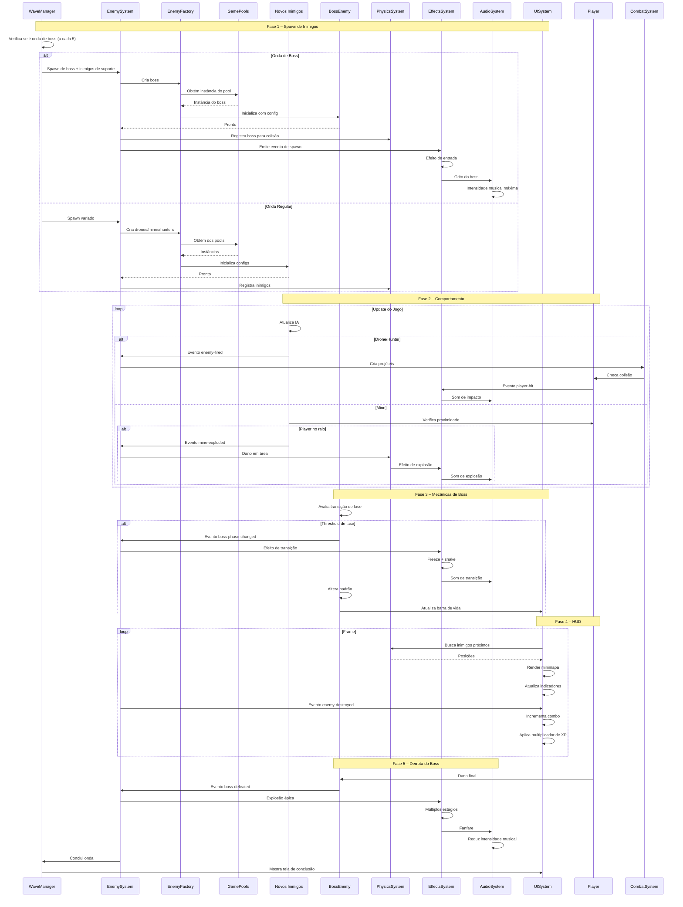

# Plano Geral – Expansão de Inimigos e Sistemas Associados

## Observações Principais

1. **Enemy System:** padrão Factory com `EnemyFactory`, classe base `BaseEnemy` e implementações específicas (atualmente `Asteroid`), utilizando `GamePools` para pooling e design baseado em componentes.
2. **Wave Management:** `WaveManager` controla progressão com configurações pré-definidas (ondas 1-10) e geração dinâmica (11+), usando geradores randômicos escopados.
3. **Effects & Audio:** `EffectsSystem` gerencia partículas, screen shake e indicadores com arquitetura orientada a eventos. `AudioSystem` possui batching, cache e síntese procedural.
4. **UI System:** HUD data-driven a partir de `hudLayout.js` com layouts (classic, minimal) e atualizações dinâmicas via event bus.
5. **Physics:** `PhysicsSystem` usa `SpatialHash` para colisões eficientes e integra-se ao `EnemySystem`.
6. **Dependency Injection:** Sistema de DI (Fase 2.1) com `ServiceManifest` declarando serviços e dependências.

**Conclusões-chave:**
- `BaseEnemy` oferece base para novos inimigos (Drone, Mine, Hunter).
- `GamePools` precisa ser estendido para os novos tipos.
- `WaveManager` permite integração de lógica de boss via configs.
- `EffectsSystem` tem hooks para novos VFX.
- `AudioSystem` suporta camadas dinâmicas via síntese orientada a eventos.
- `UISystem` aceita novos componentes HUD via `hudLayout.js`.

## Estratégia de Implementação

- **Fase 1 – Enemy Type Foundation:** criar classes Drone, Mine e Hunter, registrar no `EnemyFactory`, configurar pools e spawn no `WaveManager`.
- **Fase 2 – Boss System:** introduzir mecânica de boss com comportamento multi-fase, integrando `WaveManager` com spawns periódicos (a cada 5 ondas).
- **Fase 3 – Enhanced VFX:** ampliar `EffectsSystem` com novos tipos de partículas, ajustes de screen shake e efeito de câmera lenta.
- **Fase 4 – Dynamic Audio:** adicionar sistema de camadas musicais no `AudioSystem`, com áudio espacial e troca de trilhas por intensidade.
- **Fase 5 – Tactical HUD:** expandir `hudLayout.js` com componentes (minimapa, indicadores de ameaça, combo) e implementar renderização na `UISystem`.

### Referências de Plano por Fase

- [Fase 1 – Fundamentos de Novos Inimigos](phase1-enemy-foundation-plan.md)
- [Fase 2 – Sistema de Boss](phase2-boss-system-plan.md)
- [Fase 3 – Efeitos Visuais Avançados](phase3-effects-upgrade-plan.md)
- [Fase 4 – Áudio Dinâmico](phase4-audio-dynamics-plan.md)
- [Fase 5 – HUD Tático](phase5-tactical-hud-plan.md)

## Motivação e Análise

A análise detalhada dos arquivos `BaseEnemy`, `EnemyFactory`, `WaveManager`, `EnemySystem`, `GamePools`, `PhysicsSystem`, `EffectsSystem`, `AudioSystem`, `UISystem`, `hudLayout.js`, `GameConstants`, e `serviceManifest` demonstrou que a arquitetura atual já fornece todos os pontos de extensão necessários. As fases listadas acima mantêm o trabalho modular e progressivo, permitindo revisões e validações por etapa.

## Diagrama de Sequência

